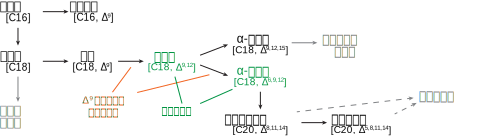
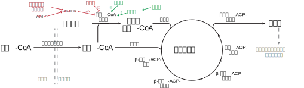

## 目录
- [[612_0-真题#蛋白质化学|蛋白质]]
- [[612_0-真题#核酸化学|核酸]]
- [[612_0-真题#脂质与生物膜|脂质]]
- [[612_0-真题#糖类结构与功能|糖类]]
- [[酶]]
## 正文
#### 蛋白质化学
###### 氨基酸基本结构 (21P)
甘氨酸无手性 α-碳原子
###### 等电点 (16M, 21P)
等电点 (isoelctric point) 是氨基酸或肽处于净电荷为 0 时的特征 pH，也称为等点 pH，该值仅取决于等点兼性离子两侧的 pKa，而不取决于离子强度等其他外部条件，反应氨基酸或肽本身的酸碱性质。当溶液 pH 相较 pI 越远时，氨基酸所带电荷越多，pH 大于 pI 时，氨基酸带负电荷，反之则带正电荷。一般而言，溶液 pH 为蛋白质的 pI 时，该蛋白质溶解度最小。
>《生物化学》第四版 上册 朱圣庚 et al.,  Page 48-51
###### 氨基酸的光谱性质 (21X)
蛋白质在近紫外区 (200 - 400 nm) 的最大吸收在 280 nm 处，主要来源于芳香族氨基酸，其中色氨酸贡献最大，$λ_{max}$=280，其次为 $λ_{max}$=275 的酪氨酸，最低为 $λ_{max}$=257 的苯丙氨酸。
###### 胰岛素的激活 (24P)
胰岛素是胰岛 β-细胞分泌的一种激素，生物在核糖体上会合成分子量两倍大的单链多肽，称为**前胰岛素原 (preproinsulin)**。N' 端含有的信号肽在引导肽链出核至内质网后立即被切除，剩余多肽链折叠成含 3 个二硫键的**胰岛素原**，进入高尔基体后在酶的催化下切除连接 B 链 C' 与 A 链 N' 的 C 肽，称为成熟胰岛素。
>《生物化学》第四版 上册 朱圣庚 et al.,  Page 68-69
###### 简述同源蛋白质的特点(19J)
**同源蛋白质 (homologous protein)** 具有如下特点
1. 编码同源蛋白质的基因序列具有明显的序列相似性（同源性）
2. 同源蛋白质的具有明显的氨基酸序列相似性（同源性），部分必须氨基酸在整个进化过程中不变，称为不变残基，而对蛋白质功能不太重要的残基容易在进化上被替代，称为可变残基
3. 同源蛋白质具有相同的功能特性
4. 同源蛋白质可以分为来源于不同物种的直系同源 (ortholog) 和同一物种的旁系同源 (paralog)
5. 同源蛋白质具有共同的进化起源
>《生物化学》第四版 上册 朱圣庚 et al.,  Page 78-81
###### 蛋白质结构的主要测定方法 (23X)
- X-射线衍射法 (X-ray diffraction)：蛋白质晶体结构
- 核磁共振法 (NMR)：
- 冷冻电镜 (cyro-EM)
99
###### 简述蛋白质中的共价键与非共价键 (23L)
**共价键**
- **肽键**：肽键 (peptide bond) 是最基础的共价键，将氨基酸的氨基与另一个氨基酸的羧基连接在一起构成了肽链，属于蛋白质的一级结构。肽键具有三个二面角，这些角度决定了蛋白质的二级结构并间接决定了更高级结构。其化学本质是酰胺键，可以被各种蛋白酶所切割。
- **二硫键**：二硫键是蛋白质中半胱氨酸的巯基经氧化而交联形成的键，可以在肽链内或肽链间形成，主要构成了蛋白质的一级结构。二硫键也可以帮助蛋白质维持四级结构，部分蛋白质亚基间的缔合也依靠二硫键的形成。二硫键可以被部分巯基化合物如巯基乙醇还原而破坏。
- **配位键**：配位键存在于许多含金属的蛋白中，如锌指蛋白和碳酸酐酶。
- **N-糖苷键与 O-糖苷键**：主要参与 N-连接糖蛋白与 O-连接糖蛋白中氨基酸残基与糖残基的连接。
**非共价键**
- **离子键**：也称为盐桥，指的是正电荷基因与负电荷基团之间发生的静电相互作用，这种引力随着溶剂的介电常数的增大而减小。在蛋白质中，主要由带正电的碱性氨基酸与带负电的酸性氨基酸贡献，蛋白质内部的离子相互作用也明显大于溶剂中，因此离子键可以维持蛋白质的稳定性。此外，离子键也助于部分金属蛋白中金属离子的结合。
- **氢键**：氢键本质上也是一种静电相互作用，但起到正电荷的部分则是一个强负电荷原子 X 连接的 H 原子，在 X 的吸引下，X-H 键的电子云几乎完全偏向 X 原子，因此氢原子几乎裸露，与另一电负性较大的原子产生静电吸引力。氢键具有方向性和饱和性，这两种性质决定了其可以使分子或基团形成有序的排列结构，对蛋白质的二级结构（特别是 α-螺旋与 β-片）和三级结构的折叠和稳定起着关键作用。
- **范德华力**：范德华力是广泛存在于分子间的相互作用，包括具有永久偶极矩的极性分子间的**取向力/定向效应**、极性-非极性分子间的**诱导力/诱导效应**与仅可产生瞬时偶极矩的非极性分子之间的**分散力/分散效应**。范德华力具有加和效应与位相效应，单个强度弱但其作用力总和相当可观，是维持蛋白质结构的重要因素。
- **疏水相互作用**：疏水相互作用指的是水介质中，疏水分子或疏水基团倾向于聚集在一起的现象，这种过程是熵驱动的，也是驱动蛋白质折叠、三级结构维持和亚基缔合的主要动力。
>《生物化学》第四版 上册 朱圣庚 et al., 17-20
###### 简述蛋白质二级结构及其主要类型 (17J, 21J)
蛋白质二级结构是蛋白质主链**在氢键稳定**下折叠成的有规则构象，即**主链原子的局部空间排列**，其作用力主要为分子表面的主链极性基团与溶剂形成氢键，分子内部的主链极性基团之间相互形成氢键
- **α-螺旋 (α-helix)** 是蛋白质中常见的螺旋性结构，蛋白质主链以每圈 3.6 个残基，上升 0.54 nm 的规律 (每氨基酸上升 0.15 nm) 盘旋成直径为 0.5 nm 的螺旋形结构。α 螺旋主要以右手螺旋形式存在，其氢键平行于螺旋主轴，由每个残基的羰基与第 4 个残基的氨基连接，构成13 元环，因此也称 $3.6_{13}$ 螺旋。
- 其他螺旋，主要包括 $3_{10}$ 螺旋与 π ($4.4_{16}$) 螺旋，前者每圈 3 个氨基酸残基，主轴与氢键形成 10 元环，后者每圈 4.4 个氨基酸残基，主轴与氢键形成 16 元环
- **β-片 (β-sheet)** 是多条蛋白质主链在空间中伸展平行的二级结构，其中多肽链骨架形成锯齿状平面结构，而侧链 R 基则交替地在上下伸出，该结构中氢键主要在链间形成。根据相邻肽链的方向性，β-片可以分为平行与反平行两种形式
	- 平行形式氢键明显弯折，疏水侧链分布在平面两侧，总体结构一般超过 5 个 β 片
	- 反平行更稳定，氢键相互平行，疏水侧链在平面一侧，因此一般疏水/亲水残基交替排列，可少至 2 个 β 片形成结构
- **β-转角 (β-turn)** 是多肽链中转弯或逆转方向的结构，由 4 个氨基酸残基构成，其中第一位的残基通常与第四位残基形成氢键，多存在 Gly 与 Pro，多存在于分子表面。β-转角可分为 I 型与 II 型，I 型中中央肽键的羰基与 2, 3 位 R 基反向，而 II 型的第三个氨基酸为 Gly。
- **Ω-环 (Ω-loop)** 可视为 β-转角的延伸结构，由 6-8 个残基构成，使得首尾两个氨基酸残基距离小于 1 mm
- **无规卷曲 (ramdon coli)** 泛指上述结构之外的其他结构，具有一定的任意性，但同样具有明确且稳定的构象，有的会构成酶的活性中心或其他蛋白质的功能中心
>《生物化学》第四版 上册 朱圣庚 et al.,  Page 100-106
###### 简述纤维蛋白表达后的共价调节激活 (24P)
纤维蛋白中需要相邻链之间共价交联
>《生物化学》第四版 上册 朱圣庚 et al.,  Page 106-113
###### 简述蛋白质变性及蛋白质变性后的性质变化 (16L, 21P, 22X)
**蛋白质变性 (protein denaturation)** 指的是蛋白质因各种物理或化学因素，发生溶解度降低、功能丧失、不对称性增高、其他物理化学常数发生改变的过程。该过程仅涉及次级键的断裂，不涉及一级结构（肽键、二硫键）的变化。
性质变化：
- **生物活性的丧失**：生物活性包括酶活性、毒素作用、免疫蛋白和信号分子的受体-配体结合、血红蛋白/肌红蛋白的载氧能力等，这些生物活性的丧失是蛋白质变性的主要特征，通常仅需要局部结构发生结构的变化，因此活性的丧失可以先于物理化学性质的改变。
- **侧链基团的暴露**：在蛋白质变性过程中，部分疏水残基会暴露于蛋白质表面外
- **物理化学性质的改变**：由于部分疏水残基会暴露于蛋白质表面外，造成等电点 pH 蛋白质不溶解、蛋白质相互凝集并沉淀等溶解度降低的特征。球状蛋白质变性后，其分子伸展形态改变，不对称程度增高、粘度增高、扩散系数降低、紫外吸收变化
- **生物化学性质的改变**：疏水残基会暴露于蛋白质表面外同样使得蛋白酶更易于切割蛋白质肽链，因此蛋白质的降解与分解更容易。
>《生物化学》第四版 上册 朱圣庚 et al.,  Page 135
###### 蛋白质分离纯化的一般原则 (19L)
蛋白质分离纯化的目的是从多种蛋白质包括其他物质的混合物中分离得到高纯度或高比活力的单一目的蛋白溶液，并增加产物浓度和产量。因此，蛋白质分离纯化的一般程序在于：前处理、粗分级分离、细分级分离、结晶，每一步中目的蛋白的浓度都会增加。
- **前处理**：将蛋白质以溶解的形式从组织中释放，并保持其天然状态。动物组织一般匀浆/超声处理，植物组织一般使用纤维素酶，细菌一般使用超声振荡/溶菌酶，得到粗提取液
- **粗分级分离**：需要使用处理量大、同时可除去大量杂蛋白和核酸/糖类等杂质的方法，一般使用盐析、等电点沉淀、有机溶剂分级分离等方法。
- **细分级分离**：也称为纯化，主要是在分离了杂质与大部分杂蛋白后进一步提高目的蛋白纯度的方法，一般使用柱层析，如凝胶过滤层析、离子交换层析、亲和层析等
- **结晶**：当某种蛋白质在浓度上绝对占优时，可以在过饱和条件下进行结晶，该过程既是蛋白质的再一次纯化，也可以保证蛋白质的天然活性
>《生物化学》第四版 上册 朱圣庚 et al.,  Page 191-193
###### 蛋白质常见的分离纯化方法有哪几种，并简述各自原理 (22M, 21L)
- **基于溶解度的分离**
	- **等电点沉淀 (Isoelectric point)**：当溶液的 pH 等于目的蛋白的 pI 时，目的蛋白净电荷为 0 ，此时蛋白分子之间无静电斥力而趋于聚集沉淀，其溶解度达到最低点。而当溶液的 pH  处于 pI 的两侧时，蛋白质因携带同种符号的净电荷而相互排斥，阻止分子聚集形成沉淀，因此溶解度较大。基于以上原理，当溶液 pH 被调至混合蛋白质中某一成分的等电点时，该成分的大部分或全部将沉淀下来，而等电点不在此 pH 的蛋白质则仍留在溶液中。
	- **盐析 (salting out)**：中性盐会对蛋白质的溶解度有显著的影响。低浓度时，中性盐可以增加蛋白质的溶解度，原因为蛋白质会吸附中性盐离子，带电离子层与水分子的互作增强，因此溶解度提高，该现象称为**盐溶**。高浓度时，大量中性盐离子会与水分子形成水化盐离子，原先的盐离子层也会与水分子形成水化盐离子，使得蛋白质的疏水残基暴露，溶解度降低而沉淀，该现象称为**盐析**。根据以上原理，表面疏水残基越多的蛋白质会先聚集而沉淀，可以根据上述原理进行蛋白质的分离。
	- **有机溶剂分级分离**：与水相溶的有机溶剂会显著降低其中蛋白质的溶解度。有机溶剂在两方面起到作用。其一是有机溶剂的介电常数显著低于水的介电常数，因此体系内相反电荷吸引力增加，蛋白质表面可解离基团离子化程度降低，从而水化程度降低，促进聚集与沉淀。其二是有机溶剂可能与中性盐相似，与蛋白质直接争夺水化水。
	- 两相分配
- **基于分子大小的分离**
	- **超滤 (ultrafiltration)**：超滤是使用外力（压力、离心力）强行使水和其他小分子溶质透过半透膜，而蛋白质截留于膜上的技术。可以通过该原理浓缩样品，在选择合适滤膜孔径的前提下也可以进行粗分级
	- **凝胶过滤 (gel-filtration)**：凝胶过滤是使用多孔介质对不同大小/体积和不同形状的分子的排阻能力不同而分离蛋白质混合物的方法。当不同分子大小与形状的蛋白质流过凝胶层析柱时，大分子的蛋白不能进入凝胶球中，会较快的流过层析柱，而较小的蛋白质分子则能不同程度地出去凝胶珠，因此大分子蛋白会先流出柱外，小分子蛋白会后流出柱外，而分子质量相同的蛋白质则以线型分子快，球状分子慢。
	- 超离心
	- **密度梯度离心**：蛋白质颗粒的沉降速度也取决于其密度，因此当蛋白质在含有密度梯度的溶液中离心时，在以各自的速度沉降一定时间后会停留在与自身密度相等的密度梯度中，可在底部依次放出实现分离。一般常用的密度梯度离心包括蔗糖密度梯度离心与氯化铯密度梯度离心。
- **基于电荷的分离**
	- 纸电泳：
	- 聚丙烯酰胺凝胶电泳：
	- **等电聚焦 (Isoelectirc focusing, IEF)**：等电聚焦是一种高分辨率蛋白质分离技术，目前主要使用凝胶基质。该技术使用两性电解质，在电场的作用下会形成连续的 pH 梯度，加样后，不同蛋白质会在外电场的作用下移动，当蛋白质移动到与其 pI 相同的 pH 处时，蛋白质所带净电荷为 0，因此会停止并“聚焦”于此处，该方法分辨率可达 0.001 pH
	- **双向电泳 (two-dimensional electrophrosis)** (22M)：双向电泳是指在蛋白质首次电泳后，将凝胶切下并旋转 90 度进行第二次电泳的方法，目前多将等电聚焦与 SDS-PAGE 结合，实现基于蛋白等电点与分子量两种性质的更精确的分离，分离后一般可以得到单个蛋白斑点。
	- 毛细管电泳：
	- 离子交换层析：
- **基于疏水相互作用的分离**
	- SDS-PAGE 电泳：
	- **疏水相互作用层析 (hydrophobic interaction chromatography)**：疏水相互作用层析是基于蛋白质表面疏水能力差别的纯化技术。该方法一般使用高盐条件及等电点附近的 pH ，使得蛋白质暴露于表面的疏水残基最多，当蛋白质与基质上的疏水基团结合后，可使用降低离子强度或增加 pH 的梯度洗脱法，或使用与固定相亲和性更强的置换剂洗脱。使用部分染料树脂的方法称为**染料结合层析**，其原理仍为疏水相互作用。
- **基于与生物基的亲和层析**
	- **亲和层析 (affinity chromatography)** 是基于蛋白质与其他配体分子专一性配对的原理进行分离的方法，包括基于凝集素-糖互作的凝集素亲和层析，基于抗体-抗原互作的免疫亲和层析，基于螯合物-金属离子配位的金属螯合层析等。配体可以是蛋白质所固有的部分，如糖蛋白中的糖链、金属离子蛋白中的金属离子，也可以是通过基因工程表达于蛋白上的特定标签，如 His-tag 等。当蛋白质混合物上柱时，蛋白质会通过配体及一个连接臂连接到琼脂糖颗粒表面上，杂蛋白则会被洗涤除去，随后一般通过大量游离的配体来洗脱目的蛋白质。
- 高效液相层析 (high performance liquid chromatography, HPLC)
>《生物化学》第四版 上册 朱圣庚 et al.,  Page 193-203
###### 列举蛋白质分子量的测定方法与原理 (22L)
- **凝胶过滤法**：凝胶过滤法是利用不同分子量大小的蛋白质通过凝胶珠的速度不同来区分蛋白质的，该方法认为蛋白质通过凝胶珠的速度取决于其斯托克半径，即与该蛋白质通过速度相同的非水化球体半径。经验公式表明洗脱体积与分子量的 lg 值成反比的线性关系，因此测得几种已知 Mr 蛋白质的洗脱体积后，即可建立标准曲线并根据待测蛋白的洗脱体积确定其相对分子质量。但该方法的前提是目的蛋白需要与标准蛋白质具有相似的近似球形的形状，并且不能与凝胶具有相互作用。
- **SDS-PAGE**：十二烷基磺酸钠-聚丙烯酰胺凝胶 (SDS-PAGE) 电泳在 PAGE 的基础上加入十二烷基磺酸钠 (SDS) 和少量巯基苏糖醇/巯基乙醇，SDS 可以破坏蛋白质的氢键与疏水键，巯基化合物则可破坏蛋白质的二硫键，使得蛋白质完全变性。由于 SDS 带有负电荷且会与蛋白质侧链通过疏水相互作用结合，每条肽链会上带有大量等密度的负电荷，这会掩盖蛋白质原有的电荷量差异。同时，SDS 会使得蛋白质呈现相同的棒状型，使得电泳迁移率完全取决于蛋白质的相对分子质量。通过对比 Marker 与蛋目的蛋白条带的大小，可以测定蛋白质的相对分子量。
- **沉降速度法 (sedimentation velocity)**：利用蛋白质分子在溶液中受到离心力作用时沉降速度不同的原理测定其分子量。纯的蛋白质溶液在离心场中以相同速度移动，因此在蛋白质溶液与溶剂中有一清晰界面，通过光学测量沉降界面的特征折射率并记录其移动速度，可以通过 Svedberg 方程定量计算出其相对分子质量
- **质谱法**：通过电喷雾离子化质谱 (ESIMS) 或 MALDI-TOF MS 可以测定蛋白质的 Mr。当蛋白质溶液被注入气相后会带不同数目的质子，因而带有正电荷，在谱图上呈现一系列不同质荷比的峰，相邻峰仅差一个电荷与一个质子，可以计算出 Mr。
>《生物化学》第四版 上册 朱圣庚 et al.,  Page 203-208
###### 蛋白质电泳 (22M)
**蛋白质电泳**基于不同蛋白质离子在外电场中受到作用力产生不同的移动速度，而进行蛋白质分离的方法。但是由于电泳过程通常会破坏蛋白质的结构，因此电泳一般不作为分级分离蛋白质的方法，而作为测定蛋白质种类或蛋白质等电点、分子量等性质的方法。
蛋白质电泳依据支持物的物理性质可以分为纸电泳、薄膜电泳、凝胶电泳等，其中凝胶电泳是目前最广泛使用的电泳方法。而根据处理方法，又可以分为非变性凝胶电泳与变性凝胶电泳。
非变性聚丙烯酰胺凝胶电泳 (Native-PAGE) 依据不同的电荷迁移率和凝胶的分子筛作用分离不同蛋白质。而变性电泳则在 PAGE 的基础上加入带有大量负电荷的强变性剂十二烷基磺酸钠 (SDS) 和少量巯基化合物使得蛋白质的都带上远大于其自身的负电荷，移动速度完全取决于其分子量大小，因此广泛用于测定蛋白质分子量。
>《生物化学》第四版 上册 朱圣庚 et al.,  Page 198-200/204
#### 核酸化学
###### Chargaff 规则 (24X)
- Chargaff 第一规则
	- DNA 中，核苷酸数量上 A=T，G=C
	- A+C = G+T
	- A+G = C+T
>《生物化学》第四版 上册 朱圣庚 et al.,  Page 429
###### DNA 双螺旋结构 (21M, 22X)
**DNA 双螺旋结构**是 Watson 与 Crick 基于 X 射线衍射分析提出的 DNA 结构模型，最为常见且典型的 B 型双螺旋主要有以下特征：
- 两条寡核苷酸链反平行地围绕一条主轴以右手螺旋的形式相互缠绕
- 双螺旋的外部为核糖与磷酸，核糖平面与纵轴平行，核糖之间形成 3',5'-磷酸二酯键；双螺旋内部为嘌呤与嘧啶，氢键平面垂直于纵轴。两条配对单链偏向一侧，形成大沟与小沟
- 螺旋平均直径 2 nm，每两个核苷酸之间上升 0.34 nm，夹角为36°，因此每圈含有 10 个核苷酸，上升 3.4 nm。
- 两条链的结合依靠碱基间的氢键，符合 AT 配对、GC 配对，其中 AT 间形成两条氢键，GC 间形成三条氢键
- 碱基在一条链上的排列不受限制，但是其中一条链的序列决定了另一条序列的序列
- DNA 分子的稳定主要依靠氢键与碱基堆积力，其中碱基堆积力来源于碱基芳香环间的 Π-Π 电子相互作用及疏水作用力
在不同条件下，DNA 双螺旋还可以以 A、C、D、E 等多个其他型结构存在，包括呈现左手螺旋的 Z 型。
>《生物化学》第四版 上册 朱圣庚 et al.,  Page 429-432
###### 体内的 RNA 有哪些分类？
体内的 RNA 主要分为编码 RNA 和非编码 RNA 两大类，其中编码 RNA 指的是编码蛋白质的 mRNA，而非编码 RNA 则行驶多种功能。
  - messenger RNA (mRNA) 是经基因转录产生的编码 RNA 序列，在会经过剪接成熟（仅真核生物）并在核糖体的作用下翻译为肽链。原核生物中为单顺反子 mRNA，具有 5'-UTR、基因编码区、3'-UTR 的顺序结构，真核生物的 mRNA 两端则有 5'-帽结构与 3'-多聚 poly(A) 尾
  - transfer RNA (tRNA) 用于转运氨基酸至核糖体以协助蛋白质合成的 RNA
  - ribosome RNA (rRNA) 是核糖体的组成部分，原核生物拥有5S/16S/23S rRNA，真核生物拥有 5S/5.8S/18S/28S
  - micRNA
  - sRNA
  - siRNA
  - microRNA (miRNA) 是
  - Ribozyme 是一类具有催化功能的 RNA，具有较为稳定的高级结构，易结合金属离子，也可借助碱基、氨基酸、咪唑和其他小分子完成催化，主要催化自我加工与剪接，包括 I / II 型自剪接内含子、某些病毒/类病毒/卫星病毒的自我加工 RNA、RNaseP 的 RNA 亚基、小型核酶家族等。
>《生物化学》第四版 上册 朱圣庚 et al.,  Page 440-441
###### 非编码 RNA (12M)

###### 真核细胞与原核细胞 mRNA 的区别 (17J)
- 原核 mRNA 为单顺反子或多顺反子，具有一个编码区或多个编码区，真核 mRNA 全为单顺反子，仅具有一个编码区
- 原核生物转录与翻译偶联，因此半衰期极短，真核生物需要转录-加工-出核后翻译，因此半衰期较长。
- 真核 mRNA 具有 5' 端帽子，即甲基化鸟苷酸经 5',5'-三磷酸键与 mRNA 5' 相连，根据 mRNA 5' 核苷酸被甲基化的个数可分为 O 型、I 型、II 型，可以防止外切酶降解 mRNA，参与协助核糖体对 mRNA 的识别。
- 真核 mRNA 具有 3' 端多聚腺苷酸尾，即 mRNA 3' 含有的 20~180 个腺苷酸，是在mRNA 合成后经腺苷酸转移酶添加的，可能有助于 mRNA 出核的过程，也可能与其半衰期有关，新生的 mRNA poly(A) 尾较长。
>《现代分子生物学》第五版 朱玉贤 et al.,  Page 77-82
###### 多顺反子的特点 (24J)
多顺反子 (polycistron) 是原核生物一组相邻或相互重叠基因（操纵子）的转录产物，即拥有多个编码区的 mRNA 形式，具有如下特点：
- 多顺反子对应的 DNA 片段位于同一个转录单位之内，共同拥有一个转录起点和终点
- 多顺反子中不同的的编码区拥有独立的起始密码子和终止密码子，转录间隔区大多有核糖体结合位点
- 当多顺反子 mRNA 的 5' 开始合成后，翻译起始位点即可与核糖体结合并开始翻译，后方的顺反子受上游顺反子结构的调控
- 核糖体大小亚基在完成一个编码区的翻译后，可以解离并脱离核糖体，下一个编码区等待新的核糖体；其小亚基也可以留在 mRNA 上，直接与游离大亚基结合并启动翻译
>《现代分子生物学》第五版 朱玉贤 et al.,  Page 78-79
###### 简述真核生物成熟 mRNA 的结构特点及其作用 (21L, 22L)
真核生物 mRNA 具有如下的结构特点及相应的作用
1. **5'-帽子结构**：真核生物 mRNA 的 5' 具有典型结构为 m7G5'ppp5'NpNp 的 5' 帽子，由 5' 甲基鸟苷酸转移酶催化 GTP 加到新生 mRNA 上，再选择性的给 mRNA N 端的核苷酸进行 N-6 甲基化形成 Cap1 与Cap2。
	- 5'-帽结构与 **mRNA 稳定性**有关，其可以抵抗细胞内存在的 5'-3' 核酸外切酶将 mRNA 降解。
	- 5'-帽结构与**翻译起始**有关，帽子结合蛋白 eIF-4E 可专一性地识别 5'-帽结构生成蛋白质-mRNA 复合物，且核糖体上也有专一性位点识别帽结构
2. **5'-非翻译区**：5'-UTR 不编码蛋白质，含有许多翻译的调节元件，如多个茎环结构。
3. **编码区**：编码区以编码甲硫氨酸的 AUG 起始，主要作用为携带遗传信息并传递给蛋白质，这也是 mRNA 的首要功能。真核生物的编码区具有两个主要特点，其一是真核生物 mRNA 为**单顺反子**，一条 mRNA 中仅存在一个编码区，编码一个基因，不存在原核生物操纵子结构。其二是真核生物为断裂基因，其 mRNA 具有**外显子-内含子交替排列**的结构，因此在翻译后需要进行剪接将内含子去除并连接外显子成为成熟 mRNA。
4. **3'-非翻译区**：存在数量众多的顺式元件，会形成二级结构。***去稳定元件 (DE)** 会显著影响 mRNA 的半衰期。被称为**拉链密码 (Zipcode)** 的顺式元件也会形成复杂的二级结构与三级结构，与 mRNA 的亚细胞运输与定位有关。*
5. **3'-多聚赖氨酸尾**：3'-多聚赖氨酸尾是转录在识别到特定位点 AAUAAA 时停滞，招募一系列蛋白复合物（如CPSF、PAP）将 mRNA 的 3' 特定位置切开加上约 200 nt 的多聚腺苷酸尾。该 poly(A) 尾自生成伊始就会与 poly(A) 结合蛋白 PABP 结合，*可被 deadenylase 介导脱腺苷酸化并引起 mRNA 降解*。
	- poly(A) 尾对 **mRNA 出核**是必要的，可以提升 mRNA 在细胞质中的稳定性，新生 mRNA 的腺苷酸数量显著多于衰老的 mRNA。
	- poly(A) 尾对**翻译**也有促进作用，真核生物翻译起始时，eIF4G 会识别并结合 poly(A) 尾并使 mRNA 形成环状，增强 mRNA 的可翻译能力。
	- 在基因工程中，mRNA 带有 poly(A) 尾巴的独特性质也用于 cDNA 的合成，只需要将寡聚 dT 作为引物即可逆转录合成 cDNA 第一链。
80-82/139
674/687
###### 叙述 tRNA 的生物学及 1/2/3 级结构主要特点 (20L, 21X, 22M)
**转运 RNA (transfer RNA, tRNA)** 用于转运氨基酸至核糖体以协助蛋白质合成，根据反密码子可以确定约有 65 种 tRNA 携带 20 种不同的 氨基酸。**tRNA 是含有最多修饰核苷酸的 RNA**。
- 一级结构：由 60~95 个核苷酸组成，含较多稀有碱基，3' 为 CpCpAOH，5' 为 pG 或 pC，具有部分保守序列。
- 二级结构：呈现三叶草结构，包括 5 个茎环结构：
	- **氨基酸臂**：3' 为 CCA，可接受活化的氨基酸
	- **二氢尿嘧啶 (DHC) 环**：含有两个二氢尿嘧啶
	- **TψC 环**：含有假尿嘧啶
	- **反密码子环**：中间 3 个核苷酸为反密码子，可以识别 mRNA 上的反密码子
	- **可变环/额外环**：一般含有 3~18 个核苷酸，大小不等
- 三级结构：呈现**倒 "L" 型**，其中氨基酸臂与 TψC 环形成连续双螺旋区构成 L 的横，其余三个环共同构成一竖，稳定力主要为几乎所有相邻碱基间的疏水相互作用。
###### 什么是非编码 RNA? 简述其分类及相应功能 (13L)
**非编码 RNA (non-coding RNA)** 指的是
###### 如何看待 RNA 分子功能的多样性，其核心作用是什么 (11J, 12J)
RNA 的分子功能
- 参与蛋白质的合成
- 具有催化功能
- 基因表达调控
- 染色体结构组装
- RNA 表型效应

>《生物化学》第四版 上册 朱圣庚 et al.,  Page 445-449
###### 核酸分子杂交及其应用 (16J, 17M, 20J, 21P)
将异源 DNA 、DNA 与 RNA 或异源 DNA 放入同一体系中，加热变性随后缓慢复性，若两条异源分子之间具有近似的序列，则会交错互补配对并形成**杂交分子 (hybrid molecule)**，这一操作称为**核酸分子杂交**。
核酸分子杂交广泛应用于分子生物学与基因工程之中，**Southern 印迹法 (Southern blot)** 是一种检测特定 DNA 的方法，首先将 DNA 进行凝胶电泳，再将电泳后的 DNA 按照凝胶上的位置原位转移至另一张膜上，使用标记核酸进行杂交后洗脱来检测目的 DNA。 **RNA 印迹法 (Northern blot)** 则与之相似，利用 RNA 杂交来检测特定 RNA，这两种方法都利用了核酸分子杂交。除了体外方法，核酸分子杂交也可以在体内进行，被称为**原位杂交 (*in-situ* hybridization, ISH)**，利用放射或荧光标记的寡核苷酸探针在体内结合目的核酸，来实现特定核酸序列的定位。核苷酸杂交还被应用于许多技术，如基因芯片 (gene chip)、杂交捕获、DNA 二代测序、qPCR、滚环扩增 (RCA)等
>《生物化学》第四版 上册 朱圣庚 et al.,  Page 459
###### 核小体 (13M, 16M) 

>《生物化学》第四版 上册 朱圣庚 et al.,  Page

###### 核酸变性及其与蛋白质变性的影响因素的不同 (19L)

>《生物化学》第四版 上册 朱圣庚 et al.,  Page

#### 糖类结构与功能
###### 同分异构体 (14M)
###### 寡糖的结构 (24M)

乳糖：**半乳糖**和**葡萄糖**以 **β-1, 4-半乳糖苷键**缩合形成
>《生物化学》第四版 上册 朱圣庚 et al.,  Page 344
###### 肽聚糖 (23M)
**肽聚糖 (peptidoglycan)** ，又称黏肽、胞壁质，是一种构成细菌细胞壁的杂多糖，主链由 **N-乙酰葡糖胺 (GlcNAc)** 和 **N-乙酰胞壁酸 (MurNAc)** 经 **β-(1,4) 糖苷键**连接，各主链之间相互平行。MurNAc 会连接一个 D, L-氨基酸交替排列的短肽，不同主链的短肽间会形成交联桥，这些交联桥与主链共同构成肽聚糖骨架。肽聚糖是溶菌酶与青霉素类抗生素的靶标，溶菌酶可水解 β-(1,4) 糖苷键，而青霉素类抗生素则可破坏交联桥，实现细菌的杀伤。
>《生物化学》第四版 上册 朱圣庚 et al.,  Page 353-354
#### 脂质与生物膜
###### 必须脂肪酸 (22M, 23M)
不同脂肪酸的合成需要使用不同的酶在短链脂肪酸上进行延长与去饱和，脊椎动物细胞中不存在可以才 C9 以后去饱和引入双键的酶，因此亚油酸 (Δ9, 12) 与 α-亚麻酸 (Δ9, 12, 15) 这两种生命所必需的脂肪酸无法在人体内被合成，只能通过膳食获取，这类脂肪酸称为必需脂肪酸。
>《生物化学》第四版 下册 朱圣庚 et al., 239
###### 脂类化合物的特征 (22J)
- 物理性质：低溶或不溶于水，易溶于非极性溶剂
- 化学结构：主要元素组成为 C、H、O，化学本质为脂肪酸与醇形成的酯类及其衍生物，
- 结构多样性：可以仅有脂肪酸与甘油或长链一元醇构成**简单脂质**，也可以与部分非脂部分形成磷脂、鞘脂等形成**复合脂质**。也可以进一步形成类二十烷酸、类固醇等衍生脂质
- 功能多样性：参与形成多种结构与多个生物过程，可据此划分为贮存脂质、结构脂质和活性脂质。**贮存脂质**主要用于能量储存，包括三酰甘油、蜡；**结构脂质**主要参与生物膜磷脂双分子层结构，包括磷脂、糖脂、固醇；**活性脂质**多具有重要的生物活性，如辅因子、电子载体、吸光色素等。
###### 脂类物质在生物体内的主要功能 (18L)
**贮藏脂质**：主要用于能量储存，包括三酰甘油、蜡。**三酰甘油**是动植物油脂的主要成分，在含水细胞溶胶中形成微小的油滴分离相，作为代谢燃料的储库。脊椎动物中一般含有专门化细胞——脂肪细胞用以储存大量的三酰甘油，几乎占满其整个细胞。三酰甘油一般经脂酶水解释放脂肪酸供能，脂肪酸碳原子还原性高，且其疏水性质决定不需要携带水化水，因此储能密度高。动物在皮下、腹腔等部位的脂肪组织中具有大量三酰甘油，不仅作为能储，也可以作为抗低温的绝缘层。**蜡**由长链脂肪酸与长链一元醇形成，是部分海洋生物储能脂质，具有很强的防水性。

**结构脂质**：包括磷脂、糖脂、鞘脂、部分固醇。磷脂包括甘油磷脂和鞘磷脂，其中**甘油磷脂**是生物膜磷脂双分子层的主要部分，极性头部面向双分子层表面，非极性脂肪酸链位于双分子层内部。部分甘油磷脂也具有特殊功能，如磷脂酰丝氨酸一般位于细胞内小叶，细胞凋亡时则会外翻，可作为多种凋亡相关分子的识别位点。**鞘脂**多位于细胞膜外表面，多于细胞膜表面识别位点相关，鞘糖脂中的红细胞糖苷脂疏水尾部插入双分子层，伸出细胞表面的寡糖链也称为抗原决定簇，决定血型。

**活性脂质**：多具有重要的生物活性，如辅因子、电子载体、吸光色素等。类二十烷酸为局部性激素、磷脂酰肌醇和鞘氨醇衍生物是胞内信使，萜类是植物的活性物质、维生素 A/D/E/K 参与代谢。
###### 长链脂肪酸的结构 (21P)

###### 流动镶嵌模型及其生物学意义 (14J, 15M)
流动镶嵌模型是目前对于生物膜结构最广为接受的模型，认为生物膜是蛋白质和磷脂组成的动态结构，蛋白质处于磷脂双分子层构成的二维流体溶剂中。磷脂的极性头部向外，与水介质相互作用，非极性尾部则向内面向双层片的核心。蛋白质可以埋入膜中，其疏水结构域通过疏水相互作用与磷脂尾部结合并稳定结构 
#### 酶学
###### 酶的组成相关概念 (22X)
**化学组成**
- **单纯蛋白质**：仅含有蛋白质的酶，如脲酶、蛋白酶、淀粉酶、脂肪酶、核糖核酸酶等
- **缀合蛋白质**：除蛋白质外还含有一些热稳定的非蛋白小分子或金属离子
	- **脱辅酶**：缀合蛋白质中的蛋白质部分，单独存在无催化作用
	- **辅因子**：缀合蛋白质中的非蛋白质部分，可依据结合的松散程度做以下划分，但没有严格的界限
		- **辅酶**：结合较松弛的小分子，通常使用透析即可除去，如辅酶 I/辅酶 II
		- **辅基**：使用共价键结合的小分子，通常需要一定的化学处理才可除去，如 FAD、铁卟啉等
**分子特点**
- **单体酶**：由一条肽链或多条肽链构成，为一个共价整体，主要为水解酶
- **寡聚酶**：由两个或两个以上亚基构成的酶，亚基之间由次级键相互连接，分子量较大，相当多寡聚酶为调节酶。
- **多酶复合体**：由多个酶相互以非共价的形式嵌合在一起，底物可以在不同活性中心中快速转移，有利于一系列反应的连续进行。典型的多酶复合体包括丙酮酸脱氢酶、α-酮戊二酸脱氢酶等
219-222
###### 酶的分类
- 氧化还原酶：催化电子转移
	- 脱氢酶、氧化酶
- 转移酶：催化基团转移
	- 转甲基酶、转糖基酶、转氨酶、激酶（转磷酸基）
- 水解酶
	- 脂酶、蛋白酶、肠激酶（肠肽酶）、果胶酶、核酸酶
- 裂合酶：催化从底物上移除一个小分子并留下双键或环，包括部分合酶
	- 脱羧酶、醛羧酶、
- 异构酶：同分异构体分子内相互转换
	- 消旋酶、差向异构酶
- 连接酶：曾称为合成酶，即偶联 ATP 的物质合成
	- 氨酰-tRNA 合成酶、DNA 连接酶、乙酰-CoA 羧化酶
- 易位酶：将离子或分子从膜的一侧转移到另一侧
	- 泛醇氧化酶、ABC 家族转运体

###### 米氏常数 (13M)
###### 活化分子与活化能 (19M)

###### 诱导契合 (19M)
###### 别构效应/别构调节/别构物 (18M, 20M, 24M)
酶分子的非催化部位可逆性地非共价结合某些化合物，进而改变酶的活性状态，这种效应称为**别构效应**。凡是能使酶分子发生别构效应的物质称为**别构物/效应物**，通常为小分子代谢物或辅因子。别构效应可以分为正协同效应与负协同效应，表现为不同的动力学曲线。能发生别构效应的酶称为别构酶，一般为次级键结合的寡聚酶，目前阐述别构效应的重要模型包括齐变模型与序变模型，在不同亚基的紧张 (T态) 与松弛 (R态) 相互转变机制上提出了不同机制。
>《生物化学》第四版 下册 朱圣庚 et al., 303-306
###### 简述同工酶的概念与乳酸脱氢酶 (21M/P)
**同工酶**指的是催化同一种反应，但在蛋白质结构、理化性质、免疫性质上都存在明显差别的一组酶，被不同基因编码。同工酶广泛的分布于动植微生物等生物上，可以存在于不同个体、不同组织、不同亚细胞结构甚至不同发育阶段。同工酶的生物功能包括可以作为遗传标志、协助个体发育与组织分化、代谢调节、癌基因表达紊乱、临床诊断等。典型的同工酶是最早被分离表征的乳酸脱氢酶 LDH，具有组织特异性。

**乳酸脱氢酶 (lactate dehydrogenase)** 是催化乙酸
>《生物化学》第四版 上册 朱圣庚 et al., 320-322
###### 抗体酶 (11M, 14M)

###### 酶活力与比活力的概念，说明如何评价分离纯化的酶 (15J)
###### 酶与一般催化剂的共同点及作为生物催化剂的特点 (14L, 16L, 22L)
**酶作为一般催化剂的特点**
**效果**：酶和一般催化剂相同，都能提高反应速率，但不会改变反应的平衡常数，因此仅能催化热力学允许的反应。
**机制**：酶和一般催化剂都通过改变反应路径，如先将底物结合与催化剂上再进行反应，实现降低反应的活化能，继而实现催化效率的提升。
**用量**：在反应中，酶和一般催化剂的用量一般都较少，反应前后不发生变化

**酶作为生物催化剂的特点**
**化学本质**：酶一般为蛋白质，少部分为核酸，一般催化剂则为过渡金属单质或小分子
**专一性**：酶一般仅催化特定反应、特定基团甚至特定底物，相比一般催化剂具有严格的专一性，这也是酶最重要的特点之一。
**高效性**：酶对反应速率的提升效果远大于普通的化学催化剂，其催化反应速率比非生物催化剂高 $10^7$-$10^{13}$ 倍
**酶易失活**：绝大部分酶作为蛋白质，容易受到外界条件（如高温、强酸强碱、重金属盐）的影响导致失活（变性）甚至不可逆的破坏，而一般催化剂仅有特定的条件下会中毒导致催化活性丧失。
**反应条件**：一般催化剂介导的化学反应许多都需要在高温高压的条件下进行，但酶促应条件较为温和，一般均为常温常压。
**受调控**：酶的催化效率可以受到调控，对酶本身的共价调控和别构调控、酶的浓度、底物的浓度等方式均会对酶的催化速率产生影响，而化学催化剂一般不可控。

###### 酶的活性中心及其特点 (22P)
**活性中心 (active site)** 指的是具有催化活性的酶分子内直接参与底物结合与催化作用的一小部分区域，一般为数个特异的氨基酸残基。活性中心可分为结合部位与催化部位，结合部位参与底物的结合，决定了酶的专一性；催化部位参与催化旧键的断裂与新键的形成，决定了酶的催化能力。活性中心具有以下特点：
1. 所占比例小
2. 具有空间结构
3. 不和底物形状完美匹配
4. 位于酶分子表面的空穴或裂缝内
5. 底物利用次级键结合
6. 具有柔性
>《生物化学》第四版 上册 朱圣庚 et al., Page 278-279
###### 酶的作用机制 (22X)
**溶菌酶**

**碳酸酐酶**
**丝氨酸蛋白酶**
包括胰蛋白酶、胰凝乳蛋白酶、弹性蛋白酶、枯草杆菌蛋白酶、凝血酶、纤溶酶原、组织纤溶酶原激活剂等

**天冬氨酸蛋白酶**
包括胃蛋白酶、凝乳酶、组织蛋白酶 D/E、肾素等
>《生物化学》第四版 上册 朱圣庚 et al., Page 289-303
###### 简述酶的专一性 (24L)
酶的专一性指的是酶只作用于特定的底物，而不作用于其他底物的性质
- 结构专一性
	- 绝对专一性指的是一类酶只作用于严格确定的一种底物，而不作用于其他任何一种物质，如脲酶、DNA 聚合酶等
	- 相对专一性/族专一性/基团指的是一类酶作用于特定的基团，或在作用于底物时，对键两侧基团的要求程度不同，如 α-葡糖苷酶作用时，需要 α-糖苷键的一侧拥有一个固定的葡萄糖。
	- 键专一性/反应专一性指的是一类酶可以作用于拥有一类特定键的底物，如脂酶、部分蛋白酶
- 空间异构专一性指的是当底物具有数种立体异构体时，酶仅能作用于其中一种
	- 旋光异构专一性
	- 几何异构专一性
###### 简述酶活性的调节方式 (13L, 24J)
- **环境因素**：包括温度、pH、抑制剂、激活剂等。
	- 温度：酶具有最适温度，在该温度下酶的催化活性达到最大，动物细胞内酶的最适温度一般为 35~40℃，植物约 40~50℃，微生物最适温度差异较大，最高温度甚至可达 70℃。温度并非酶的特征物理常数，受到底物、作用时间、pH、离子强度等多方面其他因素影响。
	- pH：酶具有最适 pH，在该 pH 下酶的催化活性达到最大，可能从酶的空间结构、底物解离状态、辅基团/辅因子等多方面影响酶活。
	- 激活剂与抑制剂：其中激活剂大部分为无机离子和简单有机化合物，具有一定选择性。
- **别构调节** 指的是一些小分子的物质可逆非共价的结合于酶的非催化部位，通过酶的构象改变，导致酶活性状态变化的效应。
- **共价调节** 指的是基于酶蛋白共价变化来调控活性的方法
	- 可逆共价修饰：通过共价调节酶对酶的某些集团进行可逆共价修饰，如磷酸化、腺苷酸化等，通常导致级联放大效应，包括典型的糖原分解与合成相关酶。
	- 不可逆共价调节：一般指的是酶原的激活，包括胃蛋白酶原、胰蛋白酶原、胰凝乳蛋白酶原、凝血酶在合成后或需要时切除一部分肽链而形成有活性的成熟酶。
- **辅因子** 指的是一些酶发挥活性所必须的无机离子或小分子。
>《生物化学》第四版 上册 朱圣庚 et al., Page 272-274/303/312/317
###### 可逆抑制与不可逆抑制的概念，如何使用动力学实验分辨？竞争抑制与非竞争抑制的特征变化 (15L, 22X)
**抑制作用的类型与分辨**
- **不可逆抑制**：指的是抑制剂以共价形式结合与酶上，结合后酶发生失活，且不能通过物理方法（如透析、超滤）方法将抑制剂其去除。不可逆抑制也称为修饰抑制，典型的不可逆抑制剂包括有机磷/砷/汞化合物、重金属盐、烷化剂、氰/硫化物等。动力学实验中，添加与不添加抑制剂的 \[$v_0$]-\[$E$] 图对比可发现，添加抑制剂组相较于不添加组，其直线向 x 轴正方向平移，平移距离随着抑制剂浓度的升高而增大。
- **可逆抑制**：指的是抑制剂以非共价形式结合与酶上，可以通过物理方法去除，根据抑制方式可以分为竞争抑制、非竞争抑制、反竞争性抑制与混合性抑制。动力学实验中，添加与不添加抑制剂的 \[ $v_0$ ]-\[ $E$ ] 图对比可发现，添加抑制剂组相较于不添加组，其直线仍过原点，但斜率减小，斜率减小的幅度随着抑制剂浓度的升高而增大。
	- **竞争性抑制**：指的是抑制剂 I 结合于酶 E 的活性部位，结合后产生的 EI 无法结合底物 A 由此产生抑制，一般竞争性抑制剂都是底物相似物。由于 I 仅降低了可催化酶的数量，因此当 \[ $E$ ] 的浓度超过抑制剂时，总能达到最大反应速率，因此 $V_{max}$ 不变，而 $K_m$ 减小。 
	- **非竞争性抑制**：指的是抑制剂 I 结合于酶 E 的非活性部位，而这种结合不会对酶 E 与底物 A 的结合产生影响，但是 EI 与 A 结合形成的 EIA 无法分解形成产物 P，由此产生抑制。在该型抑制中，由于 I 结合对酶的活性无影响，因此酶的 $K_m$ 不变，但因体系中总有 E 是被抑制剂结合的，因此反应的 $V_{max}$ 会减小。
	- **反竞争性抑制**：指的是只有在酶 E 与底物 A 结合形成 EA 后，抑制剂 I 才能结合形成 EAI 并产生抑制。
	- **混合性抑制**：指的是介于竞争性抑制与非竞争性抑制之间的形式，即抑制剂 I 的结合会对 A 的结合产生一定的影响。
>《生物化学》第四版 上册 朱圣庚 et al., Page 259-266
###### 简述酶别构调节与共价调节的概念，作用方式及不同点 (21L)
#### 维生素和辅酶
###### 水溶性维生素及相关辅酶的性质 (21X, 23X)

| 维生素             | 辅酶                                        | 机制                            | 功能                                 | 缺乏        |
| --------------- | ----------------------------------------- | ----------------------------- | ---------------------------------- | --------- |
| B1 (硫胺素)     | 硫胺素焦磷酸 (TPP)                              | 脱羧酶/转酮酶辅酶                     | 主要参与糖代谢                            | 脚气病、消化道症状 |
| PP (烟酰胺)     | 烟酰胺腺嘌呤二核苷酸 (NAD+) 烟酰胺腺嘌呤二核苷酸磷酸 (NADP+) | 转移氢负离子                        | 参与多种氧化还原反应，包括糖代谢、电子传递、还原性生物合成等  |           |
| B2 (核黄素)     | 黄素单核苷酸 (FMN) 黄素腺嘌呤二核苷酸 (FAD)           | 转移氢负离子 转移单电子、双电子           | 参与多种氧化还原反应，包括电子传递链，还原物 (GSH) 合成等   | 粘膜/皮肤症状   |
| 泛酸              | 辅酶 A (CoA)                                | 转移并活化酰基                       | 参与多种酰化反应，糖/脂/氨基酸代谢                 |           |
| B6 (吡哆醛/醇/胺) | 磷酸吡哆醛 (PLP) 磷酸吡哆胺                      | 通过形成 Schiff 碱参与转氨/脱羧/消除/消旋/醇醛 | 氨基酸代谢                              |           |
| B12 (钴胺素)    | 5'-脱氧腺苷钴胺素 (辅酶 B12) 甲基钴胺素              | 分子内重排 核糖核苷酸的还原 甲基转移     | DNA 合成等                            | 恶性贫血      |
| H (生物素)      | 生物胞素 (通过 Lys 结合至羧化酶)                      | 依赖ATP驱动的活化重碳酸盐作为羧化剂实现羧基转移     | 羧化酶                                |           |
| 叶酸              | 四氢叶酸 (THF)                                | 一碳单位的转移                       | 核苷酸合成                              | 恶性贫血      |
| 硫辛酸             | 硫辛酰胺                                      | 偶联酰基转移与电子转移                   | α-酮酸氧化脱羧 (丙酮酸/α-酮戊二酸脱羧酶)           |           |
| C (抗坏血酸)     | -                                         | 氧化还原                          | 巯基还原 羟化                         |           |
###### 脂溶性维生素 (22P)
**维生素 A (视黄醇)** 是类异戊二烯化合物，与脂肪酸结合经乳糜微粒转运入肝，以维生素 A 酯的形式在肝中储存，在血浆中以 RBP 结合的非酯化形式转运至需要的器官。维生素 A 主要构成视杆细胞内**视紫红质 (rhodopsin)** 的成分，参与视杆细胞的视循环。缺乏维生素 A 可导致**夜盲症**。
**维生素 D (麦角钙化醇/胆钙化醇)** 是甾体化合物，动物体内的 7-脱氢胆固醇会在紫外线的作用下生成胆钙化醇，通过与 DBP 结合并转运至肝，经混合功能氧化酶作用并生成其活性形式——**1, 25-二羟维生素 D3**。该物质可与降钙素、甲状旁腺激素共同调节钙、磷平衡，促进血钙、磷浓度提升 (吸收、重吸收)，促进新骨的生成与钙化。缺乏维生素 D 可导致**佝偻病**、**软骨病**等。
**维生素 E (生育酚)** 主要作为抗氧化剂与自由基清除剂，也可以生成生育醌，并与维生素 C 反应复原，或与 GSSG 协同抗氧化。维生素 E 缺乏会引起生殖系统受损，并且损害血红素的合成，导致贫血或血小板增多症，但一般不易缺乏。
**维生素 K (凝血维生素)** 主要参与凝血过程，依赖维生素 K 的谷氨酰羧化酶会催化凝血酶原中 γ-羧基谷氨酸的生成，羧基化的缺失会影响其结合钙离子并发挥功能，维生素 K 一般不缺乏。
###### 肠道中细菌可合成的维生素种类 (23P)
- 维生素 B1 / 硫胺素
- 维生素 B6 /
- 维生素 12 / 钴胺素
- 维生素 H / 生物素
- 叶酸
- 维生素 K 
#### 激素和信号转导

###### 第二信使 (20M, 22M)
###### 激素及其受体 (17M, 23M)
**激素 (harmone)** 是一种多细胞生物在细胞间信号交流所使用的一种化学信号分子，主要包括动物激素、植物激素与昆虫激素。动物激素一般在内分泌细胞的内质网与高尔基体中合成并直接分泌出胞外，入血后通过血液循环运输至身体各个部分，通过特异性受体作用于靶细胞，调节广泛的生理过程。动物激素根据化学性质可以分为多肽类、类固醇类等，多肽类、儿茶酚胺类激素主要作用于细胞表面受体，而类固醇类、维生素 D 激素、类视黄醇激素、甲状腺激素作用于核内受体。昆虫激素分为内激素与外激素，植物激素则包括生长素、细胞分裂素等。
激素受体则是高亲和地结合激素并向下游传递信号或直接调控生理过程的蛋白，人和脊椎动物中含有细胞表面受体、核内受体。细胞表面受体介导的信号通路应答较快，在激素结合后产生第二信使介导下游信号，改变酶的活性或调控基因转录。核内受体则与激素结合并作为转录因子结合于 DNA 上，通过调控转录改变关键蛋白质的量，因此作用较慢但是持续时间长。
>《生物化学》第四版 上册 朱圣庚 et al., Page 525-535

###### 激素及其功能 (21P, 24X)

| 激素     | 主要影响      | 本质   | 分泌器官  |
| ------ | --------- | ---- | ----- |
| 胰岛素    | 降低血糖      | 多肽   | 胰岛    |
| 胰高血糖素  | 升高血糖      | 多肽   | 胰岛    |
| 肾上腺素   | 血管收缩/提高心率 | 儿茶酚胺 | 肾上腺皮质 |
| 去甲肾上腺素 | 血压升高      | 儿茶酚胺 | 肾上腺皮质 |
|        |           |      |       |

###### 类固醇类激素的作用机理 (13J)
###### 第二信使 (22M)
第二信使指的是在细胞表面受体介导的信号转导过程中，会产生一类非蛋白小分子，这类物质会调控下游蛋白的活性，承担了携带与放大信号的功能。常见的第二信使包括 GPCR 相关通路中的 cAMP、IP3、DAG 等，分别介导 cAMP-PKA、IP3-Ca2+、DAG-PKC 等通路。
>《生物化学》第四版 上册 朱圣庚 et al., Page 540
###### 简述级联放大作用及其生物学意义 (22J)
**酶级联**是指一个信号分子激活的一系列连续的酶促反应，由于酶在反应中可多次使用，因此一个酶在反应中可催化多个底物 (假设 10 个)发生转化，若该底物也是酶分子，那么在第二步反应中则可以催化 100 个底物的转化，对于多层的级联系统就可以催化几何倍数的底物转化，使得初始微弱信号就可以迅速产生几个数量级的放大，这种作用被称为**级联放大作用**。典型的级联反应包括凝血酶的活化、各种信号通路介导的下游酶促反应（如糖原代谢）等。级联放大作用主要包括以下生物学意义
- 
#### 新陈代谢和生物能学
###### 人体内 ATP 的生成方式与生物学意义 (18L, 23L)
ATP
- 底物水平磷酸化：
- 氧化磷酸化
- 光合磷酸化

**生物学意义**
ATP 是细胞中主要的贮能化合物，是细胞能量代谢中的中心分子。这种中心作用主要体现在其作为化学能的载体，将细胞的放能反应与耗能的合成及其他生命过程偶联。
- 通过磷酸基团转移供能：当亲核试剂进攻第三个高能磷酸键时，将会连接 ATP 的末端磷酸，并释放一分子的 ATP，此时底物相当于被活化为了酶-底物-磷酸，获得了 ATP 携带的自由能并使反应在热力学上更优。此过程出现在大多数需要 ATP 进行的生化反应中
- 通过焦磷酸基团转移间接供能
- 通过磷酸腺苷酰基转移间接供能，
- 通过 ATP 驱动泵为物质的主动运输供能
- 通过肌球蛋白为肌肉收缩供能
- 作为前体合成环腺苷酸参与
34-42
###### 氧化磷酸化和呼吸链 (12M, 18M, 21M, 23L)
在细胞代谢中，糖酵解、三羧酸循环、脂肪酸分解等代谢反应产生的 NADH 与 FADH2 会通过一系列的电子载体，将电子转移至氧气等电子受体上，这一过程即称为**呼吸链 (respiration chain) 或电子传递链**。呼吸链中的复合体会在传递电子的同时向线粒体内膜外转运质子，将电子传递释放的自由能转化为质子梯度。质子随后会驱动细胞膜上的 ATP 合酶将 ADP 磷酸化为 ATP，这完整的过程称为**氧化磷酸化 (oxidative phosphorylation)**。

**电子传递链过程**
- **复合体 I: NADH-Q 还原酶**催化电子和氢原子经 NADH 上经 FMN、铁硫中心转移至辅酶 Q，并将其还原为 QH2。该反应可被鱼藤酮、安密妥抑制。
- **复合体 II: 琥珀酸-Q 还原酶**催化电子和氢原子经 FADH2 上经铁硫中心转移至辅酶 Q，并将其还原为 QH2。
- **复合体 III: 细胞色素还原酶**催化 QH2 将电子传递给细胞色素 *c*，cyt c 会在线粒体内外膜间隙中扩散至复合体 IV 中。该反应可被抗霉素 A 抑制。
- **复合体 IV: 细胞色素还原酶**催化细胞色素 *c* 将电子转移给氧气中的氧原子，并合成水分子。该反应可被氰化物抑制。

**ATP 合成机制**

>《生物化学》第四版 下册 朱圣庚 et al., Page 100-109
###### 简述氧化磷酸化与呼吸链的偶联机制的化学渗透假说，化学渗透假说可解释部分关键现象，列举相关实验证据 (13L, 19L, 20L, 22L)
电子经过电子传递链转移所释放的能量需要通过一种中间形式才能被 ATP 酶利用并合成 DNA，这种能量的保存与 ATP 对它的利用称为能量偶联。早期提出的能量偶联机制包括化学偶联假说、构象偶联假说与化学渗透假说。化学渗透假说指的是电子传递链释放自由能与 ATP 合成的过程是由**跨线粒体内膜的质子梯度**而偶联的，即电子传递所释放的自由能驱动质子从线粒体基质泵出到膜间隙，形成跨膜的质子梯度，并用于 ATP 合成。这种假说可解释多种实验证据：
- 氧化磷酸化需要在完整的线粒体内膜中进行
- 线粒体内膜对质子、氢氧根离子、氯离子等离子不通透
- 破坏质子的浓度差 (解偶联剂或离子载体) 导致无法完整氧化磷酸化
- 人工建立质子梯度可以合成 ATP
>《生物化学》第四版 上册 朱圣庚 et al., Page 111-112
###### 细胞呼吸 (15M)
###### 人体内的能源物质总结 (22M, 24X)
人体所需要的能量中 60% 由糖供给
磷酸肌酸 (Phosphocreatine, PCr) 可以快速将 ADP 合成 ATP，用于维持 ATP 耗尽后能量的快速补充
>《生物化学》第四版 下册 朱圣庚 et al.,  Page 43

###### 利用生物化学知识解释牛吃的是草，挤出来的是奶 (24J)
牛作为是食草动物中的反刍动物，主要采用前胃（瘤胃、网胃）发酵的消化方式，前胃中含有大量可以分解纤维素的微生物，这些微生物会通过复杂的生物化学反应将纤维素水解与处理供动物吸收。这些物质在代谢中除了供给牛本身的能量代谢与储存，还会合成以水、蛋白质（乳蛋白、乳清蛋白）、脂肪、乳糖为主要成分的牛奶。
- 纤维素的分解：当草到达牛的瘤胃后，其纤维素会被微生物分解的多种酶，如纤维素酶、半纤维素酶分解为各种单糖，这些单糖少部分被牛直接吸收，而大部分会被微生物吸收。这些微生物会经过自身的糖酵解途径将单糖转化为乙酰-CoA，随后合成挥发性短链脂肪酸 (VFA)，这些脂肪酸可以直接被牛的胃吸收，也是牛的主要能量来源
- 牛摄入物质的转换：牛摄入的物质包括：VFA（丙酸/乙酸/丁酸）、氨基酸等。丙酸入血运输至肝脏经一系列酶分解为琥珀酰-CoA；乙酸入血直接经过三羧酸循环氧化功能或合成脂肪酸；氨基酸通过分解代谢成为琥珀酰-CoA、延胡索酸等物质进入三羧酸循环；糖类则直接通过糖酵解途径合成丙酮酸，转化为乙酰-CoA后进入三羧酸循环。
- 乳糖的合成：乳糖由葡萄糖和半乳糖经过 β-(1,4)-糖苷键连接，经 **UDP-半乳糖**与 **N-乙酰葡糖胺**或**葡萄糖**在**结合乳清蛋白的半乳糖基转移酶**的催化下聚合而成的。
- 脂肪的合成：牛体内的乙酰-CoA 会先合成丙二酸单酰辅酶 A，再经脂肪酸合酶的催化逐步添加乙酰-CoA 形成**长链脂肪酸**，脂肪酸在酰基转移酶的催化下逐步向 3-磷酸甘油上转移并形成**脂酰甘油**。
- 蛋白质的合成：体内的多个生化分子经过各异的代谢途径会合成多种氨基酸分子，如经三羧酸循环产物合成谷氨酸/天冬氨酸族和经糖酵解中间产物合成丙氨酸/丝氨酸/芳香族/组氨酸。这些氨基酸会与 ATP 反应并激活形成氨酰-AMP，在氨酰-tRNA合成酶的作用下结合至对应的 tRNA 上，并由其转移至正在翻译的新生肽链上，新生肽链经出核、内质网折叠、高尔基体处理后分泌出细胞形成成熟的乳清蛋白、酪蛋白等牛奶中的主要蛋白质。
>《生物化学》第四版 下册 朱圣庚 et al., 53/82/144-145/231/242/321/530
#### 糖代谢
###### 糖酵解 (15M)
**糖酵解 (Glycolysis)** 指的是葡萄糖经过两个阶段的 10 步反应生成丙酮酸，并生成 NADH 与 ATP 的代谢通路，其所有中间产物均为磷酸化的形式。糖酵解既可以生成丙酮酸并进入三羧酸循环及呼吸链实现葡萄糖的有氧氧化，也可以在无氧的条件下产生 ATP 并进行供能。糖酵解的主要过程如下：
- **准备阶段**
	1. 葡萄糖经己糖激酶磷酸化形成 6-磷酸葡萄糖，该反应消耗 1 分子 ATP
	2. 6-磷酸葡萄糖经磷酸己糖异构酶变为 6-磷酸果糖
	3. 6-磷酸果糖经磷酸果糖激酶磷酸化形成 1,6-二磷酸果糖，该反应消耗 1 分子 ATP
	4. 经醛羧酶裂解形成磷酸二羟丙酮与 3'-磷酸甘油醛
	5. 3'-磷酸甘油醛经磷酸丙糖异构酶变为磷酸二羟丙酮
- **酵解供能阶段**
	6. 磷酸二羟丙酮变为 1, 3-二磷酸甘油酸，产生 1 分子 NADH
	7. 1, 3-二磷酸甘油酸变为 3'-磷酸甘油酸，产生 1 分子 ATP
	8. 3'-磷酸甘油酸异构为 2'-磷酸甘油酸
	9. 2'-磷酸甘油酸脱水形成磷酸烯醇式丙酮酸
	10. 磷酸烯醇式丙酮酸经烯醇式丙酮酸变为丙酮酸，产生 1 分子 ATP
>《生物化学》第四版 下册 朱圣庚 et al., 51-53
###### 糖酵解的调控 (22P)
糖酵解过程中的限速步骤为**磷酸果糖激酶 (PFK-1)** 催化 6-磷酸果糖**不可逆**的生成 1, 6-二磷酸果糖，该酶会**受到 ATP 别构抑制**。该酶还会**受到 2,6-二磷酸果糖的促进**，由一种双功能酶 PFK-2/FBPase-2 催化 6-磷酸果糖形成，该酶的活性由一丝氨酸位点的磷酸化控制
- 当体内含糖量高时，胰岛素升高，胰岛素可以促进蛋白磷酸酶的活化，该蛋白磷酸酶使 PFK-2/FBPase-2 去磷酸化，结果为 PFK-2 激活，FBPase-2 失活，因此促进 F6P 形成 F26BP，促进 PFK-1 并激活糖酵解通路。
- 当体内含糖量低时，胰高血糖素升高，胰高血糖素经 cAMP 信号通路激活蛋白激酶 PKA，PKA 磷酸化 PFK-2/FBPase-2，使 PFK-2 失活，FBPase-2 激活，因此抑制 F6P 形成 F26BP，PFK-1 活性降低，糖酵解通路受抑制。
>《生物化学》第四版 下册 朱圣庚 et al., 69-71
###### 三羧酸循环的概况与作用 (12J) 在代谢中的地位 (13J)
**三羧酸循环 (TCA) / 柠檬酸循环 (Citric acid cycle) / Kerbs 循环**是生物体的核心代谢循环，参与葡萄糖的有氧氧化、部分氨基酸与核苷酸的分解、各种生物化学分子合成前体的提供等过程，也因此被称为两用代谢循环。其参与的代谢通路包括：
- 草酰乙酸通过转氨基作用与天冬氨酸互变
- 柠檬酸作为前体合成脂肪酸与胆固醇
- α-酮戊二酸通过转氨基作用与谷氨酸互变
- Ile/Met/Thr/奇数碳脂肪酸分解为琥珀酰-CoA
- Tyr/Phe/Asp 分解为延胡索酸
- 苹果酸转运出线粒体，经糖异生作用合成葡萄糖及多种代谢产物
TCA 循环主要由 8 步反应构成，包括乙酰-CoA 与草酰乙酸合成柠檬酸进入循环并经历一系列氧化脱羧及异构反应后彻底氧化为 $CO_2$ 并传递电子至 NADH、FADH2，并产生高能磷酸化合物 ATP 或 GTP 的过程。
- ① 乙酰-CoA 与草酰乙酸合成柠檬酸，进入三羧酸循环，该步骤由**柠檬酸合酶**催化，其先与草酰乙酸结合，诱发构象变化后再与乙酰-CoA 结合。
- 柠檬酸的羧基与羟基位于同一个碳原子上而不利于脱羧，因此随后经过两步反应发生柠檬酸的异构。② 柠檬酸脱水形成顺乌头酸，③ 顺乌头酸再加水形成异柠檬酸，两步均由**乌头酸酶**催化转变，水分子可逆地与两个双键碳原子结合，反应由异柠檬酸的消耗催化
- ④ 异柠檬酸在异柠檬酸脱氢酶的作用下脱氢形成 α-酮戊二酸，是 TCA 循环中首个氧化脱羧反应。该反应由**异柠檬酸脱氢酶复合体**催化，先将羟基氧化为酮基并合成 NADH，再进行 α-脱羧（草酰乙酸的羧基）产生 α-酮戊二酸。
- ⑤ α-酮戊二酸再次进行 α-脱羧形成琥珀酰-CoA，该反应由**酮戊二酸脱氢酶复合体**催化，机制与丙酮酸脱氢酶相似，形成琥珀酰-CoA 的同时生成 NADH 与 CO2。
- ⑥ 琥珀酰-CoA 在**琥珀酰-CoA 合成酶/琥珀酸硫激酶**的作用下脱去 CoA-SH，并通过底物水平磷酸化合成一分子 GTP。至此，进入循环中的乙酰-CoA 在计量上已经被氧化为两分子 $CO_2$，并产生两分子 NADH 和 1 分子 GTP 或 ATP。*具体合成 ATP / GTP 取决于琥珀酰-CoA 合成酶的种类，具组织特异性，一般脑/肌多为 ATP，肝及其他组织为 GTP*
- 在接下来三步 中，需要将琥珀酸转变为可重新接收乙酰-CoA 的草酰乙酸。 ⑦ 琥珀酸在**琥珀酸脱氢酶**的作用下脱氢形成延胡索酸，该酶位于线粒体内膜（真核）或细胞质膜（原核）上，也是电子传递链中的复合体 II，脱下来的氢转移至 FAD 上形成 FADH2。⑧ 延胡索酸经**延胡索酸酶**可逆水合为 L-苹果酸，⑨ 再经苹果酸脱氢酶脱氢为草酰乙酸并合成 1 分子 NADH。

>《生物化学》第四版 下册 朱圣庚 et al., 79/82-90
###### 糖酵解和三羧酸途径共同起作用的酶 (24X) ?

>《生物化学》第四版 下册 朱圣庚 et al., 79
###### 葡萄糖有氧 (15J, 24M) 和全部 (13L) 氧化阶段的过程，氧化中生成 ATP 的计量
**葡萄糖有氧氧化**
葡萄糖有氧氧化指的是葡萄糖在有氧气的条件下，经过糖酵解、三羧酸循环、氧化磷酸化三个阶段，自身被彻底氧化为二氧化碳和水，同时转移电子并释放能量合成 ATP 的过程，也可以说是以氧分子作为最终电子受体的葡萄糖氧化途径。
- **糖酵解过程**：主要指的是葡萄糖在细胞质基质中经过磷酸化与裂解形成 3-磷酸甘油醛、放能并转化为丙酮酸的过程，在该过程中 1 分子葡萄糖会转换为 2 分子丙酮酸，并合成 2 分子 ATP 与 2 分子 NADH 的过程。
- **三羧酸循环**：真核生物中丙酮酸会通过丙酮酸移位酶进入线粒体基质中，随后在丙酮酸脱氢酶复合体的催化下合成乙酰辅酶 A 并放出 1 分子 $CO_2$ 。乙酰-CoA 进入三羧酸循环，经过 8 步反应进行脱氨与脱羧最终氧化为二氧化碳，将电子传递给 NADH、FADH2，并生成 ATP 或 GTP。
- **电子传递链/呼吸链**：指电子从 NADH 及 FADH2 中经过一系列传递最终转移至 $O_2$ 的 4 个电子载体，糖酵解与三羧酸循环中形成的 NADH 会在 **NADH-Q 还原酶（复合体 I）** 中将电子传递给**辅酶 Q**，而三羧酸循环中琥珀酸脱氢则直接在**琥珀酸-Q 还原酶（复合体 II）** 上发生，电子从琥珀酸经 FADH2 同样转移至**辅酶 Q** 中，而辅酶 Q 会在线粒体内膜自由移动，并在**细胞色素还原酶（复合体 III）** 将电子传递给**细胞色素 (cyt c)** ，后者在膜间隙侧扩散到达**细胞色素氧化酶（复合体 IV）**，将电子传递给 CO2，完成有氧氧化的全过程。

**葡萄糖无氧氧化**
葡萄糖无氧氧化指的是细胞在缺乏氧气时，将葡萄糖不完全氧化为乙醇、乳酸等产物的过程，其中在葡萄糖生成丙酮酸这一步骤与有氧氧化完全相同。动物体内发生缺氧时，动物细胞只能利用糖酵解过程产生的 ATP 供能，该过程中同时产生的 NADH 无法进入呼吸链而过剩，且糖酵解过程还需要大量 NAD+ 作为底物，因此需要一个反应消耗 NADH 并产生 NAD+。丙酮酸在以 TPP 作为辅因子的乳酸脱氢酶催化下会产生乳酸，消耗 1 分子 NADH 并产生 1 分子 NAD+。而植物和微生物（如酵母）中则存在丙酮酸脱羧酶，该酶会催化丙酮酸脱羧产生乙醛和 CO2。乙醛随后经乙醛脱氢酶催化产生乙酸，并消耗 1 分子 NADH 并产生 1 分子 NAD+。

**1 分子葡萄糖氧化的化学计量**
- 1 分子葡萄糖有氧氧化可以产生 30/32 个 ATP 分子
	- 糖酵解过程
		- 2 ATP
		- 2 NADH = 3 ATP（磷酸甘油穿梭）/ 5 ATP（苹果酸/天冬氨酸穿梭）
	- 丙酮酸氧化脱羧
		- 2 NADH = 5 ATP
	- 三羧酸循环过程
		- 2 ATP/GTP
		- 6 NADH = 15 ATP
		- 2 FADH2 = 3 ATP
- 1 分子葡萄糖无氧氧化可以产生 2 个 ATP 分子
	- 糖酵解过程
		- 2 ATP
>《生物化学》第四版 下册 朱圣庚 et al., 53/66-69/79/83/100-101

###### 糖异生的概念与过程 (22P)
**糖异生 (Gluconeogenesis)** 指的是乳酸、丙酮酸、丙酸、 甘油、氨基酸等各种非糖分子经过一系列转变重新生成葡萄糖的过程，不是糖酵解的简单逆反应，该过程对人体来说是必要的。该通路的过程包括：
**丙酮酸经草酰乙酸合成磷酸烯醇式丙酮酸**
- 丙酮酸在丙酮酸羧化酶的作用下生成草酰乙酸
- 丙酮酸在**丙酮酸羧激酶 (PEPCK)** 的作用下生成磷酸烯醇式丙酮酸 (PEP)
**1, 6-二磷酸果糖合成 6-磷酸果糖**
- 1, 6-二磷酸果糖磷酸酶
**6-磷酸葡萄糖合成葡萄糖**
- 6-磷酸葡萄糖磷酸酶
>《生物化学》第四版 下册 朱圣庚 et al., 136-139

###### 乙醛酸循环 (21P)
**乙醛酸途径/乙醛酸循环** 是存在于植物与微生物中的一条代谢通路，主要功能是将乙酰-CoA 转化为草酰乙酸从而进入三羧酸循环中，根据代谢情况异生为糖或保留在三羧酸池中。该通路发生于植物的**乙醛酸循环体**中，故首先需要线粒体中的草酰乙酸经过天冬氨酸氨基移换酶作用生成天冬氨酸进入乙醛酸循环体，再经过该酶生成草酰乙酸作为乙醛酸循环的前体。首先草酰乙酸与柠檬酸会经历与 TCA 循环相同的前几步，即合成**柠檬酸**、异构为**异柠檬酸**，但随后会在重要的**异柠檬酸裂合酶**的作用下裂解形成**琥珀酸**与**乙醛酸**，乙醛酸再与另一分子乙酰-CoA经**苹果酸合酶**形成**苹果酸**，再穿梭至胞质溶胶中脱氢形成草酰乙酸。而琥珀酸则可穿梭至线粒体，完成整个乙醛酸循环。该循环的重点在于**跨过了三羧酸循环中数步的脱氢与氧化步骤**。
>《生物化学》第四版 下册 朱圣庚 et al., 142
###### 糖酵解、三羧酸循环、磷酸戊糖途径、糖异生的生理意义 (20M, 24L)
**糖酵解的生理意义**
- 葡萄糖有氧氧化的途径
- 无氧状态下供能的方式
- 细胞代谢平衡
- 提供前体物质
**三羧酸循环的生理意义**
- 葡萄糖有氧氧化的途径
- 提供前体物质
- 物质的彻底分解
- 细胞代谢平衡
- 清除有毒代谢产物
**磷酸戊糖途径的生理意义**
- **提供细胞内还原力 (NADPH)**：1 分子 6-磷酸葡萄糖在氧化为 5-磷酸核酮糖的过程中会形成 2 分子的 NADPH。不同于 NADH 的呼吸链作用，NADPH 主要参与还原性生物合成，为反应提供氢负离子，同时其还会将谷胱甘肽 GSSG 还原为还原型谷胱甘肽 GSH，用以防止细胞内的氧化、过氧化及氧自由基的侵害，磷酸戊糖途径即提供这一细胞内的主要还原力。
- **不同结构糖分子及其衍生物的来源**：非还原阶段的 PPP 途径会在异构酶、转醛/酮酶的作用下产生多种磷酸化糖分子，如 4-磷酸赤藓糖、7-磷酸景天庚酮糖等，因此该途径是细胞内各种 3-7 个碳原子的糖类相互转换的重要途径，并作为其衍生物如核苷酸、ATP、FAD、CoA 等分子的前体来源。
**糖异生的生理意义**
- **维持血糖的稳定**：在机体中的中枢神经系统细胞、红细胞等细胞中是以葡萄糖作为主要能量来源的，正常情况下游离葡萄糖与糖原分解的葡萄糖足够供给。但当机体饥饿时，机体需要将其他非糖物质转化为葡萄糖以维持血糖稳定，使得这些器官具有稳定的葡萄糖供给，而这一转化的过程就主要依赖糖异生途径。
- **乳酸的再利用**：当大量进行无氧呼吸时，肌肉组织会积累大量的乳酸，由于骨骼肌中仅有利于合成乳酸的 LDH5 同工酶，此处的乳酸仅能入血并转运至肝脏，经肝脏的 LDH 1 等酶转换回丙酮酸，并经由糖异生过程转换为葡萄糖，再回流至其他需要葡萄糖的器官。
>《生物化学》第四版 下册 朱圣庚 et al., 133-134/136/141

###### 糖原合成的步骤

###### 糖原合成的调控 (22P)
糖原合成的调控主要是在分解糖原的糖原磷酸化酶和合成糖原的糖原合酶上讨论的，这两种酶均有活性形式 a 与无活性形式 b。
- **糖原磷酸化酶 GP** 具有两种形式，磷酸化的有活性的 GPa 和去磷酸化的无活性的 GPb。
	- **GPb 的磷酸化激活**，即促进糖原分解，由**糖原磷酸化酶激酶 GPK** 所介导，该蛋白的激活也是依赖**蛋白激酶 A (PKA)** 的磷酸化的。
		- **激素**：胰高血糖素 (肝) 和肾上腺素 (肌) 会结合于 GPCR 受体，经 cAMP-PKA 通路，磷酸化激活 GPK，并激活 GP，促进糖原分解维持血糖水平 (肝) 或供能 (肌)。
		- **能量水平**：肌细胞中糖原分解供能需要取决于能量水平，当能量不足时胞内 AMP 的水平高，AMP 会作为别构活化剂结合于磷酸化酶 b 上，促进糖原分解。**肝细胞中则不存在此作用**。
	- **GPa 的去磷酸化失活**，即不促进糖原分解，由**磷蛋白磷酸酶 PP1** 所介导。
		- **ATP 水平**：ATP 是 GPa 的别构抑制剂，促进其失活并抑制糖原分解。
		- **激素**：在肝细胞中，胰岛素会促进 PP1，并促进 GPa 失活及糖原分解，防止血糖升高。
		- **葡萄糖水平**：在肝细胞中，葡萄糖会进入肝细胞与 GPa 结合，作为别构抑制剂促进其被 PP1 磷酸化失活的过程，该调控机制称为**葡萄糖传感器 (glucose sensor)**，仅存在于肝中。
- **糖原合酶 GS** 具有两种形式，去磷酸化的有活性的 GSa 和磷酸化的无活性的 GSb
	- **GSa 的磷酸化失活**，即不促进糖原合成，由肌酸激酶 II 与糖原合酶激酶 3 (GSK3) 介导。
		- **激素**：在肝细胞中，胰岛素会抑制 GSK3，继而抑制 GSa 的失活，介导糖原的合成并降低葡萄糖水平
	- **GSb 的去磷酸化失活**，即促进糖原合成，由 PP1 介导，会受到胰岛素、葡萄糖、G6P的促进，并受到肾上腺素与胰高血糖素的抑制。
>《生物化学》第四版 下册 朱圣庚 et al., 168-172
###### 血糖 (22X)
血糖指的是血中**葡萄糖**的浓度
###### 光合作用 (11M, 14M)

###### C4 途径 (17M)
###### 植物体内的单糖获得途径 (14J)

#### 脂类代谢与合成
###### 脂肪酸分解代谢 (16M)
脂肪酸分解代谢指的是脂肪酸分解为乙酰-辅酶A的过程，其机制包括通用的 β-氧化、α-氧化与 ω-氧化机制
###### 脂肪酸氧化的步骤及能量计算 (23X/J)
脂肪酸氧化主要分为 β-氧化、α-氧化、ω-氧化等

**β-氧化**
动物细胞中脂肪酸会在线粒体及过氧化物酶体中完成 β-氧化，步骤如下：
- **脂肪酸的活化**：脂肪酸在脂酰-CoA 合酶的催化下合成脂酰-CoA，反应需要消耗 1 分子 ATP。
- **脂肪酸进入线粒体**：脂酰-CoA 在脂酰肉碱移位酶 I 的催化下形成脂酰肉碱穿过线粒体外膜，再穿过载体蛋白跨过线粒体内膜，在脂酰肉碱移位酶 II 的作用下脱乙酰-CoA，实现跨线粒体膜的转运。
- 脂酰-CoA 在脂酰-CoA 脱氢酶的作用下发生 Δ2-消除反应，生成 Δ2-烯酰-CoA，该反应会将 H- 离子转移给 FAD，并经 ETF-Q 等过程将电子传递至呼吸链中
- Δ2-烯酰-CoA 在烯酰-CoA 水合酶的作用下生成 L3-羟脂酰-CoA
- L3-羟脂酰-CoA 在 L3-羟脂酰-CoA 脱氢酶作用下生成 β-酮脂酰-CoA
- β-酮脂酰-CoA 在硫解酶的作用下脱去一分子乙酰-CoA 并形成少两个碳原子的脂酰-CoA。

>《生物化学》第四版 下册 朱圣庚 et al., 
###### 酮体 (13M, 22P)
**酮体 (ketone body)** 是乙酰-CoA 除合成脂肪酸、进入柠檬酸循环和合成类固醇的另外一种去路，包括**乙酰乙酸**、**D-β-羟丁酸**和**丙酮**三种物质。酮体主要在肝中合成，健康人体仅形成少量丙酮且迅速分解，另两种物质可被合成入血并运输至肝外组织供能。决定乙酰-CoA 是否生成酮体的是草酰乙酸的量，长期饥饿或糖尿病人中糖异生过程会持续进行，使得草酰乙酸大量被用于合成葡萄糖。乙酰-CoA 无法进入柠檬酸循环而大量合成酮体，这些物质使血液 pH 降低，称为**酸中毒**，酮体也会大量进入尿中，称为**酮症**。
>《生物化学》第四版 下册 朱圣庚 et al., 228-229
###### 脂肪酸的合成与调控 (21P)

###### 磷脂、糖脂、鞘脂合成 (24X)
磷酸二羟丙酮 -> 磷酸甘油
>《生物化学》第四版 下册 朱圣庚 et al., 243-244
###### 类二十烷酸合成 (22X)
类二十烷酸多由花生四烯酸衍生而来，在合成途径上也以**花生四烯酸**作为合成前体，经过脂加氧酶途径合成线性衍生物，经过环加氧酶途径合成环形衍生物。
- 线性衍生物中包括**白三烯**
- 环形衍生物就包括了**前列腺素 (PG)** 和**血栓烷** ，**阿司匹林**具有抗炎作用，可以通过共价结合环加氧酶来抑制前列腺素的合成。
>《生物化学》第四版 下册 朱圣庚 et al., 254-256
###### 血脂的概念与血浆脂蛋白的分类 (18J, 22X)
血浆脂蛋白指的是在血浆中存在的含有三酰甘油、磷脂、载脂蛋白 (apo) 等多种成分的球状分子，直径约为 5~12 nm，主要分为五类
- **乳糜微粒 (CM)** 是最大且密度最低的脂蛋白，在小肠中合成并分泌进入毛细淋巴管，经锁骨下静脉入血，可以将小肠上皮细胞吸收的脂肪酸和胆固醇运送至肝脏。
- **极低密度脂蛋白 (VLDL)** 主要将脂肪自肝中经血运输至其他组织，含有 apoC-II，可被脂蛋白脂肪酶识别并分解其中的三酰甘油为脂肪酸供给其他组织。三酰甘油的消耗伴随着颗粒的减小，此时部分表面分子就会被输送至 HDL，其自身变为 IDL 并逐渐吸收从 HDL 中转移的胆固醇酯。
- **中间密度脂蛋白 (IDL)** 是密度介于 VLDL 和 LDL 之间的脂蛋白，由 VLDL 经过脂肪酸的消耗并逐渐生成 LDL 的中间态。
- **低密度脂蛋白 (LDL)** 在血浆中由 VLDL 经 IDL 生成，将脂质运输至肝外组织，该过程依赖细胞包被区聚集的特异 LDL 受体，在识别后细胞膜内陷通过胞吞作用形成包被小泡，与溶酶体融合并水解。
- **高密度脂蛋白 (HDL)** 可以减少血液中胆固醇的沉积，主要功能为将胆固醇脂自血中运输回肝脏。HDL 在肝中分泌时几乎不含胆固醇酯，其表面的磷脂酰胆碱在 apoA-I 活化的**卵磷脂:胆固醇磷脂酰转移酶 (LCAT)** 的催化下与胆固醇形成胆固醇酯，并逐渐在 HDL 表面累积。最后 HDL 会回到肝中，与肝/类固醇生成组织中特异性的 SR-B 膜受体结合，并转移部分的胆固醇进入细胞，其自身再重新入血继续收集胆固醇，该过程称为**胆固醇的逆向运输 (reserve cholesterol transport)**。
#### 核酸代谢
###### 核酸分解 (22X/P, 23X)
- **核酸分解**：核酸经**核酸酶**/**磷酸二酯酶**分解为核苷酸
- **核苷酸分解**：核苷酸首先在**磷酸单酯酶**的催化下分解为核苷与磷酸，其中核苷可以通过**核苷磷酸化酶**或**核苷水解酶** 分解形成嘌呤碱/嘧啶碱及戊糖
- **嘌呤碱分解**：腺嘌呤和鸟嘌呤可以在核苷酸/核苷水平上发生脱氨基反应分别生成次黄嘌呤及黄嘌呤，随后在黄嘌呤氧化酶 (复合黄素酶) 的作用下氧化生成尿酸，该反应可被别嘌呤醇抑制，因此可治疗通风。对于排尿酸动物（人/猿/鸟等），**尿酸**会直接排出体外；对于大部分动物，尿酸可继续被氧化为尿囊酸，并分解为**尿素**排出（鱼/两栖）；许多低等动物还可以继续将尿素分解为**氨和二氧化碳**。
- **嘧啶碱分解**：胞嘧啶可脱氨形成尿嘧啶，并进一步脱氢、分解形成 **β-丙氨酸**，可进一步转氨并参与代谢；胸腺嘧啶则会经历相似过程分解为 **β-氨基异丁酸**。
>《生物化学》第四版 下册 朱圣庚 et al., 357-359
###### 嘌呤和嘧啶的从头合成途径有何区别，分别有什么氨基酸参与 (12L, 22P, 23P)
**嘌呤的从头合成**
- 5'-磷酸核糖焦磷酸 (PRPP) 依次添加氨基 (**Gln**)、**甘氨酸**、甲酰基 (N10-甲酰基 THF)、第二个氨基 (**Gln**/需 ATP)，最后关环 (需 ATP)合成含咪唑环的 **5'-氨基咪唑核糖核苷酸 (AIR)**
- AIR 依次添加羧基 (ATP 活化的**碳酸氢盐**)、氨基 (添加 **L-Asp** 后脱去延胡索酸)、甲酰基 (N10-甲酰基 THF)，最后关环合成**次黄嘌呤核苷酸 (IMP)**
- IMP 与 **Asp** 由 GTP 供能合成腺苷酸琥珀酸，再脱去延胡索酸合成**腺嘌呤核苷酸 (AMP)**
- IMP 通过其脱氢酶在 NAD+ 辅助下与水合成**黄嘌呤核苷酸 (XMP)**，再经谷氨酰胺转氨基形成**鸟嘌呤核苷酸 (GMP)**

**嘧啶的从头合成**
- **氨甲酰磷酸合成酶 II** (细胞质) 催化**谷氨酰胺**将氨基转移至 ATP 活化的**碳酸氢盐**上，形成**氨甲酰磷酸**。其在**天冬氨酸转氨甲酰酶** 催化下转氨基给**天冬氨酸**，形成氨甲酰天冬氨酸，经二氢乳清酸酶催化关环形成二氢乳清酸。此步反应的三个酶组成三亚基**多功能酶 CAD**，每个亚基含有所有催化活性。
- 二氢乳清酸脱氢酶催化二氢乳清酸脱氢形成含有完整嘧啶环的**乳清酸**。
- 乳清酸连接 **5-磷酸核糖焦磷酸 (PRPP)** 形成乳清苷酸，并在脱羧酶催化下生成**尿嘧啶核苷酸 (UMP)**。此步反应中两个酶融合为一条多肽链，称为 **UMP 合成酶**。缺乏该酶患乳清酸尿症。
- 胞嘧啶由尿嘧啶在三磷酸水平上合成。尿嘧啶经尿嘧啶核苷酸/二核苷酸激酶合成 UTP，再经 CTP 合成酶的催化与谷氨酰胺的转氨合成**胞嘧啶核苷酸三磷酸 (CTP)**
>《生物化学》第四版 下册 朱圣庚 et al., 359-368
#### 蛋白质降解与代谢
###### 氨的排泄 (22P)
动物根据氨的排泄形式，可以分为排氨动物、排尿素动物与排尿酸动物。
- **排氨动物**包括水生/海洋动物/原生动物等，以**谷氨酰胺**的形式将氨运输至排放部位，再以**游离氨**的形式排出。转运机制具体为脱下的氨经胞内**谷氨酰胺合成酶**催化与谷氨酸在 ATP 供能下形成中性谷氨酰胺，该物质为中性无毒物质，容易透过细胞膜。运输至排放部位如鳃处时，谷氨酰胺被谷氨酰胺酶分解得到游离氨，并排出体外。
- **排尿素动物**包括大部分脊柱动物，同样以谷氨酰胺的形式将各处的氨转运至**肝**中，再**在线粒体中**经谷氨酰胺酶分解为氨。氨会进入**尿素循环**并合成尿素，分泌入血并被肾汇集，从尿中排出体外。
- **排尿酸动物**包括鸟类、爬行类等水分有限的动物，将氨转化为尿酸以固体悬浮液的形式排出体外。

**尿素循环**
- 肝细胞线粒体中的氨经**氨甲酰磷酸合成酶 I (CPS I)** 与 **ATP 活化的碳酸氢根**合成**氨甲酰磷酸**，该反应不可逆且为限速步。CPS I 受 N-乙酰谷氨酸别构激活，该分子时谷氨酸在 N-乙酰谷氨酸合酶催化与乙酰-CoA 合成的，该酶浓度受到氨基酸降解速度调节。
- 在**瓜氨酸氨甲酰基转移酶**的作用下，氨甲酰磷酸将氨甲酰基转移至鸟氨酸，形成**瓜氨酸**。
- 瓜氨酸经转运蛋白进入细胞质中，在**精氨琥珀酸合成酶**的作用下，天冬氨酸将琥珀酸转移给瓜氨酸，形成**精氨琥珀酸**，此时该分子已含有两个氮。
- **精氨琥珀酸酶**催化精氨琥珀酸裂解脱去延胡索酸，形成尿素的直接前体**精氨酸**。
- **精氨酸酶**催化精氨酸裂解脱去**尿素**，形成**鸟氨酸**。
>《生物化学》第四版 下册 朱圣庚 et al., 286-291
#### 基因组复制、修复与转录
###### 半保留复制 (24M)
**半保留复制**指的是，双链 DNA 在复制后，每个子代的其中一条链来自亲代 DNA，另一条链是以这条亲代 DNA 为模板合成的。在复制过程中，亲代的两条互补 DNA 链解旋并分开，同时 DNA 聚合酶会分别以两条链为模板，从 5'-3' 以碱基互补配对的原则合成两条新链。半保留复制机制可以通过同位素标记或放射自显影的方法进行验证，在功能上保证了 DNA 在代谢上的稳定性。
>《现代分子生物学》第五版 朱玉贤 et al.,  Page 42
###### 冈崎片段 (19M)
DNA 复制中复制叉沿着一条链的 5'-3' 移动（后随链），则相对另一条链（前导链）的方向则为 3'-5'，而由于 DNA 聚合酶的只能从 5'-3' 的方向合成新生肽链，因此在后随链上聚合酶只能以相对于复制叉移动反向的合成多条大小 1000-2000 bp 的新生 DNA 片段，这种片段被称为**冈崎片段**。冈崎片段随后会被 DNA 连接酶连接形成完整的单链。
>《现代分子生物学》第五版 朱玉贤 et al.,  Page 45
###### DNA 复制的特点 (15L)
- 半保留复制：
- 半不连续复制 (semicontinuous replication)
- 双向复制：
>《生物化学》第四版 下册 朱圣庚 et al., 
###### DNA 复制过程中的保真准确性的机制 (24L)
- **半保留复制机制**：半保留复制指的是 DNA 在复制过程中，首先将亲代的 DNA 双链解旋分开，再分别依据每条链作为模板，根据碱基互补配对原则合成新链，这种机制在理论上确保了复制准确性。
- **核苷酸底物选择**：DNA 聚合酶的手掌域具有催化 4 中脱氧核糖核苷酸根据碱基互补配对原则添加至 DNA 模板上形成磷酸二酯键的活性，并具有监视该过程的能力。当正确核苷酸位于最佳的催化位置，手指域也会包裹并使得核苷酸与催化金属离子密切接触，使得共价键形成效率显著增加，其掺入速率约为错误核苷酸的 10000 倍。
- **聚合酶的校对**：当错误核苷酸被添加后，DNA 链的构象变化会使得手掌域的催化活性显著降低，使得引物-模板从催化位点脱离并结合到具有 3'-5' 外切酶活性的结构域上，实现错误核苷酸切除并重新合成，该步骤使得错误率降低至 $10^7$。
- **错配修复系统**：该系统会在 DNA 复制后，依据母链的序列逐一检查子链的核苷酸。母链由 Dam 甲基化酶复制前在 5‘-GATC 序列腺苷酸的甲基化所确定，当检查到子链存在错误后，MutS-L 会结合于该序列并由 MutH 复合物将未甲基化的子链切开，并由外切酶向错配位点降解子链，再由 DNA 聚合酶 III 重新合成。
>《现代分子生物学》第五版 朱玉贤 et al.,  Page 42/46-47
###### 端粒与端粒酶 (21P)
**端粒 (telomere)** 指的是真核生物线性核 DNA 末端的一种结构，由短串联重复序列构成，人的端粒重复序列为 TTAGGG，较长的 G-rich 链形成 3'-overhang。端粒的作用包括稳定染色体 DNA 末端结构防止不同染色体间连接、补偿后随链 5' 在 DNA 复制过程中产生的缺失等。
**端粒酶 (telomerase)** 是真核生物用于修复 DNA 复制过程中端粒缺失的酶，本质上为携带特定 RNA 模板的逆转录酶。该 RNA 模板可以与该生物的端粒重复结构互补配对，可以引导逆转录酶定位在端粒末端，并继续延伸一个模板长度的重复序列，并移动到下一个单位继续延长。这种机制使得动物端粒的长度几乎保持恒定，但随着动物细胞的分化，端粒酶会逐渐失去活性，端粒的长度不断缩短，最终引起细胞生长停止或凋亡。
###### DNA 损伤的修复机制 (16J, 18J, 22X)
- 错配修复
- 切除修复
- 同源重组修复和非同源末端接合
- 直接修复：紫外线损伤可导致 DNA 分子中同一条链相邻胸腺嘧啶碱基之间形成**嘧啶二聚体** (TT)，影响了 DNA 双螺旋结构
- 跨损伤合成 (TLS)
- SOS 修复系统
>《生物化学》第四版 下册 朱圣庚 et al., 449-453
###### DNA 切除修复 (11M)

###### DNA 重组的概念、方式 (14J, 21P)
**DNA 重组 (DNA recombination)** 指 DNA 分子间或 DNA 分子内发生遗传信息的重新组合，真核生物主要在减数分裂同源染色体的交换，原核生物如细菌则可以在不同个体 DNA 发生，如细菌的接合过程。重组的生物学意义包括：
- 迅速增加群体的遗传多样性，将有利突变与不利突变分开，通过优化组合积累有意义的遗传信息
- 参与 DNA 损伤或复制障碍的修复
- 在部分生物中具有调节基因表达的功能，可以控制发育相关事件

按照**机制**划分，DNA 重组主要包括如下三类：
- 同源重组
- 位点特异性重组
- 转座重组
###### 同源重组的概念与机制 (23L)
**同源重组 (homologus recomination, HR)** 也称为一般性重组，指的是两条异源双链 DNA 配对、断裂并重新连接产生片段交换的过程，在大肠杆菌中由 RecA 等酶介导。

**Holliday 模型**是用以解释同源重组机制的模型，提出以下步骤：
- 两条具有同源区的 DNA 排列整齐
- 其中一个 DNA 分子的一条链断裂，侵入另一个 DNA 分子的该位置，因此链的置换，此时产生的分子称为 Holliday 中间体，中间交叉的位置称为 Holliday junction
- 交叉位置发生分支移动，产生异源双链
- Holliday junction 切开并使得 Holliday 中间体重新连接为两个单独的 DNA 分子，若切开的链与开始的链相同，则重组体仅含有一段异源双链区，称为**片段重组体**；而若切开的链与开始的链不同，则异源双链区两端不来自于同一个亲本，产生**剪接重组体**。
###### DNA 甲基化在 DNA 复制和修复中的作用 (17L)
**半甲基化 *OriC*  结合细菌质膜**：在大肠杆菌中，复制过程与细菌质膜有关，起始序列 *oriC*  中含有 11 个 GATC 序列，这些序列在未复制的基因组中都是 m6A 甲基化的。当复制起始后，合成的新链中 GATC 是未甲基化的，因此此时 DNA 双链处于半甲基化状态，该状态的 DNA 可以结合于细菌质膜，并可能与 DNA 随细胞分裂而移向两端这一过程有关，而结合又会抑制甲基化过程。在数十分钟后，细菌二分裂完成，DNA 从细胞膜上解离，并被 dam 甲基化酶甲基化，开启新一轮的复制起始。
**用于错配修复判断新旧链**：除特殊的 *oriC*  中，新生 DNA 链其余位置在合成后约 1.5 min 内也会存在一段非甲基化状态，此时 MutS/L 会介导错配修复。MutS/L 会在错配部位形成复合物，并沿着 DNA 链向前移动，当遇到 GATC 序列即会停止，此时 MutH 会结合并依赖甲基化来判断新旧链，并从未甲基化的新链处切开，并通过外切再合成的方式修复错配碱基。
>《生物化学》第四版 下册 朱圣庚 et al., Page 443-444/449
###### 模板链与编码链的定义 (18J)
**编码链 (coding strain)** 是与转录产物 mRNA 序列相同 (T-U) 的链，即正链，**模板链 (template chain)** 是与转录产物 mRNA 序列互补的链，即负链，在转录中作为 mRNA 合成的模板。
###### RNA 聚合酶的功能和种类 (11J)
原核生物中仅含有一种 RNA 聚合酶 (RNAP)，转录所有的基因；而真核生物中主要具有 3 类RNAP，分别识别不同的启动子并转录不同类型的基因，并且叶绿体和线粒体中还存在与原核生物 RNAP 相似的基因

**原核生物 RNAP**：具有 α2ββ'ω 的核心酶结构，与起始亚基 σ 结合形成全酶。σ 负责识别原核生物启动子的 -10 与 -35 区，并引导 RNAP 核心酶定位。
**真核生物 RNAP I**：识别类别 I 启动子，转录的产物包括 5.8s RNA、18S rRNA、23S rRNA，对高浓度 α-鹅膏蕈碱不敏感
**真核生物 RNAP II**：识别类别 II 启动子，转录的产物包括所有 mRNA 和大多数 snRNA，对 α-鹅膏蕈碱敏感
**真核生物 RNAP III**：识别类别 II 启动子，转录的产物包括 5S rRNA、U6 snRNA 、tRNA 和其他小 RNA，对高浓度 α-鹅膏蕈碱敏感
###### 为什么 DNA 聚合酶需要引物，RNA聚合酶不需要 (21J, 23P)
DNA 聚合酶的机制：DNA 聚合酶催化已有核酸链与游离核苷酸之间通过 SN2 反应形成磷酸二酯键，催化的活性中心位于聚合酶的手掌域。DNA 双链在待掺入部位后 ssDNA 立即进行一个急剧转弯，使得活性部位仅有一个暴露的核苷酸残基供 NTP 的掺入。掺入后聚合酶会向前滑移，仅仅只有完美配对双链存在时才可以维持酶的活性结构，任意错配都会使得复制过程停滞并启动 3'-5' 外切，因此 DNA 聚合酶不能在没有可校对双链结构而仅有 ssDNA 结构的情况下发挥合成活性。
在 RNA 转录的起始过程中，存在一个专门负责稳定起始复合体的 σ 因子，会在识别并解链后协助 ββ' 亚基掺入数个 NTP 并合成初始的 9 nt mRNA，而在该过程中聚合酶的位置是不改变的。当合成 9 nt 后，σ 因子重排，发生启动子逃逸。
综合而言，催化起始的数个核苷酸合成和后续核酸链延长所需要的条件不一，RNA 聚合酶中存在一个 σ 因子专门稳定起始复合物结构以供催化亚基 de-novo 合成核酸链，而 DNA 聚合酶中则不存在，只能依赖额外的引发酶完成该功能。
###### 转录抑制剂 (21P)
- **碱基类似物异常掺入**：包括 6-巯基嘌呤、硫鸟嘌呤、2,6-二氨基嘌呤、8-氮鸟嘌呤、5-氟尿嘧啶等，其会首先在体内转变为相应核苷酸形式。这些核苷酸可以作为**抗代谢物**抑制核苷酸生成相关酶、也可以掺入核酸分子形成异常的 DNA 或 RNA。
- **结合 DNA 抑制模板功能**：
	- **烷化剂**可以将 DNA 模板链中的核苷酸甲基化，如产生 m7G、m1/3/7A 或烷基磷酸等修饰核苷酸，会导致其不稳定易被水解，包括 (苯丁酸) 氮芥、磺酸酯、氮丙啶、乙烯亚胺、环磷酰胺
	- **放线菌素 D** 中的芳香稠环会插入 DNA 邻近两 G-C 碱基对之间，肽链部分则可插入大沟，高效抑制转录过程
	- **嵌入染料** 同样可以插入相邻碱基对之间，通常含有吖啶、菲啶等扁平芳香发色团，如原黄素、吖啶黄、吖啶橙、溴化乙啶等
- **抑制 RNA 聚合酶**：
	- **利福霉素/利福平**可以抑制细菌 RNA 聚合酶
	- **α-鹅膏蕈碱**可以抑制真核生物 RNA 聚合酶，不抑制细菌 RNAP。
>《生物化学》第四版 下册 朱圣庚 et al., Page 486-488

###### 叙述真核生物转录后 mRNA 的加工成熟过程 (23L, 24M)
真核生物在核内转录会形成**核内不均一 RNA (hnRNA)**，其需要进行一系列加工过程才能最终形成成熟的 mRNA 并出核翻译。
- **5'-加帽**：在 hnRNA 的形成之初就会发生 5'-加帽的反应，新生的 RNA 链具有 5'-pppPu 的头，经 RNA 三磷酸酯酶催化切割一分子的磷酸，并在 mRNA 鸟苷酸转移酶的催化下与 GTP 反应生成 G5'ppp5'NpNp 同时释放 PPi，再在鸟嘌呤-7-甲基转移酶的作用下从 SAM 上转移甲基形成 m7G5'ppp5'NpNp。此形态被称为 Cap0，还可在 2'-O-甲基转移酶的催化下继续甲基化形成 cap1 或 cap2。
- **3'-加尾**：pre-mRNA 的加尾多发生于转录后，依赖接近 mRNA 的 AAUAAA 信号。该序列由 CPSF 复合物识别并导致转录暂停，随后招募 CstF/CFI/PAP 等蛋白介导 mRNA 链的切割，PAP 会合成约 10 nt 长的多聚腺苷酸，随后由不依赖 AAUAAA 的 PAB II 合成约 200 nt 长的 poly(A)。
- **甲基化**：部分 hnRNA 会携带 m6A 甲基化腺苷酸
- **剪接** (24M)：由于真核生物为断裂基因，其表达产物 hnRNA 由多个外显子与内含子相邻排列而成，因此需要将内含子从前体 mRNA 中切除，并将外显子拼接为连续的成熟 mRNA，这种生物过程称为**剪接 (splicing)**。此外，tRNA 等非编码 RNA 在成熟过程也会发生剪接过程。mRNA 剪接过程机制可分为 pre-mRNA 剪接与两类自剪接内含子，前者是含有多种 snRNP (U1/2/4/5/6) 的大型剪接体 (spliceosome) 介导的两步转酯反应，后者则由 RNA 分子自有核酶功能催化。除了组成性剪接之外，mRNA 还可以发生选择性剪接/可变剪接，使一个基因可表达多种蛋白质产物。
- **编辑**：**(m)RNA 编辑**指的是 pre-mRNA 在生成之后可以通过剪辑的插入、删除与改变来使得其搭载的遗传信息变化，是细胞内改变 mRNA 序列和蛋白质编码信息的重要途径，可以通过脱氨酶完成特定或非特定碱基的 C-U/A-I 变化，也可以在 gRNA 的介导下完成 U 的插入或删除。
- **再编码**：RNA 再编码主要使用变异的 tRNA 在翻译水平上改变遗传信息。变异 tRNA 可以在其识别碱基的位置发生变化，如识别错义或无义突变并添加一个功能相似的氨基酸，或识别二联/四联密码子添加氨基酸。
>《生物化学》第四版 下册 朱圣庚 et al., Page 491-504
>《现代分子生物学》第五版 朱玉贤 et al.,  Page 80-82/99-111

###### RNA 分子的剪接机制 (21X/J)
- **类型 I 内含子的自剪接**：真核生物中广泛分布有**类型 I 自我剪接内含子**，如真核生物细胞器基因、低等生物 rRNA 基因，此类内含子中含有内含子指导序列 (IGS) 和多个碱基配对区，可以形成一定的空间结构。剪接反应仅需一价/二价阳离子和鸟苷酸即可发生，机制为**三步转酯反应**：首先鸟苷酸的 3'-OH 攻击内含子 5' 并将内含子 5' 转移至鸟苷酸上；随后上游外显子的 3'-OH 攻击内含子 3' 并连接形成完整的外显子和一条具有鸟苷酸头的外显子；最后内含子的 3'-OH 进攻其自身 5' 并成环，释放游离鸟苷酸。该过程中鸟苷酸提供游离的 3'-OH，起到了辅因子的作用。
- **类型 II 内含子的自剪接**：**类型 I 自我剪接内含子** 相对更复杂且保守，分布相对较少，目前仅发现于部分真菌线粒体和植物叶绿体基因。内含子含有多个螺旋区，其中螺旋区 I 含有两个外显子结合位点 (EBS)，可以与上游基因 3' 的两个内含子结合位点 (IBS) 结合并靠近。反应经历**三步转酯反应**，首先内含子 3' 末尾具有一个保守的 CUGAC 序列，该腺苷酸会攻击上游外显子 3' 端，并形成套索结构，随后上游外显子 3'-OH 攻击下游外显子 5'，释放套索结构。
- **剪接体介导的剪接**：体内转录产生的 hnRNA 经由**剪切体 (splicesome)** 介导剪切，剪切体由**多个核小 RNA (snRNA)** 组成的蛋白复合物 snRNP 共同构成。此类内含子两端含有保守的二核苷酸序列，如主要内含子的 GU-AG 与次要内含子的 AU-AG 等，靠近 3 端具有保守寡核苷酸序列构成的**分支点**，其下游至 3' 为富嘌呤序列。主要内含子使用 U1/2/4/5/6，次要内含子使用 U11/12/4atac/5/6atac 介导剪接。
	- E 复合体：U1 识别 5' 序列，U2AF 结合于分支点下游 Py 区，其他因子将两者结合。
	- A 复合体：U2AF 引导 U2 snRNA 结合于分支点序列。
	- B1 复合体：U4/5/6 snRNP 结合。
	- B2 复合体：U1 释放，U5 移动至内含子结合，U6 结合于 5' 剪接点。
	- C1 复合体：U4 释放，U2/U6 配对并促使内含子回折。
	- C2 复合体：U5 识别两外显子剪接点，U2/U6 催化两步转酯反应，释放套索结构。
- **tRNA 的酶促剪接**：tRNA 的前体经由两种酶催化，首先由内切核酸酶将内含子两侧的磷酸二酯键切开，形成**两个半分子 tRNA** ，其中上游 tRNA 3' 具有**特殊的 2'-3' 环状磷酸基团**，随后经**环磷酸二酯酶**开环形成 2'-磷酸与 3'-OH。ATP 活化连接酶形成 AMP-酶，并将 AMP 转移至 5'-磷酸基上形成焦磷酸键，随后开环形成的 3' 羟基进攻此处并脱去 AMP 连接 tRNA，最后由磷酸酯酶去除 2'-磷酸基。
- **反式剪接**：反式剪接指的是生物内一个 RNA 的 5' 剪接点连接到另一 RNA 的 3' 剪接点的过程，典型例子为大多数锥虫 mRNA 上游前导序列 **SL RNA** 都由一些重复单位转录并剪接加入。
###### 简述选择性剪接及其方式 (18L)
一般而言，mRNA 在剪接的过程中都是有序地自上游向下游切除内含子并连接外显子，但在一些过程中会选择性地越过某个外显子或某个剪接点，使得同一基因可转录产生不同外显子组合的转录本，继而产生不同的蛋白，这种剪接方式就称为选择性剪接 (alternative splicing)。选择性剪接主要有五种方式：
- 跳过一个或多个内含子
- 保留一个或多个内含子
- 外显子中存在 5' 或 3' 剪接位点，使得外显子部分缺失
- 内含子中存在 5' 或 3' 剪接位点，使得内含子部分保留
>《生物化学》第四版 下册 朱圣庚 et al., 499-500
###### RNA 编辑及其生物学意义 (16M, 17L, 18M)
**(m)RNA 编辑**指的是 pre-mRNA 在生成之后可以通过剪辑的插入、删除与改变来使得其搭载的遗传信息变化，是细胞内改变 mRNA 序列和蛋白质编码信息的重要途径，分为位点特异性氨基化/脱氨基、引导 RNA 介导的尿嘧啶的插入与删除等机制。
- 位点特异性氨基化/脱氨基主要由氨基
- 
- 
**RNA 编辑的生物学意义**
- 可能可以修复突变所丢失的遗传信息
- 引入起始密码子或终止密码子调控基因表达
- 使基因产物获得新的结构与功能。
###### 逆转录酶 (13M)

###### 简述逆转录病毒，说明逆转录病毒的特征与应用 (13L, 16L)

###### 单核苷酸多态性 (14M)
#### 蛋白质合成与转运
###### 合成蛋白质时常见的 RNA 种类及作用 (19J)
- **信使 RNA (messenger RNA, mRNA)** 在转录过程中以 DNA 为模板合成，通过一系列 RNA 水平的加工并出核送入核糖体（真核生物），作为模板供核糖体合成蛋白质，承担了从 DNA 向蛋白质传递遗传信息的功能。
- **转运 RNA (transfer RNA, tRNA)** 可以在氨酰-tRNA 合成酶的作用下与氨基酸生成氨酰-tRNA，并作为转运介质将氨基酸送入核糖体中，其搭载的氨酰即可作为蛋白质合成的原料。原核生物的 fMet-tRNA 和真核生物的 Met-tRNA 具有起始翻译的作用，校正 tRNA 可以实现错误密码子的纠正甚至提前终止翻译。
- **核糖体 RNA (ribosome RNA, rRNA)** 是蛋白质合成结构核糖体的主要构成部分，在原核生物中，包括 5S rRNA、23s rRNA 和 16S rRNA，前两者是核糖体大亚基的主要成分，贡献了蛋白质合成中肽基转移酶的活性，后者是核糖体小亚基的主要成分，具有校对密码子的功能。
- tmRNA
###### 核糖体的结构特点及其功能 (20J)
**核糖体 (Ribosome)** 是一种核糖核蛋白颗粒，用于细胞中合成蛋白质，原核生物与真核生物中的核糖体都由两个大小不等的亚基组合而成
- 原核生物核糖体为 **70S**，由 **50S 大亚基**与 **30S 小亚基**构成，其中大亚基由 5S rRNA、23S rRNA 和 36 种蛋白质 (L1-36) 构成，小亚基由 16S rRNA 和 21 种蛋白质 (S1-36) 构成。
- 真核生物核糖体为 **80S**，由 **60S 大亚基**与 **40S 小亚基**构成，其中大亚基由 5S rRNA、5.8S rRNA、28S rRNA 和 47 种蛋白质构成，小亚基由 18S rRNA 和 33 种蛋白质构成。

真核与原核生物的核糖体总体结构与功能相似：
- 核糖体总体呈现一个椭圆状，大亚基具有中央突起、翼和柄三个突起，其中间面与小亚基平台相互接触，接触面即为肽链合成场所。小亚基以平台与大亚基接触，另有一突出头部及一裂缝，mRNA 即可恰好穿过小亚基裂缝。
- 大小亚基接触面具有多个活性中心，包括 A 位点（新进入的 aa-tRNA 结合位点）、P 位点（延伸中的 aa-tRNA 结合位点）、E 位点（tRNA 离开位点）、mRNA 结合位点、EF-G 结合位点等
- 大亚基含有核糖体的肽基转移酶活性中心，由 23S/28S 核酶提供活性，催化 A 位点上氨酰-tRNA 的 α-氨基攻击 P 位点肽酰-tRNA 的羰基碳，形成肽键.
- 小亚基作为译码中心，具有忠实性校对功能，活性中心具有 RNA 和蛋白质，当 mRNA 密码子与 tRNA 反密码子结合时，小亚基的 rRNA 与蛋白质会与三个碱基对结合，若 tRNA 不匹配则不会被小亚基接纳
###### 原核生物与真核生物翻译起始的过程及区别 (17L, 23X)
**原核生物合成起始**：
- **30S-mRNA 复合体**：IF1/IF3 与核糖体 30S 小亚基结合，其中 IF1 与 A 位点结合，IF3 的结合位置则重叠于 50S 的结合位置，因此一方面 IF3 起到抗结合因子的作用防止 50S 大亚基，另一方面可以帮助 30S 的 3' 与互补的 SD 序列配对，并介导 30S-mRNA 的结合。
- **fMet-tRNA 进入**：IF2 与 fMet 及一分子 GTP 结合，并引导其进入核糖体小亚基的 P 位点，组成复合物
- **50S 的进入**：IF3 从核糖体解离，50S 大亚基与上述复合物结合并组合为完整核糖体，随后 IF1/2 脱离，P 位点的 GTP 水解并驱动核糖体构象变化开始翻译。

**真核生物合成起始**：
- **fMet-tRNA-40S 复合体**：真核生物中有多于原核的起始因子，首先 eIF2 会携带 Met-tRNA 结合于核糖体的 P 位点，同时 eIF3 结合于 40S 小亚基防止其与 60S 大亚基结合；eIF4A/B 会通过**衔接蛋白 eIF4G** 结合于**帽结合蛋白 eIF4E** 并结合于 mRNA 5'-cap 上。结合于 mRNA poly(A) 的 **PABP** 蛋白也会与 eIF4G 结合。
- **40S 装配**：eIF3 与核糖体的 eIF4G 互作，引导 40S 小亚基与 mRNA 结合，eIF1/1A 会引导核糖体在 mRNA 上水解 ATP 并滑移，寻找核糖体结合位点 RBS。当寻找到核糖体结合位点时，Met-tRNA 反密码子会与 AUG 配对并引导结合。
- **起始复合物装配**：脱去完成功能的起始因子后，eIF5 引导 60S 大小亚基组合。

**原核生物与真核生物翻译起始的区别**
1. **起始密码子与 tRNA**：真核生物使用 Met-tRNA 识别 AUG 起始密码子起始，首个氨基酸为甲硫氨酸；原核生物使用 fMet-tRNA 识别 AUG 等密码子起始，首个氨基酸为甲酰甲硫氨酸。
2. **起始因子**：原核生物仅需 3 个起始因子 (IF1/2/3)，真核生物需要至少 11 个起始因子。
3. **装配顺序**：原核生物首先进行小亚基与 mRNA 的结合，真核生物首先进行小亚基与 tRNA 的结合。
4. **mRNA 序列**：原核生物 mRNA 具有 SD 序列供识别，真核生物为核糖体结合位点。
5. **识别过程**：原核生物核糖体直接结合于位点，真核生物装配后水解 ATP 并滑移寻找 RBS。
>《生物化学》第四版 下册 朱圣庚 et al., 535-536
###### 基因发生突变后，表达的蛋白质产物在结构上、功能上可能发生哪些改变 (12J)
- **同义突变 (synonym mutation)** 指的是基因发生的突变改变了密码子，但该密码子与原密码子编码的氨基酸相同，因此表达的蛋白质没有差异。
- **错义突变 (missense mutation)** 指的是基因发生的突变会导致一个氨基酸的变化，大部分为中性突变，即对蛋白质结构与功能无影响，少部分关键位置包括催化位点的错译突变可能会导致蛋白质的构象变化，继而丧失一部分或全部活性；蛋白质构象变化的更低概率是产生有益突变。
- **移码突变 (frameshift mutation)**
- **无义突变 (nonsence mutation)**
- **回复突变 (reverse mutation)**
>《生物化学》第四版 下册 朱圣庚 et al., 525
#### 细胞代谢和基因表达调控
三羧酸循环与糖异生由丙酮酸羧化酶联系 (22P)
###### 人饥饿时体内的能量来源 (17J)

###### 简述脂类代谢紊乱与酮症、脂肪肝、动脉粥样硬化的发病原因 (17L)

###### 高糖膳食使人肥胖与血脂升高的机制 (16L)

###### 操纵子 (12M, 21P)
**操纵子 (operon)** 是原核基因表达的协调单位，在真核生物中罕见，其具有共同的控制区和调节系统。操纵子包括在功能上有关的结构基因和调节基因，所有结构基因处在同一个转录单位中，会共同转录成一条多顺反子 mRNA；调节基因则包括启动子 (promoter, P) 和操纵基因 (operator, O)，控制结构基因的表达。
###### 说明乳糖操纵子 (11L, 24L) / 色氨酸 (16L) 操纵子在原核基因表达调控产生的调控机制 
**乳糖操纵子 *lac***
**基因结构**
- 阻遏蛋白基因*lacI*
- 启动区 P 与操纵区 O
- 结构基因 *lacZ*/*lacY*/*lacA*：分别编码 β-半乳糖苷酶、β-半乳糖苷通透酶与 β-半乳糖苷乙酰基转移酶，其表达产物是经乳糖能量代谢的必须酶
**调控机制**（以大肠杆菌为例）
大肠杆菌在不含有乳糖时，体内会组成性的少量表达本底水平的 *lacZYA* 基因，而这种效果是源于上游的 ***lac* 操纵区**结合了一个具有抗解链功能的二聚化**阻遏蛋白 LacI** 。此状态下，细胞内乳糖代谢通路相关酶的含量低，但仍拥有一定的乳糖转运及处理能力。
当环境中存在乳糖时，乳糖会通过少量的 β-半乳糖苷通透酶进入细胞，再经过少量的 β-半乳糖苷酶处理生成**异构乳糖**，这些异构乳糖会与阻遏蛋白 lacI 的核心结构域结合，迫使其从 *lac* 操纵区脱离，诱导了*lacZYA* 表达活性的提升。而当乳糖再次缺乏时，随着阻遏物与异构乳糖比例的升高，阻遏物将会再次大量结合至 *lac* 操纵区，抑制基因表达。这种调控模式被称为**负控诱导系统**。
当体系中存在葡萄糖时，*lacZYA* 的表达活性也会受到抑制。葡萄糖的某些代谢产物会使得细胞内的 cAMP 水平降低，因而与一种可结合 cAMP 的**代谢物激活蛋白 (CAP)** / **环腺苷酸受体蛋白 (CRP)** 的结合产物 cAMP-CRP 量就会降低。cAMP-CRP 是一种可以结合至启动子上游 CAP 位点，帮助 RNAP 结合的正调控因子。当存在葡萄糖时，较少的 cAMP-CRP 就很难对 *lacZYA* 产生转录的促进，因而葡萄糖也会通过此方式抑制 *lacZYA* 的表达。

**色氨酸操纵子 *trp***
**基因结构**
- 辅阻遏蛋白基因 *trpR*：表达辅阻遏蛋白 TrpR
- 启动区 P 与操纵区 O
- 前导肽 *trpL* 与弱化子区 *trpa*
- 结构基因 *trpE/D/C/B/A*：编码一系列分支酸至色氨酸合成通路所需要的酶
**阻遏作用**
*trpR* 基因会组成性表达**辅阻遏蛋白 TrpR**，当培养基中不存在色氨酸时 TrpR 不会与操纵区结合，因此结构蛋白正常转录并参与色氨酸合成。当色氨酸浓度升高时，TrpR 与色氨酸结合并结合于 *trp* 操纵区，抑制结构蛋白的转录从而抑制色氨酸合成。该作用对色氨酸合成系统起到一个开关的作用，属于正控阻遏系统。
**弱化作用**
当色氨酸浓度升高时，结构基因的转录活性还会受到提前终止作用的抑制。转录仅会产生约 167 nt 的短 mRNA，末尾的部分称为**弱化子**，形成了茎环-多聚尿嘧啶的典型终止结构。而正常的 mRNA 会在较前的位置产生茎环结构，与终止信号的茎环在位置上相互重叠，因此只要先在该较前位置形成了茎环，则不会产生终止信号，并使得转录正常进行产生通读的全长 mRNA。由于原核生物中转录与翻译可以同时进行，mRNA 在 5' 形成不久就会开始翻译，产生**前导肽**。前导肽中含有多聚色氨酸序列，因此此位置的合成速度严重依赖 tRNAtrp 的浓度。当色氨酸浓度高的时候， tRNAtrp 的浓度也较高，核糖体会快速通过，mRNA 产生较前位置的茎环，转录顺利进行产生全长 mRNA。而当色氨酸浓度低时，核糖体会在前导肽对应的 mRNA 区域停留较久，阻止较前茎环的形成，因而较后位置茎环就会形成并呈现终止信号，使得 mRNA 转录提前终止，不表达结构蛋白。弱化作用实现了色氨酸合成通路活性更精细的调控。
>《现代分子生物学》第五版 朱玉贤 et al.,  Page 245-261
###### 增强子的作用机制(18L)
###### 严紧控制 (15M)

###### 细胞膜结构对代谢调控的作用 (15J, 17J)
#### 基因工程和蛋白质工程
###### 重组 DNA / DNA 分子克隆的概念与基本步骤 (11L, 12L)
###### PCR 原理 (21P, 23L)
**聚合酶链式反应 (polymerase chain reaction, PCR)** 是体外快速扩增少量 DNA 的技术，基本原理为：首先提高温度使双链 DNA 变性分开，再降低温度使设计的两端引物退火结合于模板 DNA 上，随后再次升高温度使 DNA 聚合酶以四种 dNTP 作为底物进行延伸，通过重复变性-退火-延伸这一步骤实现 DNA 的快速扩增。
热不对称 PCR 可扩增单链 DNA
###### 简述几种核酸凝胶电泳 (23J)
- 琼脂糖凝胶电泳 (AGE) 是以琼脂糖为支持介质的电泳，利用核酸带正电荷的性质使其在电场中运动，利用不同分子量的核酸受到不同的电场力的原理实现不同大小核酸片段的分离。
- 聚丙烯酰胺凝胶电泳 (PAGE)是以聚丙烯酰胺凝胶为支持介质的电泳，主要用以高分辨率分离寡核苷酸片段，分辨率可达 1 bp
###### RACE (22X)
cDNA快速扩增
###### 作为基因工程克隆载体的质粒，需要具备哪些基本要求 (21J)
###### Sanger 双脱氧终止法 (11M)

###### 基因敲除 (基因打靶) 与基因敲低 (17M, 18M, 21M)
**基因敲除 (gene knock-out, KO)** 指的是将一段特定的基因序列完全删去，也称为基因打靶，会导致其表达活性及表达产物的完全丧失，是反向遗传学对于基因功能研究的重要方法之一。敲除的方式包括传统的重组方法及近年来发展的 CRISPR-Cas 方法，这些方式也称为完全基因敲除。此外，也可以通过 Cre-loxP、Flp/FRT、Tet-on/off 等系统实现时空特异性敲除及基因的开关，称为条件型敲除。

**基因敲低 (gene knock-down, KD)** 指的是将一段基因的表达量下调，该方法不会彻底消除细胞内该基因的表达蛋白。在方法学上，可以通过转录层面的 CRISPRi 实现，也可以利用 RNA 沉默 (RNAi)、反义寡核苷酸 (ASO) 或 shRNA 等方式通过抑制或降解 mRNA 实现。在时间尺度上，可以通过瞬时转染实现暂时性沉默，也可以经慢病毒、AAV、定点敲入上述元件的方式实现稳定沉默。
###### FISH 检测技术 (22M)
**荧光原位杂交 (flourscence *in-situ* hybrid, FISH)** 是一种利用直接或间接的荧光探针检测和定位特定核酸序列的技术。使用特异性标记的寡核苷酸探针直接在活细胞中与靶序列进行原位杂交，洗脱后使用荧光显微镜观察细胞荧光信号即可确定靶染色体或靶序列的位置。除了直接的荧光探针，目前主要使用其他小分子如生物素标记探针，杂交后使用可与其特异结合并偶联荧光素的分子或抗体进行孵育实现信号放大。该方法实验周期短且安全性高，且可以多色荧光标记实现单一细胞内共定位。
###### 载体 (11M, 21P)
- 质粒载体
- 噬菌体载体
- 大型载体
	- cosmid 载体：约 35 - 45 kb
	- fosmid 载体：约 40 kb
- 人工染色体
	- 细菌人工染色体 (BAC)：约 300 kb
	- 酵母人工染色体 (YAC)：0.5 - 1 Mb +
- 动物病毒载体
	- 慢病毒载体
	- 腺病毒载体
- 植物病毒载体
###### 克隆载体的基本要求 (21J)
- 含复制起点 *ori*，可以在细胞内自主复制，具有稳定的复制能力与拷贝数。
- 具有多克隆位点 (MCS)，含有多个酶切位点，可以插入需要的外源基因
- 具有抗性基因如 AmpR/KanR 等，可以使用抗生素筛选转化成功的细菌
- 无毒力及致病性基因，如大肠杆菌
- 无水平转移性，
- 无甲基化系统，
###### RNAi 与 CRISPR-Cas 的特点与异同 (19L)

###### 简述蛋白组学及其研究特点 (14L)
###### SDS-PAGE 原理 (11L)
###### SAGE 技术 (22X)
基因表达系列分析
###### DNA 提取

###### cDNA 文库构建与测序 (22L)
由于真核生物与原核生物基因结构不同，真核生物的基因不能直接在原核生物中表达，只有将经过转录-加工后形成的 mRNA 逆转录合成**互补 DNA (complementary DNA, cDNA)** 才能在原核生物中表达或测序分析，一个细胞中所有 mRNA 逆转录形成的 cDNA 称为 **cDNA 文库**。经典的 cDNA 合成方法分为总 RNA 提取、mRNA 分离制备、cDNA 合成、载体准备、cDNA 克隆等步骤，但目前已经出现部分 cell to cDNA 试剂盒可以直接快速逆转录从细胞裂解物中得到 cDNA 第一链。

**TRIzol 法提取总 RNA** 
1. 向切碎的新鲜组织、细胞离心收集物等样本中加入 TRIzol 并匀浆
2. 加入氯仿并彻底混合并孵育
3. 将混合物离心，得到下层的苯酚-氯仿相与上层含有 RNA 的水相
4. 将水相转移至新管中并添加异丙醇，若样本量小可添加糖原，孵育并离心使得 RNA 沉淀，弃去上清液。
5. RNA 沉淀可用 75% 乙醇洗涤，离心弃上清液
6. 加入 DEPC 水溶解洗涤后的 RNA
7. 可通过测定 A260/A280 来确定 RNA 的产率
>Thermo Fisher TRIzol manual

**mRNA 提取** 可以使用经典的 dT-纤维素柱层析法或 dT 磁珠，其原理均为 mRNA 具有 poly(A) 尾，可以与柱上或磁珠偶联的 dT 结合。以磁珠法为例：
1. 将总 RNA 用 RNase free 水重悬，加入缓冲液
2. 向离心管中加入寡聚 dT 偶联的磁珠，放置于磁力架上使磁珠受磁场作用吸引，随后吸出缓冲液
3. 加入洗涤 buffer，重复上述步骤后弃去洗涤 buffer
4. 加入 RNA 溶液，加热并孵育 1 h，
5. 将离心管放于磁力架上继续孵育，孵育时间取决于当前溶液体积
6. 弃去缓冲液，使用 wash buffer 多次洗涤磁珠，去除非特异性结合的物质及 rRNA
7. 将预热的洗脱液加入离心管中，重悬磁珠，放置于磁力架后吸取洗脱液
8. 将上一步重复一次，得到的洗脱液加入第一次的洗脱液中
9. 加入乙酸铵、糖原和无水乙醇，并速冻或 -20℃ 过夜后离心沉淀 mRNA，弃上清液
10. 将沉淀洗涤后重悬，得到纯 mRNA 产物
>Thermo Fisher Poly(A)Purist™ MAG Kit manual

**cDNA 合成** 即从 mRNA 合成 cDNA 两条链的过程，首先使用逆转录酶以 mRNA 为模板合成 cDNA 第一链，再以其为模板合成 cDNA 第二链。
**第一链合成**一般使用 oligo dT 作为引物，将其退火至 mRNA 的 poly(A) 区域，并加入 AMV/MMLV 逆转录酶，该酶会发挥 RdDp 活性合成 cDNA 第一链，并发挥 RNaseH 活性水解模板 RNA 链。
**第二链合成**有多种方法
1. 回折法：使用 mRNA 自身回折的部分作为引物合成第二链，再使用 nuclease S1 剪切回折部分，但会造成 5' 部分序列的丢失。
2. 取代法：RNaseH 会将模板 RNA 链水解为小片段，利用这些小片段作为引物合成第二链，体系中需添加 DNA 聚合酶 I、dNTP、DNA 连接酶、NAD+
3. 随机引物法：用六核苷酸在第一链上随机引发合成
4. 均聚物引发法：使用末端转移酶和一种 dNTP 在第一链末端合成寡聚核苷酸，以此为引物合成
5. 已知序列直接设计特异性引物

**合成文库**时一般将 cDNA 与质粒或 λ 噬菌体连接，首先需要将 cDNA 甲基化防止降解，该过程一般使用 EcoRI 甲基化酶及 SAM 作为甲基供体；随后将 cDNA 削平，一般使用 T4 DNA 聚合酶进行；cDNA 与质粒或 λ-噬菌体臂的连接可以使用平端连接、TA 克隆等方法，连接后形成 cDNA 文库。
将文库直接进行 illumina 二代测序，下机数据经清洗，分析得到 RNA 序列。
587-589
###### 表达量水平相关实验 (22L)
**实时荧光定量 PCR (quantitative real-time PCR, qPCR)** 是一种定量检测核酸水平的技术，可用于在 mRNA 水平检测基因的表达量。其基本原理为将荧光的强度与双链产物的量结合在一起，通过监测每循环结束后的荧光强度即可计算出初始 DNA 的量。目前主流的结合方法具有两种，其一为 SYBR Green 染料法，这种染料与双链配对 DNA 高度亲和并可产生荧光信号，与未，使得荧光强度可反应配对双链 DNA 的量。其二为 Taqman 探针法，该探针两端分别有荧光基团与淬灭基团，因此游离及结合时不显示荧光信号，初始状态下会结合于两条引物之内的 DNA 片段上，而 DNA 聚合酶会在延伸过程中水解探针，使得淬灭基团远离荧光基团而丧失淬灭作用，使得探针被切割时产生荧光，同样将荧光信号与核酸的量联系起来了。可以使用 2–∆∆Ct 等方法经目的基因与内参基因的 ct 计算目的基因的相对表达量。
- qPCR 的引物设计原则
	- 扩增片段约在 80-300 bp 间，使溶解曲线得到的 Tm 合理
	- 引物本身长度 
	- 引物 Tm 值约 60℃ 左右

**Western Blot (WB)** 是一种检测并半定量表达蛋白的免疫学方法，可用于在**蛋白水平检测表达量**。其基本原理为，首先将蛋白质样品进行 SDS-PAGE 电泳，将不同蛋白质按照分子量大小分开。随后进行转膜，即将蛋白质按照原位从 PAGE 中转移到 PVDF/硝酸纤维素膜上。使用封闭液将蛋白质的非特异位点封闭，并使用与蛋白质特异结合的一抗，及偶联报告分子并特异性结合一抗的二抗依次孵育杂交膜并洗涤。此时，目标蛋白因被酶或荧光素偶联而可以被检测到，得到其分子量大小及半定量的表达量数据。

**酶联免疫吸附实验 (ELISA)** 是一种定量检测抗体或抗原的免疫学技术。其基本原理为，固相通常包被抗原或捕获抗体，样品中待测物结合后用带酶标记的二抗或带标记的抗原/抗体显色，并检测吸光度来计算待测抗原/抗体浓度。目前常用的方法包括双夹心 ELISA 与间接 ELISA，前者在固相基质上包被抗体用以特异性捕获待测抗原，并加入酶标抗体结合该抗原实现酶联，后者则在固相基质上包被抗原用以特异性捕获待测抗体，并加入酶标二抗实现酶联。通常使用的酶/底物为辣根过氧化物酶 HRP + TMB，并通过酶标仪较高通量的检测。
###### 蛋白质相互作用的研究技术 (11L, 22X)
- **主要用于筛库的技术**
	1. **酵母双杂交 (Y2H)**
	2. 
	3. **亲和纯化质谱 (AP-MS)**
	4. **邻近标记技术 (PL)**
	5. **免疫共沉淀-质谱 (CoIP-MS)**
- **较低证据等级的初步验证技术**
	1. 免疫共沉淀
- 
**免疫共沉淀**

**GST pull-down**

**酵母双杂交**

**荧光共振能量转移**

###### 蛋白质-DNA相互作用的研究技术 (19J, 23J, 20M, 23M)
**染色质免疫共沉淀 (20M, 23M)**
染色质免疫共沉淀 (Chromatin immune pericipate, ChIP) 是研究细胞内染色质 DNA 与蛋白质相互作用的技术，是通过蛋白确定与其结合 DNA 片段的方法。该技术的主要原理与步骤是：
- **交联**：使用甲醛固定 DNA-蛋白的结合，使之不在后续的步骤中降解
- **片段化**：通过超声或微球菌核酸酶来将体内的 DNA 随机切割为小片段
- **免疫沉淀**：通过该蛋白的抗原富集 DNA-蛋白复合物
- **纯化**：进一步分离并纯化得到与该蛋白互作的 DNA 片段
- **分析**：通过多种方式分析 DNA 片段
由于大部分蛋白-DNA结合能力较弱，在切割过程之前需要首先使用甲醛来固定 DNA-蛋白复合物，该方法被称为交联 ChIP (X-ChIP)。而相应的不需要交联的方法则被称为天然 ChIP (N-ChIP)，主要用于研究组蛋白相关 DNA。主要使用两种分析方法来确定纯化的 DNA 片段：**ChIP-PCR** 通过设计感兴趣区域的引物，验证该段 DNA 是否与蛋白相互作用；**ChIP-seq** 则直接对提纯的 DNA 进行高通量测序，再通过 peak calling 与注释来完成富集区域的确定与分析。

**Southern-blot**

**凝胶迁移实验**

**酵母单杂交**

###### 免疫共沉淀的概念，原理和优缺点 (13J)

#### 真核生物基因调控原理
###### 比较真核基因(组)与原核基因(组)的特点 (23J)

| 特点     | 原核                              | 真核           | 病毒                       |
| ------ | ------------------------------- | ------------ | ------------------------ |
| 遗传物质   | 环状 dsDNA 线性 dsDNA (链霉菌/疏螺旋体) | 线性 dsDNA     | ss/dsDNA (+)/(-)ssRNA |
| 大小     | ＜10 Mb                          | ＞10 Mb       | 3  ~ 186 kb              |
| 基因数    | 约 473 ~ 8000                    | 5 k ~ 43 k   | ＜200                     |
| 主要成分   | 编码序列                            | 间隔序列 调节序列 | 编码序列                     |
| 相近功能基因 | 可位于一个操纵子内                       | 分散           | -                        |
| 重叠基因   | 无                               | 多            | 极多                       |
| 重复序列   | 少                               | 多            | 少                        |
| 转录产物   | 单/多顺反子                          | 单顺反子         | 单/多顺反子                   |
|        |                                 |              |                          |
###### 基因家族和基因簇 (13M, 18M, 20M, 21P)
**基因家族 (Gene family)** 指的是真核生物基因中一系列相关的基因按照功能成套组合的形式，同一家族中的成员通常紧密排列在一起，称为一个**基因簇 (gene cluster)**。基因家族具有不同的分类：
1. 简单多基因家族
2. 复杂多基因家族
3. 发育调控的多基因家族
>《现代分子生物学》第五版 朱玉贤 et al., Page 293-296
###### 基因控制区 (LCR) 和绝缘子 (22M)
**基因控制区 (locus control region, LCR)** 是染色质中一个基因座的必要元件，是该基因座中基因转录所必需的，一般包括 DNaseI 超敏感位点和多个转录因子结合位点，可位于 5' 或 3'。
**绝缘子 (insulator)** 是一个可以阻挡转录激活或抑制作用的特殊顺式调控元件，如增强子和启动子之间存在时，启动子的转录活性就不会受到增强。其还可以通过阻断异染色质扩散，保护基因所在的染色质不会异染色质化而无法表达。
>《生物化学》第四版 下册 朱圣庚 et al., 567
###### 真核生物基因表达调控的特点与机制 (22J)
真核基因具有两个显著的表达特点，第一，真核生物中的某些基因在个体的所有细胞中都持续性的表达，这类基因称为**管家基因 (housekeeping gene)**，表达方式则称为**组成性表达 (constitutive gene expression)**；另一种基因的表达则会受特定的环境信号调控，这一类基因称为**奢侈基因 (luxury gene)**，表达方式被称为**选择性表达**，根据受环境信号刺激而激活或抑制分为**可诱导基因 (inducible gene)** 与**可阻遏基因 (repressible gene)**。第二，真核基因表达可以按照功能需要，严格地在某一时间、某一组织表达特定的基因，即具有**时间特异性 (temporal specificity)** 与**空间特异性 (spatial specificity)**。
- **转录前水平调控 (pretranscriptional regulation)**
	- **染色质丢失**指的是直接失去部分染色质或全部染色质，以实现激活保留基因的表达或不表达丢失的基因，一般出现在发育的过程中，如原生动物四膜虫发育中删除部分片段激活剩余片段的表达、哺乳动物红细胞成熟中丢失整个细胞核
	- **基因扩增**指的是应环境需要而大量增加特定基因拷贝的过程，如部分原生动物、昆虫、脊椎动物需要储备大量的核糖体供受精卵发育，因此就会通过滚环复制的方式大量复制 rDNA 基因并大量表达，胚胎开始后这些 rDNA 又会逐渐消失
	- **基因重排与交换**指的是基因中一个片段的失去或与另一个片段发生交换，使得由表达一个基因转变为表达另一个基因，以适应特殊的需要。典型例子为单倍体**酵母接合型/配对型 (mating type)** 的转换：酵母接合型由单一活性基因座（活性框）与两份非活性基因座（沉默盒）拷贝决定，活性框与沉默盒的互换决定了酵母的接合型。
- **转录水平调控 (transcriptional regulation)** 包括调节特定调节因子识别位点并疏松染色质的过程，也包括调节转录起始复合物装配的过程。
	- **表观遗传调控 (epigenetic regulation)** 指的是染色质 DNA 和组蛋白的修饰在不改变 DNA 序列的情况下对细胞的表型产生了调控作用，这种活化条件会被细胞所记忆并遗传给子代细胞，主要类型包括 DNA 甲基化、组蛋白乙酰化、组蛋白甲基化等。
		- **染色质重塑 (chromatin remodeling)** 指的是与转录相关的染色质结构变化，涉及核小体的移动、调整和取代等变化，使得该区域 DNA 在结合核小体和结合转录装置之间变化。重塑由染色质重塑复合体介导，且需要 ATP 水解供能，重塑复合体包括SWI/SNF、ISWI 等四个家族，SWI/SNF 通常介导转录激活，而部分 ISWI 则作为阻遏物。
		- **DNA 甲基化 (DNA methylation)** 指的是 DNA 上形成的 m5C、m6A、m7G 等甲基化脱氧核糖核苷酸，其中 m5C 主要集中在 CpG、CpXpG 等位置。DNA 甲基化会严重影响 DNA 双链的构象，使 B-DNA 向 Z-DNA 转变，即双螺旋更加紧缩，导致许多结合大沟的转录因子结合困难，从而抑制转录。少数甲基化位点即可抑制弱启动子的活性，但弱启动子变为强启动子后这种抑制又可被解除。除构象机制外，甲基化的 m5CpG 极易自发脱氨形成 TpG，引入可遗传的变化。
		- **组蛋白修饰 (histone modification)** 指的是构成核小体的组蛋白 (H2A/2B/3/4) 的某些氨基酸会被修饰，这些氨基酸主要集中在每个组蛋白伸出核小体的 N 端尾巴，目前被报道的主要修饰方式为乙酰化、甲基化、泛素化等
			- **组蛋白乙酰化**主要发生于赖氨酸，反应主要由组蛋白乙酰基转移酶 HAT 和组蛋白去乙酰化酶 HDAC，组蛋白的乙酰化会中和其尾巴的正电荷，降低与 DNA 的亲和性，使核小体构象发生有利于转录激活的变化。E2F 类转录因子就会与肿瘤抑制因子 Rb 互作招募 HDAC 来抑制靶基因的转录活性。
			- **组蛋白甲基化**发生于赖氨酸和精氨酸，不同位置的赖氨酸甲基化一般具有不同的象征。如 H3K9me 主要标示着丝粒、端粒处的组成型异染色质；H3K27me 标示非组成型异染色质，并通常伴有 polycomb 抑制复合物 (PRCs)；H3K4me、H3K36me 则标示转录活性区，前者一般集中在转录起始区，这是由于分别对应的甲基化转移酶会与不同磷酸化状态的 RNAP CTD 互作。
	- **顺式作用元件 (cis-acting elements)** 指的是 DNA 序列上的启动子和其他基因的调控序列，具有调控翻译的作用，可以被反式作用因子结合。
		- **启动子 (promoter)** 包括核心启动子与上游启动子元件，核心启动子包含转录起始位点与上游 -25 ~ -30 bp 的 TATA 盒，可以决定转录起始位点并产生基础水平的转录；上游启动子元件 (UPE) 包括 -70 bp 左右的 CAAT 盒和 GC 盒，可以通过 TF IID 调节转录起始频率。
		- **增强子 (enhancer)** 是可以极大增加转录频率的顺式作用元件，这种转录促进作用不依赖上下游、方向，并可在数 kb 的范围内发挥作用，一般为重复序列，长 50 bp。
		- **沉默子 (sliencer)** 是可以抑制转录频率的顺式作用元件
	- **反式作用因子 (trans-acting factors)** 指的是可以结合在顺式作用元件上调节转录过程的蛋白质或 RNA，主要包括
		- **基础/通用转录因子**与**转录调节因子**被统称为转录因子，具有转录激活/抑制域，通过自身 DNA 结合域识别启动子或上游元件，也可以通过和共调节因子共同相互作用
		- **共调节因子**不直接通过 DNA-蛋白质相互作用调控转录，但可以识别 DNA 上的顺式作用元件并招募或引导含有 DNA 激活域的转录调节因子并促进其激活作用。根据作用的调节因子类型可分为共激活因子和共抑制因子。
- **转录后水平调控 (posttranscriptional regulation)**
	- RNA 加工调控
		- **mRNA 修饰**的主要形式为 **m6A**，目前认为该修饰可以改变 mRNA 的二级结构，使某种 RNA 结合蛋白可以接近 RNA 序列，从而影响其他 m6A 修饰的进行，进一步调控基因表达。同时，这些二级结构会作为 RNA 水平的调控开关，当响应到不同的因子时，茎环结构会发生改变，可能会招募具有特定功能的蛋白进行表达调控。 m6A 也会影响 mRNA 的剪接、核输出、翻译等过程。
		- **mRNA 剪接**过程受到**剪接调节蛋白**的调控，如**激活蛋白**可结合**剪接增强子**发挥作用。剪接激活蛋白为 SR 蛋白，含有两个结构域，RRM 结构域可以识别并结合 RNA，RS 结构域则可以招募剪接装置至其附近，实现该位置的剪接。而抑制蛋白则仅有 RRM 结构域，其自身结合至剪接点附近时起到阻断简介装置结合的作用。
	- 翻译水平调控
		- **非编码 RNA**
			- **短干扰 RNA (short interference RNA, siRNA)** 是一种介导沉默的 21 ~ 23 nt 的 dsRNA，由 Dicer 酶精确切割产生。R2D2 会与 Dicer-siRNA 形成 RISC 装载复合物并招募 Argonaute 蛋白，后者会将乘客链降解并形成有功能的沉默复合物。随后 siRNA 会与 mRNA 配对，并导致 mRNA 被切断而降解。而配对的双链部分则会通过 RdRP 继续扩增，产生次级 siRNA 放大效应，介导更大规模的靶 mRNA 降解，表现为基因沉默。
			- **微 RNA (microRNA, miRNA)** 由 ncRNA 转录出 70 ~ 90 nt 的长前体，自身回折成茎环结构，在核中经 Dorsha 蛋白第一次切割后出核，再经胞质中的 Dicer 酶切割形成 20 ~ 25 nt 长的双链 miRNA，其可以直接形成与 siRNA 相似的 RISC 复合体，也可以抑制 mRNA 的翻译。
			- **长链非编码 RNA (long non-coding RNA, lncRNA)** 指的是大于 200 bp 的非编码 RNA，可以通过多种方式调控基因表达。
				1. 作为信号分子，与染色质互作并招募修复装置进一步介导大量基因的转录沉默，如 *Xist* RNA。
				2. 作为诱饵分子结合与蛋白质靶点上，将转录因子带离或带入染色质核心区。
				3. 作为引导分子，lncRNA 可以结合于 mRNA 并以顺式的方式介导核糖体蛋白复合体定位于特定的靶点；也可以结合于 DNA 的特定位点，以反式调控的方式介导染色质改变。
				4. 部分复杂的 lncRNA 可以作为骨架分子，以中心平台的角色招募多个分子组分来调控基因表达，如 *HOTAIR* RNA 5' 可以结合 PRC2 甲基化 H3K27 抑制基因，其 3' 又可以与另一个大型复合体结合并去甲基化 H3K4，阻止基因激活。
		- **应答元件** 可以指位于 mRNA 上一些调控翻译的顺式作用元件，如铁蛋白受体和铁蛋白 mRNA 上存在铁应答元件 (IRE)，该元件会与铁结合蛋白 (IREBP) 互作并控制 mRNA 的翻译效率，而其亲和力又受胞内铁水平控制。
		- **翻译抑制物**可以由细胞在多个情况下产生，如血红素即由一种 eIF-2 激酶控制，该酶可以磷酸化起始复合物中的 eIF-2 α 亚基，使其失去正常再生能力。而 eIF-2 激酶又由血红素介导的 cAMP-PKA 通路所调控。
		- 帽结合蛋白 eIF-4E 结合与 mRNA 的帽结构，借助衔接蛋白 eIF-4G 为其他起始因子提供了结合位置，当细胞生长缓慢时，4E-BPs 可以结合于 eIF-4E 并妨碍 eIF-4G 的结合和翻译的进行
		- 细胞内的 CBP II 的失活也会阻断有帽结构的 mRNA 翻译，当脊髓灰质炎感染细胞时，mRNA 即因此停止翻译。
	- **蛋白质加工水平调控** 指的是多肽链合成后的调控，部分多肽链与其 mRNA 对应的蛋白质序列并不完全一样，蛋白质在翻译后可能会经历与 mRNA 相似的剪接过程，该过程由内含肽 (intein) 催化将内含肽除去，连接外显肽 (extein)。
	- **蛋白质降解调控**：蛋白质可被泛素化而降解，多种因素可以影响该降解的过程，如含有 PEST 序列信号的肽段会被迅速降解，部分蛋白质进行修饰后也可能产生 E3 的结合位点，从而被介导降解。

564-
###### 简述真核生物中主要顺式作用元件的功能与作用机制 (12J, 18J, 17M, 21M/P, 22X)
**顺式作用元件 (cis-acting elements)** 指的是 DNA 序列上的启动子和其他基因的调控序列，具有调控翻译的作用，可以被反式作用因子结合。

**增强子 (enhancer)** 是可以使与其连锁的基因转录频率明显增加的顺式作用元件，发现于 SV40 早期基因上游，具有以下特点
1. 增强效应显著，可对数 kb 外的远距离启动子活性产生影响。
2. 增强效应与位置和取向无关，增强子可位于启动子的上游或下游并以任意方向存在。
3. 增强效应不针对特定基因，无基因专一性。
4. 多为重复序列，长约 50 bp，且常含核心序列 (G)TGGA/TA/TA/T(G)
5. 不具有物种特异性，但常具有组织和细胞特异性。
6. 受外部信号调控，如金属硫蛋白上游增强子受锌、镉浓度控制。

**沉默子 (sliencer)** 是可以降低连锁基因转录活性的顺式作用元件，其结合特异性负调节蛋白因子 时，能够对基因转录起阻遏作用。沉默子在本质上相当于启动子的负调节元件。沉默子的 作用机制分为两个方面，一方面是通过特殊的序列结构招募蛋白质或蛋白复合体抑制基因转录，二是通过形成特殊的结构，干扰基因的转录，如形成G-四链体。

>《生物化学》第四版 下册 朱圣庚 et al., 567-568
>《现代分子生物学》第五版 朱玉贤 et al.,  Page 301-302
###### 反式作用因子/转录因子的概念与结构域/motif (12J, 13J, 14J, 22X, 24J)
**反式作用因子 (trans-acting factors)** 指的是可以结合在顺式作用元件上调节转录过程的蛋白质或 RNA，主要包括
- **基础/通用转录因子**与**转录调节因子**被统称为转录因子，具有转录激活/抑制域，通过自身 DNA 结合域识别启动子或上游元件，也可以通过和共调节因子共同相互作用
- **共调节因子**不直接通过 DNA-蛋白质相互作用调控转录，但可以识别 DNA 上的顺式作用元件并招募或引导含有 DNA 激活域的转录调节因子并促进其激活作用。根据作用的调节因子类型可分为共激活因子和共抑制因子。
多数结合 DNA 的转录调节因子都有三个结构域：DNA 结合结构域、转录激活结构域、二聚化结构域。

**DNA 的结合域**主要有以下类型：
1. **锌指结构域 (ZnF)** 广泛存在于多种 DNA 结合蛋白中，包括 Cys2/His2 、Cys2/Cys2 等类型。每个锌指单位约长 30 个氨基酸，形成一个反平行 β-发夹和一个 α-螺旋。两个锌指单位中的两个 α-螺旋会稳固的结合于 DNA 的大沟，每个 α-螺旋可特异性识别 3-4 碱基，ZFN 即依据该原理实现靶向结合特异 DNA。
	1. **Cys2/His2 型** ZnF 一般含有 1 个至最多 37 个锌指单位，由每单位 β-发夹中的两个 Cys 与 α-螺旋中的两个 His 与一个锌离子配位，该类型典型例子包括 5s rRNA 基因转录必须的 TFIIIA。
	2. **Cys2/Cys2 型** 则由 4 个 Cys 残基与锌离子配位，整体结构一般只有两个锌指单位。
2. **螺旋-转角-螺旋 (HTH)** 较小，一般由 20 个氨基酸残基构成，结构为 α-螺旋-β-转角-α-螺旋，其中一个 α-螺旋插入 DNA 大沟识别与结合，N-端多余臂与小沟结合。同源域 (HD) 约由 60 个氨基酸残基构成，多见于真核生物转录调节因子，有伸展的 N'-末端多肽链与三个 α-螺旋，其中螺旋 1/2 反向平行，螺旋 3 作为识别螺旋垂直于 1/2，螺旋 2/3 的结构呈现 HTH 关系。
3. **碱性亮氨酸拉链 (bZip)** 是亮氨酸拉链 (Zip) 结构 N 端用于结合 DNA 的 20-30 aa 碱性氨基酸序列，其结合活性一般依赖拉链结构的二聚化。
4. **碱性螺旋-突环-螺旋 (bHLH)** 是螺旋-突环-螺旋 (HLH) 结构 N 端用于结合 DNA 的氨基酸序列

**转录激活结构域**主要有以下类型：
- **酸性 α-螺旋**富含酸性氨基酸，构成带有负电的螺旋与 DNA 相互作用，其本身对于转录起始的特异性诱导能力不强，一般结合通用因子及 RNA 聚合酶并稳定转录起始复合物。
- **富含谷氨酰胺结构域**
- **富含脯氨酸结构域**

二聚化的**蛋白-蛋白互作结构域**主要有以下类型：
- **亮氨酸拉链 (Zip)** 由约 35 个氨基酸构成两性的卷曲螺旋型 α-螺旋，其中每两圈即含有一个亮氨酸，两个分子通过亮氨酸之间的疏水相互作用力二聚化，典型的蛋白为真核生物 cAMP 应答元件结合蛋白 (CREB)
- **螺旋-突环-螺旋 (HLH)** 含有 40-50 个残基构成两个 α-螺旋，以一个突环连接，由于突环的柔性两个螺旋可以回折并叠加
>《生物化学》第四版 下册 朱圣庚 et al., 555-556/568-569
>《现代分子生物学》第五版 朱玉贤 et al.,  Page 302-311
#### 高等动物的基因表达
###### 什么是表观遗传学? 简述目前已发现的表观遗传调控的主要方式及作用 (12M, 15L, 20L, 24P)
可遗传
###### 组蛋白密码 (16M)
###### 剂量补偿效应 (23X)
在性染色体决定性别的生物中，性染色体的数量不同，如雄性含有 1 条 X 染色体，而雌性含有两条 X 染色体，因而雄性 X 染色体基因的数量是雌性的两倍。**剂量补偿效应 (dosage compensation effect)** 就是调整基因表达产物达到相同水平的方式。
- **果蝇通过调节基因活性实现补偿**，其会产生 roX RNA 与 MSL 蛋白组成剂量补偿复合物 (DCC)，通过调节雄性细胞染色体素蛋白乙酰化和磷酸化，松开染色体并将转录活性提高一倍。
- **哺乳动物通过雌性的一条 X 染色体失活实现补偿**，在哺乳动物胚胎发育早期，其中一条染色体中编码 X 失活特异转录物的基因表达，产生 XIST RNA，这种 RNA 会诱导该条染色体从临近的 X 失活中心 (XIC) 开始失活并凝缩成为致密的巴氏小体。
>《生物化学》第四版 下册 朱圣庚 et al., 418
###### 去甲基化清除亲代遗传标记发生在什么时期？(24X)

###### 分子伴侣的含义及功能 (20L)

###### 原癌基因的定义、特点、活化机制及作用 (12L, 22P, 24M)
**原癌基因 (protooncogene)** / **细胞转化基因**是细胞内编码的，可以导致细胞转化为肿瘤细胞的基因，与病毒癌基因有着序列相似性。原癌基因有着广泛的分布，并有着较高的保守性，属于管家基因，其表达产物对细胞周期与细胞生长分化有着重要的调控作用，最早发现的癌基因是 ***src***。
原癌基因的表达产物主要包括膜结合蛋白 (erbB, Src)、可溶性蛋白 (mos)、核蛋白 (myc)，又可根据功能分为蛋白激酶类、生长因子类、生长因子受体类、GTP 结合蛋白类、核蛋白类等。
原癌基因一般情况下是单拷贝，低表达或不表达，而当其发生改变时可能会被活化，活化机制有如下几种：
- 点突变：如 ras 基因编码的癌蛋白 p21 在部分肿瘤系细胞中有着 K61S，足以导致蛋白的构象改变继而细胞获得转化活性。
- LTR 插入：反转录病毒的 LTR 中常含有强启动子，一旦强启动子插入至癌基因上游启动子区域，癌基因的转录活性就会异常地大量增加。
- 基因重排：原癌基因可与原癌基因或非原癌基因之间发生重排，可能导致显著的染色体结构异常，同时若原癌基因重排至较高表达的其他基因的附近与其融合时，可能会大大提高表达量。
- 缺失：大部分原癌基因上游都有负调控序列，当负调控序列因突变等因素导致功能丧失时，原癌基因的表达活性就会升高。
- 基因扩增：当癌基因的拷贝数大大增加时，癌蛋白的总表达量就会显著上升。
>《现代分子生物学》第五版 朱玉贤 et al.,  Page 358-361
#### 病毒的分子生物学

###### 简述病毒 RNA 的复制类型 (14L)

###### 病毒的遗传物质类型 (24X/P)
乙肝病毒 (HBV)：有部分单链区的环状 dsDNA
腺病毒(AAV)：dsDNA
禽流感病毒：8 个 (-) ssRNA 片段
人类免疫缺陷病毒 (HIV)：两条 (+) ssRNA
冠状病毒：(+) ssRNA
>《现代分子生物学》第五版 朱玉贤 et al.,  Page 365/381
#### 植物基因工程
###### Ti 质粒 (21P)
**Ti 质粒**是根瘤农杆菌/根瘤土壤杆菌中分离的质粒，可以诱发植物产生肿瘤，含有整合进入植物细胞染色体的 T-DNA 区段和表达协助蛋白的 *vir* 基因。T-DNA 区段两端含有同向重复序列（LB/RB），内部含有三个基因，冠瘿碱合成基因、根性肿瘤基因与芽性肿瘤基因，其中冠瘿碱合成基因因不同 Ti 质粒而异，如胭脂碱 Ti 质粒含有**胭脂碱合成基因 *nos***，而后两种基因统称为**致瘤基因 *onc***。当去除 *onc* 后，将外源基因插入 T-DNA 序列中即可借以并转化植物细胞。

由于 Ti 质粒较大，实践上一般采用两种方式进行植物细胞转化：
- 二元载体系统：将 T-DNA (*onc* - ) 与 *vir* 置于两个质粒上，共转植物细胞。
- 共整合载体：向*onc* - 的 Ti 质粒中插入 pBR 的一段序列，并使用一个含有外源基因、*nos-neo*、KanR 的 pBR 质粒与其共转，当转化植物细胞后，两个质粒易发生同源重组，形成共整合载体。
>《生物化学》第四版 下册 朱圣庚 et al., 601-602

###### 代谢组 (12M)

###### 代谢组学概念与主要研究技术 (18J)

###### DNA 甲基化 (19M)
###### 反义 RNA (2019M)

###### 补体活化途径 (14M) ?

###### 染色体作为遗传物质的特点 (17J)

###### 转座子和逆转座子的区别 (20J)
###### 管家基因及其基因表达的特点 (20J)  

###### RNA 干扰与小分子干扰 RNA (15M, 16M)
###### RNA 干扰现象的重要特征 (16J)
###### 基因敲除与 RNA 干扰引起沉默的异同点 (15J)

|                |               |
| -------------- | ------------- |
| 原位杂交 ISH       | 研究DNA在染色体上的位置 |
| 荧光原位杂交 FISH    |               |
| 免疫共沉淀 CoIP     | 蛋白质互作         |
| 染色质-免疫共沉淀 ChIP | 蛋白质-DNA 互作    |

###### 基因治疗的概念及常见载体 (19J)

###### 列举已知的非编码区序列种类，简述其在细胞中的基本功能 (21L)

###### 真核基因组的特点及其表达调控特点 (12L, 19L, 22L)

###### 甲基化调控基因表达的方式 (18L)
###### miRNA 的特点及介导沉默的机制 (15L) 研究现状 (14L)
###### 对于新冠病毒，简述从肺部清洗液开始，通过基因组测序直至获得病毒 RNA 序列的方案，并简述 核心技术原理 ；简述荧光定量 PCR 的实验原理；简述 ELISA 与 WB 杂交检测抗原抗体的原理，并选择一种适用合成病毒抗原抗体检测的方法 (22L)

###### 简述抗生素耐药性机制 (24J) - 26大纲已删
