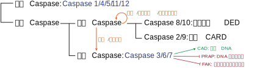

#### 绪论
###### 细胞生物学的发展历史 (96J, 16S, 17T, 20M)
- 细胞学说的建立
	- 施莱登/施万提出**细胞学说**：一切动物、植物都是由细胞组成的，细胞是生物体的基本结构单位。
	- 细胞学说的完善：原生动物由单细胞构成、生物发育是细胞的繁殖与分化等
	- 恩格斯的 19 世纪三大科学发现：细胞学说、进化论、能量守恒与转化定律。
- 经典细胞学时期
	- 原生质理论的提出：组成有机体的单位是一小团原生质 (protoplast)
	- 细胞分裂的研究：有丝分裂的实质是核内丝状物的形成及其向两个子细胞的平均分配。减数分裂的发现。
	- 细胞器的发现：中心体、线粒体、高尔基体等
- 实验细胞学时期
	- 细胞遗传学：以果蝇为模式生物的实验遗传学，如研究不同细胞及分裂过程中染色体数量的变化，并联系孟德尔的遗传因子
	- 细胞生理学：细胞质膜、细胞应激性、神经传导等。高速离心机分离细胞器并体外研究。
	- 细胞化学：细胞内 DNA 的检测、细胞染色、组分分离、放射自显影等
- 细胞生物学时期：1950s 以来，电子显微镜超薄切片技术的超微形态学、DNA 双螺旋结构、中心法则推动上述学科融合，并于 1970s 最终完成细胞生物学学科的形成和确立。
- 分子细胞生物学时期：转基因与单抗制备、经典基因打靶技术、测序、CRISPR 等技术，基因组计划等组学的发展，推动分子水平上对细胞的探索，自 1980s 进入分子细胞生物学时期
###### 细胞生物学的概念与研究的基本内容 (16L)
**细胞生物学 (cell biology)** 是一门利用先进物理学与化学方法，实现
###### 细胞的共性 (19T)
- 化学组成
- 细胞质膜
- 遗传装置
- 分裂方式
###### 如何理解细胞是生命活动的基本单位 (05J, 22L)
- 细胞是一切有机体构成的基本单位
- 细胞是代谢与功能的基本单位
- 细胞是生长与发育的基本单位
- 细胞是繁殖的基本单位
- 细胞是生命起源的标志
###### 生物界的三域六界 (25T)
- 原核生物域 (prokaryote)
	- 原核生物界
- 古核生物域 (archaeon)
	- 古核生物界
- 真核生物域 (eukaryote)
	- 原生生物界
	- 真菌界
	- 植物界
	- 动物界
###### 原核细胞、古核细胞与真核细胞的区别 (93J, 17T, 17J, 20T, 24J)

| 特征      | 原核细胞                                                                     | 古核细胞                                        | 真核细胞                                                  |
| ------- | ------------------------------------------------------------------------ | ------------------------------------------- | ----------------------------------------------------- |
| 大小      | 0.2-10 μm 1-10 (up to 60 μm) （蓝藻）                                     | 0.1-15 μm                                   |                                                       |
| 核结构     | 具有明显的核区 / 类核 (nucleoid)，无核膜围绕                                            | 具有明显的核区 / 类核 (nucleoid)，无核膜围绕               | 有核膜围绕的封闭的细胞核 ()                                       |
| 遗传信息储存  | 环状基因组，在拟核蛋白协助下包装                                                         | 环状基因组，具有组蛋白与类核小体结构                          | 线性基因组，在组蛋白及其他蛋白协助下折叠包装为染色质/染色体                        |
| 基因结构    | 无内含子 多顺反子 mRNA                                                        | 大部分无内含子 多顺反子mRNA                         | 有内含子 单顺反子 mRNA                                     |
| 遗传信息表达  | DNA 复制、RNA 转录、蛋白质合成在空间与时间上无分隔，可同时进行                                      |                                             | 细胞核内进行 DNA 复制与 RNA 转录，成熟 mRNA 出核并进行蛋白质合成              |
| 翻译起始    | fMet                                                                     | Met                                         | Met                                                   |
| 核外遗传物质  | 质粒                                                                       |                                             | 线粒体基因组、叶绿体基因组（植物）                                     |
| 增殖      | 二分裂                                                                      | 二分裂                                         | 有丝分裂、减数分裂                                             |
| 细胞周期    | DNA 复制与细胞分裂不是依次进行的，可同时进行复制与分裂甚至子细胞的 DNA 复制，因此复制周期长于细胞周期                  |                                             | 严格的细胞周期：G1-S-G2-M                                     |
| 细胞壁     | 以肽聚糖为主要成分的细胞壁，依据肽聚糖的多少及革兰氏染色结果分为 G+ 或 G-（细菌） 以肽聚糖为主要成分的细胞壁，与G- 相似（蓝藻） | 蛋白质构成的细胞壁，无肽聚糖和胞壁酸，染色呈 G+ 或 G-              | 主要几丁质的细胞壁 （真菌细胞） 主要几丁质的细胞壁（植物细胞） 无细胞壁（动物细胞）     |
| 其他细胞外基质 | 胶质鞘（蓝藻）                                                                  |                                             |                                                       |
| 细胞质膜    | 脂键连接的甘油磷脂                                                                | 醚键连接的甘油磷脂，具有特征的鲨烯衍生物                        | 脂键连接的甘油磷脂                                             |
| 核糖体     | 70S 核糖体 (50+30)                                                          | 70S 核糖体 (50+30)，但具有 60 种以上蛋白质，rRNA 与真核生物更相似 | 80S 核糖体 (60+40) 叶绿体：70S 核糖体 (50+30) 线粒体：55S 核糖体 |
| 细胞器     | 70S 核糖体 (50+30)、类囊体（蓝藻）                                                  | 70S 核糖体 (50+30)                             | 80S 核糖体 (60+40)                                       |
| 细胞骨架    |                                                                          |                                             | 微丝、微管、中间丝                                             |
| 运动机制    | 由一种鞭毛蛋白构成鞭毛（细菌）                                                          |                                             |                                                       |

###### virus (17M)
###### 动物/植物细胞特有的细胞结构与细胞器 (19T)

动物细胞：
- 细胞器
	- 

植物细胞：
- 细胞器
	- 叶绿体
	- 淀粉体
- 结构
	- 细胞壁
	- 胞间连丝

###### 和细胞相比，为什么说病毒是非细胞形态的生命体 (99T)

###### 为什么认为进化过程中形成的第一个细胞中遗传材料是 RNA，而在进化后期变为了 dsDNA (2008)
#### 研究方法
###### microscopic structure (17M)
显微结构
###### 亚显微结构 (16M)
###### 倒置显微镜与正置显微镜 (17T)
###### 微分干涉显微镜 (12M)
###### 激光扫描共聚焦显微镜 laser scanning confocal microscope (98M)
###### 比较光学显微镜（荧光显微镜）与电子显微镜 (16L, 21T)
光学显微镜使用光作为光源，其中普通光学显微镜使用可见光，而荧光显微镜使用紫外光；电子显微镜使用电子束作为光源
###### 扫描隧道显微镜 scanning tunneling microscope (97M)
###### 荧光单分子检测技术及其应用 (19J)
###### 电子显微镜的分类 (17T)
- 透射电镜 
- 扫描电镜 
###### 差速离心 differential centrifuge (10M)
###### 简述两种使用超速离心技术分离细胞组分的方法 (21T)
速度沉降、等密度沉降
###### 免疫荧光杂交技术及其应用 (15J, 22T, 24M)
免疫荧光技术是指将免疫学方法与荧光标记技术相结合，研究特定蛋白抗原在细胞内分布的方法。
###### 原位杂交技术及其应用 (10J)
原位 ( *in-situ* ) 杂交技术是用标记的核酸探针通过分子杂交来确定特定的核苷酸在染色体或细胞内位置的技术
###### 荧光原位杂交 (11M, 14M, 19M, 22T, 23M)
###### 流式细胞仪的原理及其在测定和分选不同类型免疫细胞中的应用 (07J)
流式细胞术 (flow cytometry) 可以测定细胞中特异的 DNA、RNA 或特异标记蛋白的含量，并可计数细胞群体中含有相应成分的细胞的数量，并进行分选。

###### 细胞系 cell line (2017, 2022)
###### 原代培养 primary culture (2023)
###### 简述细胞培养方法的主要步骤及其应用 (07J)
复苏、培养、传代、冻存
###### cell fusion (15M, 17M, 20M, 22M)
###### 论述体外培养的细胞和体内细胞具有明显差异的特点及原因，并提出优化方案 (23L)

###### 植物组织培养注意的事项 (10J)

###### 单克隆抗体及其主要特点 (99J)

###### 单克隆抗体的制备原理与过程 (93J, 10J, 21T)
###### 简述荧光漂白恢复技术 (20T)

###### 列举生物学常用的模式生物，并说明该模式生物在生物学研究中的用途与优势 (09J, 23J)
线虫
果蝇
斑马鱼
拟南芥
小鼠
###### 转录组与蛋白组在细胞生物学中的应用 (19L)

###### 基因编辑 gene editing (23T)
###### 转录因子的种类与作用 (23J, 23T)
#### 细胞质膜
###### 质膜/细胞膜 plasma membrane (21M)
###### 细胞膜的基本特征 (16J)
细胞膜的基本特征
###### 脂筏 (14M)
###### 细胞质膜的功能  (20J)

###### 膜流动性的生理意义 (95J)
###### 膜蛋白的分类及实验区分 (08J, 19T, 20M)
膜蛋白的分类
- 周边膜蛋白 (peripheral membrane protein) / 外在膜蛋白 (external membrane protein)
	- 
- 整合膜蛋白 (integrated membrane protein) / 内在膜蛋白 (internal membrane protein) 
- 脂锚定膜蛋白 (lipid anchored membrane protein) 
周边膜蛋白与膜通过非共价键连接，结合较为松散，一般通过改变离子强度甚至提高温度即可使其解离；内在膜蛋白通过跨膜结构 (如 α 螺旋、β 桶) 插入膜的脂质双分子层中并与其作用，通过加入 SDS, Triton 等去垢剂可以使其解离；脂锚定膜蛋白
###### 膜脂的分类及其特性 (17T, 18T)
- 甘油磷脂 Phospholipid
	- 磷脂酰胆碱/卵磷脂 (phosphatidylcholine, PC)，质膜中最丰富
	- 磷脂酰乙醇胺/脑磷脂 (phosphatidylethanolamine, PE)
	- 磷脂酰丝氨酸 (phosphatidylserine, PS)
	- 磷脂酰肌醇 (phosphatidylinositol, PI) 
	- 双磷脂酰甘油/心磷脂 ()
- 鞘脂
	- 鞘磷脂 (Sphingomyelin)，鞘氨醇衍生物，连接的脂肪酸较长，构成的脂双层较厚
		- 神经鞘磷脂
	- 鞘糖脂/糖脂
- 固醇
	- 胆固醇（动物）
	- 豆固醇（植物）
	- 麦角固醇（真菌）
###### 红细胞用于研究细胞膜的原因 (21T)
###### 血影 ghost (99M)
#### 物质跨膜运输
###### 简述物质跨膜运输的方式及意义 (11J, 14J, 18T, 22T, 23J, 25T)
###### 被动运输与主动运输的异同点 (16J, 17J, 20J)
###### 协同转运 (19M, 20M)
协同转运指的是利用顺浓度梯度转运一种溶质时的能量，将另一种溶质逆浓度梯度转运，主要依赖协同转运蛋白/偶联转运蛋白。根据两种溶质的运动方向异同可以划分为同向协同转运蛋白 (symporter) 和反向协同转运蛋白 (antiporter)，前者包括小肠和肾小管上皮细胞将钠离子与葡萄糖同向转运进入细胞，而后者包括质膜上的 Na+/H+交换载体。动物细胞常使用 Na+ 作为协同转运离子，其电化学梯度的形成依赖消耗 ATP的 Na+-K+泵，因此本质上属于间接消耗能量的主动运输。
###### 载体蛋白 carrier protein (18M, 23M)
载体蛋白是膜转运蛋白的一种，可介导物质的**协助扩散**及**主动运输**，广泛存在于几乎所有类型的生物膜上，属于多次跨膜蛋白，其可以与特定溶质结合，**通过构象改变介导溶质实现跨膜转运**。典型介导协助扩散的蛋白包括葡糖转运蛋白家族，无需能量可以将溶质顺浓度梯度运输。介导主动运输的载体蛋白可分为利用 ATP 能量的 **ATP 驱动泵**、利用其他溶质浓度梯度差的**协同转运蛋白** 与利用光能的**光驱动泵**。
###### 通道蛋白 channel protein (99M, 22M, 24M, 25M)
通道蛋白是膜转运蛋白的一种，主要介导物质的**协助扩散**，普遍存在于各类真核细胞质膜及细胞内膜上，其通过形成亲水性通道，实现对特异溶质的跨膜转运。通道蛋白基于**通道的直径、形状及通道内带电氨基酸残基的分布** 选择特定可通过的溶质。通道蛋白可分为**离子通道**、**孔蛋白**与**水孔蛋白**，离子通道为目前发现的通道蛋白中的绝大多数，常形成选择性及门控通道。
###### ATP 驱动泵的分类及原理 (17T, 20T)
- P 型泵：有两个独立的 α 催化亚基用于离子转运，并含有 ATP 结合位点，其催化循环中会形成磷酸化中间体，因此称为 P 型泵。
	- $Na^{+}$-$K^{+}$ 泵：α2β2 四聚体，**每一循环消耗 1 分子 ATP，逆化学浓度梯度泵出 3 个 $Na^{+}$ 并泵入 2 个 $K^{+}$** 。具体机制为 $Na^{+}$ 与内侧 α 亚基结合并促进 ATP 水解，通过一个 Asp 残基的磷酸化引起 α 亚基构象变化，将 $Na^{+}$ 泵出细胞，外侧的 $K^{+}$ 与 α 亚基的另一个位点结合并导致 α 亚基构象再度发生变化，将 $K^{+}$ 泵入细胞并完成循环。$Na^{+}$-$K^{+}$ 泵主要功能包括维持细胞膜电位、维持动物细胞渗透压平衡、与协同转运机制共同参与营养吸收，可被少量**乌本苷**抑制。
	- $Ca^{2+}$ 泵：也称 $Ca^{2+}$-ATP 酶，**每一循环消耗 1 分子 ATP，逆化学浓度梯度泵出 2 个 $Ca^{2+}$**，其 α 亚基与 $Na^{+}$-$K^{+}$ 泵的 α 亚基同源，具有相似的机制。$Ca^{2+}$ 泵主要将 $Ca^{2+}$ 泵出细胞或泵入内质网中储存，维持胞质中 $Ca^{2+}$ 的低浓度。细胞质膜型 $Ca^{2+}$ 泵的 C 端具有一个钙调蛋白结构域，可与 CaM 结合并受其调控，而内质网型 $Ca^{2+}$ 泵则无此结构。
	- P 型 $H^{+}$ 泵：存在于植物、真菌与细菌中，发挥其缺少的 $Na^{+}$-$K^{+}$ 泵的生物功能，主要用于维持跨细胞膜的 $H^{+}$ 浓度梯度，并可促进营养的摄入
- V 型质子泵 (**v**esicle)：广泛存在于动物细胞的内体/溶酶体膜、破骨细胞/肾小管细胞质膜、植物细胞/酵母/真菌细胞的液泡膜上，可水解 ATP 并逆浓度梯度转运 $H^{+}$。
- F 型质子泵 (**f**actor)：广泛存在于类囊体薄膜、线粒体内膜、细菌质膜，其结构和机制与 V 型质子泵相似，但是作用相反，即顺浓度梯度转运 $H^{+}$，并借助此质子动力势合成 ATP，因此也称为 $H^{+}$-ATP合酶或 $F_oF_1$ - ATP 合酶
- ABC 超家族：也称为 ABC 转运蛋白，主要转运小分子
	- 核心结构域：主要包括 2 个跨膜结构域 (T)，和 2 个胞质侧 ATP 结合结构域 (A)
	- 机制：ATP 结合前，底物结合位点会暴露于胞外侧（原核）/胞质侧（真核）并发生底物的结合，当 ATP 结合后，ABC 转运蛋白的两个 ATP 结合域会二聚化并将底物结合位点暴露于另一侧并解离需要转运的物质，当 ATP 水解并释放 ADP 后，构象会复原并完成一个循环

###### 离子通道的分类 (18T)
###### 细胞如何维持细胞膜内外离子及电荷的不均匀分布 (07J, 13J, 18T, 19J)
###### 动作电位 (12M)
###### 胞吞作用  (13M, 19M)
###### 胞吐作用 exocytosis (21M, 25M)

#### 细胞质基质/内膜系统
###### 细胞质基质 cytoplasmic matrix / cytomatrix (98M, 07M)
###### endomembrane system (18M, 22T, 24T)
**内膜系统 (inner membrane)** 指的是细胞中包括内质网、高尔基体、溶酶体、内体和分泌泡等单层膜细胞器，在功能和发生上相互联系并且不断变化的动态结构体系。内膜系统各区室通过生物合成、蛋白质修饰与分选，膜泡运输和各种质量监控机制维系其系统的动态平衡。例如，携带分泌蛋白编码 mRNA 与核糖体会结合于内质网膜中，新生肽链直接在内质网中进行加工处理，并通过 COP II 膜泡介导的运输转运至高尔基体中继续加工并分泌出细胞，靶细胞则通过胞吞摄取大分子，在溶酶体中进行消化。
>Page 78
###### 内质网的类型及特点 (13J, 16T)
###### 微粒体 (10M)
###### 蛋白质N-/O-糖基化的特征与区别 (17T)

| 特征          | N-连接糖基化                                                                    | O-连接糖基化                 |
| ----------- | -------------------------------------------------------------------------- | ----------------------- |
| 连接的氨基酸残基及位点 | 天冬氨酸的 N 原子                                                                 | 丝氨酸/苏氨酸/羟脯氨酸/羟赖氨酸的 O 原子 |
| 第一个糖残基      | N-乙酰葡糖胺                                                                    | N-乙酰半乳糖胺                |
| 合成位置        | 糙面内质网与高尔基体                                                                 | 高尔基体                    |
| 合成方式        | 先在内质网膜腔面的磷酸多萜醇载体上合成一定数量糖残基的前体，再通过糖基转移酶将寡糖链整体转移至 Asp 的氮原子上，随后移入高尔基体中进行进一步加工 | 逐个糖残基添加                 |
| 寡糖链长度       | 至少 5 个糖残基                                                                  | 一般 1-4 个糖残基             |

###### 特化的光面内质网及其功能 (19T)
- 肝细胞中发达的光面内质网
	- **合成外输性脂蛋白颗粒**
	- 发挥**解毒作用 (detoxification)**，通过多种化学作用将脂溶性毒物转化为水溶性物质而被排出体外，典型例子为 P450 混合功能氧化酶介导毒物羟基化并转化为水溶物通过尿液排出体外
- 心肌细胞和骨骼肌细胞中发达的光面内质网被称为**肌质网 (sacroplasmic reticulum)**，主要用于储存钙离子，对细胞质中的钙离子起调控作用。
- 合成固醇类激素细胞（如睾丸间质细胞）中发达的光面内质网主要用于合成胆固醇并进一步产生固醇类激素

###### 高尔基体 Golgi (14M)
###### 以胰岛素为例阐述高尔基复合体的蛋白质改造功能 (96J)
###### 简述高尔基复合体的膜转化功能 (97J)
###### 内质网和高尔基体功能上的主要区别 (99J)
###### lysosome (20M, 25M)
###### 溶酶体的形成过程及其基本功能 (07J, 08J, 15J)
###### autophagy 的概念及其生物功能 (09M, 18M, 21J, 22M)

###### peroxisome (20M)
###### 溶酶体和过氧化物酶体的主要异同点 (98J, 20T, 25T)
- 不同点
	- 过氧化物酶体内含有的高浓度尿酸氧化酶等会会呈现特征的晶格状结构，可以此作为电镜识别的主要特征
	- 溶酶体含酸性水解酶，过氧化物酶体含氧化酶
	- 溶酶体 pH ≈ 5，过氧化物酶体 pH ≈7
	- 溶酶体不需氧气，过氧化物酶体需要氧气
	- 溶酶体主要承担消化功能，过氧化氢酶体承担包括脂肪酸分解、乙醛酸循环等多种功能
	- 溶酶体内水解酶在粗面内质网合成，高尔基体出芽形成溶酶体；过氧化物酶体内酶在细胞质基质合成，经组装与分裂形成过氧化物酶体
	- 溶酶体标志性酶为酸性水解酶，过氧化物酶体标志酶为过氧化氢酶
- 相同点
	- 过氧化物酶体与初级溶酶体具有相似的形态与大小

#### 蛋白质分选/膜泡运输
###### 真核细胞分泌蛋白合成机制的信号假说 (94J)
###### 信号识别颗粒 signal recognition particle SRP (99M)
###### 核定位信号 NLS (19M)
###### 分子伴侣 (07M, 09M)
###### 泛素化 ubiquitination (10M, 14M, 19M)

###### 蛋白酶体 (09M)
###### 简述囊泡运输机制 (2012)

###### 内吞作用 (11M, 15M)

###### 受体介导的内吞作用的概念及生理意义 (95J, 97M, 07J)
###### 说明铁传递蛋白受体介导的内吞过程中蛋白质的分拣和受体的再循环 (93J)

#### 线粒体与叶绿体
###### chloroplast (24M)
**叶绿体 (chloroplast)** 是植物细胞中由原质体分化形成的细胞器之一，呈现绿色的凸饼状，主要分布于液泡和细胞质膜之间的薄层细胞质中，其亚细胞定位会随着光照而变化，并且不同叶绿体中会通过基质小管进行频繁的相互联系。叶绿体含有环状双链 DNA，与线粒体同属于半自主性细胞器，受到细胞核及其自身基因组的双重调控。叶绿体的超微结构包括双层的叶绿体膜、类囊体与叶绿体基质，主要通过光合磷酸化作用将光能转化为化学能，并将二氧化碳固定为 3-磷酸甘油并释放氧气。
###### thylakoid (98M)

###### 线粒体的超微结构与功能 (07J, 14J, 20T, 22T, 23T) 
酶

###### 叶绿体的定义，超微结构与功能 (18T, 20T, 21T, 22T, 25T)
###### 光合磷酸化 photophosphorylation (98M)
###### 叶绿体和线粒体的结构比较 (17J)

###### 为什么说线粒体和叶绿体是半自主性细胞器 (09J, 12J, 19T, 21M)

###### 线粒体和叶绿体起源的内共生假说及支持其假说的证据 (1998) 基于该假说，线粒体和叶绿体哪个会先产生？提出假说并说明理由 (2005)

#### 细胞骨架
###### 细胞骨架 cytoskeleton (18M, 20M, 22T)
###### 微丝 microfilament (17M, 23M)
###### 微丝的组装过程 (19J)
###### microfilament binding protein, MBP (24M)
**微丝结合蛋白 (microfilament binding protein, MBP)** 是可以与微丝相互作用的一类蛋白质，其影响微丝的组装与解聚，并介导微丝与其他细胞结构的相互作用来决定微丝的组织与行为。根据其作用方式不同，可分为**肌动蛋白单体结合蛋白** (胸腺素 β4)、作为组装起始位点的**成核蛋白** (如 Arp2/3)、维持组装好的微丝稳定的**加帽蛋白** (如 CapZ)、连接不同微丝束的**交联蛋白** (如 α-辅肌动蛋白)、切断微丝的**割断及解聚蛋白** (如凝溶胶蛋白)
P147
###### 肌肉纤维的组成与功能 (17T)
肌肉纤维主要由负责肌肉运动的**肌动蛋白**、**肌球蛋白**及负责调控的**原肌球蛋白**、**肌钙蛋白**构成，还包括其他辅助蛋白如 Z 盘稳定肌动蛋白丝的 **CapZ**、构成 Z-盘的 **α-辅肌动蛋白**、与黏着斑相关的**纽蛋白**，肌节中的**肌联蛋白**、**伴肌动蛋白**、**肌营养不良蛋白**等
###### 微管 microtubule (21M)
###### 微管组织中心 microtubule organizing center, MTOC (99M)
###### 微管相关蛋白 microtubular associated protein MAP (22M, 25M)
###### 微丝与微管结构与功能的差异 (22T, 24J)
###### 试述分布在细胞内的各部位（如质膜下、纤毛和鞭毛等部位）的微管的组成和生物功能。(2007)

###### 举例微管与微丝的特异性抑制药物并阐述原理 (12J, 16T, 17T, 19T)
- 作用于微丝的特异性药物
	- **细胞松弛素**：可以与微丝结合并将其切断，也会与微丝一端结合以抑制其继续组装，但不与肌动蛋白单体结合，也不会影响微丝的解聚，因此会破坏细胞的微丝网络
	- **鬼笔环肽**：可以与微丝结合并将其稳定，抑制微丝的解聚，因此常用于微丝网络的染色
- 作用于微管的特异性药物
	- **秋水仙碱**、**诺考达唑**：可以结合于微管的一端，阻止微管蛋白继续组装，但不影响微管解聚，因此可以破坏微管网络
	- **紫杉醇**：可以与微管结合并将其稳定，抑制微管的解聚，但不影响微管的组装，同样会影响细胞周期
#### 细胞核与染色质
###### 简述细胞核的基本结构和主要功能 (19T, 20T, 25J)
###### 核孔复合体 nuclear pore complex (98M)
###### 孔膜区 (11M, 15M)
###### 简述亲核蛋白的入核机制 (20J)
###### 核纤层的概念、结构及其主要生物学功能 (97M, 21J)
###### 染色质 / 染色体 (09M, 20T, 22M, 23M)
###### 原核生物和真核生物基因组的区别 (23J)
###### 非组蛋白在染色质中所起的作用 (95J)
###### 核小体 (07M, 09M)
###### 核小体在细胞中存在的实验证据及其基本结构 (09J)
###### DNaseI 超敏感位点 DNaseI hypersensitive locus (99
###### 兼性异染色质 (99M)

###### 转录因子 (24M)
###### snRNPs (12M)
###### 染色体结构与基因活性的关系，在个体发育过程中染色体结构发生哪些变化影响基因活动 (97M)
###### euchromatin (24M)
**常染色质 (euchromatin)** 指的是间期细胞核中染色质纤维折叠程度较低，相对处于伸展状态，用碱性染料染色时着色浅的染色质。一般来说，处于转录活性状态的活性染色质都为常染色质。常染色质核小体组蛋白的 H3K9Me 及 H3K27Me 与 HP1 的多聚化一般标志着其向异染色质的转换。 
###### 着丝粒 (10M)
###### 核仁的结构，功能及与细胞周期之间的对应关系 (08J, 12J, 23M)
#### 核糖体
###### 核糖体的基本类型与化学组成 (20J)
###### 翻译过程参与的物质 (23T)

#### 细胞信号转导
###### 简述细胞间通讯的概念及方式 (16M, 17M, 21M, 22M, 23J, 24T)
**细胞通讯 (cell communication)** 指的是细胞产生胞外信号与靶细胞表面的受体，导致受体的构象改变，并建立胞内的一系列信号通路，最终调控靶细胞的代谢、结构功能或基因表达，并表现为靶细胞整体的生物学效应，信号转导是其中的关键步骤。细胞通讯可分为分泌化学信号、接触依赖性通信和建立间隙连接与胞间连丝三种方式，通过不同介质在细胞间建立连接。
- 分泌化学信号又可以分为四类
	- **内分泌 (endocrine)** 指的是动物中由内分泌细胞分泌的胞外信号分子，经血液或其他细胞外液运输到靶细胞而发挥作用
	- **旁分泌 (paracrine)** 指的是细胞分泌胞外信号进入细胞外液，经过被动的扩散作用作用于附近细胞。主要见于多细胞生物发育中生长因子的调控作用，在创伤恢复中刺激组织增殖也有重要作用。
	- **自分泌 (autocrine)** 指的是细胞分泌的胞外信号分子作用于其自身，常见于肿瘤细胞分泌生长因子，作用于其自身并促进细胞增殖。
	- **化学信号突触 (synaptic signaling)** 指的是神经元间或神经元与感受器及效应器间依靠短距离化学信号分子神经递质传递信号的突触结构，代表神经冲动的电信号到达突触前膜后，电压依赖性离子通道会通过离子浓度介导化学信号（神经递质或神经肽）的分泌，快速穿过突触间隙与突触后膜上的配体结合并继续传输信号。
- 接触依赖性通信
- 间隙连接与胞间连丝
	- 间隙连接
	- 胞间连丝
###### receptor (11M, 13M, 22M, 23M)
**受体 (receptor)** 是一种可以识别并选择性结合特异信号分子的分子，大多数为糖蛋白，少数为糖脂，根据所处的位置可以分为细胞表面受体与细胞内受体 (核受体)。细胞表面受体主要结合亲水性信号分子，如分泌性信号分子（多肽类激素、神经递质等）或膜结合型分子（细胞表面抗原等）；细胞内受体则主要结合脂溶性小分子，如甾体激素、甲状腺素等。受体与信号分子空间结构的互补性是二者特异性结合的主要因素，但并非一一对应，同一信号分子可以作用于不同靶细胞表面的不同受体引起不同反应。
>Page 227
###### cell surface receptor (24M)
**细胞表面受体 (cell surface receptor)** 是一种可以识别并选择性结合特异信号分子的膜蛋白，主要识别亲水性信号分子，其可以将胞外信号转化为胞内信号或物理信号。细胞表面受体一般包括三大类，**离子通道偶联受体**、**G 蛋白偶联受体**与**酶联受体**。离子通道偶联受体在接受信号分子后改变其自身离子通道的活性以改变胞内的离子水平，**G 蛋白偶联受体 (GPCR)** 偶联三聚体 G 蛋白，激活后其 Gα 亚基会解离并传递信号，**酶联受体**在激活后则会作为酶催化胞内的反应，多引起长期效应。
>Page 227
###### intracellular receptor (25M)
细胞内受体是一种可以识别并选择性结合特异信号分子的，
>Page 227
###### signal transduction (13M)

###### 信号转导中受体的种类及特点 (10J, 13J)
###### second messenger (15M, 20M)
第二信使指的是在细胞表面受体介导的信号转导过程中，会产生一类非蛋白小分子，这类物质会调控下游蛋白的活性，承担了携带与放大信号的功能。常见的第二信使包括 GPCR 相关通路中的 cAMP、IP3、DAG 等，分别介导 cAMP-PKA、IP3-Ca2+、DAG-PKC 等通路。
###### 分子开关 (09M)
分子开关指的是一类保守的蛋白，在胞外信号的刺激下在其自身具有的活化（开）和失活（关） 两种状态间转换，并介导下游的信号通路，起到信号转导级联反应中的开关作用。典型的分子蛋白包括 **GTP 酶分子开关调控蛋白**，结合 GTP 时处于活化状态，水解并结合 GDP 时处于失活状态，转换过程由鸟苷酸交换因子 (GEF) 介导；**蛋白激酶/蛋白磷酸酶** 介导的蛋白特定氨基酸残基磷酸化/去磷酸化可以调节蛋白的活性；**钙调蛋白 (CaM)** 通过钙离子的结合与解离实现开关变化
###### 细胞信号转导系统的基础与主要特性 (21J, 20T, 22T, 25T)
细胞信号转导系统的基础是信号蛋白的相互作用
- 主要特性
	- 特异性
	- 放大效应
	- 网络化与反馈调节机制
	- 整合作用
###### 简述细胞表面受体的概念及介导的信号通路 (24M, 25J)
###### G 蛋白的信号转导作用 (15J, 17T)
G 蛋白是三聚体 GTP 结合调节蛋白，有 α/β/γ 三个亚基，其中 α 亚基是具有 GTP 水解酶活性的分子开关，β/γ 形成异二聚体，α 与 β/γ 分别通过共价结合的脂分子结合于质膜。

G 蛋白偶联的受体称为 G 蛋白偶联受体 (G-protein coupled protein, GPCR)，当信号分子与 GPCR 结合后，会使得 G 蛋白发生 GDP-GTP 置换并解离为 β/γ 异二聚体与带有 GTP 的激活 Gα，Gα 会移动并活化下游的效应器，如离子通道、腺苷酸环化酶、磷脂酶C等，介导下游信号通路的激活，实现了胞外信号向胞内信号的转导。
###### 简述 NO 作为气体信号分子的作用机制，举例其参与的生理过程 (09J)
###### G 蛋白偶联介导的磷脂酰肌醇通路转导机制 (07M, 18J, 17T, 21T)
磷脂酰肌醇通路是一条 GPCR 介导的**双信使系统**信号通路，受体会与 $G_o$ 或 $G_q$ 偶联的受体结合并激活 $G_oα$ 或 $G_qα$ ，通过 G 蛋白开关机制激活膜上的磷脂酶 C 的 β 异构体 (PLCβ)，PLCβ 会将膜上的 PIP2 水解为游离的**三磷酸肌醇 IP3** 和留在膜上的亲脂性分子**二酰甘油 DAG** 作为两个第二信使。

IP3 会通过细胞内扩散结合并开启内质网上 IP3 敏感的 $Ca^{2+}$ 通道，引起内质网钙库中的 $Ca^{2+}$ 顺浓度梯度扩散至细胞质中，再通过结合钙调蛋白、激活 NO 合酶等方式介导下游信号。

DAG 会在膜上积累并激活蛋白激酶 C (PKC)，PKC 会催化多种蛋白的丝氨酸/苏氨酸残基磷酸化，介导下游信号通路并作用于多个生理过程
###### 简述细胞信号转导通路间的相互作用 (97J)
###### 生长因子 growth factor (97M)
###### 细胞因子 cytokine (11M)
###### 表皮生长因子调控细胞的机制 (93J)
###### 信号分子中气体分子的类型与特性 (18T)

###### 钙信号的生物学功能 (2012)
###### 整联蛋白 integrin (10M, 14M)?
###### 交叉对话 crosstalking (97M)
#### 细胞周期与细胞分裂
###### 细胞周期的概念及研究意义 (95M, 18M)
###### 细胞周期中细胞形态变化及发生的主要事件 (10M, 25M)
###### G0 期细胞 (99M)
###### 简述 G1 期细胞的可能去向并给出例子 (05M)
###### 什么是细胞周期同步化？简述细胞周期同步化培养的方法并阐述优缺点 (12J, 19T, 22J, 24J)
###### 有丝分裂 mitosis (19M)
###### 减数分裂 meiosis (11M, 13M, 15M, 16M, 18M, 25M)
###### 减数分裂过程 (11J, 14J) 
###### 染色单体 (18M)
###### 联会复合体 (12M)
###### 着丝点 (12M)
###### 初级卵母细胞 (21M)
###### 有丝分裂与减数分裂的异同点 (94J, 22T, 23J)

###### 减数分裂的生物学意义 (2014)
#### 细胞增殖调控/癌细胞
###### 促成熟因子 maturation prompting factor, MPF (98M, 21M)
###### cyclin (10M, 24M)
细胞周期蛋白 (cyclin) 指的是细胞中随着细胞周期产生浓度周期性振荡的蛋白质，参与细胞周期的调控。
###### 检查点 checkpoint (97M)
###### 细胞周期检查点的分类及功能 (17J, 21J, 24T)
###### 简述调控细胞周期的关键激酶及其作用 (20J)
###### 简述核膜在细胞周期中的动态变化和调控机制 (07J)
###### 细胞使 CDK 失活的方式 (07J)

###### 癌基因学说在细胞转化的癌变中的意义 (93J, 19T)
###### 癌细胞的概念与基本特征 (22J, 24J, 25M)

###### 举例说明细胞增殖调控与肿瘤发生的关系 (11J, 14J)
###### 肿瘤细胞与正常细胞在细胞水平上的特征 (09J)

###### 癌细胞的特征与分子靶向治疗的策略 (12J)
###### 癌基因 (09M, 13M)
###### 肿瘤抑制因子 (09M)
###### P53 基因 (97M, 18T)
###### 论述单基因突变和多基因突变累积导致肿瘤发生的机理 (18L)
###### 从细胞遗传学角度论述老人易患肿瘤的原因 (21L)
#### 细胞分化/干细胞
###### 细胞分化的概念与生物学意义 (10M, 14M, 18J, 19M, 20T, 21M, 22J, 25J)
###### 全能性 totipotrncy (99M, 15M, 24M)
细胞全能性指的是一种已经分化的细胞，因携带该个体发育所需要的全部基因，而具有发育成完整个体的潜能
###### 差别基因表达 differential gene expression (97M)
###### 影响细胞分化的因素 (22L, 24J)
- 受精卵细胞质的不均一性
- 信号分子及细胞的位置
- 细胞记忆与决定
- 染色质变化与基因重排
###### 动植物细胞的全能性及其相关实验依据 (20L)
###### 从细胞水平论述动植物发育的共性事件 (22L)
###### 干细胞概念特点及应用 (11J, 16M, 18M, 25M)

###### 干细胞分类与来源 (17J, 22J, 23T, 24T)
###### 干细胞按分化潜能可以如何分类？列举诱导胚胎干细胞/成体干细胞分化的调控机制 (2012)
###### 多能干细胞 pluripotent stem cell (10M, 14M, 19M)

###### 举例说明干细胞分化过程中基因表达的调节 (2007, 2013)
###### 某些动物的部分器官切除后可再生，如蝾螈的前肢。你认为再生的过程中包含了哪些细胞生物学事件？ (2006)

###### 去分化 (24M)
###### 转分化 (12M)
###### 转化细胞 transformed cell (98M)
###### 单克隆抗体 (17M, 19M)
###### 多克隆抗体 (22M)
###### 再生医学 regenerative medicine (24M)
再生医学是旨在将治疗性克隆技术与人胚胎干细胞制备技术相结合，在体外诱导人自身胚胎干细胞，分化形成无免疫排斥反应的器官，用于疾病治疗的概念。

###### 干细胞未来前景 (2014)
#### 细胞衰老/死亡
###### 简述细胞衰老的概念、特征及引起衰老的可能原因 (97J, 98J, 09J, 10J, 16J, 18M, 22M)
**细胞衰老 (cell senescence)**/**复制衰老 (replicative senescence, RS)** 指的是细胞在经历有限次数的分裂后，在形态结构和代谢活动上发生显著的变化，并处于不可逆的增殖功能丧失状态。衰老细胞会变得大而扁平、质膜流动性降低、骨架结构改变、粘附性增强，内部含有大量未消化的脂质。

衰老细胞具有以下**典型特征**。
- 细胞不可逆地停止分裂，且不由生长因子促进。
- 细胞周期的**负调控因子 (p16/p21/p53 等)** 表达上调或活性增强。
- **衰老相关 β-半乳糖苷酶 (SABG)** 表达量上升并活化，该酶在 pH 6.0 条件下表现活性。
- 出现**衰老相关异染色质 (SAHF)** 集中，衰老细胞核荧光染色可见点状聚集。
- 产生**衰老特征性分泌物 (SASP)**，包括炎性因子、金属蛋白酶等，招募免疫细胞吞噬衰老细胞并改变周边微环境。
- 衰老细胞端粒长度明显减少，可用 FISH 准确测定。

衰老的**可能原因与机制**
- 真核生物 DNA 复制存在着末端复制问题，后随链的分段复制机制导致子链 5' 会随着复制次数不断变短。由于人类大多数正常细胞中端粒酶的活性很低，染色体末端结构端粒随着细胞的复制就会不断变短损伤。当端粒损伤到一定限度时，会触发肿瘤抑制因子 p53 的高表达及磷酸化激活，p53 又会活化下游 p21，并抑制 cyclin-CDK2/4/6，使细胞周期停滞在 G1 期，最终导致细胞衰老。
- 当细胞中存在超量过氧化物、非端粒 DNA 损伤的因素时，会激活 p16 蛋白，并发挥与 p21 相似的功能，该机制被称为胁迫诱导的**早熟性衰老 (stress-induced premature senescence, SIPS)**。
###### 端粒 telomere (98M, 07M, 25M)
**端粒 (telomere)** 指的是真核生物线性核 DNA 末端的一种结构，由短串联重复序列构成，人的端粒重复序列为 TTAGGG，较长的 G-rich 链形成 3'-overhang。端粒的作用包括稳定染色体 DNA 末端结构防止不同染色体间连接、补偿后随链 5' 在 DNA 复制过程中产生的缺失等。
**端粒酶 (telomerase)** 是真核生物用于修复 DNA 复制过程中端粒缺失的酶，本质上为携带特定 RNA 模板的逆转录酶。该 RNA 模板可以与该生物的端粒重复结构互补配对，可以引导逆转录酶定位在端粒末端，并继续延伸一个模板长度的重复序列，并移动到下一个单位继续延长。这种机制使得动物端粒的长度几乎保持恒定，但随着动物细胞的分化，端粒酶会逐渐失去活性，端粒的长度不断缩短，最终引起细胞生长停止或凋亡。
###### Hayflick 界限和端粒的关系 (12J)
Hayflick 界限指的是细胞在达到增殖停滞状态之前的复制次数
###### 细胞死亡的方式有哪几种，简述特点及生物学意义 (14J, 20T)

| 特点   | necrosis     | apoptosis               | pyroptosis | necroptosis | autophage | ferroptosis |
| ---- | ------------ | ----------------------- | ---------- | ----------- | --------- | ----------- |
| 细胞膜  | 破裂           | 完整                      |            |             |           |             |
| 形态   | 细胞内容物释放      | 逐渐分离并变为凋亡小体             |            |             |           |             |
| 炎症反应 | 有            | 无                       | 有          |             |           |             |
| DNA  | 片段大小不一，弥散性条带 | 约为 200bp 片段，200 bp 倍数条带 |            |             |           |             |
| 机制   | 被动           | 内源性： 外源性：            |            |             |           |             |
###### programmable cell death (PCD) 的概念、特点及生物学意义 (96J, 11M, 13J)
细胞程序性死亡 (PCD) 指的是

###### apoptosis 的概念、特点、机制及生物学意义 (09M, 15J, 16J, 18J, 21M, 22J, 23T, 24T)
**细胞凋亡 (apoptosis)** 是细胞程序性死亡的一种方式，过程中细胞膜不破裂、内容物不渗出、核 DNA 以 200 bp 为单位被切割，周围组织不产生炎症反应。细胞凋亡主要经历以下过程：
1. **凋亡起始**：细胞表面特化结构消失，细胞间连接消失；线粒体从内质网上脱离，内质网腔不断增大，并逐渐与质膜融合；染色质凝缩成新月状结构，沿核膜分布。
2. **凋亡小体的形成**：核染色质断裂为大小不一的片段，与部分细胞器如线粒体聚集，被质膜反折并包裹进入泡状结构，称为**凋亡小体 (apoptosis body)**。
3. **凋亡小体被吞噬**：凋亡小体逐渐脱离独立，邻近的吞噬细胞将其完整吞噬。

细胞凋亡的**生物学意义**
- **参与胚胎发育及个体塑造**：生物中许多组织的发育依赖程序性的细胞凋亡，如哺乳动物指间蹼、脊椎动物神经系统、蝌蚪尾巴的退化、免疫耐受的形成等
- **维持生物体内自稳态**：动物依赖对分裂和凋亡速率的调控来维持细胞数量的稳态， ALPS 患者增生的 T 细胞无法正常凋亡，会导致淋巴细胞增殖性的自身免疫病；AIDS 患者 HIV 感染的 CD4+ T 细胞直接诱发 T 细胞特异性的过度凋亡也会导致免疫丧失
- **生理保护**：体内会通过凋亡机制来清除体内受损或危险的细胞，杀伤性 T 细胞会分泌 Fas 因子与被感染细胞表面的 Fas 受体结合并介导凋亡，部分细胞在受损伤或受胁迫下会自身同时分泌 Fas 因子与 Fas 受体介导自身凋亡。正常细胞 DNA 受损会诱发凋亡，而肿瘤细胞会抑制凋亡（如高表达凋亡抑制基因 *Bcl2*），使得其可以持续增殖。x
###### 简述 Caspase 及其在执行细胞凋亡中的机理和功能 (09J)

Caspase 是一类天冬氨酸特异性半胱氨酸蛋白酶，参与细胞凋亡的多个通路，根据其功能可以分为两类。**炎症 Caspase** (Caspase 1/4/5/11/12) 主要负责产生有活性的白介素 1 (IL1)，**凋亡 Caspase** 主要介导凋亡，在细胞内活性受到严格调控，正常状态下会与一类 caspase 抑制因子 (inhibitor of apoptosis, cIAP) 结合并被抑制。凋亡 Caspase 可以分为**起始 Caspase** 和**效应 Caspase**，起始 Caspase 会在接受信号后自身切割进行同源活化，并切割效应 Caspase 异源活化，效应 Caspase 再介导一系列下游信号，如
- 激活以 200 bp 为单位切割 DNA 的 **Caspase 激活的 DNA 内切酶 (CAD)**
- 抑制具有解离损伤部位核小体功能的**聚腺苷酸二磷酸核糖转移酶 (PRAP)**
- 切割细胞骨架蛋白使细胞体系发生变化
- 切割核纤层蛋白使得核纤层解聚，核膜收缩
- 抑制**黏着斑激酶 (FAK)**，使得凋亡细胞胞外基质与其他细胞解离

细胞凋亡的起始主要分为两个途径，外源性途径与内源性途径。**外源性途径**一般由死亡受体介导，这些死亡受体会与**死亡配体**（如 TNF、Fas ligand、TRAIL 等）结合，并通过胞质含有的**死亡结构域 (death domain, DD)** 招募含有**死亡效应结构域 (death effector domain, DED)** 的 Caspase 8/10 酶原并组成**死亡诱导信号复合物 (death induced signaling, DISC)**。Caspase 8 在复合物中会自身切割以**同源活化**的方式激活，一方面切割效应蛋白如 Caspase 3 使其**异源活化**，一方面切割 Bid 将凋亡信号传递至线粒体并通过内源途径扩大凋亡信号。**内源性途径**主要与 Bcl2 家族中三个亚族有关，正常情况下 Bcl2 亚族蛋白与 Bax 亚族蛋白形成复合体，但是当细胞内存在凋亡信号时，BH3 家族 (如 Bid) 被活化，导致 Bcl2 亚族蛋白从复合体上解离，Bax 亚族蛋白寡聚化并从细胞质中转移至线粒体外膜上，与电压依赖性离子通道 (VDAC) 相互作用并使其开放至足够凋亡因子从线粒体中释放。一个关键的过程为**细胞色素 c 的释放**，由王晓东团队发现，cyt c 会与细胞质中的 **APAF1** 结合，并促进 APAF1 发生自身聚合并形成一个很大的复合体，称为**凋亡复合体 (apoptosome)**。复合体中的 APAF1 会通过 CARD 结构域招募 Caspase 9，并进一步异源活化 Caspase 3/6/7，介导凋亡。
###### necrosis and necroptosis(13M, 21J)
**细胞坏死 (necrosis)** 是一种以细胞膜破裂、内容物渗出、引起周围组织发生炎症反应的动物细胞死亡方式，会使动物血液中可检测到**损伤相关分子模式 (damage-associated molecule pattern, DAMP)**，即一些原先定位于细胞内的分子，如高度泳动族蛋白 B1、线粒体 DNA 等。细胞坏死包括被动性的死亡与程序性的死亡，后者也可以被称为**坏死性凋亡 (necroptosis)**。
###### 细胞坏死与凋亡的特征比较及细胞凋亡检测的方法 (08J, 10J, 15J, 16J, 17J, 18J, 19J, 24T, 25J)
细胞凋亡的检测方法：
- **电镜形态学观察**：
- **细胞核形态染色**：
- **TMRM/TMRE 染色检测线粒体膜电位**：
- **Annexin V/PI 检测质膜磷脂酰丝氨酸外翻**：Annexin V/PI 是特异性
- **凋亡分子标记检测**
- **电泳检测 DNA 损伤**
- **TUNEL 检测 DNA 损伤**

cAMP介导凋亡？(19T)
#### 社会联系
###### cell sociology (20M)
**细胞社会学 (cell sociology)** 是研究细胞间相互联系的一门学科，细胞之间以细胞通信、细胞黏着、细胞连接、细胞与细胞外基质相互作用构成了复杂的细胞社会。
###### 细胞连接的分类 (13M, 14M, 15M, 17M, 18M, 21T, 23T, 25T)
- **封闭连接 (occluding junction)** 指的是上皮细胞间细胞膜紧密贴合在一起，阻止小分子和离子溶质从细胞间扩散的连接类型，主要方式为紧密连接。
	- **紧密连接 (tight junction)** 一般存在与上皮细胞之间，如小肠上皮或血管上皮中，相邻细胞之间紧靠，可见一条条嵴线包绕在细胞四周并封闭了细胞间的间隙，目前已鉴定出两种 4 次跨膜蛋白——闭合蛋白 (occludin) 与密封蛋白是嵴线的关键组成蛋白。紧密连接主要具有两个功能，第一是形成**渗透屏障**，阻止小分子或离子透过细胞间隙从上皮细胞的一侧扩散至另一侧，典型的例子是大脑中的血管上皮细胞构成了血脑屏障；第二是**形成膜蛋白和膜脂的侧向扩散屏障**，小肠上皮细胞的顶面/游离面需要从肠腔内吸收葡萄糖，因此游离面质膜广泛分布 Na-葡萄糖同向转运体，而基底面则具有被动运输的葡萄糖转运载体，紧密连接限制了两个区域间膜蛋白的侧向扩散，维持了上皮细胞正常功能的行驶。
- **锚定连接 (anchoring junction)** 指的是细胞通过细胞骨架或细胞膜蛋白与另一个细胞或胞外基质黏着的方式，可以传递机械应力。根据参与细胞连接的骨架类型可以分为中间丝相关的锚定连接与肌动蛋白纤维相关的锚定连接。相关的蛋白质包括两种，连接胞外基质及细胞内锚蛋白的**跨膜黏着蛋白质 (adhesion protein)** 和连接前者与胞内骨架的**细胞内锚蛋白 (anchor protein)**。
	- 桥粒与半桥粒是中间丝相关的锚定连接。**桥粒 (desmosome)** 的细胞内锚蛋白主要为**桥粒斑蛋白**与**桥粒斑珠蛋白**，在细胞内形成独特的**盘状致密斑/胞质斑**，在不同细胞中连接不同中间丝（上皮细胞主要为 α-角蛋白）。跨膜黏着蛋白主要包括钙黏蛋白家族的**桥粒芯蛋白**和**桥粒胶黏蛋白**等。天疱疮即为免疫细胞攻击自身的跨膜黏着蛋白导致上皮细胞间锚定连接消失的免疫性疾病。**半桥粒 (semidesmosome)** 与桥粒的结构相似，区别为其跨膜黏着蛋白为**整联蛋白 (integrin)** 连接细胞外基质中的**层粘连蛋白**，上皮细胞与基膜的连接属于半桥粒。
	- 黏着带与黏着斑属于与肌动蛋白纤维相连的锚定连接。**黏着带 (adhesion belt)** (17M) 属于细胞间的连接方式，在上皮细胞间位于紧密连接的下方，形成约 30 nm 的间隙。黏着带跨膜黏着蛋白为Ca2+依赖的钙黏蛋白，细胞内锚蛋白为**联蛋白**、**黏着斑蛋白**、**α-辅肌动蛋白**等，介导钙黏蛋白与细胞内的肌动蛋白纤维连接，可能参与动物发育过程中上皮细胞层弯曲的过程。**黏着斑 (focal adhesion)** (18M) 与黏着带相似，由**踝蛋白**、**α-辅肌动蛋白**、**细丝蛋白**、**纽蛋白**等细胞内锚蛋白介导整联蛋白与微丝连接，常见于肌肉与肌腱的连接。
- **通讯连接 (communicating junction)** (13M, 15M) 介导细胞间的物质转运、化学与电信号的传递。
	- **间隙连接/缝隙连接 (gap junction)** (14M, 18M) 是动物细胞间普遍存在的可传递信号的连接方式，其结构基础为细胞膜上的 4 次跨膜**连接子蛋白 (connexin)**，该蛋白六聚化并形成含有中间孔道的**连接子 (connexon)**，相邻细胞的连接子对接构成间隙连接。连接子的亲水孔道直径约为 1.5 nm，可容纳 Mr ＜ 1000 的小分子及离子通过，因此可以在细胞间实现代谢的偶联、电偶联。间隙连接主要包括三方面功能：
		- 胞间代谢偶联：连接子可以容纳小分子通过，因此，一方面，小分子代谢物前体可以在细胞间自由穿梭，通过实验证明正常细胞产生的代谢前体物质可以通过连接子进入代谢缺陷细胞，并正常合成大分子；另一方面，信号分子也可以在一个细胞群内自由扩散，使得在分泌细胞群中，少量细胞接收到信号就可以通过第二信使的扩散使得所有内分泌细胞分泌激素或酶等物质。
		- 胞间电偶联：神经元中的兴奋传递是基于钠离子内流/钾离子外流引起的膜电位变化，继而触发 VDAC 继续内流/外流进程的原理，因此连接子可以容纳离子通过的特性同样可以在神经元之间形成**电突触 (electronic synapse)**。电偶连的速度快于化学偶联，在协调心肌细胞的收缩，控制小肠蠕动等方面都发挥了作用。
		- 发育相关功能：动物细胞的胚胎发育早期中细胞间普遍存在着间隙连接，使用抗连接子蛋白的抗体注射会导致细胞发育异常，但随着发育的进行，细胞间的间隙连接逐渐消失。
	- **胞间连丝 (plasmodesma)** 是高等植物细胞间信号连接的主要方式，由相邻细胞的质膜穿越细胞壁形成 20 - 40 nm 的管状结构，中央为两侧细胞光面内质网联通形成的**链样管 (desmotubule)**，四周为充满细胞液的环孔，环孔两端狭窄，可以调控细胞间的物质交换。胞间连丝在细胞胞质分裂中细胞板形成后期产生，也可以在非姐妹细胞之间形成。胞间连丝对物质运输具有选择性，不同细胞的胞间连丝可允许通过的物质不尽相同，在植物细胞的物质运输和信号传递中起着非常重要的作用。
	- **化学突触 (chemical synapse)** 是神经元间/神经元-肌肉间传递兴奋的突触结构中除电突触外的另一种结构，由突触前、突触后构成。
###### cadherin (09M, 12M)
**钙黏蛋白 (cadherin)** 是一类介导细胞间钙依赖同亲性黏着的跨膜糖蛋白，其 N 端胞外具有**重复结构域**作为黏着的结构基础。典型钙黏蛋白含有 5 个重复结构域，非典型钙黏蛋白可多至 30 个，每个重复结构域为**刚性结构**，重复结构域间为具有一定柔性的**铰链区**，并具有**钙离子结合位点**。当钙离子结合后，两个不同的钙黏蛋白 N-端即可嵌合在一起。不同组织可表达**不同钙黏蛋白**，如上皮细胞表达 E-cadherin、神经细胞分泌 N-cadherin、胎盘及表皮细胞表达 P-cadherin。钙黏蛋白具有**高度的选择性**，小鼠发育进入八细胞胚胎时期时会表达 E-cadherin，将松散的分裂球细胞转变为紧密黏合的细胞；外胚层细胞发育为神经管时，其会从表达 E-cadherin 转为表达 N-cadherin；上皮细胞与间质细胞的互相转换称为**上皮-间质转型 (epithelial-mesenchymal transition)**，也涉及 E-cadherin 的表达与否，这种表达受到启动子区甲基化和多种转录调控因子 (Snail, Slug, Twist) 的共同作用，EMT 在胚胎的发育、器官细胞更新、多能干细胞分化、肿瘤逃逸等过程中都发挥着作用。
###### 选凝素、整联蛋白与趋化运动
**选凝素 (selectin)** 是细胞分泌的介导钙依赖异亲型结合的细胞黏着分子，能识别糖蛋白上的特异性糖链——**凝集素 (lectin)** 结构域，主要参与白细胞与血管内皮细胞之间的识别与黏着。白细胞上会分泌
###### 细菌分泌的因子（如三肽 f-Met-Leu-Phe）可引起白细胞趋化运动。简述此过程包括哪几个基本的细胞活动。 (06)
白细胞**趋化作用 (chemotaxis)** 也称化学趋向性，指的是白细胞沿着化学刺激物浓度梯度进行定向移动的过程，化学刺激物也称为**趋化因子 (chemokine)**，细菌分泌的三肽 fMLP 就是典型的趋化肽，可以引起白细胞趋化运动，此过程主要包括以下细胞活动：
1. fMLP 作为配体结合白细胞表面的受体，通过信号转导作用
2. 白细胞极化产生 leading edge 与
3. 血管内皮细胞分泌选凝素，与白细胞表面的多肽链凝集素产生较弱的相互作用
4. 随着血流的冲击，
###### extracellular matrix, ECM (11M, 12M, 14M, 19M)
细胞会向细胞外分泌蛋白质和多糖等物质，构成**细胞外基质 (extracellular matrix, ECM)**。细胞外基质在结缔组织中尤为丰富，由成纤维细胞分泌，不同结缔组织的 ECM 具有不同的特性，如骨组织具有坚硬的 ECM、上皮组织和结缔组织间的 ECM 特化为基膜。ECM 主要**构成**包括：**结构蛋白**（胶原等）赋予其强度和韧性、**蛋白聚糖**具有亲水性并提供抗压性、**粘连糖蛋白**（纤连蛋白、层粘连蛋白）连接 ECM 与细胞。ECM 的**生物学功能**包括：为组织的构建提供了支撑框架，对接触细胞的存活、发育、迁移、增殖、形态及其他功能产生重要的调控作用。
###### glycocalyx (97M)
**细胞外被 (cell coat)**/**糖萼 (glycalyx)** 是细胞外表面覆盖的一层粘多糖物质，用重金属染料如钌红染色后，在电镜下可显示厚约 10 - 20 nm 的结构，边界不明确。细胞外被由几乎所有整合膜蛋白和部分膜脂共价相连的糖链构成，不仅对细胞膜其保护作用，还在细胞识别中起重要作用
###### cell wall (24M)
**细胞壁 (cell wall)** 指的是细胞质膜外一层较厚且有一定弹性的结构，通常存在于细菌、真菌、古菌和植物中。细菌的细胞壁主要由肽聚糖、胞壁酸 (G+)、脂多糖 (G-) 构成，真菌的细胞核主要由几丁质构成，植物细胞壁主要由纤维素、半纤维素和果胶构成。细胞壁的主要功能有，为细胞提供机械支撑、发挥渗透屏障作用、协助生长分裂与运动，植物细胞壁还会生成胞间连丝，细菌细胞壁则会决定细胞的抗原性与致病性等。
###### 细胞识别 (12M, 15M, 17M)
#### 其他

###### 阮病毒及其重要性 (93J)

###### 细胞内蛋白质功能的多种调控方式 (2013)

###### 外源基因在真核生物中表达的意义/对真核生物基因表达的意义 (2015, 2019)
###### 免疫系统中细胞的类型及作用 (18J)

###### 中枢神经系统中细胞的类型 (18T)

###### cybrid (97M)
###### 杂交瘤 (11M)
###### 隐蔽 mRNA (99M)
###### 奢侈基因 (10M)
###### 主要组织相容性复合物 MHC (14M)
###### Ribozyme (10M)

---
## 诺贝尔奖
###### 2021 - 
###### 2022 - 
###### 2023 - 
###### 2024 - 
###### 2025 - 

---
## 实验类题目
#### 伪实验类题目
**2003** - 孕酮可促使卵母细胞 (oocyte) 成熟为卵 (egg)。如果用蛋白合成抑制放线酮处理，则可阻断该过程，说明需要蛋白质的合成。卵母细胞中注入 50 nl 卵的胞浆也可使其成熟为正常的卵，但若注入卵母细胞的胞浆则没作用。由此可知卵的胞浆内含有MPF，而且 MPF 介导的卵母细胞成熟不受放线酮的影响。如果将卵母细胞用孕酮处理不同时间，然后放入放线酮中，可以发现在特定的时间后卵母细胞就不再对该药物敏感，而能成熟为正常卵。这个时间与 MPF 活力的出现相对应。为了解 MPF 的合成是否是卵母细胞对放线酮敏感的原因，实验人员将 50 nl 卵的胞浆注入一个卵母细胞中，待其成熟为卵后，从中抽出 50 nl 胞浆注入另一个卵母细胞中，台此进行10次之多，他发现，每次胞浆转移都能使卵母细胞成熟为卵，而且，即使把待注射的卵母细胞放在放线酮中，结果也一样。
1. 如果每个卵母细胞胞浆的体积为 1 ul，经 10 次转移后，最初 50 nl 卵胞浆被稀释了多少倍？你认为MPF经过这样的稀释还能保持活力不变吗？
2. 解释为什么在上述转移试验中MPF活力总能保持相同的水平？
3. 试推测在孕酮催熟过程中需要合成的蛋白质因子的功能。

**2004** - 温度敏感型 (ts) 突变体是研究单倍体酵母细胞周期调控的重要手段。它使得能阴滞细胞周期进行的突变体只在较高的温度下才表现出来。而在较低的温度下只表现为野生型。某人筛选到两株 ts 突变体，在 35℃ 时均表现为细胞增殖停止，为了了解细胞周期阻滞的位置，他利用能将细胞阻滞在 S 期的药物羟基脲进行如下实验：
- 他把一部分养在 20℃ 的突变体 A 转移到 35℃ 培养两小时以产生突变表型，而这差不多是酵母细胞周期的长度。然后他再把酵母转移到含羟基脲的培养液中在 20℃ 培养。他在不同的取样用显微镜观察，未见到细胞发生分裂，相比之下那些一直培养在 20℃ 的细胞在羟基脲中却能观察到一轮明显的细胞分裂。然后他又改变了实验顺序。这次他先把 20℃ 培养的细胞用羟基脲处理两个小时，然后再转移到不含该药物的培养液中在 35℃ 培养，这时他能观察到一轮细胞分裂。
- 他用突变体B做相同的实验，则在两种情况下都看不到细胞分裂，而一直培养在 20℃ 的对照样品则能分裂。
问：
1. **A 和 B 在 35℃ 会分别阻滞在细胞周期的什么位置？并说明理由。**
	在 35 ℃ 的环境下，A 会阻滞在细胞周期的 G1 期，由于 20℃/羟基脲培养 2 h 相当于将 A 同步化在了 S 期前，因此随后观察到了细胞分裂证明 35 ℃ 不会阻断 S/G2/M 期；而 B 会阻滞在细胞周期的 S 期，因此不论先 35℃ 同步还是先羟基脲阻滞，都会将 B 阻滞在同样的 S 期，无论如何无法使周期继续进行。
2. **你能推测 ts 突变体对温度敏感的原因吗？**
	温度敏感型突变体的**一般机制**
	- 由于突变株中存在部分氨基酸的变化，蛋白质的空间结构稳定性可能会降低，使得酶的在高温下易失活，蛋白质易发生变性。
	**A 突变体**使得细胞被阻断在 G1，即干扰了 G1/S 检查点的正常通过，因此至少可以通过三种潜在的机制发挥作用。第一，E2F 抑制导致的不能通过 G1/S 检查点，这可能是由于 E2F 表达装置受到破坏，也有可能是上游抑制因子——Rb 蛋白及类 Rb 蛋白的持续活化所引起的，其活化作用也有可能是上游通路 cyclin D/E/A-CDK 相关蛋白表达被破坏或失活引起的。第二，DNA 复制起始复合物 ORC 或 Cdc6、Cdc45 等相关必要因子的表达抑制或失活。第三，DNA 复制执照因子 MEM 的失活。
	**B 突变体**使得细胞被阻断在 S 期，这可能是由于温度使得 DNA 的完整正确复制被阻断，导致 S 期内部检查点或 DNA 复制检查点无法通过。前者主要是由于 DNA 损伤的发生，而后者由于复制叉的停滞。

**2005** - 有一个小分子营养物质 A，它可为被细胞吸收进入细胞质。如果把脂质体放入溶有 A 的水溶液中，在一段时间后脂质体内腔中只有极少量的 A。随后，将细胞膜上的蛋白质整合到脂质体上，如果整合过程**在水溶液进行**，整合后的脂质体在放入 A 的水溶液中后也只有**极少量的 A 进入脂质体**。但如整合过程**在生理盐水中进行**，脂质体再放入 A 的水溶液中后就可以检测到**大量的 A 进入脂质体**，如果这样的脂质体放入 A 的生理盐水溶液中，就只有很少量的 A 进入脂质体。请你解释这一实验现象，并且给出相应的模型。根据你从上述实验结果中得到的模型，请说明如果把细胞膜蛋白质在水溶液中整合到脂质体中，把这样的脂质体放入 A 的生理盐水溶液中，A 是否可为进入脂质体，为什么？
		前两个实验提示，该小分子营养物质不能透过脂质双分子层自由扩散，或通过膜上的转运蛋白协助扩散，而水溶液和生理盐水溶液的对比则提示钠离子或氯离子可以协助 A 进入脂质体。根据转运蛋白的性质可以推测，钠离子作为协同转运离子，利用其内高外低的浓度梯度协助 A 通过质膜上的反向转运蛋白进入脂质体内，该机制类似于哺乳动物小肠上皮细胞上的 Na+-葡萄糖转运蛋白。因此，在水中整合时，脂质体中为水，外部为高浓度的钠离子，因此无法完成同向协同转运，A 无法进入脂质体。

**2004** - 检验细胞衰老的方法是看细胞是否仍然保持增殖能力。细胞衰老快，其寿命短；细胞衰老慢，其寿命长。其学生利用遗传学的方法筛选到属于两个通路的 A、B、C、D、E 共 5 个不同的基因。A、B、C 中的任何一个突变使细胞寿命短于野生型；A 突变细胞的寿命和 B 突变细胞的寿命相似；A 或 B 突变的寿命短于 C 突变细胞的寿命。D 或 E 突变使细胞寿命长于野生型，但程度不同。
1. 如果实验结果是：A 和 B 同时突变细胞的寿命与 A 或 B 单独突变的寿命相似。A 和 C 同时突变的寿命短于 A 或 C 单独突变的寿命。那么试问 B 和 C 同时突变的细胞的寿命与 A、B 或 C 单独突变细胞的寿命相比是长了还是短了？为什么？
	B/C 同时突变的细胞寿命与 A/C 同时突变的寿命相似，短于 A/B 同时突变的细胞寿命。由 A/B 突变株寿命与 A/B 分别突变株寿命相似可知，A/B 位于同一线性通路中，任意信号蛋白突变失活即影响该通路。而 A/B 突变较 C 突变更严重（相加效应），提示 A/B 与 C 位于平行通路中，且 A/B 信号通路对寿命影响更大。因此 A/C 与 B/C 寿命相似，且大于 A/B 双突变及 C 单突变对寿命的影响。
2. 如果实验结果是：在 B 突变体的细胞中过量表达 A ，细胞寿命和 B 单独突变相似，试问 A 和 B 的上下游关系是什么？
	A 是 B 的上游，B 的突变失活导致 A 的过表达无法传递到下游信号通路。
3. 如果实验结果是：在 A 突变的细胞中过量表达 B，细胞的寿命和野生型的相似，试问 A 基因和 B 基因的上下游关系是什么？
	A 是 B 的上游，A 突变失活对 B 的下调被 B 过表达所抵消了，因此对下游信号通路的影响回到原位。
4. 现在需要了解 D 或 E 基因对细胞寿命的影响是否依赖于B，你将设计什么实验回答该问题？
	- 除已进行的单突变外，设计 B/D/E 的组合突变，若 D/B 双突变株或 E/B 双突变株的寿命与 D 或 E 单突变株的寿命有显著差异，说明 D 或 E 对细胞寿命的影响可能与 B 有关。
	- 在细胞内敲低 D/E ，通过 qPCR/Western blot 在 mRNA 和蛋白水平看 B 有无显著变化。若有，进一步探究具体的机制。
	- 使用 D/E 与同一信号通路的 A/B 或已知的其他蛋白做 pull-down 或 Co-IP 等蛋白质互作实验，初步验证是否直接互作，若直接互作的话进行证据等级更高的实验验证互作关系。
	- 若不直接互作，可在生信层面查看已有的互作组数据，是否存在共同互作的蛋白。也可以分别筛选其互作蛋白，如使用 AP-MS 或邻近标记方法 (BioID/TurboID) 得到其互作组数据，经过数据处理后观察是否可能具有中间的信号蛋白，或通过骨架蛋白进行互作，若有潜在的候选蛋白，可做进一步实验验证蛋白互作，如反向 IP、FRET、SPR/ITC 等
