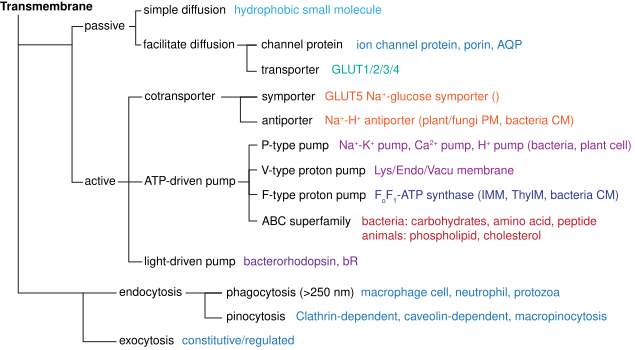

## 1. 细胞生物学的发展历史
(96J, 16S, 17T, 20M)
- 细胞的发现
- 细胞学说的建立
	- 施莱登/施万提出**细胞学说**：一切动物、植物都是由细胞组成的，细胞是生物体的基本结构单位。
	- 细胞学说的完善：原生动物由单细胞构成、生物发育是细胞的繁殖与分化等
	- 恩格斯的 19 世纪三大科学发现：细胞学说、进化论、能量守恒与转化定律。
- 经典细胞学时期
	- 原生质理论的提出：组成有机体的单位是一小团原生质 (protoplast)
	- 细胞分裂的研究：有丝分裂的实质是核内丝状物的形成及其向两个子细胞的平均分配。减数分裂的发现。
	- 细胞器的发现：中心体、线粒体、高尔基体等
- 实验细胞学时期
	- 细胞遗传学：以果蝇为模式生物的实验遗传学，如研究不同细胞及分裂过程中染色体数量的变化，并联系孟德尔的遗传因子
	- 细胞生理学：细胞质膜、细胞应激性、神经传导等。高速离心机分离细胞器并体外研究。
	- 细胞化学：细胞内 DNA 的检测、细胞染色、组分分离、放射自显影等
- 细胞生物学时期：1950s 以来，电子显微镜超薄切片技术的超微形态学、DNA 双螺旋结构、中心法则推动上述学科融合，并于 1970s 最终完成细胞生物学学科的形成和确立。
- 分子细胞生物学时期：转基因与单抗制备、经典基因打靶技术、测序、CRISPR 等技术，基因组计划等组学的发展，推动分子水平上对细胞的探索。
## 2. 细胞的基本结构与化学组成
### 2.1. 细胞的形态结构
###### 细胞大小
- 病毒：20 ~ 300 nm
- 支原体 (最小细胞)：100 ~ 300 nm
- 细菌：1 ~ 2 μm
- 动物细胞：20 ~ 30 μm
- 原生生物：0.1 ~ 数 μm
细胞大小一般取决于**核糖体的活性**，哺乳动物细胞调控大小的信号网络的中心是 **mTOR**
###### 生物界的三域六界 (25T)
- 原核生物域 (prokaryote) - 原核生物界
- 古核生物域 (archaeon) - 古核生物界
- 真核生物域 (eukaryote) - 原生生物界、真菌界、植物界、动物界
###### 如何理解细胞是生命活动的基本单位 (05J, 22L)
- 细胞是一切有机体**构成**的基本单位
- 细胞是**代谢与功能**的基本单位，单细胞依靠一个细胞完成呼吸、排泄、生殖和运动等一系列生理活动，多细胞生物则依赖细胞间的相互协同作用，不同细胞有机地组织并形成执行特定功能的器官，完成复杂的生理过程。
- 细胞是**生长与发育**的基本单位
- 细胞是**繁殖**的基本单位
- 细胞是**生命起源**的标志
###### 动物/植物细胞特有的细胞结构与细胞器 (19T) 
- 动物特有细胞器：溶酶体、中心粒、纤毛/鞭毛
- 植物特有细胞器：液泡、质体（叶绿体等）、乙醛酸循环体、胞间连丝
### 2.2. 细胞的化学组成及其意义
### 2.3. 细胞的共性
###### 细胞的共性 (19T)
- **化学组成**：所有细胞都利用自然界中的 20 多种元素，如碳、氢、氧、氮、磷、硫等形成以碳为基本骨架的氨基酸、核苷酸、脂质和糖类。因此细胞的化学组成非常同一，不同的生物间可以互相利用成分，这样的机制也是生物存活和演化的物质基础。
- **细胞质膜**：所有细胞表面都有磷脂双分子层与蛋白质构成的细胞质膜，使得细胞内具有相对独立的内环境。细胞内通过细胞质膜与外界进行物质交换和信号传递。
- **遗传装置**：所有细胞都使用**双链 DNA** 作为遗传物质的载体，并以 **RNA 指导蛋白质的合成**，且蛋白质的合成场所几乎都是**核糖体**，除部分原生动物外所有细胞都使用几乎相同的**一套遗传密码**，提示所有细胞都具有共同的原始祖先。
- **分裂方式**：所有细胞都以一分为二的方式分裂，在分裂时将一套遗传物质均分给两个子细胞，这是生命繁衍的基础与保证。从演化的观点看，现存所有细胞都是共同祖先的后代。
###### 原核细胞、古核细胞与真核细胞的区别 (93J, 17T, 17J, 20T, 24J)

| 特征      | 原核细胞                                                                           | 古核细胞                                        | 真核细胞                                                  |
| ------- | ------------------------------------------------------------------------------ | ------------------------------------------- | ----------------------------------------------------- |
| 大小      | 细菌：0.2-10 μm 蓝藻：1-10 (up to 60 μm)                                          | 0.1-15 μm                                   |                                                       |
| 核结构     | **细菌**：具有明显的核区 / 类核 (nucleoid)，无核膜围绕 **蓝藻**：中心质/中央体，无明显界限，DNA 拷贝数变化大        | 具有明显的核区 / 类核 (nucleoid)，无核膜围绕               | 有核膜围绕的封闭的细胞核，DNA 与核小体等蛋白包装                            |
| 遗传信息储存  | 环状基因组，在拟核蛋白协助下包装                                                               | 环状基因组，具有组蛋白与类核小体结构                          | 线性基因组，在组蛋白及其他蛋白协助下折叠包装为染色质/染色体                        |
| 基因结构    | 无内含子 多顺反子 mRNA (操纵子)                                                        | 大部分无内含子 多顺反子mRNA (操纵子)                   | 有内含子 单顺反子 mRNA                                     |
| 遗传信息表达  | DNA 复制、RNA 转录、蛋白质合成在空间与时间上无分隔，可同时进行                                            |                                             | 细胞核内进行 DNA 复制与 RNA 转录，成熟 mRNA 出核并进行蛋白质合成              |
| 翻译起始    | fMet                                                                           | Met                                         | Met                                                   |
| 核外遗传物质  | 质粒                                                                             |                                             | 线粒体基因组、叶绿体基因组（植物）                                     |
| 增殖      | 二分裂                                                                            | 二分裂                                         | 有丝分裂、减数分裂                                             |
| 细胞周期    | DNA 复制与细胞分裂不是依次进行的，可同时进行复制与分裂甚至子细胞的 DNA 复制，因此复制周期长于细胞周期                        |                                             | 严格的细胞周期：G1-S-G2-M                                     |
| 细胞壁     | **细菌**：以肽聚糖为主要成分的细胞壁，依据肽聚糖的多少及革兰氏染色结果分为 G+ 或 G- **蓝藻**：以肽聚糖为主要成分的细胞壁，与G- 相似 | 蛋白质构成的细胞壁，**无肽聚糖和胞壁酸**，染色呈 G+ 或 G-          | 主要几丁质的细胞壁 （真菌细胞） 主要几丁质的细胞壁（植物细胞） 无细胞壁（动物细胞）     |
| 其他细胞外基质 | 胶质鞘（蓝藻）                                                                        |                                             |                                                       |
| 细胞质膜    | 脂键连接的甘油磷脂                                                                      | 醚键连接的甘油磷脂，具有特征的鲨烯衍生物                        | 脂键连接的甘油磷脂                                             |
| 核糖体     | 70S 核糖体 (50+30)                                                                | 70S 核糖体 (50+30)，但具有 60 种以上蛋白质，rRNA 与真核生物更相似 | 80S 核糖体 (60+40) 叶绿体：70S 核糖体 (50+30) 线粒体：55S 核糖体 |
| 细胞器     | 细菌：核糖体 蓝藻：核糖体、类囊体 (含藻胆体)                                                    | 70S 核糖体 (50+30)                             | 80S 核糖体 (60+40)                                       |
| 细胞骨架    | FstZ 等                                                                         |                                             | 微丝、微管、中间丝                                             |
| 运动机制    | 由一种鞭毛蛋白构成鞭毛（细菌）                                                                |                                             |                                                       |
**三种细胞类群最基本的区别**
1. **细胞膜系统的演化**：细胞膜系统的演化将细胞分为了相对独立的**细胞质**和**细胞核**，细胞质又被内膜系统分隔为结构更精细，功能更专一的细胞器。在区域化的基础上，细胞骨架提供了精密的支架系统。
2. **遗传信息量与遗传装置的扩增与复杂化**：在膜系统演化的基础上，细胞内部结构与功能区域化专一化，导致遗传装置的扩增和基因表达方式的相应变化，DNA 由环状单倍性转化为线状多倍性。出现间隔序列和内含子，可以通过可变剪接编码多种蛋白质，增加了复杂程度。DNA 的多倍性和高级结构的形成为遗传物质的精确复制提高了难度，因此发展出了细胞周期和有丝分裂器
#### 2.4. 病毒与细胞的关系
###### virus (99T, 17M)
定义：**病毒 (virus)** 是最小最简单的有机体，其本质是不具有细胞结构的大分子复合体

特征：
- 结构：体积小，结构简单，没有核糖体等任何细胞结构，无法自主代谢
- 遗传：遗传物质为 DNA 或 DNA 中的一种，仅在细胞内才能复制及进行基因表达
- 繁殖：病毒进入细胞后，合成大量的核酸及病毒蛋白，装配为大量子代病毒，该过程称为复制
- 病毒具有彻底的寄生性，其自身不表现出任何生命特征，仅在细胞内才能表现出生命特征并繁殖出子代病毒。

分类：病毒的可以简单根据寄生细胞类型分为动物病毒、植物病毒、细菌病毒等类型，但目前主流推广的分类方法是依据病毒遗传物质及分子生物学分类的 ICTV 分类法

结构：**病毒**由核酸及一种或多种蛋白质组成，病毒核酸外有蛋白质构成的**衣壳 (capsid)**，衣壳和核酸统称为**核衣壳 (nucleocapsid)**，部分病毒在核衣壳外还有来源于细胞膜的脂双层**囊膜 (envelop)**。
###### 为什么认为进化过程中形成的第一个细胞中遗传材料是 RNA，而在进化后期变为了 dsDNA (08)

## 3. 细胞生物学研究技术和基本原理
### 3.1 细胞形态观察技术
#### 3.1.1. 光学显微技术
###### 显微与分辨率
显微镜分辨率：
$$D=\frac{0.61\lambda}{N\cdot\sin \frac{\alpha}{2}}$$
###### microscopic structure (17M)
**显微结构 (microscopic structure)** 指的是使用普通光学显微镜能观察到的微观结构，约 0.2 μm 以上，对于细胞而言一般是细胞核（染色体和核仁）、染色体、叶绿体、线粒体等细胞器的结构。1665 年胡克首次发现了细胞结构，随后经列文虎克观察并总结了细胞器的形态。观察显微结构的工具包括普通复式光学显微镜、相差显微镜、微分干涉显微镜及可以追踪特定荧光标记物质及结构的各类荧光显微镜。
###### submicroscope structure (16M)
**亚显微结构 (submicroscopic structure)** 指的是使用普通光学显微镜无法观察，仅能使用电子显微镜或其他工具才能观测到的结构尺度，一般指 200 nm 以下，介于显微结构与分子结构之间。对于细胞而言包括各类膜结构 （细胞膜/内膜系统/核膜）、微丝、微管、核糖体、各细胞器内部的超微结构，这些工具和结构的发展为细胞生物学学科的形成奠定了基础。目前观测亚显微结构的主要方式包括透射电子显微镜、扫描电子显微镜 (SEM)、扫描隧道显微镜 (STM)、冷冻电镜 (cyro-EM) 及低温断层扫描 (cyro-ET) 等，这些方式推动科学家从更微观的尺度观测细胞和大分子，为理解细胞活动的基础提供了手段。
###### 正置与倒置显微镜 (17T)
- 正置显微镜的物镜在样品上方，光源在下方
- 倒置显微镜的物镜在样品下方，光源在上方，倒置显微镜可以观察细胞培养皿或部分液体材料
###### 数种光学显微镜 (12M, 98M) 
- **暗视野显微镜 (dark‑field microscope)**：通过暗场聚光器形成一束空心锥形入射光，直接透射光被阻挡，只有被样品散射的光进入物镜，因而在黑暗背景上显现散射体为亮像。该方法将微小或无染色透明结构的散射信号放大而不依赖相位差或吸收差。
- **相差显微镜 (phase‑contrast microscope)**：利用位于光路中的环形光阑与相位板将穿过样品的相位延迟转换为振幅（强度）差，通过相干干涉使透明样品产生明暗对比。相差系统对微小折射率或厚度变化敏感，可直接观察未染色活细胞内部结构。
- **微分干涉显微镜 (differential‑interference contrast, DIC)**：将偏振光经 Wollaston/Normarski 棱镜分成两束微位移的相干光束，穿过样品后再合并干涉，干涉强度反映两束间光学路径差的梯度，产生具有伪立体感的高对比图像。DIC 强调相位梯度而非绝对相位，适合显示边界和细微形态差异。
- **激光扫描共聚焦显微镜 (laser scanning confocal microscope, LCSM)**：用聚焦激光点逐点扫描样品并通过检测光路上的共轭针孔阻挡离焦光，只收集焦平面发出的信号，从而获得光学切片并提高轴向分辨率与对比度。点扫描与同步探测器（如 PMT/HyD）还允许对荧光标记进行高度定量的三维成像。
###### 荧光单分子检测技术及其应用 (19J) 4
- **全内反射荧光显微镜 (TIRFM)** 是一种利用光学性质的超高分辨率技术。原理为大角度光线射入时，表面仅仅会发生反射而不会发生折射，而介质的另一面则会发生隐失波，能量范围通常在 200 nm 内，因此可以激发很薄一层荧光分子信号，从而大大增强纵向分辨率。
- PALM/STORM：**光激活定位显微术 (PALM)** 利用 PA-GFP 的特性，即只有先被 405 nm 荧光照射后，才能被 488 nm 激活。因此首先构建融合蛋白，每个循环先用低能量 405 nm 激光照射，再用 488 nm 激光定位，随后再 488 nm 激光漂白，大量重复该过程即可得到高分辨率。**随机光学重构显微术 (STORM)** (庄小威) 具有相似的原理，但是应用花青染料 cy3/cy5，并可以利用免疫技术标记内源蛋白
日前，已有部分集数将单分子荧光追踪技术应用于活细胞，实现基因编码标签（如 Halo、SNAP）与高亮度低光毒性染料的特异性标记、稀释或光激活策略以控制标记密度，结合 TIRF 或lattice light‑sheet等低背景成像、adaptive optics校正样品像差、快速sCMOS/EMCCD探测器和实时单分子定位与轨迹重连算法（基于多目标贝叶斯滤波或轨迹拼接），并辅以超高精度定位方法（sptPALM、uPAINT、MINFLUX）及三维定位手段（像散/双螺旋PSF），在生理条件下以纳米空间和毫秒时间分辨率直接测量蛋白扩散系数、结合与解离动力学、复合体组装过程和瞬时分子相互作用。
#### 3.1.2. 电子显微镜技术
###### 比较光学显微镜（荧光显微镜）与电子显微镜 (16L, 21T)
1. 成像原理
	1. 光学显微镜：光学显微镜使用**可见光束**或**红外/紫外光束**作为光源，光线通过**光学透镜**（目镜和物镜）进行折射并成像。根据分辨率计算公式，可见光的波长为 400-700 nm，因此在油镜及香柏油的条件下可以接近光学显微镜的分辨率极限，约 200 nm。
	2. 电子显微镜：电子显微镜使用**电子束**作为光源，光线通过**电磁透镜**进行折射并成像，分辨率可达纳米甚至亚纳米
2. 样品制备：显微镜样品制备的核心步骤均为固定-脱水-支撑/包埋-切片-染色/标记的过程，但具有一定的不同
	1. 光学显微镜对样品要求较低，以最常用的组织切片为例，活体分离组织后立刻浸入多聚甲醛溶液中**固定样品**，随后使用不同浓度的乙醇及其他有机溶剂进行**梯度脱水**，将脱水后的组织浸入热融的蜡并冷却进行**石蜡包埋**，随后将蜡块使用切片机进行**切片**，石蜡片放入水中展开后置于盖玻片并进行**烤片**干燥，动物组织一般使用伊红-苏木精 (H-E) 染色，随后观察。
	2. 电子显微镜对样品要求较高
		1. **电子束穿透能力**显著弱于光子，一方面，需要**真空成像环境**，因此样品需要**严格脱水**，另一方面对于透射电镜来说，样品的**厚度**需要更薄 (＜100 nm)，有时需要使用离子减薄技术。
		2. 对于扫描电镜来说，样品**表面需要具有导电性**，因此一般会在样品表面溅射镀金，形成数十纳米的金层，有时也会先沉积保护层再喷涂导电层，称为双喷技术。
		3. 电子束的成像仅依靠细胞不同结构的电子密度不同，因此需要**高电子密度的物质染色**提高分辨率，例如四氧化锇负染、**醋酸铀-枸橼酸铅**双染。免疫电镜技术通过将抗体和高电子密度物质/催化酶（如胶体金、过氧化物酶、铁蛋白）偶联实现特定蛋白和细胞器的标记。
3. 应用
	1. 光学显微镜，简便、活细胞/活体
	2. 电子显微镜，分辨率高、能谱分析
###### scanning tunneling microscope (97M)
定义：**扫描隧道显微镜 (scanning tunneling microscope, STM)** 利用了量子力学中的**隧道效应**，即低电压下二电极之间有很大阻抗，但近到一定距离后则会产生隧道电流，与针尖至样品距离d呈指数关系，因此可以通过检测隧道电流来计算针尖与样品表面的距离，进而进行样品表面的成像。
优点包括：
1. **原子尺度**，0.1 - 0.2 nm 侧向分辨率，0.001 nm 纵向分辨率
2. 多种条件下，大气液体
3. 非破坏性测量
### 3.2. 细胞化学组成及其定位与动态分析技术
###### differential centrifuge and  (10M, 21T)
**速度沉降**指的是在离心力场中，样品中的粒子按沉降速度沿密度梯度或缓冲液层析分离，较大的质点或更紧凑的复合体以更快的终端速度向管底移动；分离基于沉降系数 s（由颗粒的质量、形状与摩擦阻力决定），实验通过在梯度顶部加样并在限定时间内离心，使各组分按速度形成层带而不达到平衡位置。应用与注意：常用蔗糖梯度分离核糖体亚基、聚核糖体、蛋白复合体或细胞器亚群，关键是时间与转速的控制以及梯度浓度低于样品浮力密度，避免组分到达管底或扩散模糊。

**等密度沉降**指的是样品组分在足够长时间的高速离心下沿着密度梯度迁移，直到每一组分到达介质密度等于其自身浮力密度的位置并在此停留，即达到平衡，分离依据为物质的密度而非形状或质量。实验要点与应用：常用高密度介质（如氯化铯、碘克沙醇）制备梯度并进行长时间离心以分离 DNA、病毒、脂蛋白等，适用于密度差明显的组分，且结果与离心时间无关（达到平衡后稳定）。
###### 免疫荧光杂交技术及其应用 (15J, 22T, 24M)
- 定义：免疫荧光技术是指将免疫学方法与荧光标记技术相结合，研究特定成分或结构在细胞内分布的方法。
- 机制：其原理是将目的蛋白与荧光分子通过抗原-抗体的方式结合后，在荧光显微镜下观察荧光分子的光信号，定位目的蛋白的位置。
- 分类：IF 可以分为直接标记和间接标记，目前常用间接 IF，即使用一抗结合目的蛋白，再使用带有荧光标记的二抗结合一抗实现标记。
- 应用：
	- 细胞生物学：IF 另一主要的作用是通过标志蛋白来实现特定细胞器及细胞结构定位，如组蛋白 H3/H2A.X 可以标记细胞核、钙联蛋白/钙网蛋白可标记内质网、GOLGA2 可标记高尔基体、CD9/63 可标记外泌体。
	- 在免疫组织化学中，荧光免疫染色可用于检测癌细胞中特定的肿瘤标记物，例如乳 腺癌中的HER2蛋白。这可以帮助医生确定肿瘤的类型和分级，从而指导治疗决策。
	- 在神经科学研究中，荧光免疫技术可用于定位和可视化特定神经元类型的分布和连 接方式。例如，通过荧光免疫染色可以标记和观察海马区的突触连接，以研究学习和 记忆的神经机制。
	- 在免疫学研究中，荧光免疫流式细胞术广泛应用于表型分析和细胞亚群鉴定。通过 标记不同的抗体与细胞表面抗原结合，可以识别不同类型的免疫细胞，并研究免疫系统的功能和异常。
- 前沿：目前 IF 的前沿进展包括，高通量强信号的循环免疫荧光 (cycIF)、结合寡核苷酸条形码的 CODEX 技术、与 STORM、膨胀显微镜 (ExM) 等方法结合提高分辨率、与组织透明化技术结合实现大尺度的原位三维 IF。
###### 免疫电镜技术
定义：免疫电镜技术是在电镜水平下定位特定蛋白质的技术，利用抗原-抗体特异性结合的免疫反应将标记物与目的蛋白偶联，并通过电镜观察标记物实现目的蛋白的定位。

方法：由于电子显微镜不同于光学显微镜的性质，电镜的标记物需要为高电子密度的成分，目前应用过的包括铁蛋白、胶体金及过氧化物酶，其中辣根过氧化物酶可以催化过氧化氢氧化 DAB 形成棕色沉淀，经四氧化锇处理后形成高密度的锇黑。

胶体金法是相对先进的方法，利用金纳米颗粒在电子束下极强的电子散射产生高对比致密点，将这些电子致密标记通过稳定连接与抗体偶联，使抗体‑抗原特异性结合在电镜图像中直接呈现为离散的高密度小点。金粒子的尺寸与电子散射截面决定可见性与空间分辨率，而金‑蛋白的化学结合保障标记稳定性；该方法将免疫学特异性与金属的电子学对比度耦合，实现对细胞内分子在纳米尺度上的定位。
###### ISH 及其应用 (10J)
**原位杂交技术 (in‑situ hybridization, ISH)** 是用标记的核酸探针通过分子杂交来确定特定的核苷酸在染色体或细胞内位置的技术，其原理是先将样品中的核酸经变性成为单链以暴露互补序列，随后在严格控制的温度与盐度条件下用带有可检测标记（荧光染料、酶标、荧光增强/生物素等）的寡核苷酸或 cDNA 探针与靶序列发生碱基互补配对，杂交后通过洗脱非特异性结合并直接观察标记或借助信号放大体系（如 TSA 或多探针堆积的 smFISH）增强可视化；探针‑靶体的亲合力与洗涤强度决定特异性与分辨率。应用涵盖组织与细胞中 mRNA/非编码 RNA 的空间定位、染色体 FISH 用于染色体重排与拷贝数检测、临床病原体与肿瘤标志物诊断（例如 HER2 扩增）、发育生物学中基因表达格局解析，以及通过高通量与多重标记技术扩展至单分子水平或转录组级的空间基因表达研究。
###### 荧光原位杂交 (11M, 14M, 19M, 22T, 23M)
定义：**荧光原位杂交 (flourscence *in-situ* hybrid, FISH)** 是一种利用直接或间接的荧光探针检测和定位特定核酸序列的技术。

原理：使用特异性标记的寡核苷酸探针直接在活细胞中与靶序列进行原位杂交，洗脱后使用荧光显微镜观察细胞荧光信号即可确定靶染色体或靶序列的位置。除了直接的荧光探针，目前主要使用其他小分子如生物素标记探针，杂交后使用可与其特异结合并偶联荧光素的分子或抗体进行孵育实现信号放大。可以多色荧光标记实现单一细胞内共定位。

探针分类：
1. 染色体特异重复序列探针：主要用于检测染色体数目异常；
2. 全染色体或染色体区域特异性探针：主要用于检测染色体数目或结构异常；
3. 特异性位置探针：用于检测染色体的易位、缺失等。此外，还有用于特定 RNA 检测的人工合成或体外转录的探针。

**单分子荧光原位杂交 (smFISH)** 通过设计多条短的特异性寡核苷酸探针，与单个 RNA 分子进行特异性结合，并通过单分子荧光信号检测实现 RNA 分子定位。随后发展的 **RCA-FISH** 则利用挂锁探针，通过反转录-滚环扩增的机制实现了荧光信号的原位放大，一方面向高精度的单分子 RNA 动态追踪发展，另一方面联合高通量测序实现空间转录组技术。
###### autoradiography
 放射自显影是利用放射性电离射线对乳胶 (AgBr/AgCl) 的感光作用，对细胞内生物大分子进行定性、定位与半定量研究的一种细胞化学技术。
DNA：3H-TdR、RNA：3H-U
###### 流式细胞仪的原理及其在测定和分选不同类型免疫细胞中的应用 (07J) 9
流式细胞术 (flow cytometry) 可以测定细胞中特异的 DNA、RNA 或特异标记蛋白的含量，并可计数细胞群体中含有相应成分的细胞的数量，并进行分选。

**液流系统**由流动室、样品管、鞘液管和喷嘴组成。样品在进入流动室之前，其中的细胞或微粒都是以随机的方式移动。在进入流动室之后，样品在液流压力的作用下从样品管中喷出，同时鞘液(通常为缓冲盐溶液)在高压下由鞘液管喷出，并包裹在样品流四周，形成稳定的同轴流动状态，然后从喷嘴喷出。**样品流中的细胞或微粒在鞘液的作用下，会以相同的速度逐一通过激光检测点**。

**光学系统**由激发光源、分光镜和滤光片以及产生光电流的检测系统组成。经荧光染色的细胞或微粒受到合适的光激发后会产生许多不同波长的荧光信号，通过分光镜和滤光片可以将这些荧光信号区分开来并由不同的通道接收。之后光信号通过光电倍增管（Photomultiplier tube，PMT）转化为电信号，传输到数据处理系统。

流式细胞仪中常见的几种激光器主要有405nm（紫色）、561nm（黄色）、638nm（红色）和488nm（蓝色）等，不同的荧光染料可被相应的激光器激发，发出特定波长的光，从而被检测器检测。**分光镜和滤光片的作用是引导光路到指定的检测通道**，它通常由平面玻璃或棱镜制成，通过精密的设计，将入射的激光束按照特定的角度和波长进行分散和反射，使得不同波长的光聚焦于不同的位置上。滤光片主要分为长通滤光片（Long-pass filter，LP）、短通滤光片（Short-pass filter，SP）和带通滤光片（Band-pass filter，BP）
白细胞分化抗原 (CD)

https://zhuanlan.zhihu.com/p/32353876186
###### primary culture cell (23M)
定义：**原代培养 (primary culture)** 指的是直接培养从动物机体内分离出的细胞的过程，这类细胞称为**原代细胞 (primary culture cell)**，一般也会将传至 10 代内的细胞统称为原代细胞。

操作：原代细胞培养的**主要操作**为，首先取出动物的组织块剪碎，并用浓度与活性适中的胰酶或胶原酶处理使其分散，给予营养液与无菌的培养环境，静置或慢速转动培养。**培养体系**一般使用基础培养基、抗生素、动物血清与必须氨基酸，如 DMEM + NEAA + PS + FBS，若有特定实验需要也可以使用各类无血清培养基替代。

功能：原代细胞培养是建立细胞系的必要准备，得到的原代细胞也具有比普通无限细胞系更贴近体内的胞内环境。
###### cell line (17M, 22M) 
定义：**细胞系 (cell line)** 指的是动物组织中分离的原代细胞经过一定代数的培养，能稳定的生存并分裂的传代细胞，这些细胞一般保留原染色体的二倍体数量及接触抑制的特性。

分类：部分细胞系中的细胞传代 40 ~ 50 次后会无法继续传代，称为**有限细胞系**；发生遗传突变，带有癌细胞特点且可以无限制传代的细胞系则称为**永生细胞系**或**连续细胞系**，常见的无限细胞系包括人源的 HeLa、293T、CHO、U2OS 和鼠源的 NIH/3T3 和 raw246.7 等。

应用：细胞系经过遗传标记或改造，筛选分离后增殖形成的具有基本相同的性状的细胞群体称为细胞克隆，该群体进行生物学鉴定后称为**细胞株 (cell strain)**。
###### 简述细胞培养方法的主要步骤及其应用 (07J, 15J) 10
**获得细胞**
1. 分离原代细胞
2. 复苏冻存细胞
**细胞培养体系**
细胞主要可以分为成纤维细胞与上皮细胞
- 基础培养基：最早人工配制的培养基称为基础 Eagle 培养基 (BME)，以含有无机盐和葡萄糖的**平衡盐溶液 (BSS)** 作为溶剂，加入维生素、氨基酸等必要的营养物质。在此之上发展产生了 MEM 培养基，加入了更多的等渗。HEPES 作为缓冲液可以使得
- 血清：血清为细胞提供了多种营养，包括激素、生长因子、部分合成培养基缺乏的营养物质、部分物质的结合蛋白、贴壁因子、蛋白酶抑制剂等。
- 必需氨基酸：在生长旺盛的细胞培养过程中一般需要额外添加 NEAA。
- 抗生素：用于杀死培养体系中的细菌，一般使用青霉素-链霉素 (PS)。
- 培养环境：常规细胞一般培养于 37℃/ 5% CO2 的**无菌**环境中，模拟哺乳动物体内环境。
- 细胞密度：应当时刻观察细胞状态，控制适当的细胞密度，根据细胞系的特性在不同密度及时传代，避免密度达到 100% 汇合。过高的细胞密度会导致培养基的营养耗竭、产生大量代谢废物、pH 值下降变酸损伤细胞（DMEM 变黄）并可能发生接触抑制。
- 贴壁细胞培养耗材的表面需要经过特殊的改性处理，在表面引入亲水因子，以适应贴壁细胞的生长与繁殖，这种处理被称为TC 表面处理 (Tissue Culture Treated, TC)，包括细胞培养皿、细胞培养板、细胞爬片、细胞培养瓶等。
###### 论述体外培养的细胞和体内细胞具有明显差异的特点及原因，并提出优化方案 (23L) \*
体内细胞与体外细胞明显差异的原因分析
1. 激素与信号分子
2. 胞外基质
3. 机械力
4. 代谢环境
5. 微生物
6. 细胞周期

①细胞外基质和细胞—细胞相互作用： 体外培养：体外培养中的细胞通常在培养基中生长，缺乏体内细胞所依赖的复杂细胞 外基质（ECM）环境。细胞与周围细胞之间的相互作用也受到限制，无法模拟体内的 细胞—细胞通讯。 体内培养：体内细胞生存在复杂的细胞外基质中，包括胶原蛋白、纤维连接蛋白和透 明质酸等。细胞与周围细胞之间通过细胞—细胞连接和细胞信号分子进行相互作用， 这些相互作用在体外培养条件下无法完全复制。 
②机械力： 体外培养：体外培养中的细胞通常处于静态条件下，缺乏体内细胞所受到的机械力， 如拉力、压力和剪切力等。这些力对细胞形态、细胞骨架和细胞功能等方面具有重要 影响。 体内培养：体内细胞受到来自周围组织和器官的机械力的作用。例如，肌肉细胞受到 拉伸力，骨细胞受到压力，血管内皮细胞受到剪切力。这些机械力对细胞的生长、分 化和功能发挥着重要作用。 
③代谢环境： 体外培养：体外培养中的细胞通常在均一的培养基中生长，缺乏体内复杂的代谢环 境。培养基中的氧分压、pH值和营养物浓度等参数都是固定的，并不能模拟体内的代 谢梯度。 体内培养：体内细胞在复杂的代谢环境中生存，不同组织和器官中的细胞所处的氧分 压、pH值和营养物浓度可能存在差异。 
④氧气供应： 体外培养：体外培养中的细胞通常在常规培养箱或生物反应器中培养，氧气供应是通 过空气和培养基之间的气体交换进行的。这种供氧方式可能与体内细胞在不同组织和 器官中的氧气梯度存在差异。 体内培养：体内细胞的氧气供应是通过血液运输氧分子进行的，不同组织和器官中的 氧气水平可能有所不同。细胞所处的微环境中的氧气浓度可以对细胞功能和代谢产生 重要影响。 
⑤微生物污染和纯度： 体外培养：体外培养条件下，细胞培养容器和培养基的开放性暴露容易导致微生物的 污染。因此，需要采取严格的无菌技术来保持培养的纯度。 体内培养：体内细胞通常处于相对无菌的环境中，受到机体的免疫系统和防御机制的 保护。细胞在体内受到微生物污染的风险较低。
⑥细胞周期和增殖： 体外培养：体外培养条件下的细胞通常处于高增殖状态，通过提供足够的营养物质和 适宜的生长因子来促进细胞的增殖。 体内培养：体内细胞的增殖受到更严格的调控，受到细胞周期调控和周围环境的影 响。细胞在体内的增殖速率通常相对较慢。
⑦营养物质供应： 体外培养：体外培养细胞通常通过添加培养基来提供营养物质，如糖类、氨基酸和维 生素等。然而，这种营养物质供应是均一和过剩的，与体内的局部调节相比存在差 异。 体内培养：体内细胞的营养物质供应是动态调节的，受到血液供应和代谢产物清除的 影响。细胞所处的组织或器官会根据需要向其提供适当的营养物质，以维持其正常功能。 
⑧免疫系统和炎症反应： 体外培养：体外培养细胞通常缺乏体内的免疫系统调节和炎症反应。细胞在培养条件 下不会受到免疫细胞的攻击，且无法模拟体内的炎症环境。 体内培养：体内细胞受到免疫系统的监视和调节。免疫细胞可以识别和攻击异常或感 染的细胞，并触发炎症反应来应对病理状态。这些免疫和炎症反应对细胞行为和功能具有重要影响。

优化方案
三维培养：体外培养中的细胞通常以二维单层形式生长，而在体内，细胞存 在于三维环境中。通过使用三维培养技术，如细胞球体、生物打印和支架材料，可以 模拟细胞在体内的三维结构和相互作用。这种方法更接近体内细胞的真实环境，并可 改善细胞行为和功能的表达。
①力学刺激：体内细胞受到来自周围组织和器官的机械力的作用，如拉伸力、压力和 剪切力等。在体外培养中引入力学刺激可以模拟体内的机械环境。例如，使用拉伸装 置、压力装置或流体剪切装置对细胞施加适当的力学刺激，有助于改善细胞形态、细 胞迁移和信号转导等方面的模拟。
②复合培养基和生长因子：体外培养中使用的培养基通常是简化的，不能模拟体内的 复杂代谢环境。优化方案之一是使用复合培养基，更接近体内细胞所需的营养物质和代谢产物。此外，添加适当的生长因子和细胞因子，以模拟体内细胞所受到的信号调 控，对细胞的功能和表达产生更准确的影响。
③免疫和炎症模拟：体外培养细胞通常缺乏体内免疫系统的调节和炎症反应。为了更 好地模拟体内环境，可以引入免疫和炎症模拟因子。例如，添加免疫细胞、细胞因子或模拟炎症条件，以更好地模拟体内免疫系统的作用和炎症反应，从而改善细胞的行为和功能表达。 
###### cell fusion (15M, 17M, 20M, 22M)
定义：**细胞融合 (cell fusion)** 指的是将两个或多个细胞融合为一个双核或多核细胞的技术。基因型相同的细胞融合而成的杂交细胞成为同核体，来自不同基因型的杂交细胞则成为异核体

分类/机制：介导融合的方法包括病毒融合、化学融合与电融合。**病毒融合**利用灭活的仙台病毒进行，仙台病毒可以利用其自身的凝集素样 HN 蛋白与带有外露疏水部分的 F 蛋白诱导包膜与宿主细胞膜融合，因此当细胞密度极高时，膜融合也可以发生在细胞之间。**化学融合**主要使用聚乙二醇或 PEG，**电融合**则将细胞在低压电场中排列为串珠状，再施加高压电脉冲处理使其融合。植物细胞融合首先需要降解细胞壁。

应用：细胞融合一大应用为将 B 淋巴细胞与肿瘤细胞融合形成**杂交瘤 (hybridoma)**，实现用混合型的异质抗原制备出针对某一抗原上特异性决定簇的同质性**单克隆抗体 (monoclonal antibody)**。还被应用于重编程研究、线粒体遗传、克隆与再生医学等方向。
###### polyclonal antibody (22M)
定义：**多克隆抗体 (polyclonal antibody)** 指的是由多克隆免疫反应产生的一组**针对同一抗原**但**识别不同表位的抗体混合物**，常见以 IgG 为主，并含有 IgM 和 IgA 等。混合物在靶位点上产生加和的结合效应并可能增强免疫清除。  

分类：按来源可分为兔源、羊源等多种动物来源的多抗血清；按靶向可为多表位针对同一蛋白或多亚位点的混合抗体。  

制备：直接向动物注射免疫原，在免疫原入体内后，多个 B 细胞克隆被活化并分化为浆细胞，各产生识别抗原不同表位的抗体，可以直接从血清中获得或者经过进一步纯化除去其它的血清蛋白。

应用/意义：制备快速、成本低、对变异表位容忍性高，适用于免疫印迹、免疫沉淀和免疫组化等检测；但批间变异和非特异结合率较高，定位分辨率与定量精度受限。
###### hybridoma and monoclonal antibody (93J, 99J, 10J, 11M, 17M, 19M, 21T)
**单克隆抗体 (monoclonal antibody, McAb)** 是来源于单一B细胞克隆的同质性抗体，识别并特异结合抗原上的唯一表位。McAb 是均一的免疫球蛋白分子，常为单一亚型的免疫球蛋白 G，轻链和重链可变区序列一致，决定了单一的表位特异性。其具有高特异性和可重复性，在定量检测、靶向治疗和精确成像中广泛应用，适合作药物、诊断试剂及结构功能研究；但 McAb 制备成本与时间较高，易受表位突变影响。

单克隆抗体的**制备过程**如下（以鼠源为例）：
1. **抗原蛋白的纯化**：表达抗原蛋白，并进行纯化。
2. **动物的抗原接种**：动物的抗原接种一般使用初次免疫 + 数次加强免疫的策略，将抗原蛋白与弗氏完全佐剂 (CFA) 和弗氏不完全佐剂 (IFA) 混合乳化，分别用于初免和加强免疫，CFA 和 IFA 用于刺激机体产生强烈的免疫反应和巨噬细胞的聚集。接种一般采用腹腔注射、皮下注射或肌注。
3. **脾细胞获取分离**：在第 4 次加强免疫后数日，无菌条件下麻醉小鼠并取出脾脏，剪碎并滤出单细胞，离心并使用 PBS 重悬得到单细胞悬液，使用磁珠或流式细胞术再次分选 B 淋巴细胞。
4. **细胞融合与筛选**：配置无血清的 RMPI-1640 培养基作为融合稀释液，将复苏的骨髓瘤细胞和 B-淋巴细胞加入并使用聚乙二醇融合。由于骨髓瘤细胞缺乏以 H 和 T 为底物进行核苷酸补救合成的酶，因此在从头合成抑制剂氨基喋呤 (A) 的存在下无法存活，而淋巴细胞又不能体外传代，因此使用 HAT 培养基即可筛选出融合的杂交瘤细胞。将融合体系铺板并培养两周完全清除未融合细胞，通过多种方法鉴定阳性孔。
5. **单抗筛选**：此时每孔内均为多克隆抗体，因此需要极限稀释后铺板，并使用 Elisa/IHC/FCW 等方式鉴定阳性孔，扩增后冻存
6. **抗体纯化**：大量培养，硫酸铵沉淀，离心，重悬，透析并得到较纯的抗体。
>https://zhuanlan.zhihu.com/p/675245368
###### fluorscence photobleaching recovery (20T)
**荧光漂白恢复技术 (fluorscence photobleaching recovery, FPR)** 指的是使用亲脂性或亲水性的荧光素、荧光蛋白与脂质或蛋白偶联，检测标记分子在活体细胞表面或细胞内部的运动及迁移速率。该实验中首先使用高能激光束照射细胞内特定区域，使该区域内的荧光分子发生不可逆的淬灭，称为**光漂白**。由于分子的运动性，一段时间后非漂白区的荧光分子会扩散或迁移至表白区，使该区域荧光强度逐渐恢复原有水平，称为**荧光恢复**。
###### 列举生物学常用的模式生物，并说明该模式生物在生物学研究中的用途与优势 (09J, 23J)
**模式生物**指的是用于研究生命现象普遍规律的生物，具有易于实验操作和遗传背景清晰等特点，一般都能代表某一类生物的基本特征。
1. **大肠杆菌 *Escherichia coli*** ：广泛用于分子生物学和基因工程研究。
2. **酵母菌 *Saccharomyces cerevisiae***：用于细胞周期和基因表达调控的研究。
3. **拟南芥 *Arabidopsis thaliana*** ：拟南芥是十字花科植物，其基因组小，仅有 4 对染色体，是最早被全基因组测序的植物。
4. **线虫 *Caenorhabditis elegans***：适合追踪细胞发育和死亡过程，揭示程序性细胞死亡的机制。
5. **果蝇 *Drosophila melanogaster***：
	1. 个体小，繁殖快，容易饲养，雌雄易区分；
	2. 染色体数目少，基因组小，只有 4 对染色体，且形态、大小等均有明显差异；
	3. 果蝇幼虫的唾腺细胞中含有巨大的多线染色体，分布着深浅不同、粗细各异的横纹，可用于研究染色体变异的各种遗传学效应。
	4. 果蝇基因突变的类型多，如眼色、翅形、体色、刚毛等性状都有多种变异，为遗传学研究提供了丰富的材料。
	5. 果蝇胚胎发育速度快，易于观察，是研究胚胎发育调控机制的绝佳材料。
	6. 果蝇的神经系统简单，但能完成较复杂的行为，如觅食、飞行、求偶、交配、学习、记忆以及调节昼夜节律等。
6. **斑马鱼 *Danio rerio***：斑马鱼基因与人类基因的相似度达到 87%，斑马鱼的胚胎透明，因此便于观察其发育，在发育生物学中有非常重要的作用。雌性斑马鱼可产卵数量多，胚胎在 24 小时内就可发育成形，因此可以对同一代胚胎进行不同处理并观察。
7. **小鼠 *Mus musculus***：小鼠体型小，便于操作，其基因组与人类基因组高度相似 (90%+)，作为胎生哺乳动物，拥有与人类几乎相同的基本躯体、器官结构和生理系统。小鼠妊娠期短、繁殖快速、每窝数量多，其解剖结构与生理系统已被充分研究。经过多年的发展，小鼠含有众多稳定的近交品系，如 C57BL/6J、BALB/c 等，在此基础上还有丰富的杂交品系和敲除品系。小鼠在多个领域都有着极其重要的作用，如免疫、神经、药物测试等。
###### 转录组与蛋白组在细胞生物学中的应用 (19L) \*
转录组是细胞或组织中可测 RNA 的全集。原理上，测序类方法把细胞 RNA 转换为可读的核酸序列，通过对特定转录本片段的计数来估算每个基因的转录水平。转录丰度直接反映基因被转录的程度及剪接形式，但受转录速度、RNA 降解和稳态调控共同影响，因此反映的是“基因表达的模板层面”——谁被合成成 RNA、何时变化，而不是最终执行的功能。高通量、灵敏，适合发现差异表达、细胞类型与转录调控网络，但不能直接断定蛋白水平或活性状态。

蛋白组是细胞中蛋白及其修饰的集合。质谱类方法把蛋白切割成肽段，测量肽段的质量/电荷图谱并比对数据库以鉴定与定量蛋白质；特异富集则用于检测磷酸化等修饰。蛋白质是功能执行者，蛋白丰度、翻译后修饰和互作决定通路活性与细胞行为，因此蛋白组直接反映生物学效应的执行层面。

能揭示信号级联、酶活性、复合体组装和修饰调控，但检测灵敏度、覆盖度与定量精度受方法学限制。

1. 初筛与假设生成：用转录组做广谱筛查。理由在于它覆盖基因空间广、样本通量高，能快速识别差异基因、细胞群体和候选通路，从而形成可测试的假设。转录变化常是响应的早期指标，适合做分型与谱系构建。    
2. 功能验证与机制解析：用蛋白组去验证与深化。转录变化只有在翻译并具备适当修饰/互作时才生效，蛋白组测量能判断哪些转录信号转化为功能性改变（丰度、PTM、复合体）。尤其对快速信号（磷酸化、泛素化）和复合体重构，蛋白组提供直接证据。
3. 因果链与时间分辨：结合时间序列转录组和蛋白组可区分先行事件与下游效应。若某基因转录先升高，随后蛋白丰度或修饰改变并伴随表型改变，可构建从转录到功能的因果链；若转录无变化但蛋白修饰改变，说明主要是翻译后或信号传导层级的调控。   
4. 空间与异质性问题：单细胞/空间转录组解剖细胞异质性与微环境信号位置；成像质谱或亚细胞蛋白富集补充蛋白定位与近邻互作信息，用以把分子层级和组织学结构耦合起来。   
5. 互作与复合体：鉴定蛋白互作网络和复合体（亲和质谱、近邻标记）是从分子变化到机制输出的关键中间环节，能把某个蛋白的量变或修饰变与下游功能直接关联。
###### 基因编辑 (23T) 、转录因子的种类与作用 (23J, 23T)
(见生化)
###### 荧光综合整理 16/17
1. 蛋白定位
	1. 融合荧光蛋白
	2. 融合标签
	3. 免疫荧光
	4. 荧光纳米抗体
2. 蛋白互作
	1. 亚细胞共定位
	2. 荧光共振能量转移 (FRET)
	3. 双荧光素酶 (DLR)
	4. 双分子荧光互补 (BiFC)
	5. 荧光素酶互补 (LCA)
3. 核酸定位
	1. DAPI/Hoechst 染色 
	2. 荧光原位杂交 (FISH)
4. RNA 成像
	1. smFISH
	2. RCA-FISH
	3. ms2-mcp
	4. pp7
5. 细胞器（内结构）定位
	1. 标志蛋白免疫荧光
	2. 荧光器官染料
6. 荧光漂白恢复
	1. 亲脂荧光素
## 4. 细胞器的结构与功能
### 4.1. 内膜系统
###### endomembrane system (18M, 22T, 24T)
定义：**内膜系统 (endomembrane system)** 指的是细胞中包括内质网、高尔基体、溶酶体、内体和分泌泡等**单层膜细胞器**，在**功能**和**发生**上相互联系并且不断变化的**动态结构体系**。

功能：内膜系统各区室通过生物合成、蛋白质修饰与分选，膜泡运输和各种质量监控机制维系其系统的动态平衡。例如，携带分泌蛋白编码 mRNA 与核糖体会结合于内质网膜中，新生肽链直接在内质网中进行加工处理，并通过 COP II 膜泡介导的运输转运至高尔基体中继续加工并分泌出细胞，细胞则通过胞吞作用摄取大分子，转运至溶酶体中进行消化。
### 4.2. 内质网
#### 4.2.1. 内质网的形态结构特征和类别
###### endoplasmic reticulum 的类型及特点 (13J, 16T)
**内质网 (endoplasmic reticulum)** 是真核细胞中普遍存在的单层膜细胞器，由封闭管状或扁平囊状膜系统及其包被的腔组成，一般占细胞膜系统的一半左右。内质网的体积占细胞的 10% 以上，依据细胞类型及阶段而各异，在细胞分裂时需要解体并重建。在间期细胞中，内质网常与微管走向一致，从核膜起源并依赖驱动蛋白的牵引向细胞周缘形成网状结构。

内质网的**主要功能**包括，作为除核苷酸外其他一系列重要**大分子的合成基地**、作为**屏障**将胞质及内质网内的物质合成分隔开、内质网膜为多种酶提供提供**大面积的结合位点**，通过内质网应激来维持细胞稳态等功能。

内质网主要具有两种类型：
- **糙面内质网 (rER)** 是内质网膜外大量附着核糖体颗粒的内质网，主要用于蛋白质的合成和修饰。胞质中的游离核糖体会合成新生的肽链，若肽链含有特定的**信号肽**，则会通过该序列结合于**信号识别颗粒 (SRP)**，并被定位于内质网膜上，新生肽链通过内质网表面的**移位子 (translocon)** 进入糙面内质网。这些蛋白包括分泌性蛋白、内膜系统细胞器的驻留蛋白、细胞膜系统上的跨膜蛋白等。合成后，糙面内质网还会介导蛋白质的 N-糖基化等翻译后修饰及折叠过程。
- **光面内质网 (sER)** 的膜上几乎不附着核糖体，其占有比例小，一般仅作为内质网连续结构的一部分，发挥**脂质合成**、**信号转导**、**与其他细胞器相互作用**等功能。在部分细胞中，sER 尤其发达，甚至特化形成了独特的结构，如肝细胞中光面内质网极其发达，具有 **P450 等多种混合功能氧化酶**，可以降解细胞内的有毒物质；心肌细胞和骨骼肌细胞中内质网承担钙库的功能，也称为**肌质网 (sacro)**，在需要肌肉收缩时接收 IP3 的信号释放大量钙离子；部分合成固醇的细胞中光面内质网也尤其丰富。此外，光面内质网还参与多种信号通路，如未折叠蛋白质引起的 ERS 信号、固醇调节级联反应、ERS 引起的细胞凋亡等。
###### microsome (10M)
**微粒体 (microsome)** 是细胞经过匀浆和超速离心后，内质网破碎形成的大量近似于球状的囊泡结构，包含内质网膜和核糖体两种成分，具有蛋白质合成的基本功能，研究中常把微粒体和内质网等同看待。微粒体内含药物代谢的关键酶 **P450 氧化酶**，因此常用于早期药物体外代谢研究。
###### Endoplasmic reticulum stress, ERS
**内质网应激 (Endoplasmic reticulum stress, ERS)** 指的是内质网内发生生理功能紊乱时，激活一系列信号通路以恢复或维持细胞稳态的一种自我保护反应，当稳态无法维持时也会启动细胞凋亡。
- **未折叠蛋白质应答反应 (UPR)**：指的是内质网一系列错误折叠与未折叠蛋白质不能从内质网中运出，并在内质网腔中聚集。错误折叠蛋白质的增多会大量结合 Bip/GRP78，竞争性地导致同样具有 Bip/GPR78 结合位点的三种内质网膜蛋白失去结合，并通过三条平行通路介导 UPR 应答基因的转录。
	- **IRE1** 会二聚化并自磷酸化激活，对 Hac1 mRNA 进行剪接，翻译产生的 Hac1 转录因子会入核激活 UPR 应答基因的转录。
	- **PREK** 同样会二聚化并自磷酸化激活，一方面磷酸化抑制 eIF-2α 并降低翻译活性，另一方面通过 JNK 及 p38 信号通路上调转录因子 ATF4，激活 UPR 应答基因表达。
	- **ATF6** 会转运至高尔基体，被 S1P/S2P 切割激活并入核，激活 UPR 应答基因表达。
- **内质网超负荷反应 (EOR)**：指的是正确折叠的蛋白质没有被及时运出，在内质网腔中聚集，激活 NFκB，引发促炎性细胞因子产生。
- **固醇调节级联反应**：指的是内质网表面合成的胆固醇损耗介导的信号途径。膜上胆固醇水平升高时，**固醇调控元件结合蛋白 (SREBP)** 和 **SCAP** 形成复合物并抑制胆固醇合成。当胆固醇损耗时，该复合物被释放至高尔基体中，SCAP 招募 S1P/S2P 切割 SREBP 产生活性转录因子，结合于核内的顺式作用元件 SRE，激活靶基因转录。
- **ERS 引发凋亡**：指的是内质网功能持续紊乱后引起细胞凋亡的过程。ERS 会导致内质网膜上的 IP3R 通道开放，引起内质网中钙离子释放进入细胞质，结合于钙依赖蛋白酶 calpain 并将其活化。活化的 calpain 会切割多种底物如黏着斑蛋白、Bcl-xL、caspase 12 酶原促进细胞凋亡
#### 4.2.2. 粗面内质网的主要功能
###### 糙面内质网的主要功能 
1. **蛋白质的合成**
	- 分泌性蛋白质：细胞外基质组分、抗体、多肽类激素
	- 细胞器腔内可溶性驻留蛋白：
	- 内膜系统细胞器及质膜上的跨膜蛋白
2. **蛋白质的修饰与加工**
	- N-连接糖基化：发生于内质网腔侧，内质网膜上的磷酸多萜醇以两个 N-乙酰葡糖胺为起始，逐个连接单糖分子，形成约 14 个糖残基的分支寡糖链，再通过糖基转移酶将该链一次性转移至新生肽链上，糖基化位点 (N-X-S/T) 上 N 的酰胺基团氮原子上。随后再继续加工添加糖苷形成成熟的糖蛋白，**高甘露糖 N-连接寡糖**中只包含 GlcNAc、Glc 和 Man，**复杂的 N-连接寡糖**中还包括岩藻糖、半乳糖和唾液酸
	- 酰基化：**软脂酸**结合于**半胱氨酸残基**上，形成脂锚定膜蛋白的重要方式。
	- 羟基化：胶原蛋白新生肽的脯氨酸与赖氨酸氨酸发生羟基化。
3. **新生多肽的折叠与组装**
	- 内质网中含有蛋白**二硫键异构酶 (PDI)** 附着于内质网膜腔面上，可以切断异常形成的二硫键，形成自由能最低的蛋白质构象，帮助蛋白质重新形成二硫键并折叠产生正确构象。
	- 内质网中的分子伴侣主要为 Hsp70 家族的蛋白，**BiP (GRP78)** 具有 ATPase 活性，可以携带 ATP 并可逆性结合新生多肽链的疏水区段，防止其发生错误折叠及聚集。**ERdj** 蛋白可以结合于错误折叠的多肽链，招募 BiP 蛋白，刺激 BiP 水解 ATP 并紧密地与多肽链结合。**NEF (Sil1/Grp170)** 结合 BiP‑ADP，催化 ADP 离开，使 ATP 重新结合 BiP，导致底物释放，完成折叠—解离循环。
###### 真核细胞分泌蛋白合成机制的信号假说 (94J, 99M)
**信号假说 (signal hypothesis)** 指的是分泌蛋白的 N 端含有短的**信号肽 (signal peptide)**，一旦核糖体翻译出该序列，**信号识别颗粒 (signal recognition particle, SRP)** 就会与该序列结合，并引导核糖体前往内质网，与内质网膜表面的**停泊蛋白 (docking protein, DP)** 结合，随后翻译过程就会在内质网膜上进行，新生肽链穿过 rER 膜上**移位子 (translocon)** 的 2 nm 通道直接进入内质网腔。进入内质网腔后，腔面上的**信号肽酶**切除信号肽并使之快速降解。
- 信号肽一般由 16-26 个氨基酸残基组成，包括 N 端、疏水核心与 C 端。
- SRP 是一种核糖核蛋白颗粒，由约 300 nt 的 7S RNA 和 6 种蛋白组成，可以与新生肽链信号肽及核糖体大亚基结合，并导致多肽链合成的停止。
- SRP 受体具有 α/β 个亚基，α 亚基可以特异地与 SRP 的 p54 亚基结合，这种结合可以被 2 分子 GTP 的结合所强化。
###### 整合膜蛋白的合成及拓扑学
跨膜蛋白含有多种信号序列：**起始转移序列 (start transfer sequence)** 指的是信号肽序列，其引导肽链第一次跨膜进入内质网腔。**内在停止转移锚定序列 (internal stop-transfer anchor sequence, STA)** 与 **内在信号锚定序列 (internal signal anchor sequence, SA)** 则为与内质网膜具有高度亲和性的序列，大多数为 20 ~ 25 个可形成 α-螺旋的疏水氨基酸序列，翻译过程中这两种序列不会进入内质网腔，而使得整个蛋白变为跨膜蛋白，取向一般取决于其两端氨基酸序列的电性，带**正电**的一般位于胞质侧。跨膜蛋白一般包括四类：
- I 型：仅含一个 STA，形成单次跨膜蛋白，N 端为腔侧。
- II 型：仅含一个 SA，SA 上游总体带正电荷，形成单次跨膜蛋白，N 端为胞质侧。
- III 型：仅含一个 SA，SA 下游总体带正电荷，形成单次跨膜蛋白，N 端为腔侧。
- IV-A 型：含有两个 STA 及两个 SA，NC 端及 2-3 跨膜序列间总体带正电，形成四次跨膜蛋白，N/C 端均位于腔侧。
- IV-B 型：含有三个 STA 及四个 SA，C 端及 2-3/4-5/6-7跨膜序列间总体带正电，形成七次跨膜蛋白，N 端均位于腔侧，C 端位于胞质侧。
###### 蛋白质分选途径
蛋白质的**分选途径**
1. **共翻译转运途径**：多肽链的合成在游离核糖体上起始，经过 信号肽-SRP 的作用转移至内质网表面，新生多肽边合成边转移进入内质网腔，经膜泡转运至高尔基体加工包装再分选至溶酶体。
2. **翻译后转运途径**：多肽链在细胞内游离核糖体上合成，后转运至膜围绕的细胞器，如线粒体、叶绿体、过氧化物酶体、细胞核，或称为细胞质基质中可溶性驻留蛋白或骨架蛋白。

蛋白质的**转运机制**
1. **蛋白质跨膜转运**：包括共翻译转运途径新生多肽链进入内质网的过程，及基质中合成的多肽链进入叶绿体、线粒体和过氧化物酶体的过程。
2. **膜泡运输**：(见下)
3. **选择性门控转运**：主要指核孔复合体 (见核孔复合体)
4. **基质中的转运**：主要依赖细胞骨架 
#### 4.2.3. 光面内质网的功能
###### 光面内质网及其功能 (19T)
- 膜脂的合成：细胞膜的磷脂合成所需要的三种酶均为内质网膜结合蛋白，面向胞质侧。新合成的磷脂会位于胞质侧，在几分钟后借助**转位酶 (flippase)** 转向腔面，含有胆碱的磷脂（PC）转位能力更强。膜脂从内质网膜向其他膜转运的机制包括**出芽**、磷脂特异性的**磷脂交换蛋白 (PEP)**、膜蛋白介导的**供体与受体膜直接接触**。
- 解毒作用
	- **合成外输性脂蛋白颗粒**
	- 发挥**解毒作用 (detoxification)**，通过多种化学作用将脂溶性毒物转化为水溶性物质而被排出体外，典型例子为 P450 混合功能氧化酶介导毒物羟基化并转化为水溶物通过尿液排出体外。
- 横纹肌细胞（心肌、骨骼肌）中发达的光面内质网被称为**肌质网 (sacroplasmic reticulum, SR)**，主要用于储存钙离子，对细胞质中的钙离子起调控作用。肌质网构成纵管 (L) 结构，包括纵行肌质网和连接肌质网/终池。终池表面含有雷诺丁受体 (RyR)，并与 T 管形成三联管/二联管，动作电位会激活 T 管膜上的 Cav1.1 (DHPR)，DHPR 再通过机械耦合（骨骼肌）或钙诱导钙释放 (CICR 机制)（心肌）激活肌质网上的 RyR 并释放大量钙离子进入肌浆，与原肌球蛋白 TnC 结合并促进肌纤维收缩。
- 合成**固醇类激素细胞**（如睾丸间质细胞）含有发达的光面内质网，主要用于合成胆固醇并进一步产生固醇类激素。一方面，乙酰-CoA 经 HMG-CoA、甲羟戊酸、FPP-CoA、角鲨烯合成胆固醇的多数酶都是**内质网膜面向胞质侧的结合蛋白**。另一方面，胆固醇在线粒体中合成的**孕烯醇酮**需要进入光面内质网并在一系列**羟基类固醇脱氢/还原酶（如 3β-HSD）** 的作用下进行一系列反应并合成孕酮、睾酮等类固醇激素。
### 4.3. 高尔基体
###### Golgi body / Golgi apparatus (14M)
**高尔基复合体 (Golgi body)** 属于内膜系统，由具有**极性**的**扁平膜囊堆叠**形成，一般具有 6-8 层，两侧具有**网状结构**。靠近细胞核一侧的成为**顺面/形成面**，靠近外侧的称为**反面/成熟侧**，各层具有不同的标志性酶可用于鉴定。高尔基体与细胞骨架关系密切，无极性的细胞中分布于微管组织中心，分离的膜囊依赖驱动蛋白与胞质动力蛋白移动。

高尔基体的**主要功能**是将内质网合成的**蛋白质和一部分脂质加工、分类并包装送往细胞的不同位置**，例如顺面膜囊和 CGN 区主要用于 O-糖基化、酰基化等修饰和内质网驻留蛋白的送回，中间膜囊负责糖基修饰与加工、部分多糖合成，反面膜囊和 TGN 区则作为分选枢纽区。合成的蛋白质在高尔基体中移动是**单向**的，仅有具有特定回收信号的蛋白可以通过 COPI 包被膜泡进行反向运输。
#### 4.3.1. 高尔基体的形态结构特点
###### 高尔基体的分层

| 结构                   | 反应/标志酶                                 | 形态               | 功能                                                                        |
| -------------------- | -------------------------------------- | ---------------- | ------------------------------------------------------------------------- |
| 顺面膜囊 顺面网状结构 (CGN) | 嗜锇反应                                | 中间多孔连续分支 厚度略薄 | 接受内质网转运物质 内质网驻留物质返回 Ser 残基的 O-糖基化 跨膜蛋白酰基化 溶酶体酶寡糖磷酸化 日冕病毒装配 |
| 中间膜囊                 | NADP 酶                                 | 扁平膜囊与管道          | 多数糖基修饰与加工 糖脂形成 高尔基体有关多糖合成                                           |
| 反面膜囊 反面网状结构 (TGN) | TPP 酶 (仅存在于反面 1-2 层) CMP 酶 酸性磷酸酶 |                  | 高尔基体蛋白质分选区 蛋白质包装形成膜泡区 晚期蛋白质修饰，如唾液酸化、硫酸化、蛋白原的水解加工                    |
#### 4.3.2 高尔基体的功能
###### 高尔基体的功能
1. **分选与分泌活动**
	1. **溶酶体酶的包装与分选途径**：溶酶体酶在翻译折叠后形成特异的信号斑，并被高尔基体中的酶识别并将甘露糖磷酸化，形成特殊的 M6P 信号。携带 M6P 信号的蛋白在高尔基体反面膜囊中会与 M6P 受体结合，并通过 网格蛋白/AP 包被膜泡的方式出芽，与晚期内体融合，释放进入溶酶体。而 M6P 受体则会返回再利用
	2. **调节型分泌途径**：指的是特化类型的分泌细胞中，新合成的可溶性分泌蛋白在分泌泡中聚集、储存并浓缩，在特殊刺激下引发分泌活动。该途径可能是由于蛋白质在特殊的离子条件下选择性聚集，并进入调控性分泌泡的。
	3. **组成型分泌途径**：指的是所有真核细胞不受调节地，通过分泌泡连续将分泌蛋白分泌至细胞表面的过程。对于极性细胞，可以选择性地分泌至顶面或基底面，这可能是由于蛋白含有特定的信号序列，如水疱性口炎病毒囊膜蛋白含有双酸分选序列 DXE，可以转运至基底面地质膜上。
2. **蛋白质糖基化及其修饰**
	- 蛋白质糖基化的**主要功能**
		1. **增强稳定性**：糖基化可以促进蛋白质折叠并增强糖蛋白稳定性
		2. **协助分选**：标记特定的蛋白质以供高尔基体分选，如溶酶体酶的 M6P 标记
		3. **作为标志分子**：糖链可以作为标志分子与多种其他分子及结构互作，例如可以与胞外基质特定的**凝集素**发生特异性互作，介导细胞间双向通信；本质为糖链的 ABO 血型抗原决定簇可以被抗糖抗体特异性识别。
		4. **物理性质**：**多羟基**糖侧链可以影响影响蛋白质水溶性，并使得蛋白质携带特定的负电荷，如细胞表面糖蛋白的唾液酸残基使得细胞表面带有负电荷
	- **O 连接糖基化**：主要发生于高尔基体反面膜囊及 TGN 区，反应底物核苷酸单糖经反向协同转运的方式进入高尔基体，在糖基转移酶的催化下逐个添加于糖蛋白 (前体) 上。
	- **蛋白聚糖**：指的是多个**糖胺聚糖**结合于核心蛋白**丝氨酸**形成的结构，首个糖基为**木糖**而非 GalNAc。
3. **蛋白酶水解及其他加工**
	- 酶解加工的**主要形式**：
		1. **蛋白原的活化**：部分蛋白以无活性的蛋白原形式合成，进入高尔基体后切除 N 端或两端序列并形成成熟多肽，如胰岛素、胰高血糖素、血清蛋白。
		2. **水解为多个相同活性多肽**：部分新生多肽链含有多个无活性的相同多肽前体，在高尔基体中水解形成同种活性多肽，如神经肽。
		3. **细胞类型特异性加工**：一个蛋白质前体含有不同信号序列，在不同细胞中加工形成不同的产物，大大增加了信号分子的多样性。
	- **硫酸化**：底物 **3'-磷酸腺苷-5'-磷酸硫酸 (PAPS)**，转运进入高尔基体后，在酶的催化下将硫酸转移到肽链酪氨酸的羟基上，主要形成**蛋白聚糖**。
###### 简述膜泡运输机制 (12J)
- **COP II 包被膜泡**介导膜泡的顺向运输，主要参与物质由内质网向高尔基体顺面膜囊的运输，由 Sar1、Sec23/24、Sec13/31 介导。Sar1 是一种 GTP 结合的分子开关，在 ER 膜蛋白鸟苷酸交换因子 Sec12 作用下形成 Sar1-GTP，引发其构象改变并插入 ER 膜。Sar1-GTP 会募集 Sec23/24 在出芽区形成三重复合物并招募 Sec13/31 结合，Sec13/31 可以自组装为网格结构并发挥骨架作用。Sec24 蛋白可以识别特定信号序列如二酸信号，大的纤维蛋白 Sec16 结合并组织聚合。聚合完成后，Sec23 促进 GTP 水解，膜泡脱包被。
- **COP I 包被膜泡**介导膜泡的逆向运输，参与高尔基体反面-顺面的运输及高尔基体顺面向内质网的运输。COP I 含有 GTP 结合蛋白 ARF 起分子开关的作用，并有 7 种不同的蛋白质亚基，可以识别内质网可溶蛋白或膜蛋白 C 端的回收信号，并促进其转移回 ER。
- **网格蛋白/接头蛋白包被膜泡**介导分泌泡和内吞泡的形成，如向溶酶体、黑素体、血小板囊泡和液泡中转运货物膜泡的形成，由三腿网格蛋白 (clathrin) 和四聚体接头蛋白 (adaptor protein, AP) 介导，且同样需要 ARF。接头蛋白包括 AP1/2/3 及 GGA 等类型，在腔侧决定了被转运蛋白的种类，胞质侧又可以募集自组装的网格蛋白。当膜泡出芽后，具有 GTP 酶活性的**发动蛋白 (dynamin)** 会围绕颈部聚合并催化 GTP 水解，导致网格蛋白/AP 包被膜泡断裂并释放
- **膜泡与靶膜的锚定与融合**分别依赖 Rab 蛋白及 SNARE 复合体。Rab 蛋白属于可溶性小 G 蛋白，其 GEF 位于膜泡上，可以诱导 Rab 更换 GTP 形成 Rab-GTP，并暴露其异戊二烯基团插入膜泡。锚定于膜泡上的 Rab-GTP 与受体膜上的 Rab 效应器结合，以此实现膜泡的锚定。细胞质中含有可溶性的 N-乙基马来酰亚胺敏感因子 (NSF) 和其结合蛋白 NSAP，可以与供体和受体膜上的两种 NSAP 受体 (v-SNARE/t-SNARE) 结合，形成四螺旋束 SNARE 复合体，并发生膜融合。膜融合后，NSF 会催化 ATP 水解并驱动 SNARE 复合体解离，Rab-GTP 也会水解为 Rab-GDP 并释放。
###### 蛋白质N-/O-糖基化的特征与区别 (17T)

| 特征          | N-连接糖基化                                                                    | O-连接糖基化                 |
| ----------- | -------------------------------------------------------------------------- | ----------------------- |
| 连接的氨基酸残基及位点 | 天冬氨酸的 N 原子                                                                 | 丝氨酸/苏氨酸/羟脯氨酸/羟赖氨酸的 O 原子 |
| 第一个糖残基      | N-乙酰葡糖胺                                                                    | N-乙酰半乳糖胺                |
| 合成位置        | 糙面内质网与高尔基体                                                                 | 高尔基体                    |
| 合成方式        | 先在内质网膜腔面的磷酸多萜醇载体上合成一定数量糖残基的前体，再通过糖基转移酶将寡糖链整体转移至 Asp 的氮原子上，随后移入高尔基体中进行进一步加工 | 逐个糖残基添加                 |
| 寡糖链长度       | 至少 5 个糖残基                                                                  | 一般 1-4 个糖残基             |
### 4.4. 溶酶体
#### 4.4.1. 溶酶体的形态结构与化学组成
###### lysosome (07J, 08J, 15J, 20M, 25M)
定义：**溶酶体 (lysosome)** 是**单层膜**包裹的内含多种水解酶的**酸性**细胞器，有特异性的**酸性磷酸酶**。
分类：溶酶体在形态结构和功能上具有**异质性**：
- **初级溶酶体** pH 约为 5.0，内容物均一，含有多种最适 pH = 5 的水解酶，与自噬泡或异噬泡融合形成次级溶酶体。
- **次级溶酶体**根据融合的小泡可分为自噬溶酶体和异噬溶酶体，形态不规则，内部含有多种颗粒甚至细胞器，水解酶消化得到的物质会经转运蛋白运输至细胞质基质中利用。
- **残质体**是次级溶酶体消化完毕的形态，内含多种无法消化的物质，一般经过胞吐等方式排出胞外。
**溶酶体的功能** (见 [[852_细胞生物学_笔记#4.4.2. 溶酶体的功能|4.4.2]] )
**溶酶体的发生过程** (见 [[852_细胞生物学_笔记#4.4.3. 溶酶体的发生|4.4.3]] )
#### 4.4.2. 溶酶体的功能
- **消化**：除了小分子营养物质外，细胞会通过胞吞作用摄取膜组分、胞外基质、其他细胞凋亡小体等多种物质，这些物质在胞吞进入细胞后就会进入溶酶体消化后利用。
- **自噬**：自噬指的是细胞内受损或需要淘汰的物质降解并再利用的过程，可以由溶酶体直接介导微自噬，也可以先形成自噬小泡再与初级溶酶体融合形成自噬溶酶体。
- **防御**：部分吞噬细胞内溶酶体发达，此类细胞会吞噬各种病原体并通过过氧化物等物质将其杀死并分解，但是部分病原体也会通过抑制酸性环境而在溶酶体内存活并侵染细胞。
###### autophagy (09M, 18M, 21J, 22M)
定义：**自噬 (autophagy)** 是细胞在**自噬相关基因 (atg)** 的调控下对细胞内受损或需要淘汰的物质进行**降解**及再利用的过程，发生于动物细胞的**溶酶体**或植物及酵母细胞的**液泡**中。

分类：自噬主要包括三类，**微自噬**指的是溶酶体膜直接内陷并包裹物质进入溶酶体内消化的过程；**巨自噬**指的是在信号的刺激下，需要降解的物质结合于特定的膜受体，膜内陷并形成双层膜的自噬小泡，小泡的外膜再与溶酶体融合并释放物质降解的过程；**分子伴侣介导的自噬 (CMA)** 则需要 Hsp70 蛋白识别并结合具有特定序列的的蛋白并进行降解的过程。

功能：细胞中的自噬一般以低水平进行，在营养不良、饥饿等状态下可以提高自噬水平以供细胞存活，自噬还可以维持细胞内环境稳定，避免细胞氧化性损伤。

异常：溶酶体的功能异常会导致各种**溶酶体贮积症**，例如庞贝病等。
###### 溶酶体参与动物受精及免疫反应
**顶体反应**
精子顶体是一个**溶酶体样的分泌颗粒 (lysosome-related organelle)**，当精子接触卵细胞时会发生**顶体反应**，顶体会释放水解酶帮助精子穿透卵的**透明带(zona pellucida)** 并进入卵细胞。受精完成后，卵的皮层颗粒同样为溶酶体相关分泌体，外排时释放蛋白酶例并切割 ZP2、改变透明带从而阻断多精入卵，实现防多精机制。

**免疫反应**
- **吞噬作用**：吞噬细胞将病原体包裹为吞噬体并与溶酶体融合形成吞噬溶酶体，通过多种水解酶及 NADPH 氧化酶产生的氧化物消灭并降解病原体。
- **抗原呈递**：在抗原呈递细胞 (APC) 中，溶酶体酶可以将病原体蛋白切割为小的肽段，并与新合成的二聚体**主要组织相容性复合物 (MHC-II)** 结合形成复合体，并被转运至 APCs 细胞质膜表面，以供 CD4+ 细胞识别。
- **炎症小体**：溶酶体的损伤会导致**组织蛋白酶 (cathepsin)** 的释放，激活 NLRP3 炎症小体，在病原体侵染触发固有免疫信号中起到作用。
#### 4.4.3. 溶酶体的发生
- **合成**：溶酶体内部的水解酶在内质网中合成，并合成一定长度的 N-连接糖基，形成可供高尔基体中酶识别的信号斑。
- **修饰**：溶酶体的分选主要依赖甘露糖-6-磷酸 (M6P) 的标记，溶酶体酶经 COPII 包被的膜泡转运至高尔基体膜囊中，经 N-乙酰葡糖胺磷酸转移酶和磷酸葡糖苷的催化下使寡糖链中的甘露糖磷酸化形成 M6P。
- **分选**：M6P 与 TGN 区膜上的受体结合并富集，通过出芽的方式形成**网格蛋白/AP 包被膜泡**，再转运并与晚期内体融合形成**前溶酶体**，此时溶酶体酶解离，**受体返回**高尔基体再利用。
### 4.5. 微体
#### 4.5.2 过氧化物酶体
###### peroxisome (20M)
**过氧化物酶体 (peroxisome)** / **微体 (microbody)** 是内含一种或多种氧化酶的**单层膜**细胞器，具有异质性，形态与**初级溶酶体**相似，内部含有高浓度的**尿酸氧化酶形成晶格状结构**。过氧化物酶体可以**直接利用分子氧**，主要包括依赖 **FAD** 并将底物氧化为**过氧化氢**的酶及分解过氧化氢的**过氧化氢酶**。动物细胞中的过氧化物酶体可以**降解血液中有毒成分**如乙醇氧化，也可以通过直接氧化脂肪酸产热。植物细胞中的过氧化物酶体一方面可以用于光合作用 **CO2 固定反应副产物的氧化**，另一方面作为**乙醛酸循环**的发生场所协助脂肪酸转化为糖。

过氧化物酶体可以经由老的过氧化物酶体依赖 Pex11 分裂而成，也可以从头合成。
- 从头合成起始于内质网，Pex3/16 合成于内质网膜上，超募 Pex19 并共同出芽形成**过氧化物酶体前体**
- 前体可以与已存在的过氧化物酶体融合并通过 Pex19 吸引其他过氧化物酶体蛋白插入，形成**过氧化物酶体雏形**
- 含有**过氧化物酶体引导信号 PTS1/2** 的基质蛋白可以以 Pex5/7 作为受体并将货物运输至过氧化物酶体内释放
###### 溶酶体和过氧化物酶体的主要异同点 (98J, 20T, 25T)
- 不同点
	- 过氧化物酶体内含有的高浓度**尿酸氧化酶**等酶会呈现特征的**晶格状结构**，可以此作为电镜识别的主要特征
	- 溶酶体含**酸性水解酶**，过氧化物酶体含**氧化酶**
	- 溶酶体 pH ≈ 5，过氧化物酶体 pH ≈7
	- 溶酶体不需氧气，过氧化物酶体**需要氧气**
	- 溶酶体主要承担消化功能，过氧化物酶体承担包括**脂肪酸分解**、**乙醛酸循环**等多种功能
	- 溶酶体内水解酶在粗面内质网合成，高尔基体出芽形成溶酶体；过氧化物酶体内酶在细胞质基质合成，经组装与分裂形成过氧化物酶体
	- 溶酶体标志性酶为**酸性水解酶**，过氧化物酶体标志酶为过氧化氢酶
- 相同点
	- 过氧化物酶体与初级溶酶体具有相似的形态与大小
### 4.6. 线粒体
###### mitochondrion (07J, 14J, 15T, 20T, 22T, 23T) 
**线粒体 (mitochondrion)** 是细胞内一种高度动态的细胞器，其大小及数量随着细胞种类及状态高度变化，会频繁发生融合与分裂现象。线粒体具有环状 DNA，属于半自主性细胞器细胞器。
线粒体的**超微结构**包括线粒体外膜、线粒体内膜、膜间隙和线粒体基质。
- 线粒体外膜平展，蛋白质与脂质约为 1:1，具有较多可容纳大分子通过的**孔蛋白**，因此通透性较高。外膜附着一些特殊的酶类，如肾上腺素氧化酶、脂肪酸氧化酶、色氨酸降解的酶，为分子进入线粒体降解提供**预处理**。线粒体外膜标志酶为**单胺氧化酶**。
- **线粒体内膜**向叠延伸形成嵴，为各种酶和电子载体提供大面积的附着位点，其排列与数量与细胞的代谢需求高度相关。内膜作为线粒体的通透屏障，具有不透性，因此可以建立跨内膜的电化学梯度，具有 ATP 合酶并承担重要的氧化磷酸化反应。内膜的标志性酶为**细胞色素氧化酶**。
- 膜间隙宽度通常为 6-8 nm，细胞活跃呼吸时膜间隙宽度明显增大，离子成分与细胞质中相似，**腺苷酸激酶**为标志酶。
- 线粒体基质为富含可溶性蛋白的胶状物质，具有特定的 pH 和渗透压，催化线粒体重要生化反应如三羧酸循环、脂肪酸/氨基酸降解，标志性酶为**苹果酸脱氢酶**。
### 4.7. 叶绿体
#### 4.7.1. 叶绿体的显微形态特征和主要功能
###### chloroplast (98M, 18T, 20T, 21T, 22T, 24M, 25T)
**叶绿体 (chloroplast)** 是植物细胞中由**原质体分化**形成的细胞器之一，呈现**绿色的凸饼状**，主要分布于**液泡和细胞质膜之间的薄层细胞质**中，其亚细胞定位会**随着光照而变化**，并且不同叶绿体中会通过**基质小管**进行频繁的相互联系。叶绿体含有**环状双链 DNA**，与线粒体同属于**半自主性细胞器**，受到细胞核及其自身基因组的双重调控。

叶绿体的**超微结构** (98M) 包括双层的叶绿体膜、类囊体与叶绿体基质。
- **类囊体 (thylakoid lumen)** 是内膜衍生的封闭扁平膜囊，部分圆饼状类囊体会堆叠在一起形成**基粒 (granum)**，这种类囊体称为基粒类囊体，而单独不形成片层的基质类囊体称为**基质片层 (stroma lamella)**，这两种类囊体可在光照等因素调控下互相转换。类囊体的垛叠大大增加了类囊体片层的总面积因而大大提升了光合作用的效率，一个叶绿体的所有类囊体是一个**完整的连续封闭膜囊**，因此可以起到建立电化学梯度的作用。类囊体薄膜分布大量光系统 II、Cyt b6f、光系统 I、CFo-CF1 ATP 合酶，用于光合电子传递链及光合磷酸化过程。
- **叶绿体膜**与线粒体膜相似，具有两层，外膜通透性大，具有能容纳大分子通过的孔蛋白；内膜通透性较低作为屏障，具有多种转运蛋白允许特定物质通过。
- **叶绿体基质**是类囊体和叶绿体内膜间的液态胶体物质，含有大量用于光合碳同化的酶，其中含量最高的是催化二氧化碳固定的 Rubisco。叶绿体基质中还含有叶绿体 DNA、核糖体、植物铁蛋白、淀粉粒等物质。
###### 质体与叶绿体发生 (15T)
**质体 (plastid)** 是存在于植物等自养真核生物细胞中的一种膜性半自主细胞器，主要功能为特定化合物的合成与贮藏。所有质体均有前质体/原质体 (proplastid) 分化而来，包括**叶绿体 (chloroplast)**、**有色体 (chromoplast)**、**白色体 (leucoplast)** 以及由白色体发育分化而来的**造粉体**、**造蛋白体**与**造油体**
###### 叶绿体和线粒体的结构比较 (17J)

|          | 线粒体                                                                                                             | 叶绿体                                                                                                                                                                         |
| -------- | --------------------------------------------------------------------------------------------------------------- | --------------------------------------------------------------------------------------------------------------------------------------------------------------------------- |
| 外观       | 颗粒或短线状 (0.3 ~ 1 × 1.5 ~ 3)                                                                                      | 凸饼状                                                                                                                                                                         |
| 数量       | 随细胞代谢状态高度变化                                                                                                     | 细胞成熟后数量大体恒定                                                                                                                                                                 |
| 分布       | 集中于胞质溶胶中能量需求高的区域，依赖细胞骨架运动                                                                                       | 分布在液泡和质膜间薄的胞质溶胶中，定位随着光照变化，光照弱时汇集（积聚相应），光照强时躲避（躲避响应）。可能与Chup1介导的沿微丝运动有关                                                                                                      |
| 数量       | 动态调控，同类细胞间数目较稳定                                                                                                 | 成熟叶肉细胞中数量稳定                                                                                                                                                                 |
| 膜结构      | 双层膜                                                                                                             | 双层膜                                                                                                                                                                         |
| 联系       | 频繁融合分裂，将胞内所有线粒体联系为一个不连续的动态整体                                                                                    | 细胞成熟后罕见分裂融合，但会通过内外膜向外延伸形成的基质小管 (stromule) 实现相互联系                                                                                                                            |
| 融合分裂     | 依赖 *Fzo* /*Mfn* 及同源的 GTP 酶，称为线粒体融合素，依赖发动蛋白形成线粒体分裂环缢缩                                                            | 集中发生于生长中的幼叶，分裂具有相同的结构动力机制，FstZ 参与前期定位，Arc5 为发动蛋白相关蛋白                                                                                                                        |
| 融合分裂意义   | 1. 线粒体内含高水平氧化自由基，融合分裂平衡损伤 2. 植物细胞线粒体量大于 mtDNA 拷贝数，通过融合分裂共享遗传物质。                                              | -                                                                                                                                                                           |
| 超微结构     | 1. 外膜通透性高，含有孔蛋白，标志：**单胺氧化酶** 2. 内膜向内折叠形成嵴，含有电子传递复合体、ATP 合酶，标志：**细胞色素氧化酶** 3. 膜间隙：标志：**腺苷酸激酶** 4. 线粒体基质 | 1. 内外膜特性与线粒体相似 2. **类囊体 (thylakoid)** 为内膜衍生的封闭的扁平膜囊，**基粒类囊体 (gt)** 会形成垛叠结构**基粒 (granum)**，**基质类囊体 (st)** 则不形成垛叠而贯穿两个或多个基粒，两者可发生动态转换 3. 叶绿体基质：含有 DNA、核糖体、脂滴、植物铁蛋白、淀粉粒等 |
| 电子传递复合体及 | 线粒体内膜                                                                                                           | 类囊体薄膜                                                                                                                                                                       |
| 关键功能     | 氧化磷酸化                                                                                                           | 光合磷酸化                                                                                                                                                                       |
#### 4.7.2. 叶绿体的主要功能——光合作用概要
叶绿体的功能主要是**光合作用**，这一过程包括光反应和碳同化反应。**光反应 (light reaction)** 包括两步，首先是光能被天线分子吸收并传递至反应中心，引起反应中心色素分子将电子传递给原初电子受体的过程，该过程称为**原初反应 (primary reaction)**；随后产生的电子经过**类囊体薄膜**上的**光合电子传递链**传递，驱动质子电化学梯度的形成及 NADP+ 的还原，质子的电化学梯度又会驱动 ATP 合酶合成 ATP，该过程被称为**光合电子传递链**及**光合磷酸化**。**碳固定反应 (carbon fixation reaction)** / **碳同化反应 (carbon assimilation reaction)** 指的是二氧化碳在**叶绿体基质**中依靠 ATP 和 NADPH 固定并合成 3-磷酸甘油醛过程，也成为**卡尔文循环**，本质上是将光反应产物中的活跃化学能转换为糖分中高稳定化学能的反应。
### 4.8 叶绿体和线粒体的半自主性
#### 4.8.1. 半自主性主要表现
###### 为什么说线粒体和叶绿体是半自主性细胞器 (09J, 12J, 19T, 21M)
真核生物中，线粒体和叶绿体内部均含有双链 DNA，其功能均受细胞核基因组和自身基因组的双重调控，因此这两种细胞器被称为半自主性细胞器。**主要表现**如下
1. **含遗传物质**: 线粒体和叶绿体含环状 DNA，拷贝数细胞类型差异大（如人线粒体约16.6 kb/分子、每细胞数十至数千拷贝；植物叶绿体常为120–160 kb、数十到数百拷贝），编码 rRNA、tRNA 及少数关键蛋白（线粒体多为呼吸链复合体亚基、叶绿体为光合相关蛋白及某些转录/翻译元件），其余绝大多数基因已转移到细胞核。  
2. **自主表达体系**: 细胞器内保留类原核型转录和翻译机器（70S 核糖体、特异性 rRNA/tRNA），但转录酶类型有差异（线粒体多由核编码的噬菌体类 RNA 聚合酶与转录因子协同；叶绿体兼有基因组编码的类细菌 RNA 聚合酶 PEP 与核编码的 NEP），翻译仍依赖器内 tRNA/核糖体并与核基因产物协同完成。  
3. **独立复制分裂**: 器内 DNA 能在细胞周期之外复制并以自身分裂机制增殖（线粒体复制受 POLG、Twinkle 等蛋白调控并常与发育/代谢状态相关；叶绿体通过 FtsZ‑相关蛋白与分裂环机制分裂），但这些复制和分裂需要大量核编码因子并与细胞周期和信号通路协调。  
4. **特有转运系统**: 绝大多数器内蛋白为核编码，经胞质翻译后依赖 N‑末端定位肽被识别并通过专用跨膜复合体导入（线粒体 TOM/TIM 系统将蛋白送入外膜、内膜、基质或膜间隙；叶绿体 TOC/TIC 系统将蛋白运入叶绿体并经基质/囊层分配），定位信号与加工（信号肽切除）决定最终亚区室分布。  
5. **蛋白质控体系**: 器内含分子伴侣（如 Hsp70、Hsp60/ chaperonins）和专门的蛋白酶/质控复合体（线粒体的AAA 蛋白酶、Lon、叶绿体的ClpP 等）维持折叠、降解和复合体装配，错误折叠或损伤蛋白可触发器内应激并通过逆行信号影响核基因表达。  
6. **遗传方式**: 器内基因常呈细胞器遗传而非孟德尔遗传，典型为母系遗传（动物 mtDNA），存在异质粒（heteroplasmy）和阈值效应；植物中质体遗传与重组更复杂且可发生双亲或可变遗传模式；器内‑核间协同和逆行/前向信号保证功能整合。
(AI)
###### 线粒体和叶绿体起源的内共生假说及支持其假说的证据 (98) 基于该假说，线粒体和叶绿体哪个会先产生？提出假说并说明理由 (05)
1. **基因组相似性**：线粒体基因组及叶绿体基因组与**细菌基因组**有明显相似性：
	- 均为环状双链 DNA
	- 无 m5C 甲基化修饰
	- 无组蛋白结合
2. **基因表达系统**：线粒体和叶绿体均具有独立、完整的转录系统和蛋白质合成系统，其诸多特性与细菌蛋白质合成系统相似：
	- RNA 聚合酶**可被四环霉素抑制**，不被利福霉素抑制
	- 叶绿体 tRNA 及 tRNA 合成酶可以与细菌的相应酶交叉识别
	- 翻译的起始氨基酸为**甲酰甲硫氨酸**
	- 蛋白质合成因子可与细菌核糖体交叉识别
	- 核糖体沉降系数小于 80S，没有 5.8S rRNA
	- 核糖体可被**氯霉素**、**四环素**抑制，**不被放线酮抑制**
	- 叶绿体核糖体小亚基可与细菌核糖体大亚基形成有活性的杂合核糖体
	- 翻译时可形成**多核糖体**，RNAP 也被四环而非利福抑制
3. **分裂方式相似性**：均以缢裂的方式分裂增殖
4. **双层膜的特性**：线粒体及叶绿体的内膜与外膜具有明显的成分差异，外膜更贴近真核细胞的膜，可与内质网、高尔基体相互沟通，而内膜与细菌质膜更相似，内陷形成细菌间体、线粒体的嵴和类囊体，暗示内膜来源于
5. 其他证据
	- 线粒体的**磷脂成分**与**呼吸类型**和反硝化副球菌或紫色非硫光合细菌相似，暗示线粒体的祖先。
	- 目前，自然界中存在**胞内共生的蓝藻（蓝小体）**，表现出了基因片段转移等与叶绿体相似的特征。

线粒体和叶绿体出现顺序
#### 4.8.2. 线粒体/叶绿体的蛋白的转运机制
- 线粒体蛋白转运机制
	- 基质：合成后带有 N 端信号序列并结合 Hsp70，与外膜 Tom20/22 结合并经 Tom40 输入孔进入，穿过 Tim23/17 进入内膜
	- 内膜蛋白：与前相似，但具有停止转移序列或可被 Oxa1 识别的疏水结构域，穿过 Tim23/17 时嵌入膜
	- 间隙蛋白：与内膜蛋白相似，整合后切割释放。或直接进入
- 叶绿体蛋白转运机制：基本相似但更复杂
### 4.9 广义和狭义的细胞骨架概念
###### cytoskeleton (18M, 20M, 22T)
**细胞骨架 (cytoskeleton)** 指的是真核细胞内由蛋白质聚合而成的三维立体纤维状骨架，可在特异性染色后经荧光显微镜观察到。细胞骨架包括三类，由肌动蛋白聚合成的微丝、由微管蛋白聚合成的微管和中间丝蛋白聚合成的中间丝。在不同种类的细胞或细胞周期的不同阶段中，细胞骨架会形成不同的形态。细胞骨架的功能包括，对细胞起物理支撑、作为细胞运动与迁移的结构基础、膜泡等大分子运输的路径、信号转导。
###### 微丝和微管结构与功能的差异

|      | 微丝                                | 微管                             |
| ---- | --------------------------------- | ------------------------------ |
| 单体蛋白 | α-肌动蛋白                            | α/β-微管蛋白                       |
| 总体组成 | α-肌动蛋白、γ-肌动蛋白、ATP、Mg2+ | α/β-微管蛋白                       |
| 直径   | 7 nm                              | 26 nm                          |
| 整体形态 | 两个肌动蛋白为单位交替上升的实心纤维结构              | 螺旋形成中空管状结构                     |
| 分布   | 主要靠近细胞膜的区域分布                      | 广泛分布在核膜和质膜之间的区域                |
| 结合蛋白 | 单体结合蛋白、成核蛋白、加帽蛋白、成束蛋白、割断和解聚蛋白     | MAP、tau 等                      |
| 马达蛋白 | 肌球蛋白-II 、 其他非经典肌球蛋白            | 驱动蛋白、 细胞质动力蛋白               |
| 结构   | 胞质环流、伪足、                          | 微管组织中心 MTOC （中心粒、基粒等）、鞭毛、纤毛 |
| 功能   | 肌肉收缩                              | 细胞运动、细胞分裂、大分子与膜泡的运输            |
### 4.10. 微丝
###### microfilament (17M, 23M)
定义：**微丝 (microfilament)** 是由结合 ATP/ADP 的**肌动蛋白单体**聚合形成的一类直径 7 nm 的细胞骨架，染色可见主要分布于**靠近细胞膜**的细胞质区域。微丝具有极性，其正端组装速度较快，当正端的组装速度与负端的解聚速度时，微丝会形成稳定状态，**细胞松弛素**和**鬼笔环肽**分别可以破坏及维持微丝的组织网络。

可以与微丝相互作用的蛋白称为**微丝结合蛋白**，可以影响微丝的组装与解聚，并介导微丝与其他细胞结构的相互作用来决定微丝的组织与行为。

微丝具有一定的刚性，可以为细胞质膜或一些特化结构（如微绒毛）提供一定的强度和韧性；借助可移动的肌球蛋白，微丝还可以实现**动态功能**，如平滑肌和横纹肌的收缩、胞质分裂环的收缩等。微丝广泛参与各种细胞生命活动，如胞吞作用、信号转导、DNA 修复甚至染色质重塑。

近年来对微丝的研究一方面使用超高分辨率成像、单分子动态成像、细胞牵引力显微技术研究在不同条件下
#### 4.10.1. 微丝的形态结构
**微丝/肌动蛋白丝 (microfilament/F actin)** 由两股肌动蛋白纤维以右手螺旋的方式盘旋而成，直径约 7 nm，螺距约 36 nm。微丝上每个肌动蛋白亚基的裂缝都朝向同一端，因此具有极性，裂缝朝向的一端为 (-) 极，另一端为 (+) 极。
#### 4.10.2. 微丝的组装与解聚
###### 微丝的组装过程 (19J)
**微丝 (F-actin)** 由**肌动蛋白单体 (G-actin)** 组装而成，分为成核反应、延伸反应与平稳状态三个主要时期。G-actin 在微丝组装前通常先与 ATP 结合，组装后其构象发生变化，具有 ATPase 活性，可以将 ATP 水解并释放焦磷酸。
- **成核反应 (Nucleation)**：当体系内无微丝存在时，组装起始依赖于 2-3 个 G-actin 低聚物的形成，该步骤为限速步骤，称为**延迟期 (Lag phase)**。
- **延长 (elongation)**：成核反应后进入纤维快速**生长期 (Growth phase)**，当体系中 ATP 浓度足够高时，肌动蛋白会在两端同时组装。而由于结构差异（如Arp2/3或其他细胞结构更易结合在负极），正的极组装速度约较负极快 5-10 倍，组装过程随底物浓度的降低而减慢。
- **稳定状态 (steady state)**：至正极的组装速度与负极的解聚速度相同时，微丝进入稳定状态，此时 G-Actin 浓度称为临界浓度 $C_c$。当微丝组装速度快于 ATP 水解速度后，处于微丝末端的一些亚基会带有 ATP 并构成一个 ATP 帽，该结构的稳定可以使微丝持续组装，而所有 ATP 均被水解后微丝易于解聚。
**踏车行为 (treadmilling)** 指的是由于组装速度的差异，正极不断合成，负极不断解聚，其合成与解聚速度相等而总长稳定的行为，发生在临界浓度时。
###### 永久性微丝与暂时性微丝
#### 4.10.3. 微丝结合蛋白
###### microfilament binding protein, MBP (24M)
**微丝结合蛋白 (microfilament binding protein, MBP)** 是可以与微丝相互作用的一类蛋白质，其影响微丝的组装与解聚，并介导微丝与其他细胞结构的相互作用来决定微丝的组织与行为。根据其作用方式不同，可具有如下分类
1. **肌动蛋白单体结合蛋白**可以结合单体肌动蛋白，并调控其组装为微丝的过程，其中**胸腺素 β4** 结合肌动蛋白会阻止其聚合于微丝、而**前纤维蛋白**/抑制蛋白的结合则仅阻止其在负极端聚合。
2. **成核蛋白**包括 Arp2/3 复合物，在信号的激活下，活化的 Arp2/3 复合物会结合于细胞结构（如细胞膜上）或已存在的微丝上，为新的微丝提供组装起始位点。
3. **加帽蛋白**可以与末端的肌动蛋白亚基结合并稳定微丝，防止其解聚或过度组装。**CapZ** 和**凝溶胶蛋白**家族成员与微丝正极结合，在上游 GPCR/PIP2 的信号作用下，通过对加帽和脱帽的调控来影响微丝的动力学性质，作用于细胞运动。
4. **交联蛋白**部分决定了微丝的排列方式，
	1. **成束蛋白**：结合位点之间的区域为僵直的，将微丝排列为平行束状
		1. **丝束蛋白**：排列紧密的微丝束，多无收缩能力，存在于丝足等位置
		2. **绒毛蛋白**：排列紧密的微丝束，多无收缩能力，存在于指状突起
		3. **α-辅肌动蛋白**：间距较大的微丝束（如应力纤维），可容纳肌动蛋白-II，有收缩能力
	2. **凝胶形成蛋白**：微丝结合位点间柔软，形成网状结构
		1. **细丝蛋白**：两根微丝以 90° 夹角交联，主要存在于片足
		2. **血影蛋白**：在细胞内侧将微丝交联为二维网络，并与质膜相连，形成有弹性的细胞皮层。
5. **割断及解聚蛋白**帮助细胞快速解聚大量微丝或形成大量末端以加速组装，**凝溶胶蛋白**可以将较长的微丝切断，**丝切蛋白/肌动蛋白解聚因子 (ADF)** 则可以与游离肌动蛋白或微丝结合并提高解聚速度。
###### myosin
**肌球蛋白 (myosin)** 是沿微管运动的马达蛋白，具有一个保守的马达结构域，其中含有一个肌动蛋白结合位点及一个 ATP 结合/ATPase 位点，ATP 的水解及磷酸基团的释放会导致肌球蛋白的亲和性变化，驱动其在微丝上行走。除了 VI 型向负极移动外，其他均向正极移动。
#### 4.10.4. 横纹肌收缩
###### 肌肉纤维的组成与功能 (17T)
肌肉纤维主要由负责肌肉运动的**肌动蛋白**、**肌球蛋白**及负责调控的**原肌球蛋白**、**肌钙蛋白**构成，还包括其他辅助蛋白如 Z 盘稳定肌动蛋白丝的 **CapZ**、构成 Z-盘的 **α-辅肌动蛋白**、与黏着斑相关的**纽蛋白**，肌节中的**肌联蛋白**、**伴肌动蛋白**、**肌营养不良蛋白**等。

骨骼肌等横纹肌的肌纤维是由数百条肌原纤维组成的集束，显微镜下可见具有重复性的收缩单位——**肌节 (sacromere)**，肌节的两端为 Z 盘，通过粗肌丝和细肌丝的相对滑动而压缩。
- 肌节内的两侧分布着**细肌丝**，通过 **CapZ** 直接锚定到两端的 Z 盘上。细肌丝主要由肌动蛋白组成，辅以**原肌球蛋白 (Tm)** 和**肌钙蛋白 (Tn)**。
	- 原肌球蛋白
	- 肌钙蛋白
- 肌节内中央的**粗肌丝**通过具有一定长度及弹性的**肌联蛋白**连接至两端 Z 盘上，以定位于肌节的中央。粗肌丝中的多条 II 型肌球蛋白的尾部向内，而头部向外伸出，构成与细肌丝相连的横桥结构。

**肌丝滑行过程**
1. 运动神经元产生动作电位，突触前膜释放**乙酰胆碱 (ACh)**
2. 乙酰胆碱与**终板膜**上的 **N2 型乙酰胆碱受体 (nAChR)** 结合，激活配体门控的离子通道，终板膜**去极化**。
3. 终板膜的去极化会通过质膜上的**电压依赖性钠离子通道 (Nav)** 传递至肌细胞各个质膜凹陷形成的 T 小管内，并激活**电压依赖性钙离子通道 (Cav/DPHR)**。
4. 在骨骼肌细胞中，T 小管与连接肌质网形成三联管结构，DPHR (Cav1.1) 通过**机械偶联**的方式激活连接肌质网上的**雷诺丁受体 (RyR)**；心肌细胞中则会形成二联管结构，DPHR (Cav1.2) 通过钙诱导钙释放 (CICR) 的机制激活 RyR。
5. 雷诺丁受体的开放会使得肌质网中储存的**高浓度钙离子被释放**至细胞质（肌浆）中。
6. 胞浆中高浓度的钙离子会与**肌钙蛋白 Tn-C 亚基** 结合，增强 Tn-C 与 Tn-I/Tn-T 的亲和性
7. 一方面，Tn-I 对肌动蛋白亲和力降低，从微丝上解离；另一方面 Tn-T 使得原肌球蛋白 Tm 移动至微丝双螺旋沟槽的深处，暴露出粗肌丝上的肌动蛋白与肌球蛋白头部（横桥）的结合位点。
8. 横桥（肌球蛋白-ADP-Pi）弱结合微丝，释放 Pi 触发强结合。横桥改变其构象并扭动 45°，拖动细肌丝向 M 线方向滑行，横桥储存的势能转换为机械能，随后释放 ADP。
9. 横桥与 ATP 结合，结合了 ATP 的肌球蛋白-II 对肌动蛋白的亲和力降低，因此横桥与微丝分离。
10. 横桥发挥 ATPase 活性分解携带的 ATP ，使上次扭动过的横桥复位至高亲和力状态，即将 ATP 的化学能转换为横桥的势能，以供下次肌纤维收缩使用
#### 4.10.5. 非肌细胞中微丝的功能
1. **细胞皮层 (cell cortex)** 细胞内大部分微丝紧贴于细胞质膜的细胞质区域，交联形成三维网状结构，为细胞质膜提供强度和韧性，有助于维持细胞形状。还参与多种细胞活动，如阿米巴运动、胞质环流、变皱膜运动等。
2. **应力纤维 (stress fiber)** 是紧贴黏着斑或特定细胞结构的大量束状排列微丝，可产生张力
3. **伪足**介导细胞迁移，如体外细胞在基质中迁移、神经嵴从神经管向外迁移、中性粒细胞向炎症位置迁移等。首先，细胞在运动前端形成突起，并形成突起-基质锚定位点（如黏着斑），随后细胞向前移动，细胞后缘伪足内的微丝解聚。这一过程有 WASP 激活 Arp2/3 成核进行调控。
4. **微绒毛 (microvilli)** 存在于小肠上皮细胞游离面，依赖微丝束支撑，下端止于断网结构，含有肌球蛋白-I 及众多微丝结合蛋白，如绒毛蛋白、丝束蛋白等。
5. **胞质分裂环**是有丝分裂末期在两个即将分裂的子细胞之间形成的起收缩作用的环形结构，缢缩的力量依赖结合在收缩环上的肌球蛋白介导的微丝间相对滑动
### 4.11. 微管
###### microtubule (21M)
**微管 (microtubule)** 是由微管蛋白
#### 4.11.1. 微管形态结构、种类与分布
###### microtubule organizing center, MTOC (99M)
**微管组织中心 (microtubule organizing center, MTOC)** 是微管组装时成核并锚定的位置，细胞内微管会从此处向细胞边缘发散状延伸。MTOC 包括动物细胞中的中心体、基体、上皮细胞顶端面、高尔基体 TGN 等。微管组织中心决定了微管的极性，微管与微管组织中心相连的一端为负极，另一端为正极。
- **中心体 (centrosome)** 是由蛋白质聚合而成的细胞器，由两个相互垂直的中心粒及中心粒外周物质组成，每个中心粒含有 9 组等距的三联体微管，每个三联体中含有一条完整的 A 管和两条不完整的 B/C 管，一般连接至亚远端附属结构和外周物质上。在聚合时，γ-微管蛋白会首先形成直径为 24 nm 的环作为微管的组装起始位点，随后 α/β-微管蛋白会继续组装形成微管。δ/ε-微管蛋白分别参与新生微管壁的稳固及 C 管的形成，敲除均会导致三联管的不正常表型。
- **基体**位于鞭毛和纤毛基部，9 组三联体，与中心体同源，在不同细胞周期可与中心体互变
#### 4.11.2. 微管蛋白与微管结合蛋白
###### microtubular associated protein MAP (22M, 25M)
定义：**微管结合蛋白 (microtubular associated protein, MAP)** 是一类在微丝的多次解聚和组装中，始终伴随微管网络的蛋白，根据分子量命名为 MAP1/2/3/4、tau 蛋白等。

机制：MAP 蛋白通过带有**正电荷**的微管结合结构域与带负电荷的微管表面相互作用，通过线性排列的微管结合结构域组织不同的微管，增强微管的稳定性。

分类功能：在神经细胞中，MAP1B/2 和 tau 对轴突和树突的结构有显著维持作用，其有共同的 C 端结合结构域，但具有不同的 N 端序列及长度，MAP2 外源表达的细胞会形成类似树突的突起，而 tau 则会形成类似轴突的突起。

MAP的功能有：①使微管相互交联形成束状结构，也可以使微管同其它细胞结构交 联。②通过与微管成核点的作用促进微管的聚合。③在细胞内沿微管转运囊泡和颗 粒，因为一些分子马达能够同微管结合转运细胞的物质。④提高微管的稳定性∶由于 MAPs同微管壁的结合，自然就改变了微管组装和解聚的动力学。MAPs同微管的结合 能够控制微管的长度防止微管的解聚。
#### 4.11.3. 微管组装与去组装
23
#### 4.11.4. 微管功能
###### kinesin 
驱动蛋白 (kinesin) 是沿微管移动的马达蛋白，具有马达结构域的重链和货物结合结构域的轻链，目前可分为 14 个家族：kinesin-1 等。马达结构域位于 N 端的 N-驱动蛋白 (kinesin-1 至 12) 沿微管向正极移动，位于中部的 M-驱动蛋白 (kinesin-13) 则结合并使得微管不稳定，C-驱动蛋白 (kinesin-14) 则向微管负极移动。机制：步行及尺蠖
###### dynein
动力蛋白超家族是最大且移动最快的马达蛋白，包括细胞质动力蛋白和轴丝动力蛋白，前者与各细胞器运输紧密相关。
###### 微管功能 
1. 组织细胞结构：微管由α/β‑tubulin二聚体聚合成刚性中空管，通过从微管组织中心（如中心体/γ‑tubulin模板）辐射形成细胞的空间骨架，承受压缩力并维持细胞形态与极性。微管动力学（生长/缩短）与微管相关蛋白交联共同控制网格密度和器官定位，从而决定细胞内结构的几何排列。
2. 物质运输：微管提供有极性的轨道（减端朝内、加端朝外），由动力学对轨道长度进行调控，货物通过适配子被马达蛋白沿极性方向迁移；kinesin族一般向加端移动，dynein向减端移动，二者以ATP水解驱动“步行”。微管的稳定性和特定的翻译后修饰以及MAP结合状态调节马达亲和力和运输速率，从而实现时空精准的货物分配。
3. 纤毛与鞭毛：轴丝由规则排列的微管双联体（9+2结构）构成，外侧的动力蛋白臂（dynein）在微管间产生相对滑动。由于径向连结（nexin）和径向辐射等结构将滑动约束为弯曲，受控的滑动周期性产生协调的鞭打或波动运动。
4. 纺锤体和染色体运动：纺锤体微管分为极微管、动力学微管等，着丝粒/动粒通过特异性黏附位点捕获微管末端，力来源既有马达蛋白驱动的滑动也有微管末端去聚合产生的牵拉力。微管的动力学不稳定性（加速缩短）在动粒处转化为向极的牵引力，配合极向通量与马达介导的微管滑动，实现染色体有序分离。
5. 信号转导平台：微管作为空间支架招募或运输信号分子与复合体，改变信号元件的局部浓度与接触机会，从而影响信号起始和放大。微管动力学通过暴露或隐藏结合位点以及调控受体/效应器的输送，间接调节通路活性并将机械或代谢状态转化为化学信号。

###### 试述分布在细胞内的各部位（如质膜下、纤毛和鞭毛等部位）的微管的组成和生物功能。(07)
纤毛外部为细胞质膜特化形成的纤毛膜，内部为轴丝。轴丝由细胞皮层的**基体 (Basal)** 发出并直达纤毛顶端，微管可形成单体微管与二联体微管，其中二联体微管含有完全的 A 管与不完全的 B 管，共用三个亚基，其主要含三种排列结构：
1. 9+2：外周 9 组二联体微管与内部由中央鞘包被的 2 根中央微管，主要为**动纤毛 (kinocilium)**，蛙嗅觉上皮细胞等外。
2. 9+0：不含中央微管，主要为**不动纤毛/原生纤毛 (Primary ciliu)**，如斑马鱼脊髓中央管中的运动性室管膜纤毛，构成各种感受器的基础(化学感受器与本体感受器)。
3. 9+4：含4根单体的中央微管，较为罕见。
纤毛基部的基体外含 9 组三联体微管 A/B/C 且不含中央微管，结构与中心粒类似。
#### 4.11.5. 微管特异性药物与组成的细胞器
###### 举例微管与微丝的特异性抑制药物并阐述原理 (12J, 16T, 17T, 19T)
- 作用于微丝的特异性药物
	- **细胞松弛素**：可以与微丝结合并将其切断，也会与微丝一端结合以抑制其继续组装，但不与肌动蛋白单体结合，也不会影响微丝的解聚，因此会破坏细胞的微丝网络。
	- **鬼笔环肽**：可以与微丝结合并将其稳定，抑制微丝的解聚，因此常用于微丝网络的染色
- 作用于微管的特异性药物
	- **秋水仙碱**、**诺考达唑**、**长春新碱**：可以结合于微管的一端，阻止微管蛋白继续组装，但不影响微管解聚，因此可以破坏微管网络。
	- **紫杉醇**：可以与微管结合并将其稳定，抑制微管的解聚，但不影响微管的组装，同样会影响细胞周期。

>为什么微管特异性药物可以作为抗肿瘤药，微丝不行 (AI)
- 增殖速率差异：肿瘤细胞总体有更高的有丝分裂指数（mitotic index），在任何时间点更多细胞处于分裂期，故短时针对有丝分裂的药物对肿瘤“命中率”高于多数正常组织。
- 有丝分裂依赖性更强：肿瘤常有中心体异常、染色体不稳定等，使其对纺锤体动力学改变更脆弱，微管干扰更易诱导错误分裂→凋亡。
- 检查点/凋亡阈值不同：肿瘤细胞经常缺陷或受损的细胞周期检查点和应激应答，使其在微管抑制后更倾向进入不可逆的程序性死亡，而部分正常细胞可停滞并恢复。
- 可控给药窗口与可管理毒性：微管药（紫杉烷、长春碱类）虽也损伤正常分裂细胞（骨髓、肠道、毛囊）与周围神经，但这些副作用可通过剂量/周期、支持治疗（生长因子等）部分控制，形成临床可用的治疗窗。
- 分子差异和药动学：肿瘤中 tubulin 异构体表达、结合蛋白和药物摄取/滞留差异，会改变药效；此外肿瘤微环境和药物分布也可导致相对富集。
- 与微丝药物比较：肌动蛋白对绝大多数细胞（包括非分裂的心肌、神经等）的基本功能也强依赖，导致无法找到可接受的全身治疗剂量；微管药主要靶向分裂所需的纺锤体动力学，因而更容易获得选择性（尽管并非完全无毒）。
### 4.12. 中间纤维
**中间丝/中间纤维 (Intermediate filament, IF)** 为直径 10 nm 的绳索状结构。细胞质中间丝通常围绕细胞核开始组装，并伸展到细胞边缘与细胞质膜上的细胞连接结构（如桥粒/半桥粒） 相连，核膜内侧的核纤层也由中间丝构成。

### 4.13. 核糖体
#### 4.13.1. 核糖体的形态结构
###### 核糖体的基本类型与化学组成 (20J)
基本类型：原核生物核糖体和真核生物核糖体，均由 rRNA 和蛋白质构成核糖核蛋白颗粒

原核生物 70S 核糖体：由 50S 大亚基 (5/23) 和 30S 小亚基 (16)构成
真核生物 80S 核糖体：由 60S 大亚基 (5/5.8/28) 和 40S 小亚基 (18) 构成
线粒体 55S 核糖体
叶绿体 70S 核糖体

(具体见生化)
#### 4.13.2. 核糖体的功能部位及在蛋白质合成中的作用
###### 翻译过程参与的物质 (23T)
(见生化)
## 5. 细胞基质与功能

###### cytoplasmic matrix / cytomatrix / cytosol (98M, 07M) 
**细胞质基质 (cytoplasmic matrix)** / **胞质溶胶 (cytosol)** 是被细胞膜包裹的区域化且高度有序的凝胶溶液体系，多种蛋白质与穿梭其中的细胞质骨架、生物膜相结合，更大的结构如分泌泡和细胞器也固定在细胞质基质的某些部位或沿骨架移动。细胞质的功能包括：
- **代谢反应的场所**：葡萄糖氧化的 EMP/PPP 途径、糖原合成与分解、脂肪酸合成、
- **蛋白质合成起始**：所有蛋白质的合成均起始于细胞质基质中的游离核糖体上，其中合成带有 N 端序列的分泌蛋白的核糖体会转移至内质网膜上将新生肽链送入内质网。其他肽链和蛋白质则会在细胞质中游离核糖体上继续完成，并留在基质或转运至细胞核、线粒体、叶绿体等部位。
- **蛋白质正确折叠**：热激蛋白 (HSP) 可以分为 Hsp60/70/90/100 等家族，协助蛋白质合成、分选、折叠与装配等过程，还可以与错误折叠蛋白质结合并依赖水解 ATP 使其溶解，再重新折叠为正确构象。
- **蛋白质修饰场所**：许多蛋白质的翻译后修饰也发生于细胞质基质中，如辅基辅酶的结合、磷酸化与去磷酸化、糖基化、乙酰化、酰基化等，对蛋白质的功能及命运至关重要
- **蛋白质寿命控制**：泛素化和蛋白酶体介导的蛋白质降解途径同样发生于细胞质基质中，行驶蛋白质质量监控、细胞代谢、周期调控、免疫功能等多种相关功能。需要降解的蛋白质会首先在泛素结合酶 E2 的催化下与 E1 活化的泛素结合，再由泛素连接酶 E3 催化泛素羧基与蛋白质赖氨酸连接，并继续添加更多泛素形成寡泛素链，最后被蛋白酶体 19S 亚基识别并送入 20S 催化内核内降解。
###### ubiquitination (10M, 14M, 19M)
**泛素化 (ubiquitination)** 指的是向蛋白质赖氨酸残基上共价地添加泛素的过程，主要用于介导该蛋白的降解。泛素是 76aa 的小分子球蛋白，普遍存在于真核细胞中且序列高度保守。泛素化的过程主要由三种酶介导，**泛素活化酶 E1** 首先通过形成泛素-腺苷酸键活化泛素 C 端，**泛素结合酶 E2** 随后将活化的泛素与其自身的半胱氨酸残基连接。**泛素结合酶 E3** 催化先靶标蛋白的赖氨酸残基与泛素的 3-OH 连接，而由于泛素本身具有赖氨酸残基，因此后续泛素会继续连接至前一个泛素的 Lys48/63 位点，形成寡聚赖氨酸链。该寡聚赖氨酸链会作为信号被蛋白酶体 19S 调节亚基识别，并引导靶标蛋白进入 20S 催化核心降解。
###### proteasome(09M)
**蛋白酶体 (proteasome)** 是降解蛋白质的大分子复合体，分布于细胞质基质中，哺乳动物细胞中蛋白酶体约占总蛋白量的 1%。蛋白酶体主要的存在类别是 20S，由带有催化核心的 20S 亚基和一个或多个 19S 的调节亚基构成。20S 核心由两类蛋白以 α-β-β-α 形成四层中空结构，α 为骨架，β 具有蛋白酶活性；19S 则可以识别泛素化蛋白、切除泛素及去折叠蛋白。泛素和蛋白酶体介导的蛋白质降解具有多种生理功能，包括进行蛋白质质量监控、调控细胞代谢、调控细胞周期、影响免疫功能等。
###### Chaperone (07M, 09M)
**分子伴侣 (Chaperon)** 是一类协助蛋白质合成、折叠、分选、装配的蛋白质，是蛋白质稳态的核心。分子伴侣主要是**热激蛋白 (HSP)** 家族，包括 Hsp60、70、90、100 等亚家族，可组成性表达或受胁迫表达。分子伴侣可以与错误折叠蛋白质结合并依赖水解 ATP 使其溶解，再重新折叠为正确构象。如 Hsp70 家族的 Bip 蛋白是内质网的驻留蛋白，既可以与蛋白质疏水氨基酸结合防止错误折叠或聚合，也可以防止蛋白质在转运过程中变性或断裂。
## 6. 细胞核与染色体
###### 简述细胞核的基本结构和主要功能 (19T, 20T, 25J)
细胞核是真核细胞内最大、最重要的细胞器，广泛存在于除植物细胞成熟筛管细胞、红细胞等外几乎所有真核细胞，是细胞遗传与代谢的中心。细胞核包括核被膜、核纤层、染色质、核仁和核体构成。细胞核的**基本结构**如下：
- 核被膜
- 核纤层
- 染色质/染色体
- 核仁
- 核体
### 6.1. 核被膜
#### 6.1.1. 核被膜的结构与意义

#### 6.1.2. 核孔复合体的结构与功能
###### nuclear pore complex (98M)
**核孔复合体 (nuclear pore complex, NPC)** 是细胞核被膜上的一种蛋白质复合体，镶嵌于内外核膜融合形成的核孔上，直径约 120 ~ 150 nm，主要起到双向选择性物质运输的作用。核孔复合体具有多种结构模型，目前被认可的模型指出，横向上，复合体由**环、辐、栓**构成中心对称结构，纵向上看又可以分为**胞质环、辐/栓、核质环**三个结构。
- **胞质环**和**核质环**分别位于胞质侧和核质侧的核孔边缘，核质环会向核内伸入特征的 8 根纤维，末端连接为直径 60 nm 的小环，称为**捕鱼笼 (fish-trap)** 或**核篮 (nuclear basket)**。核篮会继续向内
- **辐 (spoke)** 是核孔复合体由边缘向中央延伸的八重对称结构，位于核孔边缘的称为**柱状亚基**，起到结构和支撑作用；柱状亚基向外延伸的部分称为**腔内亚基**，穿过核膜进入核周间隙。柱状亚基内靠近中心的部分称为**环带亚基**，由 8 个颗粒状结构环绕形成物质交换的通道。
- **中央栓 (central plug)** 是核孔中心的颗粒状结构，并非所有核孔中都可观测到，推测与物质交换相关.

核孔复合体由一系列**核孔蛋白 (nucleoprotein, Nup)**，最具代表性的蛋白为 Nup210 (gp210) 与 p62。
- Nup210 位于孔膜区，在**锚定核孔复合体**上起着重要的作用，介导**内外膜的融合**，并为 NPC 的装配提供**起始位点**，还对核质的**物质交换**起到一定作用。
- p62 是一类功能性的核孔复合体蛋白，包括疏水性的 N 端区和疏水的 C 端区，部分具有 O-连接糖基化修饰。N 端具有 FXFG 重复序列，可能直接参与物质交换，C 端具有疏水性七肽重复序列，可能通过卷曲螺旋和其他核孔复合体蛋白相互作用并将其固定于核孔蛋白上。

核孔复合体是**双功能、双向的亲水性核质物质交换通道**，可以介导物质的被动扩散或主动运输，包括**亲核蛋白的入核**及**核糖核蛋白颗粒的出核**。
###### pore membrane domain (11M, 15M)
**孔膜区 (pore membrane domain, POMs)** 指的是核孔周围的核被膜，尤其指的是跨膜蛋白。最必要且保守的 POMs 是 **NDC1/Ndc1**，具有六次跨膜 α-螺旋和面向孔侧的可溶性结构域 **(pore facing domain, PFD)**，以两倍于辐的化学计量存在，体外 pull-down 表明其会与 Pom34/Pom152 和 Nup53/59 互作。**NUP210** 和 POM34 具有免疫球蛋白样结构域，并将其伸入核周间隙中， **NUP210 (gp210)** 具有单次跨膜结构域和一个两亲的 α-螺旋，可以高效地招募 NPC 的组装并将其锚定于膜上。总体而言，孔膜区依靠 POM-Nup 的相互作用介导核孔复合体的招募、组装、锚定，但具体的组成成分、相互作用蛋白、相互作用方式均有待进一步研究。

>https://doi.org/10.1038/s41580-025-00881-w
###### 简述亲核蛋白的入核机制 (20J)
**亲核蛋白 (karyophilic protein)** 是**在细胞质内合成，需要进入细胞核发挥作用**的一类蛋白，大多数亲核蛋白在一个细胞周期内一次性转运入核，少部分则需要往返穿梭。亲核蛋白都具有一段特殊寡肽序列，称为**核定位信号 (nuclear localization signal, NLS)**，最早发现于 SV40 (PKKKRKV)。NLS 可以是一段或分开约 10 nt 的两段，富含碱性氨基酸 K/R 和 P，不同 NLS 尚未发现共有序列。亲核蛋白的入核一般还要依靠 importin-α、importin-β、Ran、NTF2 等，机制如下：
1. 亲核蛋白依赖 NLS 与 importin-α/importin-β 二聚物结合成为复合物
2. 亲核蛋白复合物在 importin-β 介导下与核孔复合物的胞质纤维结合
3. 通过胞质纤维的构象变化，复合物被转运至核质侧
4. 复合物与携带 GTP 的 Ran 蛋白 (Ran-GTP) 结合，解离并释放亲核蛋白
5. importin-β-Ran-GTP 回到胞质侧，Ran 水解 GTP 形成 Ran-GDP，释放 importin-β
6. Ran-GDP 回到核质侧，借助其核苷酸交换因子解离 GDP 并结合 GTP
###### 核纤层的概念、结构及其主要生物学功能 (97M, 21J)
核纤层是附着于核被膜内直径 10 mn 的纤维状网络结构，主要由 lamin A/B/C 三种蛋白组成，其中 laminA/C 为剪接异构体，表达具有发育特异性
核纤层具有以下生物功能
1. **骨架作用**：核纤层蛋白形成的骨架结构支撑于核被膜的内侧，使得核被膜能起到细胞质和核质之间的隔离及信息交换功能，并可以维持细胞核的正常大小。
2. **表达调控**：含有沉默基因的异染色质更倾向于与异染色质相结合，核纤层附近的异染色质乙酰化水平也较低，lamin A 的 C 端游离尾可以特异性地与核小体 H2A-H2B 互作。但是同样有研究表明部分活跃的基因也会在核纤层附近与核孔复合体结合。
3. **协助 DNA 修复**：lamin A 是双链 DNA 断裂修复所必需的
4. **细胞周期变化**：细胞分裂过程中，核纤层会解聚形成可溶的单体与崩解的核被膜结合，新核形成后，核纤层也会与核膜重新结合。
###### chromatin (09M)
**染色质 (chromatin)** 是细胞在非分裂期间，细胞核内可被碱性染料强烈着色地物质，与更高凝聚水平的染色体随着细胞周期互相转变。染色质的成分包括稳定的 DNA 与组蛋白，及含量会变化的 RNA 和非组蛋白。

真核生物核 DNA 为线性分子，每 100 bp DNA 超螺旋与一个组蛋白八聚体 H2A-H2B-H3-H4 及一个组蛋白 H1 结合形成核小体单位，其中 146 bp DNA 盘绕在八聚体的结构称为**核小体 (nucleosome)**，H1 结合在两个核小体间的 linker DNA 上。核小体单位重复形成 **10 nm 的核小体串珠结构**，体外研究表明，这种结构会盘绕形成每圈 6 个核小体，直径 30 nm 的**螺线管 (solenoid)**。而近年来三维基因组的研究表明，染色质以 10 nm 串珠结构则作为基础，通过 cohesin/CTCF 等蛋白介导的环挤压、核基质互作、相分离等机制形成**拓扑相关结构域 (TAD)** 等高级结构，并非不变的螺线管。总体结构可分为数十 Mb 级别的 **compartment**、kb-Mb 级别的 **TAD** 和更微观的**环 (Loop)**。

染色质根据**压缩程度**，染色质可分为较为疏松的**常染色质 (euchromatin)** 和较为致密的**异染色质 (heterochromatin)**，可以大致对应与 Hi-C 的 compartment A 及 B，常染色质与异染色质间互变一般伴随着一些组蛋白与 DNA 修饰，如 H3S10 去磷酸化、H3K4 去甲基化、H3K9me、H3K27me 和 H4K20me 等。异染色质在碱性染料染色时着色程度深，可分为两种：
- **结构异染色质 (constitutive heteromatin)** 在整个细胞周期内均凝缩，一般含有**不编码蛋白质**的**高度重复序列**，具有显著的遗传惰性，中期染色体一般定位于着丝粒等**缢痕区域或端粒**，占有**较大部分的核 DNA**，在功能上**可参与染色质高级结构**的形成，**晚复制早聚缩**。
- **兼性异染色质 (facultative heterochromatin)** (99M) 随细胞的发育阶段而变化，是可逆的沉默染色质状态，特定基因或染色体区段在某些细胞类型或发育阶段被紧密折叠并转录沉默。它可以与常染色质互换，主要通过可逆的组蛋白修饰变化（如PRC2介导的H3K27me3及其去除）、组蛋白乙酰化与 SWI/SNF 类重塑酶驱动的核小体重排、以及复制稀释、非编码RNA和核定位改变等机制实现。该可逆性使细胞在分化、X染色体失活和环境应答中能在稳定沉默与需要时的快速激活之间切换，从而兼顾发育可塑性与基因表达稳态。

染色质根据**活性程度**可分为**活性染色质 (active chromatin)** 与**非活性染色质 (inactive chromatin)**，特定阶段的活性染色质一般只占 10% 以下。染色质的激活与失活依赖**核小体相位变化（染色质重塑）**、**组蛋白修饰**及 **HMG 蛋白的影响**。活性染色质一般具有较疏松的结构，具有 **DNase I 超敏感位点 (DNaseI hypersensitive site)**，即一段 100-200 bp 的 DNA序列特异性暴露的染色质区域，表现为低浓度的 DNaseI 处理染色质时会首先切割于部分特定位点上，这些位点普遍存在于活跃表达基因的 5' 启动子区域或下游，可能与非组蛋白 HMG14/17 相关。活性染色质具有以下特点：
1. 很少有组蛋白 H1 结合
2. 组蛋白乙酰化程度高
3. H2B 磷酸化程度低
4. H2A 几乎无变异形式
5. H3 具有特征性变异形式 H3.3
6. 每 10 个核小体中约有 1 个结合 HMG14/HMG17
###### euchromatin (24M) and heterochromatin
定义：**常染色质 (euchromatin)** 指的是染色质在染色后观察到**染色较浅**、结构较为疏松与伸展、染色质纤维压缩程度较低的部分，大致对应于 Hi-C 中的 **compartment A**。

结构/特征：常染色质在序列水平上**基因密度较高**，**CpG 岛与调控元件较多**，**高度重复序列较少**；在表观遗传水平上，H3K9Me、H3K27Me 等修饰较少。

功能：
1. 常染色质的结构疏松，**染色质可及性较高**，转录因子和转录复合体较易结合与组装，因此转录活跃的染色质都需要为常染色质。
2. 常染色质可以与**兼性异染色质**在细胞信号、发育阶段及重编程等情况下可相互局部转换，伴随不同表观遗传修饰变化，而结构异染色质化则一般难以逆转。异染色质的扩散可以由**绝缘子**阻断，维持邻近常染色质的转录活性。
###### nucleosome 及其存在的实验证据 (07M, 09M/J)
**核小体 (nucleosome)** 是由 DNA 结合组蛋白组蛋白八聚体形成的结构。组蛋白包括典型的 H1、H2A、H2B、H3 与 H4，N 端富含疏水氨基酸，倾向于聚合，C 端富含带正电的氨基酸，倾向于结合 DNA。
- 核心组蛋白 H2A-H2B 和 H3-H4 分别组成异二聚体，4 个异二聚体构成 100 kDa 的核小体的**盘状颗粒核心**
- **146 bp** 的 DNA 超螺旋盘绕组蛋白八聚体 **1.75 圈**，与八聚体不依赖序列地结构性结合。
- **连接组蛋白 H1** 额外结合 **20 bp** DNA 序列并锁住核小体 DNA 的进出端，可以**稳定核小体**。
- 两个核小体间还含有 0 ~ 80 bp 的**连接 DNA**，典型长度约 60 bp

核小体的**实验证据**：
1. 温和裂解细胞核并将染色质铺展在电镜铜网上，观察可见 30 nm 直径的纤丝，盐溶液处理后可见直径 11 nm 结合核小体的串珠状结构。
2. 使用非特异性**微球菌核酸酶 (MNase)** 消化染色质，大多数 DNA 都被降解为 200 bp 片段，不完全降解时则会形成以 200 bp 为单位的长度，这种结果与消化裸露 DNA 形成的随机大小片段不同，说明染色质 DNA 周期性地受某种结构保护。
3. X 射线衍射、电镜三维重构、cyro-EM 等结构生物学方法研究染色质结晶颗粒可观察到呈现扁圆柱形的核小体，具有二分对称性。
4. SV40 病毒具有 5.2 kb 的环状双链 DNA，感染细胞后会与组蛋白结合，电镜下观测到的 23 个核小体与 200 bp 的周期性 (25 个核小体) 结合推测相吻合。
###### 原核生物和真核生物基因组的区别 (23J)
(见生化)
###### 非组蛋白在染色质中所起的作用 (95J) 
HMG 结合小沟，可以使得 DNA 弯折，HMG14/17 与活性染色质相关

非组蛋白是指除组蛋白外直接与DNA或核小体相互作用的蛋白，它们通过多种分子机制动态调节染色质的结构与功能。具体机制包括：ATP依赖的重塑复合体（如SWI/SNF类）移动或剔除核小体以改变可及性；酶类写入/擦除组蛋白修饰（如HAT/HDAC、甲基转移酶/去甲基酶）来调节“读者”蛋白招募与染色质状态；构象蛋白（如CTCF/凝聚子）组织染色质环与拓扑域以控制增强子‑启动子接触；转录因子和辅因子直接招募或稳定转录机器并连接信号传导；RNA及其结合蛋白和相分离行为提供局部聚集与调控平台。功能上，这些非组蛋白决定基因的启动与伸长、复制时序、DNA修复和染色体折叠，从而支持基因表达的位点特异性调控、基因组稳定性与细胞命运决策，其异常可导致基因错配表达和疾病。
###### chromosome (20T, 22M, 23M)
**染色体 (chromosome)** 是细胞在分裂期间遗传物质存在的特定形式，由间期染色质紧密组装，可被碱性染料着色。染色体的结构在有丝分裂中期较为稳定，由两条**姐妹染色单体 (chromatid)** 以**着丝粒 (centromere)** 相连，着丝粒以外部的**动粒 (kinetochore)** 结构域与微管连接并牵引染色体移动，中央结构域由串联重复的卫星 DNA 组成，配对结构域则介导姐妹染色单体相互作用。着丝粒也称为**主缢痕 (primary constriction)**，两侧分别为短臂 (p) 和长臂 (p)，其他的缢缩部位称为**次缢痕 (secondary constriction)**，其数目、大小、位置可作为鉴定染色体地标记。部分次缢痕中含有**核仁组织区 (nuclear organizing region, NOR)**，存放大量 rRNA 基因，与间期细胞核仁相关。**随体 (satellite)** 是染色体末端通过次缢痕连接地球形染色体阶段，**端粒 (telomere)** 是染色体末端特化结构，由简单重复序列构成，与染色体完整性和细胞寿命相关。

染色体的必要**功能元件**
1. **自主复制 DNA 序列**
2. **着丝粒 DNA 序列**
3. **端粒 DNA 序列**

染色体的基础组装方式与染色质相似，即 DNA 与组蛋白组成 10 nm 核小体结构，但更高级结构主要由凝缩蛋白 condensin 介导，而非黏连蛋白及 CTCF。
染色体的组装始于DNA绕组蛋白八聚体约147 bp形成核小体这一基本单元并以此为基础组织染色质。连接组蛋白H1、组蛋白伴侣以及可逆的组蛋白翻译后修饰调节核小体间距与可及性，ATP依赖的重塑复合体通过滑移或剔除核小体改变局部构象。在更大尺度上，cohesin与CTCF通过环挤出形成染色体环和拓扑相关结构域，将增强子与启动子等功能元件物理聚拢。进入有丝分裂时，condensin介导轴向缩短与侧向致密化，伴随激酶介导的磷酸化改变结合模式，topoisomerase II则切开并连接DNA以解除缠绕与缠结，确保染色体个体化。整个组装过程受复制、转录和DNA修复活动影响，在细胞周期和发育阶段动态可逆，表观修饰与核定位共同决定染色体的功能输出与重构。
###### centromere (10M)
定义：**着丝粒 (centromere)** 是染色体上一段特殊区域，负责组装**动粒 (kinetochore)** 并实现姐妹染色单体在有丝/减数分裂中被纺锤微管准确牵引和分离的功能位点。

结构：由富含 CENP‑A 的特异性核小体决定其表观身份（而非严格序列），包含中心着丝粒域（CENP‑A、CENP‑C、CCAN等）与周围的着丝粒外周异染色质（cohesin 富集、HP1 等），在有丝分裂时在此处组装动粒并结合微管。

分类：点着丝粒（如酵母，短而精确的DNA序列），区域着丝粒（多数真核生物，大片重复序列 + 表观标记），全着丝粒/散在着丝粒（holocentromere，整个染色体均可结合微管），另有新着丝粒/neocentromere（序列外出现功能性着丝粒）。

机制：
- 身份维持：CENP‑A 的沉积与传递（HJURP等介导）在细胞周期中特定时窗完成，构成着丝粒的表观基础。
- 动粒组装与牵引：动粒蛋白复合体（KMN网络等）在着丝粒上组装，结合纺锤微管产生牵引力；周围 cohesin 维持姐妹染色单体连接以抵抗牵引。
- 质量控制与纠错：张力与微管占位被 SAC（如Mad2）和 Aurora B 等监控，错误附着被纠正；分裂期经 separase 切割 cohesin 实现姐妹分离。
###### snRNPs (12M) 30
定义：小核核糖核蛋白 (snRNPs，small nuclear ribonucleoproteins) 是由小核RNA (snRNA) 与一组特异蛋白 (如 Sm/Lsm 蛋白) 组成的核内核蛋白复合体，是剪接体的基本构件。

结构：每个 snRNP 包含一条特定 snRNA (U1/2/4/5/6) 与相应的蛋白成分；U1/U2/U4/U5 有 Sm 核心环，U6 以 Lsm 蛋白复合体结合，多个 snRNP 可形成三联体（U4/U6·U5）。

分类：按 snRNA 分类（U1、U2、U4、U5、U6 等）或按功能阶段（早期识别复合体、催化复合体等）；也有特殊/次要型 snRNP（如 U11/U12 在少数剪接中）。

发生：大多数 snRNA 由 RNA Pol II 转录，获得 5' m7G 帽后转运到胞质组装 Sm 核心（需 SMN 复合体），帽被修饰为 TMG 并重返核内，在 Cajal 小体完成成熟与装配。

机制：在剪接过程中：U1 识别 5' 剪接位点，U2 结合分支点，U4/U6·U5 三联体参与催化复合体形成，U6 与 U2 构成催化中心并通过 RNA‑RNA/蛋白质动力学完成前体 mRNA 的两步剪切；ATP 依赖的 RNA 解旋酶调节各步骤动力学与重排。
###### 核仁的结构，功能及与细胞周期之间的对应关系 (08J, 12J, 23M)
定义：**核仁 (nucleolus)** 是间期细胞核中**最显著**的结构，通常为单一或多个匀质的**球形小体**。

结构：
- **纤维中心 (fibrillar center, FC)** 被颗粒组分包裹的一个或多个低电子密度的圆形结构，其成分包括 rDNA、RNA 聚合酶 I 和相应的转录因子，通常被认为是间期时核仁组织区 (NOR) 的副本。此处的 rDNA 不形成核小体结构，无组蛋白，但结合嗜银蛋白。
- **纤维致密组分 (dense fibrillar component, DFC)** 是核仁中电子密度最高的区域，呈半月形或环状包裹纤维中心，含有高密度的 rRNA，具有核仁纤维蛋白、核仁蛋白、核仁组成区嗜银蛋白。
- **颗粒组分 (granular component, GC)** 是代谢活跃细胞核仁的主要成分，由大量 15 ~ 20 nm 成熟中的核糖体亚基前体颗粒 (RNP) 构成，可被蛋白酶及 RNase 消化。

动态：**核仁**在细胞周期间期结构完整，但在有丝分裂中会表现出周期性的消失与重建。有丝分裂前期时，**Cdk1 激酶磷酸化核仁蛋白**，核仁变形和变小，rRNA 合成停止，核仁消失。末期时 rRNA 合成重新开始，核仁物质聚集形成分散的**核仁前体 (prenucleolar body, PNB)**，并在 NOR 周围融合成正在发育的核仁。

功能：核仁的主要功能是作为 rRNA 合成、修饰及核糖体生物发生、质量控制的场所，并可以促进其经核孔出核。
###### 核体 31
## 7. 细胞膜与细胞表面的结构与识别
### 7.1. 质膜的化学组成和结构
###### plasma membrane (21M) 32

###### 细胞膜的基本特征 (16J) 
1. 结构特征：
	1. 基本结构：
	2. 膜脂的不对称性：膜脂在膜的脂双层中呈不均匀分布，糖脂仅存在于质膜的细胞外小叶中及内膜的 ES 面。鞘磷脂和卵磷脂多分布在质膜外小叶，磷脂酰乙醇胺、 磷脂酰肌醇和磷脂酰丝氨酸多分布在质膜内小叶，胆固醇在生物膜内外小 叶的分布一般比较 均匀。
	3. 膜蛋白的不对称性：指每种膜蛋白分子在质膜表面都具有 明确的方向性。
2. 运动特征：
	1. 膜质的流动性：主要指脂分子的侧向运动，一般来说脂肪酸链越短， 不饱 和程度越高，膜脂的流动性越大；鞘脂或卵磷脂形成的脂双层膜流动性小一些， 磷脂酰乙醇胺、磷脂酰肌醇和磷脂酰丝氨酸等形成的膜脂流动性大一些。
	2. 膜蛋白的流动性：膜蛋白在脂双层二维溶液中的运动是自发的热运动，不需要细胞代谢产物的 参加，也不需要能量的输 出。
3. 理化特征：
	1. 半透性：细胞质膜是一个半透性膜，它具有选择性通透性。这意味着它可以控制物 质的进出，有选择地允许某些物质通过而阻止其他物质通过。细胞质膜通过蛋白通道 和载体蛋白来调控物质的跨膜运输。
4. 功能特征：
	1. 细胞识别和信号转导：细胞质膜上存在许多蛋白质，包括受体蛋白和信号转导蛋 白，它们可以识别外部的信号分子并将信号传递到细胞内部。这些信号可以触发细胞内的特定反应和功能。
	2. 细胞黏附：细胞质膜上的蛋白质可以与邻近的细胞质膜相互作用，促进细胞之间的 黏附和联系。这种黏附可以形成组织和器官的结构，并参与细胞间的相互作用和信号传递。
	3. 细胞吸收和排泄：细胞质膜通过细胞吞噬和胞吐等过程，实现物质的吸收和排泄。 它可以将外部的液体、溶质或颗粒吸收到细胞内部，或将细胞内的物质排出细胞外。
###### 膜流动性的生理意义 (95J) 40
#### 7.1.1. 构成质膜的主要分子类别
###### 膜脂的分类及其特性 (17T, 18T) 
- 甘油磷脂 Phospholipid
	- 磷脂酰胆碱/卵磷脂 (phosphatidylcholine, PC) 最丰富
	- 磷脂酰乙醇胺/脑磷脂 (phosphatidylethanolamine, PE)
	- 磷脂酰丝氨酸 (phosphatidylserine, PS)
	- 磷脂酰肌醇 (phosphatidylinositol, PI) 
	- 双磷脂酰甘油/心磷脂 
- 鞘脂 (Sphingolipid)
	- 鞘磷脂 (Sphingomyelin)，鞘氨醇衍生物，连接的脂肪酸较长，构成的脂双层较厚
	- 神经鞘磷脂
	- 鞘糖脂/糖脂
- 固醇
	- 胆固醇（动物）
	- 豆固醇（植物）
	- 麦角固醇（真菌）
###### 膜蛋白的分类及实验区分 (08J, 19T, 20M)
膜蛋白的分类
- 周边膜蛋白 (peripheral membrane protein) / 外在膜蛋白 (external membrane protein)
- 整合膜蛋白 (integrated membrane protein) / 内在膜蛋白 (internal membrane protein) 
- 脂锚定膜蛋白 (lipid anchored membrane protein) 
周边膜蛋白与膜通过非共价键连接，结合较为松散，一般通过改变离子强度甚至提高温度即可使其解离；内在膜蛋白通过跨膜结构 (如 α 螺旋、β 桶) 插入膜的脂质双分子层中并与其作用，通过加入 SDS, Triton 等去垢剂可以使其解离；脂锚定膜蛋白
###### 红细胞及血影 (99M, 21T)
定义：红细胞质膜有较高的弹性又有较好的强度，其质膜与膜骨架易于纯化。红细胞低渗处理后，质膜破裂并释放血红蛋白和其他可溶性蛋白，此时红细胞仍保持原来的基本形状与大小，称为**血影 (ghost)**。

成分：血影蛋白/红膜肽、锚蛋白、带 3 蛋白、带 4.1 蛋白、带 4.2 蛋白、肌动蛋白
#### 7.1.2. 质膜的结构模型
###### 流动镶嵌模型 33

###### lipid raft (14M) 34
脂筏是质膜上富含胆固醇和鞘磷脂的动态微结构域，大小约70nm。其主要成分为胆固醇、鞘脂，并含有 SPFH 家族蛋白，其中flotillin-1常作为标志性蛋白。脂筏通过鞘磷脂的长饱和脂肪酸链形成有序液体结构，具有抗去垢剂特性，可作为信号分子和膜蛋白的聚集平台，参与细胞信号转导、蛋白质分选及病毒入侵过程。
### 7.2. 质膜的功能
###### 细胞质膜的功能  (20J) 35
1. 为细胞的生命活动提供相对稳定的内环境
2. 选择性地运输物质
3. 提供细胞识别位点
4. 多种酶提供结合位点
5. 介导细胞与细胞、细胞与胞外基质的连接
6. 参与形成不同功能的表面特化结构
#### 7.2.1. 物质的跨膜运输
###### 简述物质跨膜运输的方式及意义 (11J, 14J, 18T, 22T, 23J, 25T)
物质跨膜运输可依据多种角度分类，按照是否顺浓度梯度及是否耗能可分为被动运输与主动运输，不耗能的被动运输按照是否需要载体又可分为自由扩散与协助扩散，此外细胞还可以通过胞吞和胞吐作用介导大分子及颗粒性物质的跨膜运输。
**简单扩散 (simple diffusion)**
**协助扩散 (facillitated diffusion)**，包括通道蛋白和部分载体蛋白。通道蛋白包括离子通道蛋白、孔蛋白与水孔蛋白。离子通道蛋白

###### 被动运输与主动运输的异同点 (16J, 17J, 20J) 36

###### 协同转运 (19M, 20M)
协同转运指的是利用顺浓度梯度转运一种溶质时的能量，将另一种溶质逆浓度梯度转运，主要依赖协同转运蛋白/偶联转运蛋白。根据两种溶质的运动方向异同可以划分为同向协同转运蛋白 (symporter) 和反向协同转运蛋白 (antiporter)，前者包括小肠和肾小管上皮细胞将钠离子与葡萄糖同向转运进入细胞，而后者包括质膜上的 Na+/H+交换载体。动物细胞常使用 Na+ 作为协同转运离子，其电化学梯度的形成依赖消耗 ATP 的 Na+-K+泵，因此本质上属于间接消耗能量的主动运输。
###### 载体蛋白 carrier protein (18M, 23M)
定义：载体蛋白是膜转运蛋白的一种，可介导物质的**协助扩散**及**主动运输**，广泛存在于几乎所有类型的生物膜上，不同生物膜有各自功能相关的载体蛋白。载体蛋白具有饱和性，也可以被底物类似物竞争性抑制，因此也被称为通透酶。

机制：载体蛋白属于多次跨膜蛋白，可以与特定溶质结合，**通过构象改变介导溶质实现跨膜转运**。

分类：典型介导协助扩散的蛋白包括葡糖转运蛋白家族，无需能量可以将溶质顺浓度梯度运输。介导主动运输的载体蛋白可分为利用 ATP 能量的 **ATP 驱动泵**、利用其他溶质浓度梯度差的**协同转运蛋白** 与利用光能的**光驱动泵**。

应用：许多载体蛋白是重要的药物靶点，药物可以通过对载体蛋白的调控从而影响细胞的通透性或代谢水平。
###### 通道蛋白 channel protein (99M, 22M, 24M, 25M)
通道蛋白是**膜转运蛋白**的一种，主要介导物质的**协助扩散**，普遍存在于各类真核细胞质膜及细胞内膜上，其通过形成亲水性通道，实现对特异溶质的跨膜转运。通道蛋白基于**通道的直径、形状及通道内带电氨基酸残基的分布** 选择特定可通过的溶质。通道蛋白可分为**离子通道**、**孔蛋白**与**水孔蛋白**，其中离子通道数量较多，其主要利用脱水合机制使离子通过，并常形成选择性及门控通道，如电压门控、离子门控、机械敏感型，在多种生理功能中起到关键作用，如神经电信号传递、肌肉收缩、触觉与本体感觉。
目前对于通道蛋白的**前沿研究**包括，①高分辨率和单分子动态成像技术解析通道蛋白的作用机制（如 time-resolved cyro-EM、cyroET、smFRET 等技术），②膜片钳及其衍生方法（如全光电生理 all-optical electrophysiology、高通量膜片钳）主导的电生理结果，这两大类实验构建了通道蛋白从结构到功能的完整证据链。
###### 离子通道的分类 (18T) 37
**离子通道 (ion channel)** 指的是
###### ATP 驱动泵的分类及原理 (17T, 20T)
- P 型泵：有两个独立的 α 催化亚基用于离子转运，并含有 ATP 结合位点，其催化循环中会形成磷酸化中间体，因此称为 P 型泵。
	- $Na^{+}$-$K^{+}$ 泵：α2β2 四聚体，**每一循环消耗 1 分子 ATP，逆化学浓度梯度泵出 3 个 $Na^{+}$ 并泵入 2 个 $K^{+}$** 。具体机制为 $Na^{+}$ 与内侧 α 亚基结合并促进 ATP 水解，通过一个 Asp 残基的磷酸化引起 α 亚基构象变化，将 $Na^{+}$ 泵出细胞，外侧的 $K^{+}$ 与 α 亚基的另一个位点结合并导致 α 亚基构象再度发生变化，将 $K^{+}$ 泵入细胞并完成循环。$Na^{+}$-$K^{+}$ 泵主要功能包括维持细胞膜电位、维持动物细胞渗透压平衡、与协同转运机制共同参与营养吸收，可被少量**乌本苷**抑制。
	- $Ca^{2+}$ 泵：也称 $Ca^{2+}$-ATP 酶，**每一循环消耗 1 分子 ATP，逆化学浓度梯度泵出 2 个 $Ca^{2+}$**，其 α 亚基与 $Na^{+}$-$K^{+}$ 泵的 α 亚基同源，具有相似的机制。$Ca^{2+}$ 泵主要将 $Ca^{2+}$ 泵出细胞或泵入内质网中储存，维持胞质中 $Ca^{2+}$ 的低浓度。细胞质膜型 $Ca^{2+}$ 泵的 C 端具有一个钙调蛋白结构域，可与 CaM 结合并受其调控，而内质网型 $Ca^{2+}$ 泵则无此结构。
	- P 型 $H^{+}$ 泵：存在于植物、真菌与细菌中，发挥其缺少的 $Na^{+}$-$K^{+}$ 泵的生物功能，主要用于维持跨细胞膜的 $H^{+}$ 浓度梯度，并可促进营养的摄入
- V 型质子泵 (**v**esicle)：广泛存在于动物细胞的内体/溶酶体膜、破骨细胞/肾小管细胞质膜、植物细胞/酵母/真菌细胞的液泡膜上，可水解 ATP 并逆浓度梯度转运 $H^{+}$。
- F 型质子泵 (**f**actor)：广泛存在于类囊体薄膜、线粒体内膜、细菌质膜，其结构和机制与 V 型质子泵相似，但是作用相反，即顺浓度梯度转运 $H^{+}$，并借助此质子动力势合成 ATP，因此也称为 $H^{+}$-ATP合酶或 $F_oF_1$ - ATP 合酶
- ABC 超家族：也称为 ABC 转运蛋白，主要转运小分子
	- 核心结构域：主要包括 2 个跨膜结构域 (T)，和 2 个胞质侧 ATP 结合结构域 (A)
	- 机制：ATP 结合前，底物结合位点会暴露于胞外侧（原核）/胞质侧（真核）并发生底物的结合，当 ATP 结合后，ABC 转运蛋白的两个 ATP 结合域会二聚化并将底物结合位点暴露于另一侧并解离需要转运的物质，当 ATP 水解并释放 ADP 后，构象会复原并完成一个循环
###### 细胞如何维持细胞膜内外离子及电荷的不均匀分布 (07J, 13J, 18T, 19J) 38

###### action potential, AP (12M)
不同的物质跨膜运输条件方式造成了膜两侧物质浓度不相同的情况，对于带电离子而言，膜两侧的浓度不一会导致产生跨膜的电位差，这种电位差称为膜电位。

**静息电位 (resting potential)** 指的是细胞在静息状态下维持的特定电位，胞内主要由**钠钾泵**与开放的**钾离子通道**维持，其中钠钾泵向外泵出钠离子并同时向内泵入钾离子，而钾离子通道使胞内持续向外渗漏钾离子，这两种作用在平衡后会得到**内负外正**的静息电位，也称为**极化 (polarization)**，神经细胞的静息电位约 -40 ~ -80 mV，而肌肉细胞可达 -90 mV。细胞外的离子稳态则由星形胶质细胞与肾脏维持。

细胞在刺激状态下产生的电位称为动作电位。此时**膜内带正电荷，膜外带负电荷**，电势约 **+40 mV**。感受器电位或突触电位会引起局部去极化，使得局部钠离子通道开放及钠离子内流，导致**轴突起始节 (AIS)** 中极高密度的电压门控钠离子通道 **(Nav) 开放**，**钠离子剧烈内流**，质膜**去极化 (depolarization)**，产生动作电位。动作电位可以沿着轴突几乎无衰减地传输至末端突触，其幅度与持续时间是固定的，强度则取决于电位的数量及脉冲间隔，不同细胞有独特的放电规律。

动作电位后，钠离子通道关闭，电压门控钾离子通道开启
###### endocytosis  (11M, 13M, 15M, 19M)
**胞吞作用 (endocytosis)** 是细胞摄取大分子与颗粒性物质的一种方式，是一种耗能过程
- **吞噬作用 (phagocytosis)**：原生动物可以通过吞噬作用将胞外营养摄取到细胞内，巨噬细胞和中性粒细胞则通过吞噬作用清除机体内外源的病原体或衰老凋亡的细胞，该过程中细胞表面的抗体会与病原微生物表面结合，并暴露出尾部 Fc 区，被吞噬细胞表面的 Fc 受体结合，诱发吞噬细胞膜伸出伪足并将病原微生物包裹并降解。细胞发生吞噬作用形成吞噬体 (phagesome)。
- **胞饮作用 (pinocytosis)**
	- 网格蛋白依赖的胞吞作用：包被的结构单位 **网格蛋白 (clathrin)** 由 3 个二聚体形成，形成三角蛋白复合体。当配体与膜上的受体结合后，**衔接蛋白 (adaptin)** 与受体尾部肽信号互作并招募网格蛋白聚集，形成 50 ~ 100 nm 的质膜内陷，称**网格蛋白包被小窝**。**发动蛋白 (dynamin)** 在颈部组装成环，并水解 GTP 引起颈部缢缩，形成网格蛋白包被膜泡，网格蛋白随后脱离并回到质膜附近以供再次使用。脱包被小泡会与早期内体融合，并作为膜泡运输的主要分选站，转运摄入的物质进入溶酶体。以 LDL 为例，质子泵泵出氢离子降低浓度的时候会导致 LDL-受体脱离，LDL 受体在内体上出芽并回到质膜再利用。但是部分受体也会在溶酶体中降解或**跨细胞转运 (transcytosis)**。
	- 胞膜窖依赖的胞吞作用：**胞膜窖 (caveola)** 在脂筏区域形成，由 caveolin-1/2/3 构成，含有大量的信号转导受体及蛋白激酶，该区域内陷成为瓶状。胞吞时，胞膜窖带着内吞物，通过发动蛋白的收缩作用从质膜脱落，并转交给**膜窖体 (caveosome)** 或转运至细胞另一侧
	- 大型胞饮作用 (macropinocytosis) 
	- 非网格蛋白/胞膜窖依赖的胞吞作用
###### 受体介导的胞吞作用的概念及生理意义 (95J, 97M, 07J)
- **对信号转导作用的下调**：表皮生长因子 EGF 会结合于细胞表面的 EGFR，引起细胞下游级联信号，同时会通过泛素化的机制使 EGFR 聚集到网格蛋白包被小泡，启动受体内吞。该调控方式称为受体下行调节。 
- **对信号转导作用的激活**：果蝇神经系统的发育中存在旁侧抑制 (lateral inhibition) 的现象，即前体神经细胞会抑制邻近的上皮细胞发育为神经细胞。这种作用一方面是由于前体神经细胞会分泌单次跨膜蛋白 Delta 与相邻细胞的 Notch 相互作用引起的信号级联反应，另一方面，DSL 与 Notch 的互作会引起靶细胞 Notch 的构象改变，其胞外的 S2 位点被切割，切割两侧分别被两个细胞内吞，其中 Notch 受体被内吞会引起其 S3 位点被内体中的 γ-分泌酶切割，并产生有活性的 Notch 受体胞内活性片段 (NICD) 入核并调控靶细胞表达。
###### exocytosis (21M, 25M)
**胞吐作用 (exocytosis)** 指的是携带内容物的膜泡与细胞膜融合，并将内容物释放至胞外的过程。**组成型胞吐途径**指的是真核细胞从高尔基体反面网状结构 (TGN) 分泌的囊泡向质膜流动并与之融合的稳定过程，包括新合成的蛋白质、脂质等，该途径的主要机制是 COP-II 包被的膜泡。**分泌型胞吐途径**指的是特化的分泌细胞将产生的物质（激素、粘液、消化酶）预先储存于分泌泡中，受到激素后分泌泡与激素融合并将内含物释放。
### 7.4. 细胞连接
###### cell sociology (20M) 39
**细胞社会学 (cell sociology)** 是研究细胞间相互联系的一门学科，细胞之间以细胞通信、细胞黏着、细胞连接、细胞与细胞外基质相互作用构成了复杂的细胞社会。
###### 细胞连接的分类 (13M, 14M, 15M, 17M, 18M, 21T, 23T, 25T)
- **封闭连接 (occluding junction)** 指的是上皮细胞间细胞膜紧密贴合在一起，阻止小分子和离子溶质从细胞间扩散的连接类型，主要方式为紧密连接。
	- **紧密连接 (tight junction)** 一般存在与上皮细胞之间，如小肠上皮或血管上皮中，相邻细胞之间紧靠，可见一条条嵴线包绕在细胞四周并封闭了细胞间的间隙，目前已鉴定出两种 4 次跨膜蛋白——闭合蛋白 (occludin) 与密封蛋白是嵴线的关键组成蛋白。紧密连接主要具有两个功能，第一是形成**渗透屏障**，阻止小分子或离子透过细胞间隙从上皮细胞的一侧扩散至另一侧，典型的例子是大脑中的血管上皮细胞构成了血脑屏障；第二是**形成膜蛋白和膜脂的侧向扩散屏障**，小肠上皮细胞的顶面/游离面需要从肠腔内吸收葡萄糖，因此游离面质膜广泛分布 Na-葡萄糖同向转运体，而基底面则具有被动运输的葡萄糖转运载体，紧密连接限制了两个区域间膜蛋白的侧向扩散，维持了上皮细胞正常功能的行驶。
- **锚定连接 (anchoring junction)** 指的是细胞通过细胞骨架或细胞膜蛋白与另一个细胞或胞外基质黏着的方式，可以传递机械应力。根据参与细胞连接的骨架类型可以分为中间丝相关的锚定连接与肌动蛋白纤维相关的锚定连接。相关的蛋白质包括两种，连接胞外基质及细胞内锚蛋白的**跨膜黏着蛋白质 (adhesion protein)** 和连接前者与胞内骨架的**细胞内锚蛋白 (anchor protein)**。
	- 桥粒与半桥粒是中间丝相关的锚定连接。**桥粒 (desmosome)** 的细胞内锚蛋白主要为**桥粒斑蛋白**与**桥粒斑珠蛋白**，在细胞内形成独特的**盘状致密斑/胞质斑**，在不同细胞中连接不同中间丝（上皮细胞主要为 α-角蛋白）。跨膜黏着蛋白主要包括钙黏蛋白家族的**桥粒芯蛋白**和**桥粒胶黏蛋白**等。天疱疮即为免疫细胞攻击自身的跨膜黏着蛋白导致上皮细胞间锚定连接消失的免疫性疾病。**半桥粒 (semidesmosome)** 与桥粒的结构相似，区别为其跨膜黏着蛋白为**整联蛋白 (integrin)** 连接细胞外基质中的**层粘连蛋白**，上皮细胞与基膜的连接属于半桥粒。
	- 黏着带与黏着斑属于与肌动蛋白纤维相连的锚定连接。**黏着带 (adhesion belt)** (17M) 属于细胞间的连接方式，在上皮细胞间位于紧密连接的下方，形成约 30 nm 的间隙。黏着带跨膜黏着蛋白为Ca2+依赖的钙黏蛋白，细胞内锚蛋白为**联蛋白**、**黏着斑蛋白**、**α-辅肌动蛋白**等，介导钙黏蛋白与细胞内的肌动蛋白纤维连接，可能参与动物发育过程中上皮细胞层弯曲的过程。**黏着斑 (focal adhesion)** (18M) 与黏着带相似，由**踝蛋白**、**α-辅肌动蛋白**、**细丝蛋白**、**纽蛋白**等细胞内锚蛋白介导整联蛋白与微丝连接，常见于肌肉与肌腱的连接。
- **通讯连接 (communicating junction)** (13M, 15M) 介导细胞间的物质转运、化学与电信号的传递。
	- **间隙连接/缝隙连接 (gap junction)** (14M, 18M) 是动物细胞间普遍存在的可传递信号的连接方式，其结构基础为细胞膜上的 4 次跨膜**连接子蛋白 (connexin)**，该蛋白六聚化并形成含有中间孔道的**连接子 (connexon)**，相邻细胞的连接子对接构成间隙连接。连接子的亲水孔道直径约为 1.5 nm，可容纳 Mr ＜ 1000 的小分子及离子通过，因此可以在细胞间实现代谢的偶联、电偶联。间隙连接主要包括三方面功能：
		- 胞间代谢偶联：连接子可以容纳小分子通过，因此，一方面，小分子代谢物前体可以在细胞间自由穿梭，通过实验证明正常细胞产生的代谢前体物质可以通过连接子进入代谢缺陷细胞，并正常合成大分子；另一方面，信号分子也可以在一个细胞群内自由扩散，使得在分泌细胞群中，少量细胞接收到信号就可以通过第二信使的扩散使得所有内分泌细胞分泌激素或酶等物质。
		- 胞间电偶联：神经元中的兴奋传递是基于钠离子内流/钾离子外流引起的膜电位变化，继而触发 VDAC 继续内流/外流进程的原理，因此连接子可以容纳离子通过的特性同样可以在神经元之间形成**电突触 (electronic synapse)**。电偶连的速度快于化学偶联，在协调心肌细胞的收缩，控制小肠蠕动等方面都发挥了作用。
		- 发育相关功能：动物细胞的胚胎发育早期中细胞间普遍存在着间隙连接，使用抗连接子蛋白的抗体注射会导致细胞发育异常，但随着发育的进行，细胞间的间隙连接逐渐消失。
	- **胞间连丝 (plasmodesma)** 是高等植物细胞间信号连接的主要方式，由相邻细胞的质膜穿越细胞壁形成 20 - 40 nm 的管状结构，中央为两侧细胞光面内质网联通形成的**链样管 (desmotubule)**，四周为充满细胞液的环孔，环孔两端狭窄，可以调控细胞间的物质交换。胞间连丝在细胞胞质分裂中细胞板形成后期产生，也可以在非姐妹细胞之间形成。胞间连丝对物质运输具有选择性，不同细胞的胞间连丝可允许通过的物质不尽相同，在植物细胞的物质运输和信号传递中起着非常重要的作用。
	- **化学突触 (chemical synapse)** 是神经元间/神经元-肌肉间传递兴奋的突触结构中除电突触外的另一种结构，由突触前、突触后构成。
###### cadherin (09M, 12M)
**钙黏蛋白 (cadherin)** 是一类介导细胞间钙依赖同亲性黏着的跨膜糖蛋白，其 N 端胞外具有**重复结构域**作为黏着的结构基础。典型钙黏蛋白含有 5 个重复结构域，非典型钙黏蛋白可多至 30 个，每个重复结构域为**刚性结构**，重复结构域间为具有一定柔性的**铰链区**，并具有**钙离子结合位点**。当钙离子结合后，两个不同的钙黏蛋白 N-端即可嵌合在一起。不同组织可表达**不同钙黏蛋白**，如上皮细胞表达 E-cadherin、神经细胞分泌 N-cadherin、胎盘及表皮细胞表达 P-cadherin。钙黏蛋白具有**高度的选择性**，小鼠发育进入八细胞胚胎时期时会表达 E-cadherin，将松散的分裂球细胞转变为紧密黏合的细胞；外胚层细胞发育为神经管时，其会从表达 E-cadherin 转为表达 N-cadherin；上皮细胞与间质细胞的互相转换称为**上皮-间质转型 (epithelial-mesenchymal transition)**，也涉及 E-cadherin 的表达与否，这种表达受到启动子区甲基化和多种转录调控因子 (Snail, Slug, Twist) 的共同作用，EMT 在胚胎的发育、器官细胞更新、多能干细胞分化、肿瘤逃逸等过程中都发挥着作用。
###### 选凝素、整联蛋白
**选凝素 (selectin)** 是细胞分泌的介导钙依赖异亲型结合的细胞黏着分子，能识别糖蛋白上的特异性糖链——**凝集素 (lectin)** 结构域，主要参与白细胞与血管内皮细胞之间的识别与黏着。白细胞上会分泌

**整联蛋白 (integrin)/整合素** 是异亲性结合、钙/镁离子依赖的细胞黏着分子，由 α/β 亚基形成跨膜异二聚体。

整联蛋白在胞内通过 α-辅肌动蛋白、踝蛋白、细丝蛋白、黏着斑蛋白等与微丝作用，在胞外与带有 RGD 三肽序列的胞外基质成分如纤连蛋白、层黏连蛋白互作，介导细胞形成半桥粒及黏着斑结构。

整联蛋白可以介导双向的信号传递，例如 PIP2 激活踝蛋白并引起踝蛋白与整联蛋白结合力增强，引起其胞外结构域改变并促进细胞黏着；胞外信号激活胞内的**黏着斑激酶 (FAK)** 后，整联蛋白会快速与肌动蛋白亲和，并产生黏着斑

细胞在含 RGD 序列合成肽的培养基上培养会导致其不能贴壁，抗 αIIbβ3 整联蛋白抗体也可以预防血栓形成
###### 细菌分泌的因子（如三肽 f-Met-Leu-Phe）可引起白细胞趋化运动。简述此过程包括哪几个基本的细胞活动。 (06)
白细胞**趋化作用 (chemotaxis)** 也称化学趋向性，指的是白细胞沿着化学刺激物浓度梯度进行定向移动的过程，化学刺激物也称为**趋化因子 (chemokine)**，细菌分泌的三肽 fMLP 就是典型的趋化肽，可以引起白细胞趋化运动，此过程主要包括以下细胞活动：
1. 趋化因子与白细胞表面受体结合，激活 G 蛋白耦联的信号级联，调控下游细胞骨架重排。
2. 白细胞极化形成前缘（推进、膜突出、促聚合因子富集）与后缘（收缩、脱粘），确立运动方向。
3. 血管内黏附级联：选择素介导滚动 → 趋化因子激活 → 整合素由低亲和态转为高亲和态并实现牢固粘附。
4. 通过内皮（经细胞间隙或经细胞通道）穿出血管，进入组织并沿趋化因子浓度梯度继续定向迁移到炎症/感染位点。
###### extracellular matrix, ECM (11M, 12M, 14M, 19M)
定义：细胞会向细胞外分泌蛋白质和多糖等物质，构成**细胞外基质 (extracellular matrix, ECM)**。

特点：细胞外基质在结缔组织中尤为丰富，由成纤维细胞分泌，不同结缔组织的 ECM 具有不同的特性，如骨组织具有坚硬的 ECM、上皮组织和结缔组织间的 ECM 特化为基膜。

构成：
- **结构蛋白**（**胶原**、**弹性蛋白**等）赋予其强度和韧性。
- **糖胺聚糖**和**蛋白聚糖**具有亲水性并提供抗压性。
- **粘连糖蛋白**（纤连蛋白、层粘连蛋白）连接 ECM 与细胞。

功能：为组织的构建提供了支撑框架，对接触细胞的存活、发育、迁移、增殖、形态及其他功能产生重要的调控作用。
###### basal lamina
定义：**基膜 (basal lamina)** 为特化胞外基质结构，存在于上皮层基底面，区分上皮组织与结缔组织，也存在于施万细胞表明、血管内皮细胞下方等位置。

成分：主要为 IV 型胶原、层粘连蛋白、巢蛋白、基膜蛋白聚糖

功能：①对组织结构起支撑作用，②调节分子通透性及作为细胞运动的选择性通透屏障，肾中基膜可防止血液中蛋白质进入尿液，表皮细胞层基膜可允许白细胞进入但组织结缔组织细胞进入，③决定细胞形态与极性、影响代谢、促进存活增殖及分化等过程。
###### glycocalyx (97M)
**细胞外被 (cell coat)**/**糖萼 (glycalyx)** 是细胞外表面覆盖的一层粘多糖物质，用重金属染料如钌红染色后，在电镜下可显示厚约 10 - 20 nm 的结构，边界不明确。

成分：细胞外被由几乎所有整合膜蛋白和部分膜脂共价相连的糖链构成。

功能：不仅对细胞膜其保护作用，还在细胞识别中起重要作用。
###### cell wall (24M)
定义/分布：**细胞壁 (cell wall)** 指的是细胞质膜外一层**较厚**且有一定**弹性**的结构，通常存在于细菌、真菌、古菌和植物中。

分类+结构/成分：细菌的细胞壁主要由**肽聚糖**、**胞壁酸 (G+)**、**脂多糖 (G-)** 构成，真菌的细胞核主要由**几丁质**构成，植物细胞壁主要由**纤维素**、**半纤维素**、**果胶**（中间层和初生细胞壁）、伸展蛋白和木质素（次生细胞壁）构成。

功能：
1. **机械支撑**：固定细胞外形并提高细胞机械强度
2. **渗透屏障**：允许离子、多糖等小分子物质通过
3. **协助生长分裂与运动**
4. **胞间连丝（植物细胞壁）**
5. **决定细胞的抗原性与致病性等（细菌细胞壁）**
###### 细胞识别 (12M, 15M, 17M)
定义：细胞识别 ()是细胞通过表面受体/配体的选择性相互作用识别并区分同源或异源细胞，从而诱导胞内信号和生物学效应的过程。

结构：主要依赖细胞表面的识别分子与结合位点，如钙黏蛋白 (cadherins)、整合素 (integrins)、选择素 (selectins)、免疫球蛋白超家族 (CAMs)、糖蛋白/糖链及细胞外基质成分，及其与细胞骨架和信号复合体的连接。

分类：按结合方式分为**同亲性结合**（如钙黏蛋白）与**异亲性结合**（如整联蛋白‑ECM、选凝素‑糖链）；按作用尺度分为直接接触依赖性识别与通过分泌配体/化学因子介导的识别；免疫识别（MHC‑TCR）为专门一类。

机制：识别分子配对→触发胞内信号（如钙流、激酶、小GTP酶）→调控黏附强度、胞骨架重排与基因表达→引起细胞聚集、分离或定向运动；差异黏附（差异表达的粘附分子或亲和力）驱动细胞排序与组织分层。

应用：在胚胎发育中通过特异识别与黏着使表面相似细胞聚集形成内/中/外胚层及器官雏形；在器官形成、组织维持、免疫应答、伤口修复与细胞迁移中关键；识别异常与肿瘤转移、先天发育缺陷、自身免疫病及再生医学/组织工程相关。
## 8. 细胞通讯和信号转导
###### 简述细胞间通讯的概念及方式 (16M, 17M, 21M, 22M, 23J, 24T)
定义：**细胞通讯 (cell communication)** 指的是细胞产生胞外信号与靶细胞表面的受体，导致受体的构象改变，并建立胞内的一系列信号通路，最终调控靶细胞的代谢、结构功能或基因表达，并表现为靶细胞整体的生物学效应，信号转导是其中的关键步骤。

分类：细胞通讯可分为分泌化学信号、接触依赖性通信和建立间隙连接与胞间连丝三种方式，通过不同介质在细胞间建立连接。

1. 分泌**化学信号**又可以分为四类
	1. **内分泌 (endocrine)** 指的是动物中由内分泌细胞分泌的胞外信号分子，经血液或其他细胞外液运输到靶细胞而发挥作用
	2. **旁分泌 (paracrine)** 指的是细胞分泌胞外信号进入细胞外液，经过被动的扩散作用作用于附近细胞。主要见于多细胞生物发育中生长因子的调控作用，在创伤恢复中刺激组织增殖也有重要作用。
	3. **自分泌 (autocrine)** 指的是细胞分泌的胞外信号分子作用于其自身，主要为白介素、生长因子等小分子蛋白。如肿瘤细胞分泌生长因子和 IL-6，作用于其自身并促进细胞增殖；胰岛 β 细胞分泌的胰岛素作用于其自身的胰岛素受体并抑制自身分泌活动。
	4. **化学信号突触 (synaptic signaling)** 指的是神经元间或神经元与感受器及效应器间依靠短距离化学信号分子神经递质传递信号的突触结构，代表神经冲动的电信号到达突触前膜后，电压依赖性离子通道会通过离子浓度介导化学信号（神经递质或神经肽）的分泌，快速穿过突触间隙与突触后膜上的配体结合并继续传输信号。
2. **接触依赖性通信**：
	1. 质膜受体-配体：**Notch 配体 (DSL) - Notch 受体**介导的细胞间接触依赖性通信，这两种物质均为膜蛋白，当信号细胞与效应细胞接触时，Delta 结合域与 Notch 结合域互作，引发效应细胞的 Notch 受体在 ADAM 及 γ-分泌酶的催化下发生两次切割，产生的游离胞质段会入核调控发育相关基因转录。
	2. 免疫相关通信：① 细胞毒 T 细胞 (CTL) 与靶细胞接触，并通过表面的 FasL 与靶细胞的 Fas 受体结合介导凋亡。②
	3. 细胞间及细胞-基质黏着：包括桥粒、半桥粒、黏着带与黏着斑
3. **细胞质联通**
	- **间隙连接**
	- **胞间连丝**
	- **细胞间桥**形成于不完全的胞质分裂，通常可在肿瘤细胞
4. **囊泡介导的通信**
5. **超弱光通信**
###### receptor (10J, 13J, 11M, 13M, 22M, 23M)
定义：**受体 (receptor)** 是一种可以识别并选择性结合特异信号分子，并将信号向下游传递的分子，其大多数为糖蛋白，少数为糖脂。

分类：受体根据所处的位置可以分为细胞表面受体与细胞内受体 (核受体)。
- 细胞表面受体主要结合亲水性信号分子，如分泌性信号分子（多肽类激素、神经递质等）或膜结合型分子（细胞表面抗原等），一般介导较为短期快速的生理反应。
- 细胞内受体则主要结合脂溶性小分子，如甾体激素、甲状腺素等，通过转录调控的方式较慢的起到相对持续更久的反应。

机制：受体与信号分子空间结构的互补性是二者特异性结合的主要因素，但并非一一对应，同一信号分子可以作用于不同靶细胞表面的不同受体引起不同反应。
>Page 227
###### cell surface receptor 的概念及介导的信号通路(24M, 25J)
定义：**细胞表面受体 (cell surface receptor)** 是一种可以识别并选择性结合特异信号分子的膜蛋白，主要识别亲水性信号分子，并将胞外信号转化为胞内信号或物理信号。

分类：细胞表面受体一般包括三大类，**离子通道偶联受体**、**G 蛋白偶联受体**与**酶联受体**。离子通道偶联受体在接受信号分子后改变其自身离子通道的活性以改变胞内的离子水平，**G 蛋白偶联受体 (GPCR)** 偶联三聚体 G 蛋白，激活后其 Gα 亚基会解离并传递信号，**酶联受体**在激活后则会作为酶催化胞内的反应，多引起长期效应。
>Page 227
###### intracellular receptor (25M) 41
**细胞内受体 (intracellular receptor)** 是一种位于细胞膜内，可以识别并选择性结合亲脂性信号分子的蛋白质，由于通常位于核内并且起到转录因子的功能，也被称为**核受体**。

>Page 227
###### signal transduction (13M) 
**信号转导 (signal transduction)** 指的是胞外信号结合于细胞表面受体，通过一系列反应进行
###### second messenger (15M, 20M)
定义：第二信使指的是在细胞表面受体介导的信号转导过程中，会产生一类非蛋白小分子。

分类：常见的第二信使包括 GPCR 相关通路中的 cAMP、IP3、DAG 等，分别介导 cAMP-PKA、IP3-Ca2+、DAG-PKC 等通路。

机制：这类物质会调控下游蛋白的活性，承担了携带与放大信号的功能。
###### 分子开关 (09M)
定义：分子开关指的是一类保守的蛋白，在胞外信号的刺激下在其自身具有的活化（开）和失活（关） 两种状态间转换，并介导下游的信号通路，起到信号转导级联反应中的开关作用。

分类：典型的分子蛋白包括 **GTP 酶分子开关调控蛋白**，结合 GTP 时处于活化状态，水解并结合 GDP 时处于失活状态，转换过程由鸟苷酸交换因子 (GEF) 介导；**蛋白激酶/蛋白磷酸酶** 介导的蛋白特定氨基酸残基磷酸化/去磷酸化可以调节蛋白的活性；**钙调蛋白 (CaM)** 通过钙离子的结合与解离实现开关变化。
###### 细胞信号转导系统的基础与主要特性 (21J, 20T, 22T, 25T)
- **特异性**：外界信号分子通过与细胞表面结构互补的受体以非共价形式结合，形成配体-受体复合物，即具有**结合特异性 (binding specificity)**；而受体又会因配体结合而改变构象，介导特定的细胞反应，表现出**效应器特异性 (effector specificity)**	
- **放大效应**：信号转导系统可以产生数个数量级的信号放大，如血液中低浓度 (10-10 mol/L) 的肾上腺素会结合 α-受体，激活腺苷酸环化酶，并快速催化 10-6 mol/L 的 ATP 转换为 cAMP 并激活 PKA，实现了一次 10000 倍的信号放大。每个 PKA 作为蛋白激酶又会催化指数倍的底物蛋白磷酸化，实现多级的信号扩增。
- **网络化与反馈调节**：细胞环境中大量的信号分子及相邻细胞的表面蛋白会通过不同的受体作用于细胞，产生的信号分子相互作用并构成细胞的信号网络，激活不同的转录因子调控基因表达。不同信号通路的互作主要通过一系列的正反馈与负反馈来校正反应的速率和强度。
- **整合作用**：细胞的环境中存在大量的信号分子，以不同组合的方式对细胞的生命活动产生调控，因此信号转导系统需要整合不同的信息，并对胞外信号分子的特异性组合作出程序性反应，才能维持生命活动的有序性。
###### G 蛋白的信号转导作用 (15J, 17T)
G 蛋白是**三聚体 GTP 结合调节蛋白**，有 α/β/γ 三个亚基，其中 α 亚基是具有 GTP 水解酶活性的分子开关，β/γ 形成异二聚体，α 与 β/γ 分别通过共价结合的脂分子结合于质膜。G 蛋白偶联的受体称为 **G 蛋白偶联受体 (G-protein coupled protein, GPCR)**，当信号分子与 GPCR 结合后，会使得 G 蛋白发生 GDP-GTP 置换并解离为 β/γ 异二聚体与带有 GTP 的激活 Gα，并活化**三类**质膜上的下游效应器：**离子通道**、**腺苷酸环化酶**与**磷脂酶 C**，并介导下游信号通路的激活，实现了胞外信号向胞内信号的转导。不同的 Gα 类型会激活不同的效应器：
1. Gsα：包括多种刺激性激素受体，如 **β-肾上腺素受体 (β-AR)**、胰高血糖素受体等，可以**激活腺苷酸环化酶 (AC)**，并**产生 cAMP**，通过 cAMP-PKA 通路传递信号
2. Giα：包括 α1-肾上腺素受体 (α1-AR)、M2 型乙酰胆碱受体 (M2-AChR) 等，**α-AR** 可以结合并**抑制腺苷酸环化酶**，**降低 cAMP 浓度**；偶联 Gi 的 M2-AChR 主要位于心肌和平滑肌细胞，通过 Gβγ 激活 K+ 通道，引起膜电位的改变并导致肌肉收缩。
3. Golfα：包括嗅觉受体，通过 cAMP-PKA 通路传递信号
4. Gqα：包括 α2-肾上腺素受体 (α2-AR)，Gqα 激活磷脂酶 C 切割 PIP3 产生 IP3 和 DAG
5. Goα：主要包括血管内皮细胞的 M3 型乙酰胆碱受体 (M3-AChR)，激活磷脂酶 C 切割 PIP3 产生 IP3 和 DAG，促进内质网钙离子进入细胞质，激活 NO 合酶扩散至平滑肌细胞中产生 cGMP 并引起平滑肌舒张。
6. Gtα：组成视杆细胞中的三聚体 G 蛋白**视紫红质 (rhodopsin)**，与被称为**传导素 (transducin)** 的光受体偶联。Gtα 会与 **cGMP 磷酸二酯酶 (PDE)** 的抑制性 γ 亚基结合，导致 PDE 的活化。活化的 PDE 会催化 cGMP 开环形成 GMP，导致 cGMP 依赖的离子通道关闭，视杆细胞质膜超极化。
###### 简述 NO 作为气体信号分子的作用机制，举例其参与的生理过程 (09J)
一氧化氮为亲脂性信号分子，主要参与血管平滑肌细胞舒张
**乙酰胆碱 (ACh)** 是一种可以舒张血管的神经递质，可与血管内皮细胞上的**M3-毒蕈碱型乙酰胆碱受体 (mAChR)** 结合，该受体为 GPCR，可以激活细胞膜上的钙离子通道，引起钙离子进入细胞质。钙离子介导 NO 合酶以精氨酸为底物合成**一氧化氮 NO**，穿过细胞膜扩散至**血管平滑肌细胞**。NO 合酶作用于具有鸟苷酸环化酶活性的 NO 受体，并将 GTP 转化为**环鸟苷酸 (cGMP)**。cGMP 激活**蛋白激酶 G (PKG)**，后者再激活 MLCP 并去磷酸化抑制肌球蛋白，使得血管平滑肌舒张。

###### G 蛋白偶联介导的磷脂酰肌醇通路转导机制 (07M, 18J, 17T, 21T)
磷脂酰肌醇通路是一条 GPCR 介导的**双信使系统**信号通路，受体会与 $G_o$ 或 $G_q$ 偶联的受体结合并激活 $G_oα$ 或 $G_qα$ ，通过 G 蛋白开关机制激活膜上的磷脂酶 C 的 β 异构体 (PLCβ)，PLCβ 会将膜上的 PIP2 水解为游离的**三磷酸肌醇 IP3** 和留在膜上的亲脂性分子**二酰甘油 DAG** 作为两个第二信使。

IP3 会通过细胞内扩散结合并开启内质网上 IP3 敏感的 $Ca^{2+}$ 通道，引起内质网钙库中的 $Ca^{2+}$ 顺浓度梯度扩散至细胞质中，再通过结合钙调蛋白、激活 NO 合酶等方式介导下游信号。

DAG 会在膜上积累并激活蛋白激酶 C (PKC)，PKC 会催化多种蛋白的丝氨酸/苏氨酸残基磷酸化，介导下游信号通路并作用于多个生理过程
###### 酶联受体 42/43
1. 受体酪氨酸激酶 (RTK)：包括 EGFR、PDGFR、InsR 等，介导下游的 Ras-MAPK、PI3K-Akt、PLCγ 等通路。
	1. RTK-Ras：
	2. PI3K-Akt：
2. 受体丝氨酸/苏氨酸激酶 (RSTK)：主要包括 TGF-β 受体，介导 TGFβ-Smad
	1. TGFβ-Smad：
3. 受体酪氨酸磷酸酯酶 (RPTP)：
4. 受体鸟苷酸环化酶 (rGC)：
5. 酪氨酸蛋白激酶偶联受体：主要为细胞因子受体，介导 Jak-STAT 信号通路
	1. Jak-STAT：
###### growth factor, GF (97M)
定义：促使细胞增殖、分化、生存、迁移或代谢改变的分泌或细胞表面信号蛋白/因子。

结构：多数为小分子多肽/糖蛋白，含信号肽分泌到细胞外或结合 ECM，常有糖基化与配体二聚化/寡聚化特性；受体为酪氨酸激酶/丝氨酸‑苏氨酸激酶/细胞因子受体等。

分类：按受体/信号类型（RTK 家族如 EGF/FGF/VEGF/PDGF、TGF‑β 超家族、神经营养因子、胰岛素样因子、细胞因子/趋化因子等）；按作用方式分为自分泌、旁分泌、内分泌或基质锚定型。

机制：与特异受体结合激活下游信号级联（如 MAPK/PI3K‑AKT/PLCγ、SMAD、JAK‑STAT），改变转录程序、细胞周期与细胞骨架，常呈剂量与时空依赖性并与 ECM、受体表达和信号负反馈共同决定细胞反应。

应用/意义：在发育与形态发生、组织修复、血管生成与干细胞命运调控中关键；在细胞培养、组织工程与再生医学中作为关键添加剂；异常表达或受体激活与癌症、纤维化与炎症性疾病相关，是药物靶点（抗‑EGFR、抗‑VEGF、促生长因子疗法等）。

(AI)
###### cytokine (11M)
定义：**细胞因子 (cytokine)** 是由细胞分泌的小分子蛋白/肽类信号分子，通过与靶细胞受体结合介导细胞间通讯，调控免疫、炎症、增殖、分化与迁移等过程。

结构：多为低分子量蛋白或糖蛋白，常含分泌信号肽并可糖基化；作用通过特异受体（如Ⅰ/Ⅱ类细胞因子受体、GPCR 对化学因子等）介导。

分类：
1. **趋化因子 (chemokines, CK)**：主要介导免疫细胞沿化学梯度迁移与组织定位，调控炎症与免疫巡查。  
2. **干扰素 (interferons, IF)**：诱导细胞抗病毒状态并增强先天与适应性免疫（如提升 MHC 表达、激活NK和巨噬细胞）。  
3. **白细胞介素 (Interleukins, IL)**：介导免疫细胞间信号传递，调节增殖、分化、活化与炎症反应。  
4. **肿瘤坏死因子 (tumor necrosis factor, TNF)**：强烈促炎并可诱导细胞凋亡、增加血管通透性与动员免疫细胞。  
5. **集落刺激因子 (colony-stimulating factors, CSF)**：刺激造血干/祖细胞增殖分化与存活，支持血细胞生成与恢复。

(AI)
###### 表皮生长因子调控细胞的机制 (93J)

###### 信号分子中气体分子的类型与特性 (18T)

###### 其他通路 44
1. wnt-β-catenin
2. hh 介导的信号通路
3. NFκB
4. Notch
###### Calcium and calmodulin (12) 45
钙离子
###### integrin (10M, 14M)?
###### 交叉对话 crosstalking (97M) 46

## 9. 细胞增殖及其调控
### 9.1. 

|           | 有丝分裂                             | 减数分裂                                   |
| --------- | -------------------------------- | -------------------------------------- |
| 发生        | 除成熟神经元、成熟红细胞、心肌细胞等 G0 外的其他大部分体细胞 | 精母细胞、卵母细胞                              |
| 结果        | 2 个子代细胞                          | 4 个精细胞或 1 个卵母细胞及 3 个极体                 |
| DNA 复制    | 1 次                              | 1 次                                    |
| 细胞分裂      | 1 次                              | 连续分裂 2 次                               |
| 子细胞遗传物质变化 | 不变                               | 减半                                     |
| 染色体行为     | 所有染色体着丝点在后期断裂，姐妹染色单体分配至 2 个子代细胞  | 同源染色体联会后先进行一次分配，着丝点再断裂并分配至 4 个子代细胞     |
| 同源重组      | 一般不发生                            | 减数分裂 I 会发生染色体间重组、交换                    |
| 周期与阶段     | 标准 G1-S-G2-M 周期                  | 前期 I 可分为细线期、偶线期、粗线期、双线期、终变期，包含长时间配对与交叉 |
| 对称性       | 一般对称，干细胞分裂不对称                    | 精原细胞对称分裂、卵母细胞不对称分裂                     |
| 识别特征      | 有丝分裂中期染色体整列                      | 中期 I 可见二价体/四分体/交叉结 (chiasma)           |
| 意义        | 细胞增殖与组织、器官的形成                    |                                        |
### 9.2. 细胞有丝分裂
### 9.3. 细胞减数分裂
### 9.2. 细胞周期与增殖调控
###### 细胞周期的概念及研究意义 (95M, 18M)
**细胞周期 (cell cycle)** 指的是一个细胞从分裂结束直到下一次分裂结束所经历的一个完整过程，依据形态学可将周期分为**分裂期**与**间期**，结合间期中 DNA 复制的特定时期可进一步划分为 G1 期、S 期、G2 期与 M 期共四个时相，这样的一个周期称为标准细胞周期。细胞周期时相的过渡在细胞内一系列监控机制下进行，这些机制可以鉴别细胞周期进程中的错误，并诱导产生抑制因子阻止细胞周期的继续运行，也称为**检查点 (checkpoint)**。
1. **G1 期**：细胞合成蛋白、糖类与脂质，为 DNA 的复制提供物质准备，细胞在 G1 期晚期进入 S 期前需要通过 G1-S 检查点。
2. **S 期 (DNA 合成期)**：DNA 进行半保留复制，伴随新组蛋白的合成，这一过程在
3. **G2 期**：完成进入 S 期前的物质准备
4. **M 期（分裂期）**：细胞发生有丝分裂与减数分裂
###### 细胞周期中细胞形态变化及发生的主要事件 (10M, 25M) 47

###### G0 期细胞 (99M) 47
G0 期细胞指的是暂时脱离分化周期的细胞，这些细胞，可以用做 Ki67 的免疫荧光来判断细胞是否处于 G0
###### 什么是细胞周期同步化？简述细胞周期同步化培养的方法并阐述优缺点 (12J, 19T, 22J, 24J)
细胞周期同步化指使得整个细胞群体处于细胞周期同一时相的过程或技术，包括天然同步化和人工同步化，天然同步化。人工同步化一般包括以下方法：
1. **人工选择同步法** 指的是直接从天然不同步的细胞群体中分离特定时相的细胞，主要分为两种方法：
	- 贴壁细胞在对数生长期分裂活跃，处于分裂期的细胞会变圆，从细胞壁上隆起，附着力减弱，因此轻摇培养瓶就会使得分裂期细胞脱离基质，收集培养基并离心即可获得分裂期细胞。该方法的**优点**在于成本低、速度快、不使用试剂、保留细胞的天然状态，**缺点**为分离得到的细胞数量较少，大量分离成本过高。
	- 部分细胞如酵母在不同的时相时的密度具有明显差异，因此可以依靠密度梯度离心分离得到不同时相的同步化细胞，**优点**同上，缺点则是适应的细胞种类太少。
2. **DNA 合成阻断法** 指的是利用 **DNA 合成抑制剂**如脱氧胸苷 (TdR)、羟基脲 (HU) 两次处理细胞，第一次处理时处于 S 期的细胞会在当前位置停滞，不位于 S 期的细胞则会运行至 G1-S 交界点。将细胞离心洗涤并更换新鲜培养基，细胞周期恢复运行，待所有细胞离开 S 期后第二次加入抑制剂阻断 DNA 合成期，此时所有细胞都会停滞咋 G1-S 期交界。该方法同步化效率高，应用广泛。
3. **分裂中期阻断法** 指的是利用秋水仙碱、诺考达唑等微管药物来在中期阻断细胞分裂，随着阻断的进行，处于分裂期变圆的细胞越来越多，轻摇瓶子后收集培养液离心即可大量获得分裂中期细胞。该方法优点为操作简便、效率高，缺点则为试剂毒性较大，处理过长可导致细胞死亡。
###### mitosis (19M)
**有丝分裂 (mitosis)**
有丝分裂的**过程**
1. **前期**
	- **染色质凝缩**：染色质凝缩指的是间期弥散的线性染色质螺旋化、折叠和包装，逐渐变短、变粗形成光镜下可见的早期染色体结构的过程。凝缩主要与黏连蛋白和凝缩蛋白有关，核心结构均为具有 ATPase 活性的 Smc 家族成员，Smc 具有两侧的卷曲螺旋臂与中部铰链区，臂的末端为**球形类 ATP 结合盒 (ATP-binding cassette)**，可以水解 ATP 并保持动态及可塑性。
		- **黏连蛋白 (cohesin)** 由 **Smc1/3 异二聚体**及两种非 Smc 亚基 (Scc1/3) 构成，介导两条姐妹染色单体的交联。
		- **凝缩蛋白 (condensin)** 由 **Smc2/4 异二聚体**及三种非 Smc 亚基 (CAP-H/-D2/-G) 构成，介导 DNA 分子内交联，促进染色质凝缩。
	- **分裂极的确定**：动物细胞**中心体**在 S 期完成复制，进入 M 期后作为微管组织中心 MTOC 开始放射状微管装配。在**中心体蛋白 (centrin)** 的协助下，中心体及周围微管形成**星体 (aster)**，微管正极端加入 α-/β-微管蛋白并延长，形成星体微管和极间微管，在马达蛋白的驱动下推动中心体向细胞两级移动。
2. **前中期**
	- **核膜崩解**：核膜崩解与核纤层解体相互偶联，核纤层的解体依赖**核纤层蛋白 lamin** 的磷酸化，而 lamin 也是 MPF 的作用底物，在有丝分裂前中期会发生 S22P/S392P 并发生构象变化而解聚，lamin A 变为可溶蛋白，lamin B 则与解体的核膜结合。
	- **纺锤体装配**：由于核膜的崩解，部分星体微管会进入染色体区域并与染色体两端的动粒结合，形成动粒微管 (kinetochore microtubule)。三种微管及其结合蛋白构成有星纺锤体，即动物细胞的**有丝分裂器 (mitotic apparatus)**。**纺锤体 (spindle)** 组装还需要中心体的分离及列队过程，两侧中心体的微管会在**负向马达蛋白**作用下**相互搭桥**，再经**正向马达蛋白**作用将**纺锤体拉长**，拉长到一定程度后**负向马达蛋白**又会在**细胞膜和星体微管间搭桥**，将中心体拉向细胞膜。
	- **染色体整列**：动粒微管与着丝粒结合，形成**着丝粒-动粒复合体 (centromere-kinetochore complex)**，含有多种特异性 CENP 蛋白。捕获后染色体不完全分布于赤道板，因此需要在微管的介导下**整列**或**中板聚合 (congression)**。整列机制目前包括牵拉假说与外推假说，分别认为微管拉动或推动染色体，最终在赤道面时两侧力相等并稳定。
3. **中期 (metaphase)**：中期起始于**染色体整列完成**，染色体排列于赤道板上。**纺锤体组装检查点 (Spindle assembly checkpoint, SAC)** 决定了分裂是否可以进入后期，Mad2/Bub1 会结合在早中期染色体的动粒和**错误排列染色体的中期动粒**，并同时与 Cdc20 结合以抑制其活性。当所有染色体正确排列后，Mad2/Bub1 脱离通过 SAC，并导致 Cdc20 活化，Cdc20 又会与**后期促进复合体 (APC/C)** 结合并将其活化，APC/C 降解 securin 蛋白，解除对**分离酶 (separase)** 的抑制，活化的分离酶切割 Scc1（黏连蛋白），导致姐妹染色单体分离，进入后期。
4. **后期 (anaphase)**：后期的标志为着丝点分离，两条染色单体分离并移至细胞两端。目前认为该过程包括后期 A 及后期 B。**后期 A** 中，动力蛋白与动粒微管结合，驱动两条染色单体向细胞两侧移动，伴随着微管的水解并变短，最后染色单体接近细胞两极。**后期 B** 中，极微管的正端聚合并延长，驱动蛋白在两条极微管中搭桥，使得重叠区变宽，但同时驱动蛋白也会向正极行走并拉长两极的距离。胞质动力蛋白也会进一步在细胞膜与星体微管之间搭桥并拉长两极距离。
5. **末期 (telophase)**：姐妹染色单体到达两级，动粒微管消失，极微管继续拉长。染色单体开始去浓缩，核纤层蛋白去磷酸化并组装形成核膜，核仁重新组装。
6. **胞质分裂**：胞质分裂发生于核分裂后期-末期
	- 细胞在中部赤道板附近下陷形成**分裂沟 (furrow)**，分裂沟位置的确定与纺锤体明显相关，可能源自于星体微管加长并对细胞膜产生刺激。分裂沟下方，微管、核膜小泡等物质会聚集形成一个环形致密层，称为**中体 (midbody)**。
	- **肌动蛋白**和**肌球蛋白 II** 介导**微丝束反向排列**组成环形的**收缩环 (contractile ring)**
	- 收缩环收缩，形成 **胞质间桥 (intercellular bridge, ICB)**
	- abscission细胞膜融合并形成两个子细胞，该
###### meiosis (11M/J, 13M, 14J, 15M, 16M, 18M, 25M)
减数分裂 (meiosis) 指的是细胞 配子减数分裂、孢子减数分裂、合子减数分裂

减数分裂，是一种特殊的有丝分裂，是有性生殖细胞的形成方式。减数分裂中， DNA只复制一次，细胞进行连续两次分裂，分别称为减数分裂I和减数分裂II，减数分 裂的结果是子细胞各自染色体数目减半。减数分裂过程中，发生父源于母源染色体在 子细胞中的随机分配，发生非姐妹染色单体间的交换。 减数分裂的意义：既有效地获得双亲的遗传物质，保持后代的遗传稳定性，又可以增 加更多的变异，确保生物的多样性，增强生物适应环境变化的能力。因此，减数分裂 是生物有性生殖的基础，是生物遗传、进化和生物多样性的重要保证。

减数分裂的**过程** (11J, 14J)
1. **前期 I** 持续时间最长可至数十年
	- **细线期 (leptolene)/凝缩期**：染色质凝缩与螺旋化形成**单条细线状染色体**，并具有一系列大小不同的颗粒状**染色粒 (chromomere)**，染色质**端粒通过接触斑与核膜相连**。
	- **偶线期 (zygotene)/配对期**：来自父母双方的同源染色体沿长轴方向紧密结合配对，称为**联会 (synapsis)**，形成**二价体 (bivalent)** / **四分体 (tetrad)**。联会起始于与核膜相连的端粒部位，并逐渐延伸至整个侧面，相连部分形成独特的**联会复合体 (synaptonemal complex)**。
	- **粗线期 (pachytene)** 间染色体继续凝缩变短，并保持与核膜的结合，联会复合体间形成蛋白质构成的**重组节 (combination nudule)**，并发生 DNA 片段的**交换和重组**。此阶段也会合成**减数分裂期专用组蛋白**，并替换原有组蛋白。部分动物卵母细胞发生的粗线期会发生 rDNA 的大量扩增，并形成环形的染色体外 rDNA，参与形成附加的核仁并转录。
	- **双线期 (diplotene)** 持续时间很长，该阶段重组结束，同源染色体分离，但仍留几处**交叉 (chiasma)** 结构，与染色体 DNA 片段交换有关。许多动物会发生染色体去凝集及转录活动，部分动物的染色体会去凝集并形成特殊的巨大染色体结构，称为**灯刷染色体 (lampbrush chromosome)**，该结构内染色体会形成活跃转录的**侧环结构**，本质为前体 mRNA。
	- **终变期 (diakinesis)** 是染色体重新凝集的过程，灯刷染色体侧环回缩。交叉会向染色体端部移动，称为**端化 (terminalization)**。
2. 前中期、中期、后期与有丝分裂相似
###### 染色单体 (18M) 49

###### 联会复合体 (12M) 50
联会复合体 ()
###### 着丝点 (12M) 51
着丝点指的是有丝分裂中期前及减数分裂中期 II 前，姐妹染色体
###### 初级卵母细胞 (21M) 52

###### 有丝分裂与减数分裂的异同点 (94J, 22T, 23J) 53
###### 减数分裂的生物学意义 (2014) 54

#### 细胞增殖调控/癌细胞
###### maturation prompting factor, MPF (98M, 21M)
**卵细胞成熟促进因子/细胞有丝分裂促进因子/ M 期促进因子 (MPF)** 是早期对于细胞周期的研究中发现的一种对细胞进入分裂期必要的物质，实验表明其可以诱导间期细胞的**早熟染色质凝缩 (PCC)** 和卵母细胞的成熟，且卵细胞内 MPF 以 pre-MPF 存在，可以转化为有活性的**蛋白激酶**。MPF 的本质是**周期蛋白依赖性激酶 Cdk1** (cdc2, p34cdc2) 与和周期蛋白 cyclin B 的复合物。cyclin B 在 S 期开始合成并不断积累，到 **M 期前浓度达到最大值**，活化的 MPF (cdk1) 会展现蛋白激酶活性，作用底物包括**组蛋白 H1**（染色质凝缩）、**核纤层蛋白**（核纤层解聚）、**核仁蛋白**（核仁解体）、p60c-Src（细胞骨架重排）、c-Abl （细胞形态调整）等蛋白，从而推动细胞进入有丝分裂。当细胞运行至有丝分裂后期时被 APC/C 迅速降解。 
###### cyclin (10M, 24M)
定义：细胞**周期蛋白 (cyclin)** 指的是细胞中随着细胞周期产生浓度周期性振荡的蛋白质，通过与**细胞周期依赖性激酶 (CDK)** 相互作用参与细胞周期的调控。

分类：
1. **G1 期周期蛋白**包括 cyclin D 与 cyclin E，主要结合于 CDK2/4/6，并介导 G1/S 期的转换，
2. **M 期周期蛋白**包括 cyclin A 与 cyclin B，在 M 期开始后浓度最高，分裂中期后随着**后期促进复合物 (APC)** 的活化而迅速降解。主要结合于 Cdk1 (p34cdc2) 

结构：
1. 具有 100 aa 的**周期蛋白框**，介导 **cyclin 与 CDK 的结合**
2. G1 期蛋白含有特殊的 PEST 序列，与其更新有关。
3. M 期周期蛋白 N 端具有特殊的**破坏框**和下游的 Lys 富集区，使 cyclin A/B 可泛素依赖降解

机制：当 cyclin 与 CDK 结合并活化后，CDK 发挥激酶活性磷酸化一系列下游底物，推动细胞周期的运行。
###### cyclin dependent kinase (CDK) and CKI

###### ckeckpoint 的分类及功能，相关关键激酶及其作用 (97M, 17J, 20J, 21J, 24T) 55
**检查点 (checkpoint)** 是细胞内针对内部状态（如 DNA 完整性、复制完成、纺锤体组装）的一系列监控机制，这一系列监控机制可以鉴别细胞周期性进程的错误，诱导产生特异性抑制因子，并阻止细胞周期的进一步运行，保证基因和基因组的稳定性。细胞中的检查点主要包括 G1 期检查点、S 期检查点、G2 期检查点、纺锤体组装检查点、abscission 检查点。
1. **G1/S 检查点** 也称为**限制点 (rescriction point, R point)**，主要检测 DNA 损伤、营养等外界条件，并受生长因子的调控。该检查点的关键复合体为 cyclin D-Cdk4/6 与 cyclin E-Cdk2，其都可以磷酸化抑制**成视网膜细胞瘤蛋白 Rb** 或**类 Rb 蛋白 p107**，从而接触它们对转录因子 E2F 的抑制。ATM/ATR 可以感知 DNA 损伤，可以通过 p53-p21 通路或 Chk1/2-Cdc25A 抑制两种复合体。大部分生长因子通过 PI3K-Akt-p27-cyclin E-Cdk2 促进细胞周期运行，抑制性生长因子 TGF-β 则可以通过 TGF-β-Smad 上调 CDK 抑制因子（如 p15、p21）并抑制周期运行。
2. **S 期内部检查点 (intra-S checkpoint)** 在 DNA 复制时感知是否存在 DNA 双链断裂，可以抑制复制的起始、减慢复制叉的速度并延长 S 期，其中 DNA 损伤的感受依然由 ATM/ATR 介导。此信号会磷酸化抑制 Cdc25A，后者又会去磷酸化抑制 cyclin A/E-Cdk2，导致 Cdc45 结合至复制叉的过程受阻，继而抑制复制起始。
3. **DNA 复制检查点** 可以感知复制叉的停滞并延长 S 期，主要由 ATR-Chk1 轴介导
4. **G2/M 期检查点** 主要检验DNA是否损伤，细胞体积是否足够大。作用是使细胞有充足的时间将损伤的DNA得以恢复。细胞DNA损伤后， 激活ATR/ATM以及下游的chk1/chk2，通过下调cdc25，上调wee1，最终使cdk-cyclinB 的活性受到抑制，导致细胞被阻断在G2/M交界处。此外，P53和P21在G2/M检验点也 发挥重要作用，可能是通过对CDK1-cyclinB活性的抑制作用来实现的。
5. **纺锤体组装检查点**：Mad2 和 Bud1 是位于动粒的 APC 负调控因子，如果染色体被纺锤体微管捕获，Mad2 和 Bud1 很快会从动粒上消失。反之若 Mad2 和 Bud1 不 被捕获，则不会从染色体上消失，后期则不能启动。Mad2复合物可以抑制后期促进复合物 APC-cdc20 的活性，使 M 期周期蛋白受到影响，姐妹染色单体不能分离，从而阻止了细胞从有丝分裂中期向后期的过渡。染 色体的任何一个着丝点没有正确连接到纺锤体上都会引起细胞周期中断在有丝分离的 中期和后期交界处，而Mad2和Bud1的消失保证了复制后染色体能够均等的分配到两个 细胞中。
6. **abscission checkpoint** 是检查**染色体分离情况**并决定是否完成胞质分裂最终 **abscission** 步骤的检查点，保证了**染色质水平的基因组完整性**。该检查点的关键分子为 Aurura B 激酶
###### 细胞周期的运行 56
 **G1/S 检查点** 决定了**是否完成了生物大分子的合成**及**细胞能否开启并完成 DNA 的复制**，主要包括两种机制
- **CDK-E2F 的调节**：主要与 cyclin D/E/A 三种周期蛋白相关。G1/S 转换的关键蛋白是转录因子 **E2F**，可以激活。**cyclin D** 会结合 Cdk4 与 Cdk6，目前已知的作用底物为**成视网膜细胞瘤蛋白 Rb**。Rb 会抑制 E2F 并负调控 G1/S 转换，在 G1 末期被磷酸化抑制。**cyclin E** 结合 Cdk2，**cyclin E-Cdk2** 可以磷酸化抑制**类 Rb 蛋白 p107**，并解除其对 E2F 的结合抑制。
- **DNA 复制执照因子**：在整个细胞周期中，复制起点识别复合物 ORC 会持续结合复制起始位点（酵母），
	- **Cdc6 和 Cdt1 结合于 ORC**，这种结合**仅能发生于 G1 期**，因为在其他细胞周期中，高水平的 S-CDK 和 M-CDK 都会将 Cdc6/Cdt1 磷酸化抑制，并诱导其泛素化降解 (SCF 等途径)，且 S/G2 期存在的 geminin 蛋白也会和 Cdt1 结合并抑制其活性。
	- Cdc6/Cdt1 的结合会招募双六聚体 **Mcm**，形成**前起始复合物 (pre-RC)**。
	- E2F 类转录因子的活化推动细胞进入 **S 期**，S-CDK 活性增强，磷酸化抑制 Cdc6/Cdt1 并使其解离
	- **DDK (Cdc7‑Dbf4)** 磷酸化激活 MCM 招募 **Cdc45**，**S-CDK** 磷酸化一系列辅助因子，并促进 **Cdc45**、**GINS** 的结合与组装为 DNA 解旋酶复合体 (Cdc45-Mcm-GINS, CMG)，开始 DNA 的复制。
6. **S 检查点**：
7. **G2/M 检查点**：
8. **M 期**：周期蛋白 cyclin B 与 Cdk1 结合后，还需要多个过程实现
9. Cdk1 为高度保守的 Ser/Thr 激酶，激活后可以选择性磷酸化多种蛋白质底物的特定位点，包括
	1. 组蛋白 H1：促进染色质凝缩
	2. 核纤层蛋白 A/B/C：促进核膜解体
	3. 核仁蛋白：促进核仁解体
	4. No38：促进
	5. c-src：促进细胞骨架重排
	6. c-Abl：促进细胞形态调整
###### 细胞使 CDK 失活的方式 (07J) 57
1. SCF 介导的降解：
2. APC 介导的降解：
###### 简述核膜在细胞周期中的动态变化和调控机制 (07J) 58

###### 癌基因学说在细胞转化的癌变中的意义 (93J, 19T) 59

###### 癌细胞的概念与基本特征 (09J, 22J, 24J, 25M) 60 61 62
1. 
2. 
3. 
4. 
5. 细胞生长与分裂失控：癌细胞成为“不死”的永生细胞，这与细胞周期中检查点失活相关。癌细胞核质比例增大，分离速度加快，结果破坏了正常组织的结构 和功能。
6. 具有浸润性和扩散性。癌细胞的细胞间黏着性下降，具有浸润性和扩散性，易于浸润周围健康组织，或通过血液循环和淋巴途径转移，并在其他部位黏着和增殖。
7. 细胞间相互作用的改变。癌细胞在转移过程中，会产生水解酶类或异常表达某些膜 蛋白，以便与其他的细胞黏着和继续增殖，并借此逃避免疫系统的监视，防止天然杀伤细胞等的识别和攻击（PD-1 PD-L1）
8. 表达谱改变或蛋白质活性改变。癌细胞往往表达一些与正常细胞不同的基因，如常 常出现一些在胚胎细胞中表达的蛋白质，癌细胞还异常表达与其恶性增殖、扩散等过 程相关的蛋白质。
9. 体外培养时的特征：癌细胞失去运动和分裂的解除抑制，在软琼脂培养基中可形成 细胞克隆，是细胞恶性程度的标志之一。
10. 抵御死亡。癌细胞可以抵抗细胞凋亡，也可以逃避生物机体对它的监控，从而永生
11. 代谢通路、表达的改变。肿瘤微环境中的代谢物往往与正常细胞代谢有区别，癌细 胞通过代谢重编程导致代谢通路和代谢物表达的改变。如癌细胞更喜好产能效率低的 EMP途径来为细胞提供能量，癌细胞TME中的许多关键酶表达也发生改变，如PFK。

###### 举例说明细胞增殖调控与肿瘤发生的关系 (11J, 14J) 63 

###### 分子靶向治疗的策略 (12J) 64 65

###### 论述单基因突变和多基因突变累积导致肿瘤发生的机理 (09M, 13M, 18L) 66 67 68
**肿瘤相关的单基因突变**
**细胞癌基因/原癌基因/转化基因 (proto-oncogene/transforming gene)** 指的是在细胞中对正常生命活动起主要调控作用的基因，当这些基因突变或被组成型异常激活时，会转化为**癌基因 (oncogene)**，造成蛋白质产物的结构改变及细胞一系列生理活动的改变，诱发癌症。原癌基因主要包括以下类别：
1. **生长因子及其受体基因**：生长因子是一类小分子蛋白质，通过与细胞质膜上的生长因子受体结合而促进细胞生长分化，生长因子受体一般属于酶联受体中的受体酪氨酸激酶 (RTK)，N 端配体结构域结合生长因子并通过构象变化引起二聚化，导致 C 端发生受体的自磷酸化而激活。
	- 生长因子相关基因的突变可能会导致受体的异常激活，**癌基因 *sis*** 的表达产物 p28 蛋白与**血小板源生长因子 PGDF 高度相似**，当表达被异常激活后，大量的 p28 会结合 PGDF 受体并导致其持续激活，引起间叶组织过度增殖。
	- 生长因子受体基因突变同样会引起该通路的异常激活，**癌基因 *erbB*** 的表达产物类似 **N-端配体结构域缺失的 EGFR**，因此其在不感知胞外 EGF 浓度的情况下，持续激活细胞内的信号转导通路。
	- 首个被发现的**癌基因 *src*** 表达产物 Src 是一种**酪氨酸激酶**，可以直接**磷酸化 EGFR 的酪氨酸位点**，使其在未接收到 EGF 的情况下被激活，持续激活细胞内的信号转导通路。同时 Src 还可以广泛磷酸化多个骨架和信号分子 (FAK, STATs, cortactin 等)，共同介导细胞黏附动力学、侵袭等特征的转变。
2. **信号转导通路中的分子**：与上一类类似，存在于相关信号通路中的分子，其突变会导致增殖、细胞周期、DNA 复制等相应信号通路的异常激活或抑制，生长因子相关的突变本质上也属于此类，举例如下：
	- 首个发现的人类**原癌基因 KRAS** 及 NRHS、HRAS 均属于开关蛋白小 GTP 酶，这些 Ras 也属于 EGFR 的下游通路之一。Ras 蛋白的活性与否取决于结合的分子，Ras-GTP 伴随着激活活性，水解后的 Ras-GDP 则失去激活活性，因此其突变致癌的主要机理是对于其水解功能的抑制或 GTPase 循环的抑制，导致 Ras 对下游信号通路的持续激活。
	- **原癌基因 *PIK3CA*** 编码蛋白 p110α 是 PIP3 水解的催化亚基，其突变会导致 PI3K-Akt 通路通路的持续激活。该通路会通过 GSK3β-mTORC1 促进细胞生长和增殖、通过抑制 BAD 抑制凋亡、进行代谢重编程促进 Warburg 样代谢模式并促进上皮-间充质转换 (EMT)。
3. **基因转录调节因子**
	- 
4. **基因转录调控因子**：这类基因编码转录因子或其调控元件，突变常表现为基因重排或增强子重定位导致表达量骤增，从而广泛改变下游基因表达谱，促进增殖、代谢重编程与抑制分化。典型例子是可以介导多种肿瘤发生相关基因的高表达的**原癌基因 *c-myc*** 编码多效性转录因子 MYC，t(8;14) 等染色体易位把 MYC 置于强增强子下导致过表达；MYC 作为 bHLH‑LZ 转录因子通过激活核糖体生物合成、细胞周期基因和代谢基因推动细胞增殖，且在抑癌通路完整时会诱导凋亡，故其致癌需协同其他抑癌基因失活。
5. **凋亡相关蛋白**：这类基因控制细胞程序性死亡，突变常表现为抗凋亡基因的过表达或促凋亡基因的失活，使受损或突变细胞逃避清除。典型为 BCL2 在滤泡性淋巴瘤中 t(14;18) 导致 BCL2 过表达，抑制线粒体途径的细胞色素 C 释放与 caspase 激活，延长细胞存活并允许突变累积；另一方面，p53 功能缺失既削弱 DNA 损伤诱导的凋亡又影响细胞周期检查点，双重促进肿瘤发生。
6. **DNA 修复相关蛋白**：这些基因维持基因组完整性，失能突变会提高突变率并产生特征性突变谱。BRCA1/BRCA2 的同源重组修复缺陷导致双链断裂通过错误修复途径修补，产生大片段缺失、插入与重排；错配修复基因（MLH1、MSH2、MSH6、PMS2）丧失导致微卫星不稳定性并产生大量移码突变；这些缺陷既直接增加驱动突变的机会，也可通过合成致死（如BRCA缺陷对PARP抑制剂敏感）被靶向治疗利用。
7. **细胞周期调控蛋白**：此类基因控制由细胞周期检查点到 G1/S 转换的节律，突变常导致检查点失灵或促进持续进入S期。CCND1（Cyclin D1）扩增或 t(11;14) 易位使 Cyclin D1 过表达，持续激活CDK4/6并磷酸化Rb，解除对E2F的抑制，驱动S期基因表达；CDK4 放大或激活性突变、以及抑制子 CDKN2A（p16）缺失都具有类似效果，降低对DNA损伤的停滞与修复窗口，从而促进突变固定与肿瘤进展。

**抑癌基因 (tumor-suppressor gene)** 是细胞正常生长增殖过程中的负调控因子，其突变或失活会导致细胞周期检查点的失效、细胞周期的失控或过度增殖，并隐性地促进细胞癌变。主要包括以下类型：
1. **DNA 损伤-细胞周期中枢蛋白**将 DNA 损伤响应与细胞周期偶联。在正常细胞中，ATM/ATR 用于检测 DNA 的双链断裂 (DSB)、单链断裂及复制应激，可以通过 Chk1/2 或自身直接磷酸化激活 p53，而 p53 又会激活 p21 转录，后者抑制 cyclin D-Cdk4/6 和 cyclin E-Cdk2 实现细胞周期 G1/S 转换的阻断。p53 分子也可以激活 DNA 修复蛋白，进行 DNA 的损伤修复，若
2. **细胞死亡相关蛋白**介导细胞在失控时进行程序性死亡
3. **细胞黏着相关蛋白**
4. DNA 损伤—细胞周期中枢蛋白：这类抑癌基因将DNA损伤感知与细胞周期检查点耦合，代表性分子包括ATM、ATR、Chk1/Chk2与p53。正常情况下ATM/ATR感知双链断裂或复制应激，激活Chk1/2并直接或间接磷酸化p53，p53上调p21使cyclin‑Cdk复合体被抑制，细胞在G1/S或S期停滞以便修复；若损伤不可修复，p53启动凋亡或衰老程序以消除受损细胞。此类基因失活（如p53突变）既破坏停滞与修复机制又抑制损伤细胞消除，导致突变累积与基因组不稳定，临床上与多种肿瘤的易感性与预后相关（例：Li‑Fraumeni综合征中胚系p53缺陷）。
5. 细胞死亡相关蛋白：包括促凋亡因子和其调控网络（典型有BAX、BAK、PUMA、NOXA、APAF1），以及连接内源性线粒体途径与效应半胱天冬酶的分子。促凋亡蛋白通过诱导线粒体外膜通透性增加、细胞色素c释放和凋亡小体形成激活级联型caspase，从而清除严重损伤或异常增殖细胞。抑癌功能丧失可表现为促凋亡基因下调或抗凋亡基因相对增强（如BCL2相对上调），使突变细胞逃避免疫和程序性死亡，促进克隆扩增与肿瘤发生。
6. 细胞黏着相关蛋白：包括细胞间黏附分子与黏附复合体成分（代表性为E‑cadherin/CDH1及其伴侣β‑catenin、α‑catenin），以及维持上皮组织极性与接触抑制的蛋白。E‑cadherin维持细胞间黏附和组织结构，通过与β‑catenin结合限制其核内转录活性，从而抑制Wnt依赖的增殖基因表达。CDH1突变或表达丧失导致黏附减弱、上皮—间质转化与β‑catenin释放，既促进侵袭/转移也解除接触抑制，常见于胃癌与乳腺浸润性癌。黏附系统破坏既改变细胞行为亦重塑微环境，促进肿瘤进展。

**多基因协同突变导致肿瘤发生**

###### P53 基因 (97M, 18T) 69
**p53 的上游**
p53 可以响应 DNA 损伤、缺氧、代谢压力及原癌基因激活等一系列上游事件，这些事件通过一系列信号分子修饰 p53 蛋白导致其激活，例如：
- DNA 损伤感受器 **ATM/ATR** 为 PI3K 同源物，活化后会直接或通过 Chk1/2 磷酸化激活 P53
- 活性氧 (ROS) 的产生会通过 **Jnk** 激活 p53
- 
- p300/CBP 乙酰化激活 p53

**p53 的核心调控**

**p53 的下游调控**

###### 从细胞遗传学角度论述老人易患肿瘤的原因 (21L) 70 71
1. 基因组不稳定性
2. 表观遗传重编程
3. 炎症
4. 微生物群落失调
5. 
6. 随机与诱导突变的累积：随着年龄增长，体细胞经历更多细胞分裂并长期暴露于致突变因子（紫外、烟草、化学物质等），DNA复制错误和外源损伤累积成固定突变，驱动基因的激活或抑癌基因的失活概率随之上升，为肿瘤发生提供原始遗传事件。
7. DNA修复能力衰退：关键修复通路（同源重组、非同源末端连接、错配修复与核苷切除修复等）在老年细胞中效率下降，损伤更易被错误修复或不修复而固定为突变，增加复杂染色体重排与小片段插入缺失的风险。
8. 端粒耗竭导致染色体不稳定：细胞分裂引起端粒逐代缩短，达到临界长度时发生端端融合与端粒危机，触发断裂—融合—断裂循环和染色体碎裂重组（有时表现为染色体震荡），产生大规模拷贝数变化和非整倍体，这是肿瘤基因组不稳定性的核心来源之一。
9. 表观遗传漂移与转座子去抑制：老年组织表现出DNA甲基化谱与组蛋白修饰的随机漂移，肿瘤抑制基因可被异常甲基化沉默，原癌基因调控异常；同时转座元件去抑制增加插入性突变与重排负担，非突变性表观变化也能功能性地促进致癌进程。
10. 线粒体功能障碍与氧化应激：线粒体DNA易在老年积累突变，导致电子传递异常与活性氧增多，氧化损伤既直接损害核DNA又妨碍修复系统，形成正反馈，促进基因组不稳定与突变谱变迁。
11. 克隆选择与潜在致癌克隆扩增：携带赋予增殖或存活优势的突变细胞在老年组织中更易被选择并扩增（如克隆性造血），这些可检测的突变克隆为进展成可侵袭肿瘤提供“种子”，并使多步致癌路径更易完成。
12. 细胞质量控制与细胞命运调节受损：衰老相关的细胞程控（细胞凋亡、衰老、自噬）及其信号通路（p53、p16/INK4a等）功能失衡，既可能使损伤细胞逃避消除，又通过衰老相关分泌表型促进局部炎症和增殖信号，为突变细胞生存和扩张创造有利微环境。
13. 基因组不稳定性的综合后果：上述因素相互叠加导致染色体数目和结构异常、拷贝数改变、丢失杂合（LOH）与基因融合等多种遗传改变的累积，最终以肿瘤相关通路（增殖、抗凋亡、基因组维护等）失衡表现，显著提高老年人群肿瘤发生率。
#### 细胞分化/干细胞
###### 细胞分化的概念与生物学意义 (97M, 10M, 14M, 18J, 19M, 20T, 21M, 22J, 25J)
定义：**细胞分化 (cell differenciation)** 指的是一种细胞在细胞分裂后逐渐形成形态、结构和功能与原细胞**具有稳定性差异**的**细胞类群**的过程。

机制：细胞分化的本质是通过决定细胞命运和功能的**特异性转录因子网络**的建立和**组合调控**的机制
实现大量**特定基因的选择性表达**。**组合调控 (combinational control)** 指的是每种类型的细胞都是由多种调控蛋白共同参与完成的，同样一组调控蛋白可以以不同的组合形式介导不同的细胞分化路径。一类细胞分化一般由一两种关键的调控蛋白启动，其编码基因被称为**主导基因 (master gene)**，可以级联启动其他调节蛋白，如 MyoD 为骨骼肌细胞分化的关键调控蛋白。

意义：细胞分化是多细胞生物体发育成复杂结构的基础，也是单细胞生物体应对环境改变的手段。
###### totipotency 及相关实验依据 (99M, 15M, 20L, 24M)
定义：**细胞全能性 (totipotency)** 指的是一种已经分化的细胞，因携带该个体发育所需要的全部基因，具有能够分化为完整个体的潜能。

实验依据：
- 细胞：诱导多潜能干细胞 (iPSCs)
- 植物：植物细胞的全能性指发育成完整植株的能力 ，该原理已经被普遍应用于植物组织培养技术，植物组织离体培养可得到愈伤组织，再经历脱分化、再分化的过程可以重新进行形态建成形成完整植株，并可以完成繁殖过程。2025 年张宪省组发表于 cell 的研究工作揭示了单个植物体细胞形成完整植物细胞的关键分子机制，即 SPCH2 和 LEC2 基因协同作用调控分生组织细胞形成一个 GMC-auxin 中间体，再通过建立生长素大量合成通路来驱动去分化形成干细胞
- 动物：通过**体细胞核移植技术 (Somatic Cell Nuclear Transfer，SCNT)** 成功克隆了哺乳动物，例如 1996 年克隆出世界上第一只克隆绵羊多莉。然而，SCNT技术的操作过程极为复杂，需要精细的技术操作和高质量的卵母细胞资源。克隆过程中的低效率也是一大问题，通常只有极少数的核移植尝试能够成功发育成完整的个体。例如，多莉的诞生经历了277次核移植尝试，这一低成功率大大限制了SCNT技术的大规模应用。此外，SCNT技术在不同物种间的适用性也存在差异，某些动物通过SCNT难以成功克隆，进一步增加了技术应用的复杂性。

细胞全能性的研究对于我们理解生物发育、组织再生和细胞命运决定的机制具有重要意义，也为干细胞研究和再生医学的发展提供了基础

可以分化为胚胎发育的所有细胞类型，包括外胚层、中胚层和内胚层。这些细胞可以产生形成胚胎的各种细胞类型，如神经细胞、心肌细胞、肌肉细胞等。 细胞全能性在发育生物学和再生医学研究中具有重要意义。人类早期胚胎内的**内细胞团 (inner cell mass)** 细胞和由人工重编程获得的诱导多能性干细胞 (induced pluripotent stem cells, iPSCs) 是具有全能性的典型例子。这些细胞可以通过适当的培养条件和信号分子的调控，定向分化为特定类型的细胞，具有重要的研究和应用潜力，包括疾病治疗和组织工程等领域。
###### cell lineage (tracing)
定义：**细胞谱系 (cell lineage)** 指从受精卵开始经一系列细胞分裂、命运决定与分化，直到形成各组织器官中终末分化细胞的发育历史和母系关系网络，通常用谱系树或命运图 (fate map) 表述。

机制：由内源性程序（转录因子网络、表观遗传重编程）与外部信号（形态素、细胞间接触、微环境/干细胞利基）共同决定；关键过程包括不对称分裂、命运决定开关、增殖‑分化平衡及环境诱导的可塑性。谱系决策可兼具确定性和随机性，且通过染色质/代谢状态被稳定化。

应用/意义：解析器官发生与再生机制、指导干细胞分化与组织工程、追踪肿瘤克隆起源与进化、利用谱系追踪（遗传命运标记、细胞条码、单细胞转录组轨迹推断）评价发育动力学与治疗策略。

细胞谱系把细胞的亲缘关系与命运演化串成时间‑空间的图谱，是理解发育、再生与疾病演化的核心概念。
###### 影响细胞分化的因素 (22L, 24J)
- **受精卵细胞质的不均一性**：卵细胞的细胞质含有大量的 mRNA 和蛋白，其分布是高度区域化的，受精后这些 mRNA 和蛋白在保持原有位置的基础上，通过级联反应激活或抑制合子相应的基因表达。以果蝇为例，这些过程造成了裂隙基因、成对规则基因、体节极性基因等合子基因表达的区域化，决定了果蝇的前后轴、背腹轴和体节。
- **信号分子及细胞的位置**：细胞所处的微环境也会从外部影响细胞的分化过程，一部分细胞会影响周围的细胞使其向特定的方向分化，称为**近端组织相互作用/近端诱导/胚胎诱导**，这一过程主要依靠信号分子分泌产生的信号分子实现。根据距离可以分为四种作用形式
	1. **极短程诱导作用**指的是信号细胞通过产生非分泌性膜蛋白配体，作用于相邻细胞的受体，如 DSL 作用于相邻细胞的 Notch 受体。
	2. **短程诱导作用**指的是信号分子作用范围在 5~10 个细胞内的诱导作用，包括 EGF、FGF、hh 等信号分子
	3. **长程诱导作用**指的是信号分子作用范围超过 5~10 个细胞的诱导作用，包括 TGF-β、Wnt 等家族的信号分子
	4. **激素调节**：激素的长程作用一般与局部的信号协同作用。蝌蚪在变态的过程中会发生尾部的退化及四肢的生长，这一过程与甲状腺分泌甲状腺素及三碘甲状腺原氨酸相关；昆虫变态由蜕皮素和保幼素介导；乳腺发育也与激素相关。
- **细胞记忆与决定**指的是细胞在接受到信号分子短暂作用后，可以将其对分化的决定长久储存，在传代多次的子细胞中仍可以通过该细胞记忆指导分化的方向。其作用机制被认为有潜在的两点：
	1. 正反馈途径：细胞接受信号分子后，激活的转录调节因子同时还会诱导其他组织特异性基因的表达。
	2. 表观遗传修饰与染色体结构变化：X 染色体失活
- **染色质变化与基因重排**
	- 染色质变化：原生动物纤毛虫类细胞中存在两个细胞核，**生殖核（小核）** 含有完整二倍体基因组，但几乎不表达。有性生殖过程中，小核丢失了 10% - 90% 基因，经过重排与扩增形成活跃转录的**营养核（大核）**，决定所有表型
	- 基因重排：B 淋巴细胞在分化为浆细胞的过程中，DNA 经过 V(D)J 重排，利用有限的免疫球蛋白基因表达出数百亿类抗体。
###### 干细胞概念特点及应用 (11J, 16M, 18M, 25M)
定义：**干细胞 (stem cell)** 是一类在机体中能进行自我更新并具有多向分化潜能的细胞，在个体发育和成体维持等生命活动中起着关键和决定性的作用。

分类：依据潜能、依据来源（见下）

机制：干细胞的维持需要特定信号，例如肠干细胞需要潘氏细胞分泌的信号分子。干细胞的增殖也需要信号，一般对称和不对称分裂

应用：再生医学
###### 干细胞分类与来源 (12, 17J, 22J, 23T, 24T)
根据**分化潜能**分类
1. **全能干细胞 (totipotent stem cell)** 具有能分化成完整个体的潜能，仅包括受精卵及卵裂早期的细胞，可以分化为三个胚层中各种细胞及胚外组织。
2. **多潜能干细胞 (pluripotent stem cell)** 可以分化为三个胚层中的各种细胞并形成器官，包括胚胎干细胞和生殖嵴干细胞
3. **多能干细胞 (multipotent stem cell)** 具有分化为多种类型细胞的潜能
4. **单能干细胞 (unipotent stem cell)** 仅能分化为一种类型的细胞

根据**来源**分类，干细胞可以分为胚胎干细胞和成体干细胞，胚胎干细胞
1. **胚胎干细胞 (embryonic stem cell, ESC)**：在动物细胞受精卵的分裂过程中会经过囊胚阶段，在该阶段会分化出外部的**滋养层细胞**及**内细胞团 (inner cell mass, ICM)**，胚胎干细胞就是来源于 内细胞团中的高度未分化细胞，属于多潜能干细胞。
2. **造血干细胞 (hematopoietic stem cell, HSC)** 是一类可以分化为各类血细胞及免疫细胞的干细胞，多数处于 G0 期，在哺乳动物中主要分布于骨髓。在骨髓中某些特定位置的微环境中存在**长期造血干细胞 LT-HSC**，具有极强的自我更新能力并在维持机体终身造血中起主要的作用。LT-HSC 会分化为短期的 **ST-HSC**，仅具备有限的自我更新能力并在短时间内维持造血机能，可以分化为**多能前体祖细胞 MPP**。MPP 分裂为淋巴系和髓系的两种前体祖细胞 CLP 和 CMP，并进一步分化为免疫细胞和血细胞。造血干细胞是**骨髓移植**的本质
3. **神经干细胞** 来源于胚胎发育早期单层的**神经管**细胞，可以通过不对称分裂向外形成**短暂增殖细胞**，后者继续分裂形成**神经祖细胞**，并向外迁移形成连续的神经层。神经干细胞则会留在室管膜下区的干细胞巢中，在特定信号分子的刺激下维持。
4. **肠干细胞** 存在于肠壁深处的**隐窝 (crypt)** 中，有一种特征性的 Lgr5 (GPCR)，其周边具有潘氏细胞负责保护与维持肠干细胞。肠干细胞会不断分裂、分化并向外迁移，平均 5 天会更新一轮肠上皮细胞。肠干细胞的维持及分裂受到 Wnt 信号及 wnt-catenine 的调控，该通路的过度激活会导致肿瘤的发生，潘氏细胞会分泌 wnt、EGF、delta 等其他信号分子维持肠干细胞。
###### pluripotent stem cell (10M, 14M, 19M)
定义：**多潜能干细胞 (pluripotent stem cell)** 指的是能自我更新并能分化成胚内三胚层（内胚层、中胚层、外胚层）中几乎所有体细胞类型的干细胞。

分类：胚胎干细胞（ESC，源自囊胚内细胞团）；诱导多能干细胞（iPSC，体细胞重编程获得）；状态上可分 naive（更接近早期胚胎）与 primed（较成熟、接近胚层前阶段）。

机制：核心 TF 网络（Oct4/Sox2/Nanog）维持多能性并抑制谱系基因；外源信号通路在不同物种/状态中作用不同（小鼠常依赖 LIF/STAT3，人体多依赖 FGF/Activin‑Nodal）；表观遗传（bivalent 域、DNA 甲基化）与代谢状态共同决定命运倾向。

功能/应用意义：发育生物学模型、疾病建模与药物筛选、细胞替代疗法与再生医学来源、基因功能研究和毒理学测试。
###### Induced Pluripotent Stem Cells 72
 **诱导多潜能干细胞 (Induced Pluripotent Stem Cells, iPSC)** 
 过引入四个转录因子：Oct4、Sox2、Klf4 和 c-Myc（统称为Yamanaka因子），可以将体细胞重编程为 iPSC。
 - Oct4 和 Sox2 是维持多能性的核心因子
 - Klf4 和 c-Myc 则在重编程过程中起到促进作用

######  列举诱导胚胎干细胞/成体干细胞分化的调控机制及基因表达调节 (07, 12, 13) 73 74 75
- 外源信号通路：生长因子/形态发生素（BMP、FGF、Wnt、Notch、TGF‑β/Activin、Shh）通过受体‑二级信使（如 SMAD、β‑catenin、NICD）改变靶基因转录，决定向神经/血/肌等谱系的分化（例：BMP 抑制促进神经分化，BMP 则促进表皮或肌成骨方向）。
- 细胞‑细胞相互作用：Notch 通过旁抑（lateral inhibition）调控祖细胞与分化细胞比例；细胞粘附分子（cadherin）/紧密连接影响细胞位置与命运（如 E‑cadherin 在胚胎干细胞维持多能性）。
- 基质与机械信号：基底刚度、拉伸和基质成分经整合素→FAK→YAP/TAZ 等通路传导，偏硬基质或高张力常促进成骨/成肌，柔软基质利于神经/脂肪样谱系。
- 氧张力与代谢状态：低氧（HIF）维持干性/促血管命运；糖酵解占优常与多能性相关，向分化常伴随向氧化磷酸化的代谢转换，代谢中间体（acetyl‑CoA、NAD+）直接影响表观修饰。
- 核心转录因子网络：多能因子（Oct4/Sox2/Nanog）抑制谱系基因，分化时这些因子下调并被谱系特异 TF（如 Neurogenin、Runx1、MyoD）替代，形成正反馈稳定新命运。
- 表观遗传调控：DNA 甲基化和组蛋白修饰（如由 PRC2 产生的 H3K27me3）决定基因可及性；胚胎干细胞常有 bivalent 域，分化时去除抑制性标记激活特定基因。
	
- 神经：外信号—BMP 被抑制（Noggin/Chordin），Wnt/FGF 调节前后位；关键因子 Sox1/2 → Neurogenin/NeuroD 启动神经程式；染色质去抑（去 H3K27me3）、细胞周期退出（p27 ↑）、形态学迁移形成神经元。
- 血液：信号—VEGF/Notch 和血流力触发内皮向造血（EHT）；关键因子 Runx1、SCL/TAL1、GATA2 建立造血网；染色质重塑和增强子激活，随后 GATA1 vs PU.1 决定红/髓谱系。
- 肌肉：信号—Wnt/Shh 促进肌源，BMP 抑制分化；关键因子 Pax3/7 → Myf5/MyoD（开启）→ Myogenin（终末分化）；招募 SWI/SNF 与 HAT 打开染色质，p21 上调促细胞周期退出，表达肌肉结构基因。

###### dedifferentiation and transdifferentiation (23M) 76
定义：**去分化/脱分化 ( dedifferentiation)** 指细胞，是指分化细胞失去其特有的结构与功能变成具有未分化细胞特征的过程，去分化的细胞往往随之又发生再分化。这两个过程统称为**转分化 (transdifferentiation)** 即一个类型的细胞转换为另一个类型的细胞。

机制：已分化细胞的细胞核需要在卵细胞质中才能完成其去分化的程序。去分化细胞具有胚胎间质细胞的功能，在植物中，去分化细胞称为薄壁细胞，称为愈伤组织。去分化涉及表观遗传修饰的改变和调控基因表达的转录因子蛋白改变

###### regenerative medicine (24M)
定义：广义的**再生医学 (regenerative medicine)** 指使用材料诱导组织再生，用于对病变或缺损组织进行再生性修复。

分类 + 功能：
1. **细胞层面**：主要指的是**干细胞疗法**，包括自体或异体的造血干细胞、间充质干细胞、角膜缘干细胞、iPSC 衍生特异细胞与组织特异祖细胞等。其功能既有**直接分化替代受损细胞**以恢复特异功能，也通过**旁分泌释放生长因子/外泌体**促进血管生成、抑制炎症并**募集宿主内源修复细胞**；典型应用为**造血重建**、**慢性创面**与**角膜修复**等。
2. **组织层面**：细胞＋支架为主，支架可为去细胞化基质、天然胶原或合成高分子，常配合生物反应器或 3D 生物打印用于体外成熟；其功能是重建三维结构与机械性能、为细胞提供黏附与定向生长的微环境并促进局部血管化，从而实现功能性移植，代表性应用包括工程化皮肤、软骨修补、血管/导管和组织贴片。
3. **器官层面**：旨在将治疗性克隆技术与人胚胎干细胞制备技术相结合，在体外诱导人自身胚胎干细胞，并分化形成无免疫排斥反应的器官。包括基于 iPSC 或胚胎干细胞的大规模分化与组织化、去细胞化整器官支架的再细胞化以及器官级生物打印和类器官联合体构建。目标是替代或重建复杂器官的整体功能，要求实现大规模细胞填充与成熟、稳定血管化及神经与免疫整合；目前多为原型与临床前研究，主要挑战为血管化/尺度化、免疫耐受、功能成熟与长期稳定性。
#### 细胞衰老/死亡
###### 简述细胞衰老的概念、特征及引起衰老的可能原因 (97J, 98J, 09J, 10J, 16J, 18M, 22M)
定义：**细胞衰老 (cell senescence)**/**复制衰老 (replicative senescence, RS)** 指的是细胞在经历有限次数的分裂后，在形态结构和代谢活动上发生显著的变化，并处于不可逆的增殖功能丧失状态。

**特征与鉴定**
1. **形态结构**：衰老**细胞**会变得大而扁平、**质膜**流动性降低，**骨架**结构改变、粘附性增强，**核膜**形态变化，发生皱缩；核内出现**衰老相关异染色质 (SAHF)** 集中，衰老细胞核荧光染色可见点状聚集。流式检测衰老细胞时，可以通过**前散射 (FSC)** 的值筛选大且扁平的细胞。
2. **细胞器**：线粒体数量减少、功能障碍、动态失衡，细胞内部含有大量未消化脂质，形成沉淀性的褐脂质，会表现为流式结果的**侧散射 (SSC)** 增大。
3. **大分子损伤**：DNA、蛋白质、脂质损伤。可以检测 DNA 损伤标志物 **γH2AX**/53BP1。
4. **周期分裂**：细胞不可逆地**停止分裂**，且不由生长因子促进。该特征可以用于衰老细胞的检测，待检测细胞可以掺入 **EdU** 并加入 **Cu(I)** 和**荧光标记叠氮化物**实现增殖细胞的荧光标记并通过荧光显微镜或流式检测，由于需要通透且具有铜毒性，该方法一般不作为分选标记。**Ki-67**
5. **信号分子**：细胞周期的**负调控因子 (p16/p21/p53 等)** 表达上调或活性增强，p53/p21 可以通过 WB 检测。
6. **标志酶**：**衰老相关 β-半乳糖苷酶 (SABG)** 表达量上升并活化，该酶在 pH 6.0 条件下表现活性。衰老检测时可以使用 **C12FDG** 作为 SABG 的发色底物来标记并进行流式分选。
7. **分泌**：产生**衰老特征性分泌物 (SASP)**，包括炎性因子、金属蛋白酶等，招募免疫细胞吞噬衰老细胞并改变周边微环境。一般会使用 ELISA 测定 IL-6 或 IL-8。
8. **端粒**：衰老细胞端粒长度明显减少，可用 FISH 准确测定。

**原因与机制**
1. 传统理论：传统衰老理论的核心在于**端粒缩短**，即真核生物 DNA 复制存在着末端复制问题，后随链的分段复制机制导致子链 5' 会随着复制次数不断变短。由于人类大多数正常细胞中端粒酶的活性很低，染色体末端结构端粒随着细胞的复制就会不断变短损伤。部分理论认为单细胞动物的衰老也与染色体外 DNA (ERC) 相关。
2. 传统衰老理论的问题：不同物种的端粒与寿命无显著相关，例如小鼠的端粒长度数倍于人类；已衰老细胞的端粒长度远长于安全值；癌细胞基因组具有高度的不稳定性，但却不会发生衰老。
3. **端粒 DNA 与 rDNA 阵列共调控假说 (TRCS)** 是更契合实验证据的更完备的假说，即端粒 DNA 与 rDNA 阵列的缩短通过 p53 影响基因表达，并产生其他衰老表型，例如基因组不稳定、线粒体功能障碍等，后者主要是衰老的表型而非调控机制。
	1. 双时钟机制：端粒位于染色体末端，rDNA 集中于近端着丝粒染色体短臂，两者均通过转录损耗长度，且缩短速率同步。
	2. p53 的中介作用：年轻细胞中长端粒/rDNA 可快速降解 p53，并使其保持低水平；随着两者的缩短，p53 累积，一方面抑制组蛋白乙酰化，导致染色质凝聚、转录效率下降，另一方面促进 p21，增强对 G1 周期蛋白的抑制，并通过 Rb-E2F 轴抑制细胞周期运行。敲低小鼠干细胞中 45S rDNA 拷贝数，P53/P21/P16 等衰老标志显著上调，细胞分裂能力骤降。
	3. 非分裂细胞：终末分化细胞中 rDNA单独承担计时功能。果蝇的 40 天寿命内串联重复的 rDNA 拷贝数量发生减半。
4. 人工诱导衰老：当细胞中存在超量过氧化物、非端粒 DNA 损伤的因素时，会激活 p16 蛋白，并发挥与 p21 相似的功能，该机制被称为胁迫诱导的**早熟性衰老 (stress-induced premature senescence, SIPS)**。
###### 端粒 telomere (98M, 07M, 25M)
**端粒 (telomere)** 指的是真核生物线性核 DNA 末端的一种结构，由短串联重复序列构成，人的端粒重复序列为 TTAGGG，较长的 G-rich 链形成 3'-overhang。端粒的作用包括稳定染色体 DNA 末端结构防止不同染色体间连接、补偿后随链 5' 在 DNA 复制过程中产生的缺失等。
**端粒酶 (telomerase)** 是真核生物用于修复 DNA 复制过程中端粒缺失的酶，本质上为携带特定 RNA 模板的逆转录酶。该 RNA 模板可以与该生物的端粒重复结构互补配对，可以引导逆转录酶定位在端粒末端，并继续延伸一个模板长度的重复序列，并移动到下一个单位继续延长。这种机制使得动物端粒的长度几乎保持恒定，但随着动物细胞的分化，端粒酶会逐渐失去活性，端粒的长度不断缩短，最终引起细胞生长停止或凋亡。
###### Hayflick 界限和端粒的关系 (12J)
Hayflick 界限是体细胞在体外连续分裂到达的有限次数，端粒是染色体末端由重复序列和结合蛋白构成的保护结构，两者紧密相关。由于末端复制问题和修复限制，每次细胞分裂端粒逐代缩短，端粒短到临界长度时被识别为 DNA 损伤并激活 p53/p21 或 Rb 通路，诱导复制衰老，这就是Hayflick界限出现的主要机制。含有活性端粒酶的胚胎干细胞、生殖细胞和多数肿瘤细胞可以延长端粒，绕过Hayflick界限；氧化应激等环境因素可加速端粒损耗，从而改变界限。
###### 细胞死亡的方式有哪几种，简述特点及生物学意义 (14J, 20T)

| 特点           | necrosis                      | apoptosis                                                   | pyroptosis                                                            | necroptosis                            | ferroptosis                                  | cuproptosis                                 |
|--------------|-------------------------------|-------------------------------------------------------------|-----------------------------------------------------------------------|----------------------------------------|----------------------------------------------|---------------------------------------------|
| 起因           | 剧烈损伤、缺血、毒物、能量耗尽等被动性损伤         | 生理性调控或病理性强刺激（发育、免疫清除、DNA 损伤等）                               | 感染/病原相关分子、炎症刺激，引发炎性小体                                                 | TNFα/在 caspase‑8 被抑制时，或λ/病毒感染等触发       | 抗氧化防御失衡（GPX4 抑制、系统 Xc‑受阻）、过量铁与脂质过氧化          | 细胞内铜过载作用于线粒体含脂酰化蛋白，导致蛋白聚集/代谢崩溃              |
| 细胞膜          | 破裂、透性失控                       | 保持完整（晚期可被吞噬）                                                | GSDMD/其他 gasdermin 打孔→膜通透、最后破裂                                        | MLKL 介导膜破裂/通透                          | 脂质过氧化破坏膜（最终破裂）                               | 非经典膜裂，主要线粒体功能失调与蛋白毒性                        |
| 形态学          | 细胞肿胀、器官膨胀、膜破裂、内容物外溢           | 细胞收缩、染色质浓缩、凋亡小体形成并被吞噬                                       | 细胞肿胀、快速裂解，释放 IL‑1β/IL‑18                                              | 细胞肿胀、器官膨胀、膜破裂（类似坏死）                    | 线粒体体积缩小、内膜致密、嵴减少                             | 线粒体蛋白聚集、呼吸链/Fe‑S 蛋白丧失、代谢崩溃                  |
| 炎症反应         | 有（强）                          | 无或低（免疫静默）                                                   | 有（强，释放促炎细胞因子）                                                         | 有（促炎）                                  | 可激活炎症（依情境）                                   | 尚未明确为强烈促炎（可能通过代谢/蛋白毒性影响免疫）                  |
| 关键分子/通路      | 无特定调控因子（ROS、Ca2+、溶酶体酶、蛋白水解酶等） | Caspase 系列（启动 caspase‑8/9，效应 caspase‑3/6/7）、Bcl‑2 家族、Apaf‑1 | 炎性小体（NLRs/AIM2 等）→ caspase‑1（或 caspase‑4/5/11 非经典）→ GSDMD；IL‑1β/IL‑18 | RIPK1、RIPK3、MLKL（caspase‑8 抑制促进）       | GPX4↓、系统 Xc‑（SLC7A11）↓、铁依赖的脂质过氧化、ACSL4       | FDX1、线粒体脂酰化蛋白（如 DLAT 等）与铜结合导致蛋白聚集/Fe‑S 蛋白丧失 |
| DNA 断裂特征     | 随机、弥散                         | 核小体级别片段（约 180–200 bp 梯度/整倍条带）                               | 非典型核片段（不是经典 180 bp 梯度）                                                | 非典型、无经典 180 bp 梯度                      | 无典型片段化                                       | 无典型片段化（主要代谢/蛋白质损伤）                          |
| 机制本质         | 被动/失控的细胞崩溃                    | 主动、程序性（酶促分解与吞噬）                                             | 程序性炎性凋亡样裂解（炎症小体→GSDM 打孔）                                              | 程序化的“坏死”，受特定激酶调控                       | 程序化的脂质过氧化依赖性死亡                               | 新发现的程序性死亡，依赖铜与线粒体脂酰化蛋白介导的蛋白毒性               |
| 抑制剂/干预       | 一般难逆；抗氧化/去除原发损伤               | caspase 抑制可阻断，Bcl‑2 家族调控                                    | caspase‑1 抑制（VX‑765）、阻断 inflammasome 或 GSDMD                          | RIPK1 抑制剂（Necrostatin‑1）、RIPK3/MLKL 抑制 | 铁螯合剂、ferrostatin‑1、liproxstatin‑1、补充 GPX4 功能 | 铜螯合剂（如 TTM）、调控脂酰化相关因子或 FDX1 路径              |
| 是否依赖 caspase | 否                             | 是（依赖效应 caspase）                                             | 是（caspase‑1 或非经典 caspase）                                             | 否（caspase‑8 抑制反而促进）                    | 否                                            | 否（与线粒体代谢/蛋白毒性相关）                            |

###### programmable cell death (PCD) 的概念、特点及生物学意义 (96J, 11M, 13J)
定义：**程序性细胞死亡 (programmed cell death, PCD)** 是由基因编码的、可被调控的细胞死亡过程，按细胞命运程序启动并由特定分子通路执行，而非纯粹被动的坏死。

机制（简短）：
- 由“触发—信号传导—执行器—清除”四段组成；执行器包括特异蛋白（如caspase、RIPK3/MLKL、gasdermin、GPX4相关途径等）。
- 形态学/生理学上可表现为细胞缩小/染色质凝集（apoptosis）、细胞肿胀与破裂（necroptosis/pyroptosis/ferroptosis）、过度自噬等，不同类型伴随不同免疫原性。

分类：↓

意义：
- 发育与形态建成：如指（趾）间去除细胞、神经系统修剪、胸腺阳性/阴性选择。
- 组织稳态与质量控制：去除衰老/损伤/突变细胞，维持细胞数目平衡。
- 免疫防御：消除受感染或被肿瘤化细胞并启动抗原呈递与炎症（视死亡类型而定）。
- 疾病相关性：PCD 过度或缺失与神经退行性疾病、缺血‑再灌注损伤、免疫疾病、癌症发生/耐药密切相关。
- 治疗靶点：诱导肿瘤细胞特定 PCD（例如激活凋亡或促 ferroptosis）、抑制坏死性 PCD 减轻炎症损伤，是重要的临床策略方向。
###### apoptosis 的概念、特点、机制及生物学意义 (09M, 15J, 16J, 18J, 21M, 22J, 23T, 24T)
**细胞凋亡 (apoptosis)** 是细胞程序性死亡的一种方式，过程中细胞膜不破裂、内容物不渗出、核 DNA 以 200 bp 为单位被切割，周围组织不产生炎症反应。细胞凋亡主要经历以下过程：
1. **凋亡起始**：细胞表面特化结构消失，细胞间连接消失；线粒体从内质网上脱离，内质网腔不断增大，并逐渐与质膜融合；染色质凝缩成新月状结构，沿核膜分布。
2. **凋亡小体的形成**：核染色质断裂为大小不一的片段，与部分细胞器如线粒体聚集，被质膜反折并包裹进入泡状结构，称为**凋亡小体 (apoptosis body)**。
3. **凋亡小体被吞噬**：凋亡小体逐渐脱离独立，邻近的吞噬细胞将其完整吞噬。

细胞凋亡的**生物学意义**
- **参与胚胎发育及个体塑造**：生物中许多组织的发育依赖程序性的细胞凋亡，如哺乳动物指间蹼、脊椎动物神经系统、蝌蚪尾巴的退化、免疫耐受的形成等
- **维持生物体内自稳态**：动物依赖对分裂和凋亡速率的调控来维持细胞数量的稳态， ALPS 患者增生的 T 细胞无法正常凋亡，会导致淋巴细胞增殖性的自身免疫病；AIDS 患者 HIV 感染的 CD4+ T 细胞直接诱发 T 细胞特异性的过度凋亡也会导致免疫丧失。
- **生理保护**：体内会通过凋亡机制来清除体内受损或危险的细胞，杀伤性 T 细胞会分泌 Fas 因子与被感染细胞表面的 Fas 受体结合并介导凋亡，部分细胞在受损伤或受胁迫下会自身同时分泌 Fas 因子与 Fas 受体介导自身凋亡。正常细胞 DNA 受损会诱发凋亡，而肿瘤细胞会抑制凋亡（如高表达凋亡抑制基因 *Bcl2*），使得其可以持续增殖。
###### 简述 Caspase 及其在执行细胞凋亡中的机理和功能 (09J)
Caspase 是一类天冬氨酸特异性半胱氨酸蛋白酶，参与细胞凋亡的多个通路，根据其功能可以分为两类。**炎症 Caspase** (Caspase 1/4/5/11/12) 主要负责产生有活性的白介素 1 (IL1)，**凋亡 Caspase** 主要介导凋亡，在细胞内活性受到严格调控，正常状态下会与一类 caspase 抑制因子 (inhibitor of apoptosis, cIAP) 结合并被抑制。凋亡 Caspase 可以分为**起始 Caspase** 和**效应 Caspase**，起始 Caspase 会在接受信号后自身切割进行同源活化，并切割效应 Caspase 异源活化，效应 Caspase 再介导一系列下游信号，如
- 激活以 200 bp 为单位切割 DNA 的 **Caspase 激活的 DNA 内切酶 (CAD)**
- 抑制具有解离损伤部位核小体功能的**聚腺苷酸二磷酸核糖转移酶 (PRAP)**
- 切割细胞骨架蛋白使细胞体系发生变化
- 切割核纤层蛋白使得核纤层解聚，核膜收缩
- 抑制**黏着斑激酶 (FAK)**，使得凋亡细胞胞外基质与其他细胞解离

细胞凋亡的起始主要分为两个途径，外源性途径与内源性途径。
- **外源性途径**：一般由死亡受体介导，这些死亡受体会与**死亡配体**（如 TNF、Fas ligand、TRAIL 等）结合，并通过胞质含有的**死亡结构域 (death domain, DD)** 招募含有**死亡效应结构域 (death effector domain, DED)** 的 Caspase 8/10 酶原并组成**死亡诱导信号复合物 (death induced signaling, DISC)**。Caspase 8 在复合物中会自身切割以**同源活化**的方式激活，一方面切割效应蛋白如 Caspase 3 使其**异源活化**，一方面切割 Bid 将凋亡信号传递至线粒体并通过内源途径扩大凋亡信号。
- **内源性途径**：主要与 Bcl2 家族中三个亚族有关，正常情况下 Bcl2 亚族蛋白与 Bax 亚族蛋白形成复合体，但是当细胞内存在凋亡信号时，BH3 家族 (如 Bid) 被活化，导致 Bcl2 亚族蛋白从复合体上解离，Bax 亚族蛋白寡聚化并从细胞质中转移至线粒体外膜上，与电压依赖性离子通道 (VDAC) 相互作用并使其开放至足够凋亡因子从线粒体中释放。一个关键的过程为**细胞色素 c 的释放** (王晓东)，cyt c 会与细胞质中的 **APAF1** 结合，并促进 APAF1 发生自身聚合并形成一个很大的复合体，称为**凋亡复合体 (apoptosome)**。复合体中的 APAF1 会通过 CARD 结构域招募 Caspase 9，并进一步异源活化 Caspase 3/6/7，介导凋亡。

###### necrosis and necroptosis(13M, 21J)
**细胞坏死 (necrosis)** 是一种以细胞膜破裂、内容物渗出、引起周围组织发生炎症反应的动物细胞死亡方式，会使动物血液中可检测到**损伤相关分子模式 (damage-associated molecule pattern, DAMP)**，即一些原先定位于细胞内的分子，如高度泳动族蛋白 B1、线粒体 DNA 等。细胞坏死包括被动性的死亡与程序性的死亡，后者也可以被称为**坏死性凋亡 (necroptosis)**。
###### 细胞坏死与凋亡的特征比较及细胞凋亡检测的方法 (08J, 10J, 15J, 16J, 17J, 18J, 19J, 24T, 25J)
细胞坏死与凋亡的对比：
1. 动力上：凋亡为主动过程，坏死为被动过程（不包括坏死性凋亡 necroptosis 的前提下）。
2. 细胞膜完整性：凋亡过程细胞膜完整，内容物不泄露；坏死时细胞膜破裂，内容物漏出。
3. 炎性反应：凋亡不产生炎症反应，坏死使周边产生大量炎症反应
4. DNA 断裂：凋亡时，Caspase 激活的 DNA 内切酶将基因组以 200 bp 为单位切成整倍的不同大小

细胞凋亡的**检测方法**：
- 早期表型：**磷脂酰丝氨酸 (PS) 外翻** / **线粒体膜电位 (Δψm) 异常**
	1. **Annexin V 染色法**：正常细胞的质膜具有不对称性，**磷脂酰丝氨酸 (PS)** 主要分布于质膜内小叶上，细胞表面的 PS 较少，而早期凋亡细胞则会发生 PS 外翻的现象，细胞表面 PS 量增多。Annexin V 为钙依赖的磷脂酰丝氨酸 (PS) 特异性结合蛋白，不能透过细胞膜，因此携带荧光染料的 Annexin V（如 Annexin V-FITC）可以用来标示细胞膜外表面 PS 的含量。检测细胞凋亡时，一般将 Annexin V 与核染料（如 PI、7-AAD）一同使用，并使用流式细胞术检测，结果中双阴性表示正常细胞，双阳性表示膜破裂的晚期凋亡细胞，而 FITC (+)/ PI (-) 则一般代表早期凋亡细胞。
	2. **线粒体膜电位检测法**：健康细胞线粒体中具有较高的膜电位 (Δψm)，而凋亡的早期就会出现线粒体膜电位的下降。**JC-1** 会进入线粒体中，存在形式则取决于线粒体内电势，正常细胞中 JC-1 会以聚合物的形式存在，并具有红色的发射光谱，而早期凋亡细胞中则会解聚，具有绿色的发射光谱，可以定性的检测线粒体膜电位丢失。**四甲基罗丹明酯 TMRM(E)** 以相似的机制发挥功能，定量程度更高。阳性对照可使用电子链抑制剂 CCCP 处理细胞。 
- 响应期表型：**Caspase 等分子的活化**
	3. **检测 Caspase 剪切体**
	4. **检测 PARP**
- 晚期表型：形态DNA 损伤
	5. **电镜形态学观察**：细胞体积缩小，胞浆浓缩，结构紧密，线粒体、核糖体等聚集；染色质凝集，胞核高度固缩，并断裂成片段；凋亡小体从胞膜出芽。
	6. **细胞核形态染色** (HE/Giemsa/wright)：
		1. 正常细胞核色泽均一
		2. 凋亡细胞染色质浓缩、边缘化，核膜裂解、染色质分割成块状。HE 染色可见细胞核呈红色
		3. 坏死细胞染色浅或难以着色。
	7. **DNA 电泳**：产生 200 bp 倍数的 DNA 片段
	8. **TUNEL**：由于凋亡会导致 DNA 的切割，因此会产生大量的 3'-OH 游离末端，该方法使用 TdT 酶将荧光标记的 dUTP (dUTP-FITC) 转移至末端，使得 DNA 末端被荧光标记并可通过 荧光显微镜观察或流式分析。
#### 其他

###### 阮病毒及其重要性 (93J)

###### 细胞内蛋白质功能的多种调控方式 (2013)
表达调控
修饰调控
###### 外源基因在真核生物中表达的意义/对真核生物基因表达的意义 (2015, 2019)
1. 可应用于基因治疗，将外源基因（治疗基因）装配在带有真核细胞中表达所必 备元件的载体中，导入人体细胞中，可以用来治疗疾病。
2. 利用真核细胞蛋白质分选机制，可在外源基因上添加一段信号肽序列，使其编码的 蛋白能够分泌。
3. 外源基因的内含子可被宿主细胞识别并剪接除去，形成成熟的mRNA。
4. 外源基因表达的蛋白可被宿主系统加工修饰，或指导正确的折叠，从而使其在分子 结构、理化性质和生物学功能方面接近于天然的高等生物蛋白分子。
5. 有利于研究真核细胞内表达产物的生理作用。
6. 用作受体的哺乳细胞易被重组DNA转染，具有遗传稳定性和可重复性。
###### 免疫系统中细胞的类型及作用 (18J)

###### 中枢神经系统中细胞的类型 (18T)

###### cybrid (97M)

###### 隐蔽 mRNA (99M)
###### 奢侈基因 (10M)
###### 主要组织相容性复合物 MHC (14M)
###### 细胞识别
细胞识别是指细胞对同种或异种细胞，同源或异源细胞的认识和鉴别。细胞通过 其表面的受体或配体与其他细胞的表面受体/配体选择性的相互作用，进而导致胞内一 系列的生理生化变化，最终表现为细胞整体的生物学效应的过程。细胞识别在细胞发 育过程中起重要作用，无论是受精，还是胚泡植入、形态发生、器官形成或成体结构 的维持都离不开细胞识别与黏着。 在胚胎发育过程中，具有相同表面特性的细胞通过特异性识别并黏在一起，形 成三个不同的胚层：内胚层、中胚层和外胚层。在器官形成过程中，同样通过细胞识 别与黏着使具有相同表面特性的细胞聚集在一起，形成组织和器官。
###### Ribozyme (10M)
#### 免疫
- 固有免疫
	- 炎症反应
	- 补体激活
	- 细胞吞噬
	- 病原体损伤
- 适应性免疫
	- 特异性免疫

- 淋巴细胞，均由淋巴系祖细胞分化而来
	- NK 细胞
	- B 细胞
	- T 细胞
	- 其他
- 单核细胞
	- 巨噬细胞
	- 树突状细胞
- 粒细胞
	- 中性粒细胞
	- 嗜酸性粒细胞
	- 嗜碱性粒细胞
---
## 11. 细胞起源与进化

## 12. 细胞生物学研究最新进展
### 12.1. 诺贝尔奖
#### 12.1.1 2025 - 调节性 T 细胞 (Treg)
1. 
##### Organ-specific autoimmune diseases induced in mice by elimination of T cell subset
- 清除带各种抗原的 T 细胞如何导致小鼠发病
	- Lyt-1.2、Lyt-2.2
	- Thy-1.2：所有 T 细胞都带有的表面抗原
	- 结果：只要清除 Lyt-1.2 小鼠则会发病，而清除所有 T 细胞 (anti Lyt-1.2/anti Thy-1.2）则不会发病
	- 结论：带有 Lyt-1 表面抗原的 T-细胞可抑制其他 T-细胞引起的自身免疫病
- FOXP3 基因突变引起自身免疫病
	- 遗传学手段定位
	- Forkhead 

#### 12.1.2. 2024 - microRNA
#### 12.1.3 2023 - 
### 12.2 国自然热点
### 12.3 2025 Annual Review

## 13. 实验设计思路

#### 细胞模型的建立
###### 衰老模型
1. 挑选
###### 肿瘤模型

#### -
**2003** - 孕酮可促使卵母细胞 (oocyte) 成熟为卵 (egg)。如果用蛋白合成抑制放线酮处理，则可阻断该过程，说明需要蛋白质的合成。卵母细胞中注入 50 nl 卵的胞浆也可使其成熟为正常的卵，但若注入卵母细胞的胞浆则没作用。由此可知卵的胞浆内含有MPF，而且 MPF 介导的卵母细胞成熟不受放线酮的影响。如果将卵母细胞用孕酮处理不同时间，然后放入放线酮中，可以发现在特定的时间后卵母细胞就不再对该药物敏感，而能成熟为正常卵。这个时间与 MPF 活力的出现相对应。为了解 MPF 的合成是否是卵母细胞对放线酮敏感的原因，实验人员将 50 nl 卵的胞浆注入一个卵母细胞中，待其成熟为卵后，从中抽出 50 nl 胞浆注入另一个卵母细胞中，台此进行10次之多，他发现，每次胞浆转移都能使卵母细胞成熟为卵，而且，即使把待注射的卵母细胞放在放线酮中，结果也一样。
1. 如果每个卵母细胞胞浆的体积为 1 ul，经 10 次转移后，最初 50 nl 卵胞浆被稀释了多少倍？你认为MPF经过这样的稀释还能保持活力不变吗？
2. 解释为什么在上述转移试验中MPF活力总能保持相同的水平？
3. 试推测在孕酮催熟过程中需要合成的蛋白质因子的功能。

**2004** - 温度敏感型 (ts) 突变体是研究单倍体酵母细胞周期调控的重要手段。它使得能阴滞细胞周期进行的突变体只在较高的温度下才表现出来。而在较低的温度下只表现为野生型。某人筛选到两株 ts 突变体，在 35℃ 时均表现为细胞增殖停止，为了了解细胞周期阻滞的位置，他利用能将细胞阻滞在 S 期的药物羟基脲进行如下实验：
- 他把一部分养在 20℃ 的突变体 A 转移到 35℃ 培养两小时以产生突变表型，而这差不多是酵母细胞周期的长度。然后他再把酵母转移到含羟基脲的培养液中在 20℃ 培养。他在不同的取样用显微镜观察，未见到细胞发生分裂，相比之下那些一直培养在 20℃ 的细胞在羟基脲中却能观察到一轮明显的细胞分裂。然后他又改变了实验顺序。这次他先把 20℃ 培养的细胞用羟基脲处理两个小时，然后再转移到不含该药物的培养液中在 35℃ 培养，这时他能观察到一轮细胞分裂。
- 他用突变体B做相同的实验，则在两种情况下都看不到细胞分裂，而一直培养在 20℃ 的对照样品则能分裂。
问：
1. **A 和 B 在 35℃ 会分别阻滞在细胞周期的什么位置？并说明理由。**
	在 35 ℃ 的环境下，A 会阻滞在细胞周期的 G1 期，由于 20℃/羟基脲培养 2 h 相当于将 A 同步化在了 S 期前，因此随后观察到了细胞分裂证明 35 ℃ 不会阻断 S/G2/M 期；而 B 会阻滞在细胞周期的 S 期，因此不论先 35℃ 同步还是先羟基脲阻滞，都会将 B 阻滞在同样的 S 期，无论如何无法使周期继续进行。
2. **你能推测 ts 突变体对温度敏感的原因吗？**
	温度敏感型突变体的**一般机制**
	- 由于突变株中存在部分氨基酸的变化，蛋白质的空间结构稳定性可能会降低，使得酶的在高温下易失活，蛋白质易发生变性。
	**A 突变体**使得细胞被阻断在 G1，即干扰了 G1/S 检查点的正常通过，因此至少可以通过三种潜在的机制发挥作用。第一，E2F 抑制导致的不能通过 G1/S 检查点，这可能是由于 E2F 表达装置受到破坏，也有可能是上游抑制因子——Rb 蛋白及类 Rb 蛋白的持续活化所引起的，其活化作用也有可能是上游通路 cyclin D/E/A-CDK 相关蛋白表达被破坏或失活引起的。第二，DNA 复制起始复合物 ORC 或 Cdc6、Cdc45 等相关必要因子的表达抑制或失活。第三，DNA 复制执照因子 MEM 的失活。
	**B 突变体**使得细胞被阻断在 S 期，这可能是由于温度使得 DNA 的完整正确复制被阻断，导致 S 期内部检查点或 DNA 复制检查点无法通过。前者主要是由于 DNA 损伤的发生，而后者由于复制叉的停滞。

**2005** - 有一个小分子营养物质 A，它可为被细胞吸收进入细胞质。如果把脂质体放入溶有 A 的水溶液中，在一段时间后脂质体内腔中只有极少量的 A。随后，将细胞膜上的蛋白质整合到脂质体上，如果整合过程**在水溶液进行**，整合后的脂质体在放入 A 的水溶液中后也只有**极少量的 A 进入脂质体**。但如整合过程**在生理盐水中进行**，脂质体再放入 A 的水溶液中后就可以检测到**大量的 A 进入脂质体**，如果这样的脂质体放入 A 的生理盐水溶液中，就只有很少量的 A 进入脂质体。请你解释这一实验现象，并且给出相应的模型。根据你从上述实验结果中得到的模型，请说明如果把细胞膜蛋白质在水溶液中整合到脂质体中，把这样的脂质体放入 A 的生理盐水溶液中，A 是否可为进入脂质体，为什么？
- 前两个实验提示，该小分子营养物质不能透过脂质双分子层自由扩散，或通过膜上的转运蛋白协助扩散，而水溶液和生理盐水溶液的对比则提示钠离子或氯离子可以协助 A 进入脂质体。根据转运蛋白的性质可以推测，钠离子作为协同转运离子，利用其内高外低的浓度梯度协助 A 通过质膜上的反向转运蛋白进入脂质体内，该机制类似于哺乳动物小肠上皮细胞上的 Na+-葡萄糖转运蛋白。因此，在水中整合时，脂质体中为水，外部为高浓度的钠离子，因此无法完成同向协同转运，A 无法进入脂质体。

**2004** - 检验细胞衰老的方法是看细胞是否仍然保持增殖能力。细胞衰老快，其寿命短；细胞衰老慢，其寿命长。其学生利用遗传学的方法筛选到属于两个通路的 A、B、C、D、E 共 5 个不同的基因。A、B、C 中的任何一个突变使细胞寿命短于野生型；A 突变细胞的寿命和 B 突变细胞的寿命相似；A 或 B 突变的寿命短于 C 突变细胞的寿命。D 或 E 突变使细胞寿命长于野生型，但程度不同。
1. 如果实验结果是：A 和 B 同时突变细胞的寿命与 A 或 B 单独突变的寿命相似。A 和 C 同时突变的寿命短于 A 或 C 单独突变的寿命。那么试问 B 和 C 同时突变的细胞的寿命与 A、B 或 C 单独突变细胞的寿命相比是长了还是短了？为什么？
	B/C 同时突变的细胞寿命与 A/C 同时突变的寿命相似，短于 A/B 同时突变的细胞寿命。由 A/B 突变株寿命与 A/B 分别突变株寿命相似可知，A/B 位于同一线性通路中，任意信号蛋白突变失活即影响该通路。而 A/B 突变较 C 突变更严重（相加效应），提示 A/B 与 C 位于平行通路中，且 A/B 信号通路对寿命影响更大。因此 A/C 与 B/C 寿命相似，且大于 A/B 双突变及 C 单突变对寿命的影响。
2. 如果实验结果是：在 B 突变体的细胞中过量表达 A ，细胞寿命和 B 单独突变相似，试问 A 和 B 的上下游关系是什么？
	A 是 B 的上游，B 的突变失活导致 A 的过表达无法传递到下游信号通路。
3. 如果实验结果是：在 A 突变的细胞中过量表达 B，细胞的寿命和野生型的相似，试问 A 基因和 B 基因的上下游关系是什么？
	A 是 B 的上游，A 突变失活对 B 的下调被 B 过表达所抵消了，因此对下游信号通路的影响回到原位。
4. 现在需要了解 D 或 E 基因对细胞寿命的影响是否依赖于B，你将设计什么实验回答该问题？
	- 除已进行的单突变外，设计 B/D/E 的组合突变，若 D/B 双突变株或 E/B 双突变株的寿命与 D 或 E 单突变株的寿命有显著差异，说明 D 或 E 对细胞寿命的影响可能与 B 有关。
	- 在细胞内敲低 D/E ，通过 qPCR/Western blot 在 mRNA 和蛋白水平看 B 有无显著变化。若有，进一步探究具体的机制。
	- 使用 D/E 与同一信号通路的 A/B 或已知的其他蛋白做 pull-down 或 Co-IP 等蛋白质互作实验，初步验证是否直接互作，若直接互作的话进行证据等级更高的实验验证互作关系。
	- 若不直接互作，可在生信层面查看已有的互作组数据，是否存在共同互作的蛋白。也可以分别筛选其互作蛋白，如使用 AP-MS 或邻近标记方法 (BioID/TurboID) 得到其互作组数据，经过数据处理后观察是否可能具有中间的信号蛋白，或通过骨架蛋白进行互作，若有潜在的候选蛋白，可做进一步实验验证蛋白互作，如反向 IP、FRET、SPR/ITC 等

**2023** - 通过对乳腺癌组织进行转录组分析，发现转移肿瘤细胞内 src 基因高表达，利用细胞模型和小鼠模型实验设计，研究 Src 对转移肿瘤细胞的影响，并分析分子机制。

**2024** - 转化生长因子 (TGF-β) 是重要的胞外信号分子，TGF-β 信号通路激活可以诱导 P15 蛋白的表达，进而调控细胞周期。通过前期分析发现，TGF-β 可与膜蛋白 X 相互作用，进而调控 P15 蛋白的激活。请设计实验：
1. 证明 TGF-β 在细胞膜上与蛋白 X 相结合
	1. 初步：共定位，是否共定位于膜
	2. 验证：fret，邻近连接技术
2. 证明蛋白 X 在 TGF-β 作用下激活 p15
	1. p15 蛋白的**激活方式**：考虑 p15 是转录激活还是修饰/切割型激活
		1. TGF-β 处理培养的细胞，
	2. 
	3. 
	4. 
	5. 前置：
		1. 典型 TGF-β 受体一般为受体酪氨酸激酶，激活 Smad 信号蛋白
		2. p15 的活性可以用底物表征：带荧光素的底物，切割后激活，然后流式筛选
	6. 含 TGF-β 的培养液处理细胞是否提高 p15 活性？阴性对照-不加 TGF-β / 阳性对照 - 某个已知可激活 p15 的药物
	7. 构建 X 基因敲除细胞株，验证是否仍然激活
	8. 构建 X 的酪氨酸激酶活性位点突变失活细胞株，验证是否仍然激活
	9. 通过 coip/pull down 等技术，看 X 是否直接和 p15 互作，若是则使用高证据等级方法验证
	10. 若否，用酵母双杂筛库筛选 X 和 p15 的互作组，挑选重叠蛋白验证

---
## 14. 宏观论述
###### 细胞生物学的概念与基本研究内容 (16L)
答：细胞生物学是生物学的一个重要分支领域，致力于研究细胞作为生命的基本单位 的结构、功能和生理过程。其研究对象包括原核细胞和真核细胞，涉及从分子水平到 细胞组织水平的多个层面。 
1. 细胞结构与组织：细胞生物学研究关注细胞的形态、结构和组织特征。通过显微镜 技术、细胞染色和成像方法，揭示细胞膜、细胞器和细胞骨架等的结构组成和功能。
2. 细胞生物化学与分子生物学：细胞生物学研究揭示细胞内的生物化学反应和分子机制，包括细胞代谢、蛋白质合成、核酸复制和修复等基本生命过程。
3. 细胞信号传导与调控：细胞内外的信号转导和调控是细胞生物学的重要研究领域。 这包括细胞表面受体的识别和激活，细胞内信号传递通路的调控和响应，以及细胞生 命周期的调节。
4. 细胞分裂与增殖：细胞生物学研究细胞的分裂过程和增殖调控。研究包括有丝分裂 和无丝分裂的机制，染色体的复制和分离，以及细胞周期的调控等。
5. 细胞分化与发育：细胞生物学研究细胞的分化和发育过程。通过探索细胞命运决 定、细胞分化和组织形成等过程，揭示多细胞生物发育的机制和调控网络。
6. 细胞运动与细胞骨架：细胞的运动与细胞骨架结构的研究是细胞生物学的重要方 向。细胞骨架包括微管、微丝和中间丝等细胞结构，它们参与细胞形状维持、细胞运 动和内质网运输等重要生理过程。
7. 细胞生理学与代谢调控：细胞生物学研究细胞的生理功能和代谢调控机制。这包括 细胞内外环境的调节、物质摄取与排泄、能量代谢和离子平衡等。
8. 细胞周期与细胞死亡：细胞生物学研究细胞的生命周期，包括细胞生长、DNA复 制、细胞分裂和细胞死亡等过程。这涉及到细胞周期调控、细胞凋亡、自噬和坏死等 相关机制。
9. 细胞遗传学：细胞生物学研究细胞的遗传特性和基因表达调控。这包括基因转录、 RNA加工、蛋白质合成和调控等过程，以及细胞遗传变异和表观遗传调控等领域。
10. 细胞与疾病：细胞生物学的研究对于揭示疾病的发生机制具有重要意义。研究细胞 在疾病中的异常变化，如癌症细胞的增殖和转移机制，神经退行性疾病中的细胞损伤 和死亡等，有助于开发新的治疗策略和药物。
11. 细胞生物学与其他学科的交叉：细胞生物学与其他学科有着紧密的交叉关系，如生 物化学、遗传学、免疫学、神经科学等。这种交叉合作促进了对细胞生物学问题的综 合研究和深入理解。
###### 用三个例子论述细胞生物学在现代生物学中的意义 (15L)
二、细胞生命周期和增殖调控研究： 细胞生物学研究了细胞的生命周期和增殖调控机制。细胞的生命周期包括细胞分裂、 细胞增殖和细胞凋亡等过程。深入了解细胞的生命周期可以揭示细胞生长和繁殖的规 律，以及细胞在发育、组织修复和疾病发展中的作用。例如，细胞分裂是细胞增殖和 遗传信息传递的基础，对细胞分裂的研究有助于我们理解细胞增殖和癌症的发生机 制。此外，细胞凋亡是维持组织稳态和清除受损细胞的重要过程，对细胞凋亡的研究 有助于我们理解发育过程、免疫调节和疾病治疗等方面的问题。 三、细胞信号传导和调控研究： 细胞生物学研究了细胞内外的信号传递和调控机制。细胞通过复杂的信号网络来感知 和响应外界刺激，调节细胞的生长、分化、存活和凋亡等过程。深入理解细胞信号传 导的机制可以揭示细胞内各种信号通路的调控机制，包括蛋白激酶、细胞因子、核受 体等参与的信号传导网络。细胞信号传导的研究有助于我们理解细胞发育、疾病发生 和药物作用等方面的问题。例如，研究细胞信号通路中的关键分子和调控点可以为疾 病的诊断和治疗提供新的靶点和策略，如癌症治疗中的靶向药物设计。 四、细胞工程和再生医学研究： 细胞生物学为细胞工程和再生医学提供了理论和实践基础。细胞工程是利用细胞的特 性和功能进行工程设计和应用的领域，涉及细胞培养、基因编辑、细胞重编程等技 术。通过对细胞的控制和操纵，可以实现组织工程、器官修复和再生等应用。例如， 通过干细胞的研究和应用，可以为组织再生和疾病治疗提供新的途径。细胞工程和再 生医学的研究有助于开发新的治疗方法和技术，如干细胞治疗、组织工程移植等，为 疾病治疗和健康医疗带来新的可能。