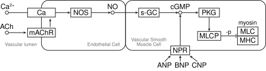
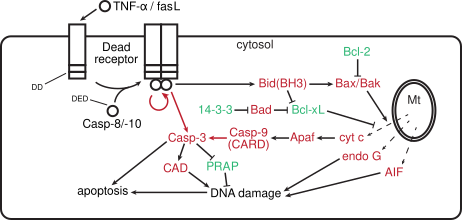

#### 绪论
###### 细胞生物学的发展历史 (96J, 16S, 17T, 20M)
- 细胞学说的建立
	- 施莱登/施万提出**细胞学说**：一切动物、植物都是由细胞组成的，细胞是生物体的基本结构单位。
	- 细胞学说的完善：原生动物由单细胞构成、生物发育是细胞的繁殖与分化等
	- 恩格斯的 19 世纪三大科学发现：细胞学说、进化论、能量守恒与转化定律。
- 经典细胞学时期
	- 原生质理论的提出：组成有机体的单位是一小团原生质 (protoplast)
	- 细胞分裂的研究：有丝分裂的实质是核内丝状物的形成及其向两个子细胞的平均分配。减数分裂的发现。
	- 细胞器的发现：中心体、线粒体、高尔基体等
- 实验细胞学时期
	- 细胞遗传学：以果蝇为模式生物的实验遗传学，如研究不同细胞及分裂过程中染色体数量的变化，并联系孟德尔的遗传因子
	- 细胞生理学：细胞质膜、细胞应激性、神经传导等。高速离心机分离细胞器并体外研究。
	- 细胞化学：细胞内 DNA 的检测、细胞染色、组分分离、放射自显影等
- 细胞生物学时期：1950s 以来，电子显微镜超薄切片技术的超微形态学、DNA 双螺旋结构、中心法则推动上述学科融合，并于 1970s 最终完成细胞生物学学科的形成和确立。
- 分子细胞生物学时期：转基因与单抗制备、经典基因打靶技术、测序、CRISPR 等技术，基因组计划等组学的发展，推动分子水平上对细胞的探索，自 1980s 进入分子细胞生物学时期
###### 细胞生物学的概念与研究的基本内容 (16L)
**细胞生物学 (cell biology)** 是一门利用先进物理学与化学方法，实现
###### 细胞的共性 (19T)
- **化学组成**：所有细胞都利用自然界中的 20 多种元素，如碳、氢、氧、氮、磷、硫等形成以碳为基本骨架的氨基酸、核苷酸、脂质和糖类。因此细胞的化学组成非常同一，不同的生物间可以互相利用成分，这样的机制也是生物存活和演化的物质基础。
- **细胞质膜**：所有细胞表面都有磷脂双分子层与蛋白质构成的细胞质膜，使得细胞内具有相对独立的内环境。细胞内通过细胞质膜与外界进行物质交换和信号传递。
- **遗传装置**：所有细胞都使用**双链 DNA** 作为遗传物质的载体，并以 **RNA 指导蛋白质的合成**，且蛋白质的合成场所几乎都是**核糖体**，除部分原生动物外所有细胞都使用几乎相同的**一套遗传密码**，提示所有细胞都具有共同的原始祖先。
- **分裂方式**：所有细胞都以一分为二的方式分裂，在分裂时将一套遗传物质均分给两个子细胞，这是生命繁衍的基础与保证。从演化的观点看，现存所有细胞都是共同祖先的后代。
###### 细胞大小
- 病毒：20 ~ 300 nm
- 支原体 (最小细胞)：100 ~ 300 nm
- 细菌：1 ~ 2 μm
- 动物细胞：20 ~ 30 μm
- 原生生物：0.1 ~ 数 μm

细胞大小一般取决于**核糖体的活性**，哺乳动物细胞调控大小的信号网络的中心是 **mTOR**
###### 如何理解细胞是生命活动的基本单位 (05J, 22L)
- 细胞是一切有机体构成的基本单位
- 细胞是代谢与功能的基本单位，单细胞依靠一个细胞完成呼吸、排泄、生殖和运动等一系列生理活动，多细胞生物则依赖细胞间的相互协同作用，不同细胞有机地组织并形成执行特定功能的器官，完成复杂的生理过程。
- 细胞是生长与发育的基本单位
- 细胞是繁殖的基本单位
- 细胞是生命起源的标志
###### 生物界的三域六界 (25T)
- 原核生物域 (prokaryote)
	- 原核生物界
- 古核生物域 (archaeon)
	- 古核生物界
- 真核生物域 (eukaryote)
	- 原生生物界
	- 真菌界
	- 植物界
	- 动物界
###### 原核细胞、古核细胞与真核细胞的区别 (93J, 17T, 17J, 20T, 24J)

| 特征      | 原核细胞                                                                           | 古核细胞                                        | 真核细胞                                                  |
| ------- | ------------------------------------------------------------------------------ | ------------------------------------------- | ----------------------------------------------------- |
| 大小      | 细菌：0.2-10 μm 蓝藻：1-10 (up to 60 μm)                                          | 0.1-15 μm                                   |                                                       |
| 核结构     | **细菌**：具有明显的核区 / 类核 (nucleoid)，无核膜围绕 **蓝藻**：中心质/中央体，无明显界限，DNA 拷贝数变化大        | 具有明显的核区 / 类核 (nucleoid)，无核膜围绕               | 有核膜围绕的封闭的细胞核，DNA 与核小体等蛋白包装                            |
| 遗传信息储存  | 环状基因组，在拟核蛋白协助下包装                                                               | 环状基因组，具有组蛋白与类核小体结构                          | 线性基因组，在组蛋白及其他蛋白协助下折叠包装为染色质/染色体                        |
| 基因结构    | 无内含子 多顺反子 mRNA (操纵子)                                                        | 大部分无内含子 多顺反子mRNA (操纵子)                   | 有内含子 单顺反子 mRNA                                     |
| 遗传信息表达  | DNA 复制、RNA 转录、蛋白质合成在空间与时间上无分隔，可同时进行                                            |                                             | 细胞核内进行 DNA 复制与 RNA 转录，成熟 mRNA 出核并进行蛋白质合成              |
| 翻译起始    | fMet                                                                           | Met                                         | Met                                                   |
| 核外遗传物质  | 质粒                                                                             |                                             | 线粒体基因组、叶绿体基因组（植物）                                     |
| 增殖      | 二分裂                                                                            | 二分裂                                         | 有丝分裂、减数分裂                                             |
| 细胞周期    | DNA 复制与细胞分裂不是依次进行的，可同时进行复制与分裂甚至子细胞的 DNA 复制，因此复制周期长于细胞周期                        |                                             | 严格的细胞周期：G1-S-G2-M                                     |
| 细胞壁     | **细菌**：以肽聚糖为主要成分的细胞壁，依据肽聚糖的多少及革兰氏染色结果分为 G+ 或 G- **蓝藻**：以肽聚糖为主要成分的细胞壁，与G- 相似 | 蛋白质构成的细胞壁，**无肽聚糖和胞壁酸**，染色呈 G+ 或 G-          | 主要几丁质的细胞壁 （真菌细胞） 主要几丁质的细胞壁（植物细胞） 无细胞壁（动物细胞）     |
| 其他细胞外基质 | 胶质鞘（蓝藻）                                                                        |                                             |                                                       |
| 细胞质膜    | 脂键连接的甘油磷脂                                                                      | 醚键连接的甘油磷脂，具有特征的鲨烯衍生物                        | 脂键连接的甘油磷脂                                             |
| 核糖体     | 70S 核糖体 (50+30)                                                                | 70S 核糖体 (50+30)，但具有 60 种以上蛋白质，rRNA 与真核生物更相似 | 80S 核糖体 (60+40) 叶绿体：70S 核糖体 (50+30) 线粒体：55S 核糖体 |
| 细胞器     | 细菌：核糖体 蓝藻：核糖体、类囊体 (含藻胆体)                                                    | 70S 核糖体 (50+30)                             | 80S 核糖体 (60+40)                                       |
| 细胞骨架    | FstZ 等                                                                         |                                             | 微丝、微管、中间丝                                             |
| 运动机制    | 由一种鞭毛蛋白构成鞭毛（细菌）                                                                |                                             |                                                       |
**三种细胞类群最基本的区别**
1. **细胞膜系统的演化**：细胞膜系统的演化将细胞分为了相对独立的**细胞质**和**细胞核**，细胞质又被内膜系统分隔为结构更精细，功能更专一的细胞器。在区域化的基础上，细胞骨架提供了精密的支架系统。
2. **遗传信息量与遗传装置的扩增与复杂化**：在膜系统演化的基础上，细胞内部结构与功能区域化专一化，导致遗传装置的扩增和基因表达方式的相应变化，DNA 由环状单倍性转化为线状多倍性。出现间隔序列和内含子，可以通过可变剪接编码多种蛋白质，增加了复杂程度。DNA 的多倍性和高级结构的形成为遗传物质的精确复制提高了难度，因此发展出了细胞周期和有丝分裂器
###### virus (17M)
**病毒 (virus)** 是最小最简单的有机体，其本质是不具有细胞结构的大分子复合体，病毒具有以下特征：
- 体积小，结构简单，没有核糖体等任何细胞结构，无法自主代谢
- 遗传物质为 DNA 或 DNA 中的一种，仅在细胞内才能复制及进行基因表达
- 病毒进入细胞后，合成大量的核酸及病毒蛋白，装配为大量子代病毒，该过程称为复制
- 病毒具有彻底的寄生性，其自身不表现出任何生命特征，仅在细胞内才能表现出生命特征并繁殖出子代病毒。
**病毒**由核酸及一种或多种蛋白质组成，病毒核酸外有蛋白质构成的**衣壳 (capsid)**，衣壳和核酸统称为**核衣壳 (nucleocapsid)**，部分病毒在核衣壳外还有来源于细胞膜的脂双层**囊膜 (envelop)**。病毒
###### 动物/植物细胞特有的细胞结构与细胞器 (19T)

动物细胞：
- 细胞器
	- 溶酶体

植物细胞：
- 细胞器
	- 质体：
- 结构
	- 细胞壁
	- 胞间连丝

###### 和细胞相比，为什么说病毒是非细胞形态的生命体 (99T)

###### 为什么认为进化过程中形成的第一个细胞中遗传材料是 RNA，而在进化后期变为了 dsDNA (2008)

#### 研究方法
###### microscopic structure (17M)
**显微结构 (microscopic structure)** 指的是使用普通光学显微镜能观察到的微观结构，约 0.2 μm 以上，对于细胞而言一般是细胞核（染色体和核仁）、染色体、叶绿体、线粒体等细胞器的结构。1665 年胡克首次发现了细胞结构，随后经列文虎克观察并总结了细胞器的形态。观察显微结构的工具包括普通复式光学显微镜、相差显微镜、微分干涉显微镜及可以追踪特定荧光标记物质及结构的各类荧光显微镜
###### submicroscope structure (16M)
**亚显微结构 (submicroscopic structure)** 指的是使用普通光学显微镜无法观察，仅能使用电子显微镜或其他工具才能观测到的结构尺度，一般指 200 nm 以下，介于显微结构与分子结构之间。对于细胞而言包括各类膜结构 （细胞膜/内膜系统/核膜）、微丝、微管、核糖体、各细胞器内部的超微结构，这些工具和结构的发展为细胞生物学学科的形成奠定了基础。目前观测亚显微结构的主要方式包括透射电子显微镜、扫描电子显微镜 (SEM)、扫描隧道显微镜 (STM)、冷冻电镜 (cyro-EM) 及低温断层扫描 (cyro-ET) 等，这些方式推动科学家从更微观的尺度观测细胞和大分子，为理解细胞活动的基础提供了手段。
###### 倒置显微镜与正置显微镜 (17T)
- 正置显微镜的物镜在样品上方，光源在下方
- 倒置显微镜的物镜在样品下方，光源在上方，倒置显微镜可以观察细胞培养皿或部分液体材料
###### phase-contrast microscpoe

###### differential-interference microscope (12M)
**微分干涉显微镜 (differential-interference microscope)** 
###### 激光扫描共聚焦显微镜 laser scanning confocal microscope (98M)

###### 比较光学显微镜（荧光显微镜）与电子显微镜 (16L, 21T)
光学显微镜使用光作为光源，
其中普通光学显微镜使用可见光，而荧光显微镜使用紫外光；电子显微镜使用电子束作为光源
###### 扫描隧道显微镜 scanning tunneling microscope (97M)

###### 荧光单分子检测技术及其应用 (19J)
###### 电子显微镜的分类 (17T)
- 透射电镜 
- 扫描电镜 
###### 差速离心 differential centrifuge (10M)

###### 简述两种使用超速离心技术分离细胞组分的方法 (21T)
速度沉降、等密度沉降
###### 免疫荧光杂交技术及其应用 (15J, 22T, 24M)
免疫荧光技术是指将免疫学方法与荧光标记技术相结合，研究特定蛋白抗原在细胞内分布的方法。
###### 原位杂交技术及其应用 (10J)
原位 ( *in-situ* ) 杂交技术是用标记的核酸探针通过分子杂交来确定特定的核苷酸在染色体或细胞内位置的技术
###### 荧光原位杂交 (11M, 14M, 19M, 22T, 23M)
###### 流式细胞仪的原理及其在测定和分选不同类型免疫细胞中的应用 (07J)
流式细胞术 (flow cytometry) 可以测定细胞中特异的 DNA、RNA 或特异标记蛋白的含量，并可计数细胞群体中含有相应成分的细胞的数量，并进行分选。
###### primary culture (23M)
**原代培养 (primary culture)** 指的是直接培养从动物机体内分离出的细胞的过程，这类细胞称为原代细胞 (primary culture cell)，一般也会将传至 10 代内的细胞统称为原代细胞培养。原代细胞培养的**主要操作**为，首先取出动物的组织块剪碎，并用浓度与活性适中的胰酶或胶原酶处理使其分散，给予营养液与无菌的培养环境，静置或慢速转动培养。**培养体系**一般使用基础培养基、抗生素、动物血清与必须氨基酸，如 DMEM + NEAA + PS + FBS，若有特定实验需要也可以使用各类无血清培养基替代。原代细胞培养是建立细胞系的必要准备，得到的原代细胞也具有比普通无限细胞系更贴近体内的胞内环境。
###### cell line (17M, 22M)
**细胞系 (cell line)** 指的是动物组织中分离的原代细胞经过一定代数的培养，能稳定的生存并分裂的传代细胞，这些细胞一般保留原染色体的二倍体数量及接触抑制的特性。部分细胞系中的细胞传代 40 ~ 50 次后会无法继续传代，称为**有限细胞系**；发生遗传突变，带有癌细胞特点且可以无限制传代的细胞系则称为**永生细胞系**或**连续细胞系**，常见的无限细胞系包括人源的 HeLa、293T、CHO、U2OS 和鼠源的 NIH/3T3 和 raw246.7 等。细胞系经过遗传标记或改造，筛选分离后增殖形成的具有基本相同的性状的细胞群体称为细胞克隆，该群体进行生物学鉴定后称为**细胞株 (cell strain)**。
###### 简述细胞培养方法的主要步骤及其应用 (07J)
**获得细胞**
1. 分离原代细胞
2. 复苏冻存细胞
**细胞培养体系**
细胞主要可以分为成纤维细胞与上皮细胞
- 基础培养基：最早人工配制的培养基称为基础 Eagle 培养基 (BME)，以含有无机盐和葡萄糖的**平衡盐溶液 (BSS)** 作为溶剂，加入维生素、氨基酸等必要的营养物质。在此之上发展产生了 MEM 培养基，加入了更多的等渗
- 血清：血清为细胞提供了多种营养
- 必需氨基酸：在生长旺盛的细胞培养过程中
- 抗生素：用于杀死培养体系中的细菌，一般使用青霉素-链霉素 (PS)。
- 培养环境：常规细胞一般培养于 37℃/ 5% CO2 的无菌环境中，模拟哺乳动物体内环境。
**传代**
###### 论述体外培养的细胞和体内细胞具有明显差异的特点及原因，并提出优化方案 (23L)
体内细胞与体外细胞明显差异的原因分析
1. 激素与信号分子
2. 
###### cell fusion (15M, 17M, 20M, 22M)
**细胞融合 (cell fusion)** 指的是将两个或多个细胞融合为一个双核或多核细胞的技术。介导融合的方法包括病毒融合、化学融合与电融合。**病毒融合**利用灭活的仙台病毒进行，仙台病毒可以利用其自身的凝集素样 HN 蛋白与带有外露疏水部分的 F 蛋白诱导包膜与宿主细胞膜融合，因此当细胞密度极高时，膜融合也可以发生在细胞之间。**化学融合**主要使用聚乙二醇或 PEG，**电融合**则将细胞在低压电场中排列为串珠状，再施加高压电脉冲处理使其融合。植物细胞融合首先需要降解细胞壁。细胞融合一大应用为将 B 淋巴细胞与肿瘤细胞融合形成**杂交瘤 (hybridoma)**，实现用混合型的异质抗原制备出针对某一抗原上特异性决定簇的同质性**单克隆抗体 (monoclonal antibody)**。
###### hybridoma and monoclonal antibody (93J, 99J, 10J, 11M, 17M, 19M, 21T)
**单克隆抗体 (monoclonal antibody, McAb)** 指的是

单克隆抗体的**制备过程**如下（以鼠源为例）：
1. **抗原蛋白的纯化**：表达抗原蛋白，并进行纯化。
2. **动物的抗原接种**：动物的抗原接种一般使用初次免疫 + 数次加强免疫的策略，将抗原蛋白与弗氏完全佐剂 (CFA) 和弗氏不完全佐剂 (IFA) 混合乳化，分别用于初免和加强免疫，CFA 和 IFA 用于刺激机体产生强烈的免疫反应和巨噬细胞的聚集。接种一般采用腹腔注射、皮下注射或肌注。
3. **脾细胞获取分离**：在第 4 次加强免疫后数日，无菌条件下麻醉小鼠并取出脾脏，剪碎并滤出单细胞，离心并使用 PBS 重悬得到单细胞悬液，使用磁珠或流式细胞术再次分选 B 淋巴细胞。
4. **细胞融合与筛选**：配置无血清的 RMPI-1640 培养基作为融合稀释液，将复苏的骨髓瘤细胞和 B-淋巴细胞加入并使用聚乙二醇融合。由于骨髓瘤细胞缺乏以 H 和 T 为底物进行核苷酸补救合成的酶，因此在从头合成抑制剂氨基喋呤 (A) 的存在下无法存活，而淋巴细胞又不能体外传代，因此使用 HAT 培养基即可筛选出融合的杂交瘤细胞。将融合体系铺板并培养两周完全清除未融合细胞，通过多种方法鉴定阳性孔。
5. **单抗筛选**：此时每孔内均为多克隆抗体，因此需要极限稀释后铺板，并使用 Elisa/IHC/FCW 等方式鉴定阳性孔，扩增后冻存
6. **抗体纯化**：大量培养，硫酸铵沉淀，离心，重悬，透析并得到较纯的抗体。
>https://zhuanlan.zhihu.com/p/675245368
###### 植物组织培养 (10J)

###### fluorscence photobleaching recovery (20T)
**荧光漂白恢复技术 (fluorscence photobleaching recovery, FPR)** 指的是使用亲脂性或亲水性的荧光素、荧光蛋白与脂质或蛋白偶联，检测标记分子在活体细胞表面或细胞内部的运动及迁移速率。该实验中首先使用高能激光束照射细胞内特定区域，使该区域内的荧光分子发生不可逆的淬灭，称为**光漂白**。由于分子的运动性，一段时间后非漂白区的荧光分子会扩散或迁移至表白区，使该区域荧光强度逐渐恢复原有水平，称为**荧光恢复**。
###### 列举生物学常用的模式生物，并说明该模式生物在生物学研究中的用途与优势 (09J, 23J)
线虫
果蝇
斑马鱼
拟南芥
小鼠
###### 转录组与蛋白组在细胞生物学中的应用 (19L)

###### 基因编辑 gene editing (23T)
###### 转录因子的种类与作用 (23J, 23T)
#### 细胞质膜
###### 质膜/细胞膜 plasma membrane (21M)
###### 细胞膜的基本特征 (16J)
细胞膜的基本特征
###### 脂筏 (14M)
###### 细胞质膜的功能  (20J)

###### 膜流动性的生理意义 (95J)
###### 膜蛋白的分类及实验区分 (08J, 19T, 20M)
膜蛋白的分类
- 周边膜蛋白 (peripheral membrane protein) / 外在膜蛋白 (external membrane protein)
	- 
- 整合膜蛋白 (integrated membrane protein) / 内在膜蛋白 (internal membrane protein) 
- 脂锚定膜蛋白 (lipid anchored membrane protein) 
周边膜蛋白与膜通过非共价键连接，结合较为松散，一般通过改变离子强度甚至提高温度即可使其解离；内在膜蛋白通过跨膜结构 (如 α 螺旋、β 桶) 插入膜的脂质双分子层中并与其作用，通过加入 SDS, Triton 等去垢剂可以使其解离；脂锚定膜蛋白
###### 膜脂的分类及其特性 (17T, 18T)
- 甘油磷脂 Phospholipid
	- 磷脂酰胆碱/卵磷脂 (phosphatidylcholine, PC)，质膜中最丰富
	- 磷脂酰乙醇胺/脑磷脂 (phosphatidylethanolamine, PE)
	- 磷脂酰丝氨酸 (phosphatidylserine, PS)
	- 磷脂酰肌醇 (phosphatidylinositol, PI) 
	- 双磷脂酰甘油/心磷脂 ()
- 鞘脂
	- 鞘磷脂 (Sphingomyelin)，鞘氨醇衍生物，连接的脂肪酸较长，构成的脂双层较厚
		- 神经鞘磷脂
	- 鞘糖脂/糖脂
- 固醇
	- 胆固醇（动物）
	- 豆固醇（植物）
	- 麦角固醇（真菌）
###### 红细胞用于研究细胞膜的原因 (21T)
###### ghost (99M)
血影 (ghost) 指的是血红细胞被
#### 物质跨膜运输
###### 简述物质跨膜运输的方式及意义 (11J, 14J, 18T, 22T, 23J, 25T)
物质跨膜运输可依据多种角度分类，按照是否顺浓度梯度及是否耗能可分为被动运输与主动运输，不耗能的被动运输按照是否需要载体又可分为自由扩散与协助扩散，此外细胞还可以通过胞吞和胞吐作用介导大分子及颗粒性物质的跨膜运输。
**简单扩散 (simple diffusion)**
**协助扩散 (facillitated diffusion)**，包括通道蛋白和部分载体蛋白。通道蛋白包括离子通道蛋白、孔蛋白与水孔蛋白。离子通道蛋白
###### 被动运输与主动运输的异同点 (16J, 17J, 20J)
相同点
- 能量：
-  
不同点
- 
###### 协同转运 (19M, 20M)
协同转运指的是利用顺浓度梯度转运一种溶质时的能量，将另一种溶质逆浓度梯度转运，主要依赖协同转运蛋白/偶联转运蛋白。根据两种溶质的运动方向异同可以划分为同向协同转运蛋白 (symporter) 和反向协同转运蛋白 (antiporter)，前者包括小肠和肾小管上皮细胞将钠离子与葡萄糖同向转运进入细胞，而后者包括质膜上的 Na+/H+交换载体。动物细胞常使用 Na+ 作为协同转运离子，其电化学梯度的形成依赖消耗 ATP的 Na+-K+泵，因此本质上属于间接消耗能量的主动运输。
###### 载体蛋白 carrier protein (18M, 23M)
载体蛋白是膜转运蛋白的一种，可介导物质的**协助扩散**及**主动运输**，广泛存在于几乎所有类型的生物膜上，属于多次跨膜蛋白，其可以与特定溶质结合，**通过构象改变介导溶质实现跨膜转运**。典型介导协助扩散的蛋白包括葡糖转运蛋白家族，无需能量可以将溶质顺浓度梯度运输。介导主动运输的载体蛋白可分为利用 ATP 能量的 **ATP 驱动泵**、利用其他溶质浓度梯度差的**协同转运蛋白** 与利用光能的**光驱动泵**。
###### 通道蛋白 channel protein (99M, 22M, 24M, 25M)
通道蛋白是膜转运蛋白的一种，主要介导物质的**协助扩散**，普遍存在于各类真核细胞质膜及细胞内膜上，其通过形成亲水性通道，实现对特异溶质的跨膜转运。通道蛋白基于**通道的直径、形状及通道内带电氨基酸残基的分布** 选择特定可通过的溶质。通道蛋白可分为**离子通道**、**孔蛋白**与**水孔蛋白**，离子通道为目前发现的通道蛋白中的绝大多数，常形成选择性及门控通道。
###### 离子通道的分类 (18T)
离子通道 (ion channel) 指的是
###### ATP 驱动泵的分类及原理 (17T, 20T)
- P 型泵：有两个独立的 α 催化亚基用于离子转运，并含有 ATP 结合位点，其催化循环中会形成磷酸化中间体，因此称为 P 型泵。
	- $Na^{+}$-$K^{+}$ 泵：α2β2 四聚体，**每一循环消耗 1 分子 ATP，逆化学浓度梯度泵出 3 个 $Na^{+}$ 并泵入 2 个 $K^{+}$** 。具体机制为 $Na^{+}$ 与内侧 α 亚基结合并促进 ATP 水解，通过一个 Asp 残基的磷酸化引起 α 亚基构象变化，将 $Na^{+}$ 泵出细胞，外侧的 $K^{+}$ 与 α 亚基的另一个位点结合并导致 α 亚基构象再度发生变化，将 $K^{+}$ 泵入细胞并完成循环。$Na^{+}$-$K^{+}$ 泵主要功能包括维持细胞膜电位、维持动物细胞渗透压平衡、与协同转运机制共同参与营养吸收，可被少量**乌本苷**抑制。
	- $Ca^{2+}$ 泵：也称 $Ca^{2+}$-ATP 酶，**每一循环消耗 1 分子 ATP，逆化学浓度梯度泵出 2 个 $Ca^{2+}$**，其 α 亚基与 $Na^{+}$-$K^{+}$ 泵的 α 亚基同源，具有相似的机制。$Ca^{2+}$ 泵主要将 $Ca^{2+}$ 泵出细胞或泵入内质网中储存，维持胞质中 $Ca^{2+}$ 的低浓度。细胞质膜型 $Ca^{2+}$ 泵的 C 端具有一个钙调蛋白结构域，可与 CaM 结合并受其调控，而内质网型 $Ca^{2+}$ 泵则无此结构。
	- P 型 $H^{+}$ 泵：存在于植物、真菌与细菌中，发挥其缺少的 $Na^{+}$-$K^{+}$ 泵的生物功能，主要用于维持跨细胞膜的 $H^{+}$ 浓度梯度，并可促进营养的摄入
- V 型质子泵 (**v**esicle)：广泛存在于动物细胞的内体/溶酶体膜、破骨细胞/肾小管细胞质膜、植物细胞/酵母/真菌细胞的液泡膜上，可水解 ATP 并逆浓度梯度转运 $H^{+}$。
- F 型质子泵 (**f**actor)：广泛存在于类囊体薄膜、线粒体内膜、细菌质膜，其结构和机制与 V 型质子泵相似，但是作用相反，即顺浓度梯度转运 $H^{+}$，并借助此质子动力势合成 ATP，因此也称为 $H^{+}$-ATP合酶或 $F_oF_1$ - ATP 合酶
- ABC 超家族：也称为 ABC 转运蛋白，主要转运小分子
	- 核心结构域：主要包括 2 个跨膜结构域 (T)，和 2 个胞质侧 ATP 结合结构域 (A)
	- 机制：ATP 结合前，底物结合位点会暴露于胞外侧（原核）/胞质侧（真核）并发生底物的结合，当 ATP 结合后，ABC 转运蛋白的两个 ATP 结合域会二聚化并将底物结合位点暴露于另一侧并解离需要转运的物质，当 ATP 水解并释放 ADP 后，构象会复原并完成一个循环
###### 细胞如何维持细胞膜内外离子及电荷的不均匀分布 (07J, 13J, 18T, 19J)

###### action potential, AP (12M)
不同的物质跨膜运输条件方式造成了膜两侧物质浓度不相同的情况，对于带电离子而言，膜两侧的浓度不一会导致产生跨膜的电位差，这种电位差称为膜电位。

**静息电位 (resting potential)** 指的是细胞在静息状态下维持的特定电位，胞内主要由**钠钾泵**与开放的**钾离子通道**维持，其中钠钾泵向外泵出钠离子并同时向内泵入钾离子，而钾离子通道使胞内持续向外渗漏钾离子，这两种作用在平衡后会得到**内负外正**的静息电位，也称为**极化 (polarization)**，神经细胞的静息电位约 -40 ~ -80 mV，而肌肉细胞可达 -90 mV。细胞外的离子稳态则由星形胶质细胞与肾脏维持。

细胞在刺激状态下产生的电位称为动作电位。此时**膜内带正电荷，膜外带负电荷**，电势约 **+40 mV**。感受器电位或突触电位会引起局部去极化，使得局部钠离子通道开放及钠离子内流，导致**轴突起始节 (AIS)** 中极高密度的电压门控钠离子通道 **(Nav) 开放**，**钠离子剧烈内流**，质膜**去极化 (depolarization)**，产生动作电位。动作电位可以沿着轴突几乎无衰减地传输至末端突触，其幅度与持续时间是固定的，强度则取决于电位的数量及脉冲间隔，不同细胞有独特的放电规律。

动作电位后，钠离子通道关闭，电压门控钾离子通道开启
###### endocytosis  (11M, 13M, 15M, 19M)
**胞吞作用 (endocytosis)** 是细胞摄取大分子与颗粒性物质的一种方式，是一种耗能过程
- **吞噬作用 (phagocytosis)**：原生动物可以通过吞噬作用将胞外营养摄取到细胞内，巨噬细胞和中性粒细胞则通过吞噬作用清除机体内外源的病原体或衰老凋亡的细胞，该过程中细胞表面的抗体会与病原微生物表面结合，并暴露出尾部 Fc 区，被吞噬细胞表面的 Fc 受体结合，诱发吞噬细胞膜伸出伪足并将病原微生物包裹并降解。细胞发生吞噬作用形成吞噬体 (phagesome)。
- **胞饮作用 (pinocytosis)**
	- 网格蛋白依赖的胞吞作用：包被的结构单位 **网格蛋白 (clathrin)** 由 3 个二聚体形成，形成三角蛋白复合体。当配体与膜上的受体结合后，**衔接蛋白 (adaptin)** 与受体尾部肽信号互作并招募网格蛋白聚集，形成 50 ~ 100 nm 的质膜内陷，称**网格蛋白包被小窝**。**发动蛋白 (dynamin)** 在颈部组装成环，并水解 GTP 引起颈部缢缩，形成网格蛋白包被膜泡，网格蛋白随后脱离并回到质膜附近以供再次使用。脱包被小泡会与早期内体融合，并作为膜泡运输的主要分选站，转运摄入的物质进入溶酶体。以 LDL 为例，质子泵泵出氢离子降低浓度的时候会导致 LDL-受体脱离，LDL 受体在内体上出芽并回到质膜再利用。但是部分受体也会在溶酶体中降解或**跨细胞转运 (transcytosis)**。
	- 胞膜窖依赖的胞吞作用：**胞膜窖 (caveola)** 在脂筏区域形成，由 caveolin-1/2/3 构成，含有大量的信号转导受体及蛋白激酶，该区域内陷成为瓶状。胞吞时，胞膜窖带着内吞物，通过发动蛋白的收缩作用从质膜脱落，并转交给**膜窖体 (caveosome)** 或转运至细胞另一侧
	- 大型胞饮作用 (macropinocytosis) 
	- 非网格蛋白/胞膜窖依赖的胞吞作用
###### 受体介导的胞吞作用的概念及生理意义 (95J, 97M, 07J)
- **对信号转导作用的下调**：表皮生长因子 EGF 会结合于细胞表面的 EGFR，引起细胞下游级联信号，同时会通过泛素化的机制使 EGFR 聚集到网格蛋白包被小泡，启动受体内吞。该调控方式称为受体下行调节。 
- **对信号转导作用的激活**：果蝇神经系统的发育中存在旁侧抑制 (lateral inhibition) 的现象，即前体神经细胞会抑制邻近的上皮细胞发育为神经细胞。这种作用一方面是由于前体神经细胞会分泌单次跨膜蛋白 Delta 与相邻细胞的 Notch 相互作用引起的信号级联反应，另一方面，DSL 与 Notch 的互作会引起靶细胞 Notch 的构象改变，其胞外的 S2 位点被切割，切割两侧分别被两个细胞内吞，其中 Notch 受体被内吞会引起其 S3 位点被内体中的 γ-分泌酶切割，并产生有活性的 Notch 受体胞内活性片段 (NICD) 入核并调控靶细胞表达。
###### exocytosis (21M, 25M)
**胞吐作用 (exocytosis)** 指的是携带内容物的膜泡与细胞膜融合，并将内容物释放至胞外的过程。**组成型胞吐途径**指的是真核细胞从高尔基体反面网状结构 (TGN) 分泌的囊泡向质膜流动并与之融合的稳定过程，包括新合成的蛋白质、脂质等，该途径的主要机制是 COP-II 包被的膜泡。**分泌型胞吐途径**指的是特化的分泌细胞将产生的物质（激素、粘液、消化酶）预先储存于分泌泡中，受到激素后分泌泡与激素融合并将内含物释放。
#### 细胞质基质/内膜系统
###### cytoplasmic matrix / cytomatrix / cytosol (98M, 07M) 
**细胞质基质 (cytoplasmic matrix)** / **胞质溶胶 (cytosol)** 是被细胞膜包裹的区域化且高度有序的凝胶溶液体系，多种蛋白质与穿梭其中的细胞质骨架、生物膜相结合，更大的结构如分泌泡和细胞器也固定在细胞质基质的某些部位或沿骨架移动。细胞质的功能包括：
- **代谢反应的场所**：葡萄糖氧化的 EMP/PPP 途径、糖原合成与分解、脂肪酸合成、
- **蛋白质合成起始**：所有蛋白质的合成均起始于细胞质基质中的游离核糖体上，其中合成带有 N 端序列的分泌蛋白的核糖体会转移至内质网膜上将新生肽链送入内质网。其他肽链和蛋白质则会在细胞质中游离核糖体上继续完成，并留在基质或转运至细胞核、线粒体、叶绿体等部位。
- **蛋白质正确折叠**：热激蛋白 (HSP) 可以分为 Hsp60/70/90/100 等家族，协助蛋白质合成、分选、折叠与装配等过程，还可以与错误折叠蛋白质结合并依赖水解 ATP 使其溶解，再重新折叠为正确构象。
- **蛋白质修饰场所**：许多蛋白质的翻译后修饰也发生于细胞质基质中，如辅基辅酶的结合、磷酸化与去磷酸化、糖基化、乙酰化、酰基化等，对蛋白质的功能及命运至关重要
- **蛋白质寿命控制**：泛素化和蛋白酶体介导的蛋白质降解途径同样发生于细胞质基质中，行驶蛋白质质量监控、细胞代谢、周期调控、免疫功能等多种相关功能。需要降解的蛋白质会首先在泛素结合酶 E2 的催化下与 E1 活化的泛素结合，再由泛素连接酶 E3 催化泛素羧基与蛋白质赖氨酸连接，并继续添加更多泛素形成寡泛素链，最后被蛋白酶体 19S 亚基识别并送入 20S 催化内核内降解。
###### ubiquitination (10M, 14M, 19M)
**泛素化 (ubiquitination)** 指的是向蛋白质赖氨酸残基上共价地添加泛素的过程，主要用于介导该蛋白的降解。泛素是 76aa 的小分子球蛋白，普遍存在于真核细胞中且序列高度保守。泛素化的过程主要由三种酶介导，**泛素活化酶 E1** 首先通过形成泛素-腺苷酸键活化泛素 C 端，**泛素结合酶 E2** 随后将活化的泛素与其自身的半胱氨酸残基连接。**泛素结合酶 E3** 催化先靶标蛋白的赖氨酸残基与泛素的 3-OH 连接，而由于泛素本身具有赖氨酸残基，因此后续泛素会继续连接至前一个泛素的 Lys48/63 位点，形成寡聚赖氨酸链。该寡聚赖氨酸链会作为信号被蛋白酶体 19S 调节亚基识别，并引导靶标蛋白进入 20S 催化核心降解。
###### proteasome(09M)
**蛋白酶体 (proteasome)** 是降解蛋白质的大分子复合体，分布于细胞质基质中，哺乳动物细胞中蛋白酶体约占总蛋白量的 1%。蛋白酶体主要的存在类别是 20S，由带有催化核心的 20S 亚基和一个或多个 19S 的调节亚基构成。20S 核心由两类蛋白以 α-β-β-α 形成四层中空结构，α 为骨架，β 具有蛋白酶活性；19S 则可以识别泛素化蛋白、切除泛素及去折叠蛋白。泛素和蛋白酶体介导的蛋白质降解具有多种生理功能，包括进行蛋白质质量监控、调控细胞代谢、调控细胞周期、影响免疫功能等。
###### Chaperone (07M, 09M)
**分子伴侣 (Chaperon)** 是一类协助蛋白质合成、折叠、分选、装配的蛋白质，是蛋白质稳态的核心。分子伴侣主要是**热激蛋白 (HSP)** 家族，包括 Hsp60、70、90、100 等亚家族，可组成性表达或受胁迫表达。分子伴侣可以与错误折叠蛋白质结合并依赖水解 ATP 使其溶解，再重新折叠为正确构象。如 Hsp70 家族的 Bip 蛋白是内质网的驻留蛋白，既可以与蛋白质疏水氨基酸结合防止错误折叠或聚合，也可以防止蛋白质在转运过程中变性或断裂。
###### endomembrane system (18M, 22T, 24T)
**内膜系统 (inner membrane)** 指的是细胞中包括内质网、高尔基体、溶酶体、内体和分泌泡等单层膜细胞器，在功能和发生上相互联系并且不断变化的动态结构体系。内膜系统各区室通过生物合成、蛋白质修饰与分选，膜泡运输和各种质量监控机制维系其系统的动态平衡。例如，携带分泌蛋白编码 mRNA 与核糖体会结合于内质网膜中，新生肽链直接在内质网中进行加工处理，并通过 COP II 膜泡介导的运输转运至高尔基体中继续加工并分泌出细胞，靶细胞则通过胞吞摄取大分子，在溶酶体中进行消化。
###### microsome (10M)
**微粒体 (microsome)** 是细胞经过匀浆和超速离心后，内质网破碎形成的大量近似于球状的囊泡结构，包含内质网膜和核糖体两种成分，具有蛋白质合成的基本功能，研究中常把微粒体和内质网等同看待。微粒体内含药物代谢的关键酶 **P450 氧化酶**，因此常用于早期药物体外代谢研究。
###### endoplasmic reticulum 的类型及特点 (13J, 16T)
**内质网 (endoplasmic reticulum)** 是真核细胞中普遍存在的单层膜细胞器，由封闭管状或扁平囊状膜系统及其包被的腔组成，一般占细胞膜系统的一半左右。内质网的体积占细胞的 10% 以上，依据细胞类型及阶段而各异，在细胞分裂时需要解体并重建。内质网的**主要功能**包括，作为除核苷酸外其他一系列重要**大分子的合成基地**、作为**屏障**将胞质及内质网内的物质合成分隔开、内质网膜为多种酶提供提供**大面积的结合位点**等。内质网主要具有两种类型：
- **糙面内质网 (rER)** 是内质网膜外大量附着核糖体颗粒的内质网，主要用于蛋白质的合成和修饰。胞质中的游离核糖体会合成新生的肽链，若肽链具有内质网的信号序列，则会通过该序列结合于信号识别颗粒 SRP 上，并被定位于内质网膜上，新生肽链通过移位子进入糙面内质网。这些蛋白包括分泌性蛋白、内膜系统细胞器内的可溶性驻留蛋白、细胞膜系统上的跨膜蛋白等。合成后，糙面内质网还会介导蛋白质的 N-糖基化等翻译后修饰及折叠过程。
- **光面内质网 (sER)** 占有比例小，其膜几乎不附着核糖体，在部分细胞中尤其发达，甚至特化形成了独特的结构。肝细胞中光面内质网极其发达，具有 P450 等多种混合功能氧化酶，可以降解细胞内的有毒物质；心肌细胞和骨骼肌细胞中内质网承担钙库的功能，也成为肌质网，在需要肌肉收缩时接收 IP3 的信号释放大量钙离子；部分合成固醇的细胞中光面内质网也尤其丰富。此外，光面内质网还参与多种信号通路，如未折叠蛋白质引起的 ERS 信号、固醇调节级联反应、ERS 引起的细胞凋亡等。
###### 蛋白质N-/O-糖基化的特征与区别 (17T)

| 特征          | N-连接糖基化                                                                    | O-连接糖基化                 |
| ----------- | -------------------------------------------------------------------------- | ----------------------- |
| 连接的氨基酸残基及位点 | 天冬氨酸的 N 原子                                                                 | 丝氨酸/苏氨酸/羟脯氨酸/羟赖氨酸的 O 原子 |
| 第一个糖残基      | N-乙酰葡糖胺                                                                    | N-乙酰半乳糖胺                |
| 合成位置        | 糙面内质网与高尔基体                                                                 | 高尔基体                    |
| 合成方式        | 先在内质网膜腔面的磷酸多萜醇载体上合成一定数量糖残基的前体，再通过糖基转移酶将寡糖链整体转移至 Asp 的氮原子上，随后移入高尔基体中进行进一步加工 | 逐个糖残基添加                 |
| 寡糖链长度       | 至少 5 个糖残基                                                                  | 一般 1-4 个糖残基             |
###### 特化的光面内质网及其功能 (19T)
- 肝细胞中发达的光面内质网
	- **合成外输性脂蛋白颗粒**
	- 发挥**解毒作用 (detoxification)**，通过多种化学作用将脂溶性毒物转化为水溶性物质而被排出体外，典型例子为 P450 混合功能氧化酶介导毒物羟基化并转化为水溶物通过尿液排出体外
- 心肌细胞和骨骼肌细胞中发达的光面内质网被称为**肌质网 (sacroplasmic reticulum)**，主要用于储存钙离子，对细胞质中的钙离子起调控作用。
- 合成固醇类激素细胞（如睾丸间质细胞）中发达的光面内质网主要用于合成胆固醇并进一步产生固醇类激素
###### Golgi body / Golgi apparatus (14M)
**高尔基复合体 (Golgi body)** 属于内膜系统，由具有**极性**的**扁平膜囊堆叠**形成，一般具有 6-8 层，两侧具有**网状结构**。靠近细胞核一侧的成为**顺面/形成面**，靠近外侧的称为**反面/成熟侧**，各层具有不同的标志性酶可用于鉴定。高尔基体的**主要功能**是将内质网合成的**蛋白质和一部分脂质加工、分类并包装送往细胞的不同位置**，例如顺面膜囊和 CGN 区主要用于 O-糖基化、酰基化等修饰和内质网驻留蛋白的送回，中间膜囊负责糖基修饰与加工、部分多糖合成，反面膜囊和 TGN 区则作为分选枢纽区。合成的蛋白质在高尔基体中移动是**单向**的，仅有具有特定回收信号的蛋白可以通过 COPI 包被膜泡进行反向运输。
###### lysosome (07J, 08J, 15J, 20M, 25M)
**溶酶体 (lysosome)** 是**单层膜**包裹的内含多种水解酶的**酸性**细胞器，具有特异性的**酸性磷酸酶**。

**溶酶体的发生过程**
- **合成**：溶酶体内部的水解酶在内质网中合成，并合成一定长度的 N-连接糖基，形成可供高尔基体中酶识别的信号斑。
- **修饰**：溶酶体的分选主要依赖甘露糖-6-磷酸 (M6P) 的标记，溶酶体酶经 COPII 包被的膜泡转运至高尔基体膜囊中，经 N-乙酰葡糖胺磷酸转移酶和磷酸葡糖苷的催化下使寡糖链中的甘露糖磷酸化形成 M6P。
- **分选**：M6P 与 TGN 区膜上的受体结合并富集，通过出芽的方式形成**网格蛋白/AP 包被膜泡**，再转运并与晚期内体融合形成**前溶酶体**，此时溶酶体酶解离，**受体返回**高尔基体再利用。

**溶酶体的异质性**
- **初级溶酶体** pH 约为 5.0，内容物均一，含有多种最适 pH=5 的水解酶，与自噬泡或异噬泡融合形成次级溶酶体。
- **次级溶酶体**根据融合的小泡可分为自噬溶酶体和异噬溶酶体，形态不规则，内部含有多种颗粒甚至细胞器，水解酶消化得到的物质会经转运蛋白运输至细胞质基质中利用。
- **残质体**是次级溶酶体消化完毕的形态，内含多种无法消化的物质，一般经过胞吐等方式排出胞外。

**溶酶体的功能**
- **消化**：除了小分子营养物质外，细胞会通过胞吞作用摄取膜组分、胞外基质、其他细胞凋亡小体等多种物质，这些物质在胞吞进入细胞后就会进入溶酶体消化后利用。
- **自噬**：自噬指的是细胞内受损或需要淘汰的物质降解并再利用的过程，可以由溶酶体直接介导微自噬，也可以先形成自噬小泡再与初级溶酶体融合形成自噬溶酶体。
- **防御**：部分吞噬细胞内溶酶体发达，此类细胞会吞噬各种病原体并通过过氧化物等物质将其杀死并分解，但是部分病原体也会通过抑制酸性环境而在溶酶体内存活并侵染细胞。
###### autophagy (09M, 18M, 21J, 22M)
**自噬 (autophagy)** 是细胞在**自噬相关基因 (atg)** 的调控下对细胞内受损或需要淘汰的物质进行**降解**及再利用的过程，发生于动物细胞的**溶酶体**或植物及酵母细胞的**液泡**中。细胞中的自噬一般以低水平进行，在营养不良、饥饿等状态下可以提高自噬水平以供细胞存活，自噬还可以维持细胞内环境稳定，避免细胞氧化性损伤。自噬主要包括三类，**微自噬**指的是溶酶体膜直接内陷并包裹物质进入溶酶体内消化的过程；**巨自噬**指的是在信号的刺激下，需要降解的物质结合于特定的膜受体，膜内陷并形成双层膜的自噬小泡，小泡的外膜再与溶酶体融合并释放物质降解的过程；**分子伴侣介导的自噬 (CMA)** 则需要 Hsp70 蛋白识别并结合具有特定序列的的蛋白并进行降解的过程。溶酶体的功能异常会导致各种**溶酶体贮积症**。
###### peroxisome (20M)
**过氧化物酶体 (peroxisome)** / **微体 (microbody)** 是内含一种或多种氧化酶的**单层膜**细胞器，具有异质性，形态与**初级溶酶体**相似，内部含有高浓度的**尿酸氧化酶形成晶格状结构**。过氧化物酶体可以**直接利用分子氧**，主要包括依赖 **FAD** 并将底物氧化为**过氧化氢**的酶及分解过氧化氢的**过氧化氢酶**。动物细胞中的过氧化物酶体可以**降解血液中有毒成分**如乙醇氧化，也可以通过直接氧化脂肪酸产热。植物细胞中的过氧化物酶体一方面可以用于光合作用 **CO2 固定反应副产物的氧化**，另一方面作为**乙醛酸循环**的发生场所协助脂肪酸转化为糖。

过氧化物酶体可以经由老的过氧化物酶体依赖 Pex11 分裂而成，也可以从头合成。
- 从头合成起始于内质网，Pex3/16 合成于内质网膜上，超募 Pex19 并共同出芽形成**过氧化物酶体前体**
- 前体可以与已存在的过氧化物酶体融合并通过 Pex19 吸引其他过氧化物酶体蛋白插入，形成**过氧化物酶体雏形**
- 含有**过氧化物酶体引导信号 PTS1/2** 的基质蛋白可以以 Pex5/7 作为受体并将货物运输至过氧化物酶体内释放
###### 溶酶体和过氧化物酶体的主要异同点 (98J, 20T, 25T)
- 不同点
	- 过氧化物酶体内含有的高浓度**尿酸氧化酶**等酶会呈现特征的**晶格状结构**，可以此作为电镜识别的主要特征
	- 溶酶体含**酸性水解酶**，过氧化物酶体含**氧化酶**
	- 溶酶体 pH ≈ 5，过氧化物酶体 pH ≈7
	- 溶酶体不需氧气，过氧化物酶体**需要氧气**
	- 溶酶体主要承担消化功能，过氧化物酶体承担包括**脂肪酸分解**、**乙醛酸循环**等多种功能
	- 溶酶体内水解酶在粗面内质网合成，高尔基体出芽形成溶酶体；过氧化物酶体内酶在细胞质基质合成，经组装与分裂形成过氧化物酶体
	- 溶酶体标志性酶为**酸性水解酶**，过氧化物酶体标志酶为过氧化氢酶
- 相同点
	- 过氧化物酶体与初级溶酶体具有相似的形态与大小
#### 蛋白质分选/膜泡运输
###### 真核细胞分泌蛋白合成机制的信号假说 (94J, 99M)
**信号假说 (signal hypothesis)** 指的是分泌蛋白的 N 端含有短的**信号肽 (signal peptide)**，一旦核糖体翻译出该序列，**信号识别颗粒 (signal recognition particle, SRP)** 就会与该序列结合，并引导核糖体前往内质网，与内质网膜表面的**停泊蛋白 (docking protein, DP)** 结合，随后翻译过程就会在内质网膜上进行，新生肽链穿过移位子直接进入内质网腔。

信号肽一般由 16-26 个氨基酸残基组成，包括 N 端、疏水核心与 C 端。信号识别颗粒 (SRP) 是一种核糖核蛋白颗粒，由约 300 nt 的 7S RNA 和 6 种蛋白组成，可以与新生肽链信号肽及核糖体大亚基结合，并导致多肽链合成的停止。SRP 受体具有 α/β 个亚基，α 亚基可以特异地与 SRP 的 p54 亚基结合，这种结合可以被 2 分子 GTP 的结合所强化。
###### 简述膜泡运输机制 (12J)
- **COP II 包被膜泡**介导膜泡的顺向运输，主要参与物质由内质网向高尔基体顺面膜囊的运输，由 Sar1、Sec23/24、Sec13/31 介导。Sar1 是一种 GTP 结合的分子开关，在 ER 膜蛋白鸟苷酸交换因子 Sec12 作用下形成 Sar1-GTP，引发其构象改变并插入 ER 膜。Sar1-GTP 会募集 Sec23/24 在出芽区形成三重复合物并招募 Sec13/31 结合，Sec13/31 可以自组装为网格结构并发挥骨架作用。Sec24 蛋白可以识别特定信号序列如二酸信号，大的纤维蛋白 Sec16 结合并组织聚合。聚合完成后，Sec23 促进 GTP 水解，膜泡脱包被。
- **COP I 包被膜泡**介导膜泡的逆向运输，参与高尔基体反面-顺面的运输及高尔基体顺面向内质网的运输。COP I 含有 GTP 结合蛋白 ARF 起分子开关的作用，并有 7 种不同的蛋白质亚基，可以识别内质网可溶蛋白或膜蛋白 C 端的回收信号，并促进其转移回 ER。
- **网格蛋白/接头蛋白包被膜泡**介导分泌泡和内吞泡的形成，如向溶酶体、黑素体、血小板囊泡和液泡中转运货物膜泡的形成，由三腿网格蛋白 (clathrin) 和四聚体接头蛋白 (adaptor protein, AP) 介导，且同样需要 ARF。接头蛋白包括 AP1/2/3 及 GGA 等类型，在腔侧决定了被转运蛋白的种类，胞质侧又可以募集自组装的网格蛋白。当膜泡出芽后，具有 GTP 酶活性的**发动蛋白 (dynamin)** 会围绕颈部聚合并催化 GTP 水解，导致网格蛋白/AP 包被膜泡断裂并释放
#### 线粒体与叶绿体
###### mitochondrion (07J, 14J, 20T, 22T, 23T) 
**线粒体 (mitochondrion)** 是细胞内一种高度动态的细胞器，其大小及数量随着细胞种类及状态高度变化，会频繁发生融合与分裂现象。线粒体具有环状 DNA，属于半自主性细胞器细胞器。
线粒体的**超微结构**包括线粒体外膜、线粒体内膜、膜间隙和线粒体基质。
- 线粒体外膜平展，蛋白质与脂质约为 1:1，具有较多可容纳大分子通过的**孔蛋白**，因此通透性较高。外膜附着一些特殊的酶类，如肾上腺素氧化酶、脂肪酸氧化酶、色氨酸降解的酶，为分子进入线粒体降解提供**预处理**。线粒体外膜标志酶为**单胺氧化酶**。
- **线粒体内膜**向叠延伸形成嵴，为各种酶和电子载体提供大面积的附着位点，其排列与数量与细胞的代谢需求高度相关。内膜作为线粒体的通透屏障，具有不透性，因此可以建立跨内膜的电化学梯度，具有 ATP 合酶并承担重要的氧化磷酸化反应。内膜的标志性酶为**细胞色素氧化酶**。
- 膜间隙宽度通常为 6-8 nm，细胞活跃呼吸时膜间隙宽度明显增大，离子成分与细胞质中相似，**腺苷酸激酶**为标志酶。
- 线粒体基质为富含可溶性蛋白的胶状物质，具有特定的 pH 和渗透压，催化线粒体重要生化反应如三羧酸循环、脂肪酸/氨基酸降解。
###### chloroplast (98M, 18T, 20T, 21T, 22T, 24M, 25T)
**叶绿体 (chloroplast)** 是植物细胞中由**原质体分化**形成的细胞器之一，呈现**绿色的凸饼状**，主要分布于**液泡和细胞质膜之间的薄层细胞质**中，其亚细胞定位会**随着光照而变化**，并且不同叶绿体中会通过**基质小管**进行频繁的相互联系。叶绿体含有**环状双链 DNA**，与线粒体同属于**半自主性细胞器**，受到细胞核及其自身基因组的双重调控。

叶绿体的**超微结构** (98M) 包括双层的叶绿体膜、类囊体与叶绿体基质。
- **类囊体 (thylakoid lumen)** 是内膜衍生的封闭扁平膜囊，部分圆饼状类囊体会堆叠在一起形成**基粒 (granum)**，这种类囊体称为基粒类囊体，而单独不形成片层的基质类囊体称为**基质片层 (stroma lamella)**，这两种类囊体可在光照等因素调控下互相转换。类囊体的垛叠大大增加了类囊体片层的总面积因而大大提升了光合作用的效率，一个叶绿体的所有类囊体是一个**完整的连续封闭膜囊**，因此可以起到建立电化学梯度的作用。类囊体薄膜分布大量光系统 II、Cyt b6f、光系统 I、CFo-CF1 ATP 合酶，用于光合电子传递链及光合磷酸化过程。
- **叶绿体膜**与线粒体膜相似，具有两层，外膜通透性大，具有能容纳大分子通过的孔蛋白；内膜通透性较低作为屏障，具有多种转运蛋白允许特定物质通过。
- **叶绿体基质**是类囊体和叶绿体内膜间的液态胶体物质，含有大量用于光合碳同化的酶，其中含量最高的是催化二氧化碳固定的 Rubisco。叶绿体基质中还含有叶绿体 DNA、核糖体、植物铁蛋白、淀粉粒等物质。

叶绿体的功能主要是**光合作用**，这一过程包括光反应和碳同化反应。**光反应 (light reaction)** 包括两步，首先是光能被天线分子吸收并传递至反应中心，引起反应中心色素分子将电子传递给原初电子受体的过程，该过程称为**原初反应 (primary reaction)**；随后产生的电子经过类囊体薄膜上的光合电子传递链传递，伴随质子电化学梯度的形成及 NADP+ 的还原，质子的电化学梯度又会驱动 ATP 合酶合成 ATP，该过程被称为**光合电子传递链**及**光合磷酸化**。**碳固定反应 (carbon fixation reaction)** / **碳同化反应 (carbon assimilation reaction)** 指的是二氧化碳在叶绿体基质中依靠 ATP 和 NADPH 固定并合成 3-磷酸甘油醛过程，本质上是将光反应产物中的活跃化学能转换为糖分中高稳定化学能的反应。
###### 叶绿体和线粒体的结构比较 (17J)

| 结构    | 线粒体  | 叶绿体  |
| ----- | ---- | ---- |
| 膜     | 双层膜  | 双层膜  |
| 电子传递链 | 内膜及嵴 | 类囊体膜 |
|       |      |      |
|       |      |      |
| 交流结构  |      | 基质小管 |
###### 为什么说线粒体和叶绿体是半自主性细胞器 (09J, 12J, 19T, 21M)
- 具有双链环状 DNA，编码各自需要的一部分基因
- 核质协作和核质冲突
###### 线粒体和叶绿体起源的内共生假说及支持其假说的证据 (1998) 基于该假说，线粒体和叶绿体哪个会先产生？提出假说并说明理由 (2005)
- 线粒体基因组及叶绿体基因组与细菌基因组有明显相似性，均为环状双链 DNA，无m5C，无组蛋白结合
- 具有完备的蛋白质合成系统，使用甲酰甲硫氨酸起始，核糖体小于 80S，且没有 5.8S rRNA，可被氯霉素、四环素抑制，不被抑制真核的放线酮抑制，可形成多核糖体，RNAP 也被四环而非利福抑制
- 二分裂
- 内外膜明显差异
- 线粒体的磷脂成分与呼吸类型和反硝化副球菌相似

#### 细胞骨架
###### cytoskeleton (18M, 20M, 22T)
**细胞骨架 (cytoskeleton)** 指的是真核细胞内由蛋白质聚合而成的三维立体纤维状骨架，可在特异性染色后经荧光显微镜观察到。细胞骨架包括三类，由肌动蛋白聚合成的微丝、由微管蛋白聚合成的微管和中间丝蛋白聚合成的中间丝。在不同种类的细胞或细胞周期的不同阶段中，细胞骨架会形成不同的形态。细胞骨架的功能包括，
###### microfilament (17M, 23M)
**微丝 (microfilament)** 是由结合 ATP/ADP 的肌动蛋白单体聚合形成的一类直径 7 nm 的细胞骨架。微丝具有极性，其正端组装速度较快，当正端的组装速度与负端的解聚速度时，微丝会形成稳定状态，**细胞松弛素**和**鬼笔环肽**分别可以破坏及维持微丝的组织网络。**微丝结合蛋白**是可以与微丝相互作用的一类蛋白质，其影响微丝的组装与解聚，并介导微丝与其他细胞结构的相互作用来决定微丝的组织与行为。微丝具有一定的刚性，可以形成伪足介导细胞迁移、形成应力纤维、微绒毛、形成胞质分裂环缢缩细胞、通过与肌球蛋白相互滑动介导肌肉细胞收缩。
###### 微丝的组装过程 (19J)
**微丝 (F-actin)** 由**肌动蛋白单体 (G-actin)** 组装而成，分为成核反应、延伸反应与平稳状态三个主要时期。G-actin 在微丝组装前通常先与 ATP 结合，组装后其构象发生变化，具有 ATPase 活性，可以将 ATP 水解并释放焦磷酸。
- **成核反应 (Nucleation)**：当体系内无微丝存在时，组装起始依赖于 2-3 个 G-actin 低聚物的形成，该步骤为限速步骤，称为**延迟期 (Lag phase)**。
- **延长 (elongation)**：成核反应后进入纤维快速**生长期 (Growth phase)**，当体系中 ATP 浓度足够高时，肌动蛋白会在两端同时组装。而由于结构差异（如Arp2/3或其他细胞结构更易结合在负极），正的极组装速度约较负极快 5-10 倍，组装过程随底物浓度的降低而减慢。
- **稳定状态 (steady state)**：至正极的组装速度与负极的解聚速度相同时，微丝进入稳定状态，此时 G-Actin 浓度称为临界浓度 $C_c$。当微丝组装速度快于 ATP 水解速度后，处于微丝末端的一些亚基会带有 ATP 并构成一个 ATP 帽，该结构的稳定可以使微丝持续组装，而所有 ATP 均被水解后微丝易于解聚。
**踏车行为 (treadmilling)** 指的是由于组装速度的差异，正极不断合成，负极不断解聚，其合成与解聚速度相等而总长稳定的行为，发生在临界浓度时。
###### microfilament binding protein, MBP (24M)
**微丝结合蛋白 (microfilament binding protein, MBP)** 是可以与微丝相互作用的一类蛋白质，其影响微丝的组装与解聚，并介导微丝与其他细胞结构的相互作用来决定微丝的组织与行为。根据其作用方式不同，可分为**肌动蛋白单体结合蛋白** (胸腺素 β4)、作为组装起始位点的**成核蛋白** (如 Arp2/3)、维持组装好的微丝稳定的**加帽蛋白** (如 CapZ)、连接不同微丝束的**交联蛋白** (如 α-辅肌动蛋白)、切断微丝的**割断及解聚蛋白** (如凝溶胶蛋白)
P147
###### 肌肉纤维的组成与功能 (17T)
肌肉纤维主要由负责肌肉运动的**肌动蛋白**、**肌球蛋白**及负责调控的**原肌球蛋白**、**肌钙蛋白**构成，还包括其他辅助蛋白如 Z 盘稳定肌动蛋白丝的 **CapZ**、构成 Z-盘的 **α-辅肌动蛋白**、与黏着斑相关的**纽蛋白**，肌节中的**肌联蛋白**、**伴肌动蛋白**、**肌营养不良蛋白**等。
###### microtubule (21M)
**微管 (microtubule)** 是由微管蛋白聚合
###### microtubule organizing center, MTOC (99M)
**微管组织中心 (microtubule organizing center, MTOC)** 是微管组装时成核并锚定的位置，细胞内微管会从此处向细胞边缘发散状延伸。MTOC 包括动物细胞中的中心体、基体、上皮细胞顶端面、高尔基体 TGN 等
###### microtubular associated protein MAP (22M, 25M)
**微管相关蛋白 (microtubular associated protein MAP)** 是一类始终伴随微管网络的蛋白，包括 MAP1/2/3/4、tau 蛋白等，通过带有正电荷的微管结合结构域与带负电荷的微管表面相互作用。MAP 可以通过线性排列的微管结合结构域组织不同的微管，增强微管的稳定性。在神经细胞中，MAP1B/2 和 tau 对轴突和树突的结构有显著维持作用，其有共同的 C 端结合结构域，但具有不同的 N 端序列及长度，MAP2 外源表达的细胞会形成类似树突的突起，而 tau 则会形成类似轴突的突起。
###### 试述分布在细胞内的各部位（如质膜下、纤毛和鞭毛等部位）的微管的组成和生物功能。(2007)

###### 微丝与微管结构与功能的差异 (22T, 24J)

|     | 微丝           | 微管                 |
| --- | ------------ | ------------------ |
| 单体  | 肌动蛋白 (actin) | α/β-微管蛋白 (tubulin) |
|     |              |                    |
###### 举例微管与微丝的特异性抑制药物并阐述原理 (12J, 16T, 17T, 19T)
- 作用于微丝的特异性药物
	- **细胞松弛素**：可以与微丝结合并将其切断，也会与微丝一端结合以抑制其继续组装，但不与肌动蛋白单体结合，也不会影响微丝的解聚，因此会破坏细胞的微丝网络
	- **鬼笔环肽**：可以与微丝结合并将其稳定，抑制微丝的解聚，因此常用于微丝网络的染色
- 作用于微管的特异性药物
	- **秋水仙碱**、**诺考达唑**：可以结合于微管的一端，阻止微管蛋白继续组装，但不影响微管解聚，因此可以破坏微管网络
	- **紫杉醇**：可以与微管结合并将其稳定，抑制微管的解聚，但不影响微管的组装，同样会影响细胞周期
#### 细胞核与染色质
###### 简述细胞核的基本结构和主要功能 (19T, 20T, 25J)
细胞核是真核细胞内最大、最重要的细胞器，广泛存在于除植物细胞成熟筛管细胞、红细胞等外几乎所有真核细胞，是细胞遗传与代谢的中心。细胞核包括核被膜、核纤层、染色质、核仁和核体构成。细胞核的**基本结构**如下：
- 核被膜
- 核纤层
- 染色质/染色体
- 核仁
- 核体
###### nuclear pore complex (98M)
**核孔复合体 (nuclear pore complex, NPC)** 是细胞核被膜上的一种蛋白质复合体，镶嵌于内外核膜融合形成的核孔上，直径约 120 ~ 150 nm，主要起到双向选择性物质运输的作用。核孔复合体具有多种结构模型，目前被认可的模型指出，横向上，复合体由**环、辐、栓**构成中心对称结构，纵向上看又可以分为**胞质环、辐/栓、核质环**三个结构。
- **胞质环**和**核质环**分别位于胞质侧和核质侧的核孔边缘，核质环会向核内伸入特征的 8 根纤维，末端连接为直径 60 nm 的小环，称为**捕鱼笼 (fish-trap)** 或**核篮 (nuclear basket)**。核篮会继续向内
- **辐 (spoke)** 是核孔复合体由边缘向中央延伸的八重对称结构，位于核孔边缘的称为**柱状亚基**，起到结构和支撑作用；柱状亚基向外延伸的部分称为**腔内亚基**，穿过核膜进入核周间隙。柱状亚基内靠近中心的部分称为**环带亚基**，由 8 个颗粒状结构环绕形成物质交换的通道。
- **中央栓 (central plug)** 是核孔中心的颗粒状结构，并非所有核孔中都可观测到，推测与物质交换相关.

核孔复合体由一系列**核孔蛋白 (nucleoprotein, Nup)**，最具代表性的蛋白为 Nup210 (gp210) 与 p62。
- Nup210 位于孔膜区，在**锚定核孔复合体**上起着重要的作用，介导**内外膜的融合**，并为 NPC 的装配提供**起始位点**，还对核质的**物质交换**起到一定作用。
- p62 是一类功能性的核孔复合体蛋白，包括疏水性的 N 端区和疏水的 C 端区，部分具有 O-连接糖基化修饰。N 端具有 FXFG 重复序列，可能直接参与物质交换，C 端具有疏水性七肽重复序列，可能通过卷曲螺旋和其他核孔复合体蛋白相互作用并将其固定于核孔蛋白上。

核孔复合体是**双功能、双向的亲水性核质物质交换通道**，可以介导物质的被动扩散或主动运输，包括**亲核蛋白的入核**及**核糖核蛋白颗粒的出核**。
###### pore membrane domain (11M, 15M)
**孔膜区 (pore membrane domain, POMs)** 指的是核孔周围的核被膜，尤其指的是跨膜蛋白。最必要且保守的 POMs 是 **NDC1/Ndc1**，具有六次跨膜 α-螺旋和面向孔侧的可溶性结构域 **(pore facing domain, PFD)**，以两倍于辐的化学计量存在，体外 pull-down 表面其会与 Pom34/Pom152 和 Nup53/59 互作。**NUP210** 和 POM34 具有免疫球蛋白样结构域，并将其伸入核周间隙中， **NUP210 (gp210)** 具有单次跨膜结构域和一个两亲的 α-螺旋，可以高效地招募 NPC 的组装并将其锚定于膜上。总体而言，孔膜区依靠 POM-Nup 的相互作用介导核孔复合体的招募、组装、锚定，但具体的组成成分、相互作用蛋白、相互作用方式均有待进一步研究。

>https://doi.org/10.1038/s41580-025-00881-w
###### 简述亲核蛋白的入核机制 (20J)
**亲核蛋白 (karyophilic protein)** 是**在细胞质内合成，需要进入细胞核发挥作用**的一类蛋白，大多数亲核蛋白在一个细胞周期内一次性转运入核，少部分则需要往返穿梭。亲核蛋白都具有一段特殊寡肽序列，称为**核定位信号 (nuclear localization signal, NLS)**，最早发现于 SV40 (PKKKRKV)。NLS 可以是一段或分开约 10 nt 的两段，富含碱性氨基酸 K/R 和 P，不同 NLS 尚未发现共有序列。亲核蛋白的入核一般还要依靠 importin-α、importin-β、Ran、NTF2 等，机制如下：
1. 亲核蛋白依赖 NLS 与 importin-α/importin-β 二聚物结合成为复合物
2. 亲核蛋白复合物在 importin-β 介导下与核孔复合物的胞质纤维结合
3. 通过胞质纤维的构象变化，复合物被转运至核质侧
4. 复合物与携带 GTP 的 Ran 蛋白 (Ran-GTP) 结合，解离并释放亲核蛋白
5. importin-β-Ran-GTP 回到胞质侧，Ran 水解 GTP 形成 Ran-GDP，释放 importin-β
6. Ran-GDP 回到核质侧，借助其核苷酸交换因子解离 GDP 并结合 GTP
###### 核纤层的概念、结构及其主要生物学功能 (97M, 21J)
核纤层是附着于核被膜内直径 10 mn 的纤维状网络结构，主要由 lamin A/B/C 三种蛋白组成，其中 laminA/C 为剪接异构体，表达具有发育特异性
核纤层具有以下生物功能
1. **骨架作用**：核纤层蛋白形成的骨架结构支撑于核被膜的内侧，使得核被膜能起到细胞质和核质之间的隔离及信息交换功能，并可以维持细胞核的正常大小。
2. **表达调控**：含有沉默基因的异染色质更倾向于与异染色质相结合，核纤层附近的异染色质乙酰化水平也较低，lamin A 的 C 端游离尾可以特异性地与核小体 H2A-H2B 互作。但是同样有研究表明部分活跃的基因也会在核纤层附近与核孔复合体结合。
3. **协助 DNA 修复**：lamin A 是双链 DNA 断裂修复所必需的
4. **细胞周期变化**：细胞分裂过程中，核纤层会解聚形成可溶的单体与崩解的核被膜结合，新核形成后，核纤层也会与核膜重新结合。
###### chromatin (09M)
**染色质 (chromatin)** 是细胞在非分裂期间，细胞核内可被碱性染料强烈着色地物质，与更高凝聚水平的染色体随着细胞周期互相转变。染色质的成分包括稳定的 DNA 与组蛋白，及含量会变化的 RNA 和非组蛋白。

真核生物核 DNA 为线性分子，每 100 bp DNA 超螺旋与一个组蛋白八聚体 H2A-H2B-H3-H4 及一个组蛋白 H1 结合形成核小体单位，其中 146 bp DNA 盘绕在八聚体的结构称为**核小体 (nucleosome)**，H1 结合在两个核小体间的 linker DNA 上。核小体单位重复形成 **10 nm 的核小体串珠结构**，体外研究表明，这种结构会盘绕形成每圈 6 个核小体，直径 30 nm 的**螺线管 (solenoid)**。而近年来三维基因组的研究表明，染色质以 10 nm 串珠结构则作为基础，通过 cohesin/CTCF 等蛋白介导的环挤压、核基质互作、相分离等机制形成**拓扑相关结构域 (TAD)** 等高级结构，并非不变的螺线管。

染色质结构的研究方法主要包括 HiC 相关技术

染色质根据**压缩程度**，染色质可分为较为疏松的**常染色质 (euchromatin)** 和较为致密的**异染色质 (heterochromatin)**，常染色质与异染色质间互变一般伴随着一些组蛋白与 DNA 修饰，如 H3S10 去磷酸化、H3K4 去甲基化、H3K9me、H3K27me 和 H4K20me 等。异染色质在碱性染料染色时着色程度深，可分为两种：
- **结构异染色质 (constitutive heteromatin)** 在整个细胞周期内均凝缩，一般含有**不编码蛋白质**的**重复序列**，中期染色体一般定位于着丝粒等**缢痕区域或端粒**，在功能上**可参与染色质高级结构**的形成，**晚复制早聚缩**。
- **兼性异染色质 (facultative heterochromatin)** 随细胞的发育阶段而变化，

染色质根据**活性程度**可分为**活性染色质 (active chromatin)** 与**非活性染色质 (inactive chromatin)**，特定阶段的活性染色质一般只占 10% 以下。染色质的激活与失活依赖**核小体相位变化（染色质重塑）**、**组蛋白修饰**及 **HMG 蛋白的影响**。活性染色质一般具有较疏松的结构，具有 **DNase I 超敏感位点 (DNaseI hypersensitive site)**，即一段 100-200 bp 的 DNA序列特异性暴露的染色质区域，表现为低浓度的 DNaseI 处理染色质时会首先切割于部分特定位点上，这些位点普遍存在于活跃表达基因的 5' 启动子区域或下游，可能与非组蛋白 HMG14/17 相关。活性染色质具有以下特点：
1. 很少有组蛋白 H1 结合
2. 组蛋白乙酰化程度高
3. H2B 磷酸化程度低
4. H2A 几乎无变异形式
5. H3 具有特征性变异形式 H3.3
6. 每 10 个核小体中约有 1 个结合 HMG14/HMG17

###### nucleosome 及其存在的实验证据 (07M, 09M/J)
**核小体 (nucleosome)** 是由 DNA 结合组蛋白组蛋白八聚体形成的结构。组蛋白包括典型的 H1、H2A、H2B、H3 与 H4，N 端富含疏水氨基酸，倾向于聚合，C 端富含带正电的氨基酸，倾向于结合 DNA。
- 核心组蛋白 H2A-H2B 和 H3-H4 分别组成异二聚体，4 个异二聚体构成 100 kDa 的核小体的**盘状颗粒核心**
- **146 bp** 的 DNA 超螺旋盘绕组蛋白八聚体 **1.75 圈**，与八聚体不依赖序列地结构性结合。
- **连接组蛋白 H1** 额外结合 **20 bp** DNA 序列并锁住核小体 DNA 的进出端，可以**稳定核小体**。
- 两个核小体间还含有 0 ~ 80 bp 的**连接 DNA**，典型长度约 60 bp

核小体的**实验证据**：
1. 温和裂解细胞核并将染色质铺展在电镜铜网上，观察可见 30 nm 直径的纤丝，盐溶液处理后可见直径 11 nm 结合核小体的串珠状结构。
2. 使用非特异性微球菌核酸酶 (MNase) 消化染色质，大多数 DNA 都被降解为 200 bp 片段，不完全降解时则会形成以 200 bp 为单位的长度，这种结果与消化裸露 DNA 形成的随机大小片段不同，说明染色质 DNA 周期性地受某种结构保护。
3. X 射线衍射、电镜三维重构、cyro-EM 等结构生物学方法研究染色质结晶颗粒可观察到呈现扁圆柱形的核小体，具有二分对称性。
4. SV40 病毒具有 5.2 kb 的环状双链 DNA，感染细胞后会与组蛋白结合，电镜下观测到的 23 个核小体与 200 bp 的周期性 (25 个核小体) 结合推测相吻合。
###### 原核生物和真核生物基因组的区别 (23J)

###### 非组蛋白在染色质中所起的作用 (95J)
非组蛋白是一类染色质中不

###### 兼性异染色质 (99M)

###### 转录因子 (24M)

###### chromosome (20T, 22M, 23M)
**染色体 (chromosome)** 是细胞在分裂期间遗传物质存在的特定形式，由间期染色质紧密组装，可被碱性染料着色。染色体的结构在有丝分裂中期较为稳定，由两条**姐妹染色单体 (chromatid)** 以**着丝粒 (centromere)** 相连，着丝粒以外部的**动粒 (kinetochore)** 结构域与微管连接并牵引染色体移动，中央结构域由串联重复的卫星 DNA 组成，配对结构域则介导姐妹染色单体相互作用。着丝粒也称为**主缢痕 (primary constriction)**，两侧分别为短臂 (p) 和长臂 (p)，其他的缢缩部位称为**次缢痕 (secondary constriction)**，其数目、大小、位置可作为鉴定染色体地标记。部分次缢痕中含有**核仁组织区 (nuclear organizing region, NOR)**，存放大量 rRNA 基因，与间期细胞核仁相关。**随体 (satellite)** 是染色体末端通过次缢痕连接地球形染色体阶段，**端粒 (telomere)** 是染色体末端特化结构，由简单重复序列构成，与染色体完整性和细胞寿命相关。

染色体的必要**功能元件**
1. **自主复制 DNA 序列**
2. **着丝粒 DNA 序列**
3. **端粒 DNA 序列**

染色体的压缩结构
###### centromere (10M)

###### snRNPs (12M)
###### 染色体结构与基因活性的关系，在个体发育过程中染色体结构发生哪些变化影响基因活动 (97M)

###### euchromatin (24M)
**常染色质 (euchromatin)** 指的是间期细胞核中染色质纤维折叠程度较低，相对处于伸展状态，用碱性染料染色时着色浅的染色质。一般来说，处于转录活性状态的活性染色质都为常染色质。常染色质核小体组蛋白的 H3K9Me 及 H3K27Me 与 HP1 的多聚化一般标志着其向异染色质的转换。 
###### 核仁的结构，功能及与细胞周期之间的对应关系 (08J, 12J, 23M)
**核仁 (nucleolus)** 是间期细胞核中**最显著**的结构，通常为单一或多个匀质的**球形小体**，包括纤维中心、纤维致密组分和颗粒组分，主要功能是作为 rRNA 合成与核糖体生物发生的场所。
- **纤维中心 (fibrillar center, FC)** 被颗粒组分包裹的一个或多个低电子密度的圆形结构，其成分包括 rDNA、RNA 聚合酶 I 和相应的转录因子，通常被认为是间期时核仁组织区 (NOR) 的副本。此处的 rDNA 不形成核小体结构，无组蛋白，但结合嗜银蛋白。
- **纤维致密组分 (dense fibrillar component, DFC)** 是核仁中电子密度最高的区域，呈半月形或环状包裹纤维中心，含有高密度的 rRNA，具有核仁纤维蛋白、核仁蛋白、核仁组成区嗜银蛋白。
- **颗粒组分 (granular component, GC)** 是代谢活跃细胞核仁的主要成分，由大量 15 ~ 20 nm 成熟中的核糖体亚基前体颗粒 (RNP) 构成，可被蛋白酶及 RNase 消化。

**核仁周期**
- 间期：核仁完整
- 有丝分裂前期：核仁变形和变小，rRNA 合成停止，核仁消失。
- 有丝分裂中期/后期：无核仁。
- 有丝分裂末期：rRNA 合成重新开始，核仁物质聚集形成分散的核仁前体 (prenucleolar body, PNB)，并在 NOR 周围融合成正在发育的核仁。
#### 核糖体
###### 核糖体的基本类型与化学组成 (20J)

###### 翻译过程参与的物质 (23T)

#### 细胞信号转导
###### 简述细胞间通讯的概念及方式 (16M, 17M, 21M, 22M, 23J, 24T)
**细胞通讯 (cell communication)** 指的是细胞产生胞外信号与靶细胞表面的受体，导致受体的构象改变，并建立胞内的一系列信号通路，最终调控靶细胞的代谢、结构功能或基因表达，并表现为靶细胞整体的生物学效应，信号转导是其中的关键步骤。细胞通讯可分为分泌化学信号、接触依赖性通信和建立间隙连接与胞间连丝三种方式，通过不同介质在细胞间建立连接。
- 分泌化学信号又可以分为四类
	- **内分泌 (endocrine)** 指的是动物中由内分泌细胞分泌的胞外信号分子，经血液或其他细胞外液运输到靶细胞而发挥作用
	- **旁分泌 (paracrine)** 指的是细胞分泌胞外信号进入细胞外液，经过被动的扩散作用作用于附近细胞。主要见于多细胞生物发育中生长因子的调控作用，在创伤恢复中刺激组织增殖也有重要作用。
	- **自分泌 (autocrine)** 指的是细胞分泌的胞外信号分子作用于其自身，常见于肿瘤细胞分泌生长因子，作用于其自身并促进细胞增殖。
	- **化学信号突触 (synaptic signaling)** 指的是神经元间或神经元与感受器及效应器间依靠短距离化学信号分子神经递质传递信号的突触结构，代表神经冲动的电信号到达突触前膜后，电压依赖性离子通道会通过离子浓度介导化学信号（神经递质或神经肽）的分泌，快速穿过突触间隙与突触后膜上的配体结合并继续传输信号。
- 接触依赖性通信
- 间隙连接与胞间连丝
	- 间隙连接
	- 胞间连丝
###### receptor (11M, 13M, 22M, 23M)
**受体 (receptor)** 是一种可以识别并选择性结合特异信号分子的分子，大多数为糖蛋白，少数为糖脂，根据所处的位置可以分为细胞表面受体与细胞内受体 (核受体)。细胞表面受体主要结合亲水性信号分子，如分泌性信号分子（多肽类激素、神经递质等）或膜结合型分子（细胞表面抗原等）；细胞内受体则主要结合脂溶性小分子，如甾体激素、甲状腺素等。受体与信号分子空间结构的互补性是二者特异性结合的主要因素，但并非一一对应，同一信号分子可以作用于不同靶细胞表面的不同受体引起不同反应。
>Page 227
###### cell surface receptor (24M)
**细胞表面受体 (cell surface receptor)** 是一种可以识别并选择性结合特异信号分子的膜蛋白，主要识别亲水性信号分子，其可以将胞外信号转化为胞内信号或物理信号。细胞表面受体一般包括三大类，**离子通道偶联受体**、**G 蛋白偶联受体**与**酶联受体**。离子通道偶联受体在接受信号分子后改变其自身离子通道的活性以改变胞内的离子水平，**G 蛋白偶联受体 (GPCR)** 偶联三聚体 G 蛋白，激活后其 Gα 亚基会解离并传递信号，**酶联受体**在激活后则会作为酶催化胞内的反应，多引起长期效应。
>Page 227
###### intracellular receptor (25M)
细胞内受体是一种可以识别并选择性结合特异信号分子的转录因子
>Page 227
###### signal transduction (13M)

###### 信号转导中受体的种类及特点 (10J, 13J)
###### second messenger (15M, 20M)
第二信使指的是在细胞表面受体介导的信号转导过程中，会产生一类非蛋白小分子，这类物质会调控下游蛋白的活性，承担了携带与放大信号的功能。常见的第二信使包括 GPCR 相关通路中的 cAMP、IP3、DAG 等，分别介导 cAMP-PKA、IP3-Ca2+、DAG-PKC 等通路。
###### 分子开关 (09M)
分子开关指的是一类保守的蛋白，在胞外信号的刺激下在其自身具有的活化（开）和失活（关） 两种状态间转换，并介导下游的信号通路，起到信号转导级联反应中的开关作用。典型的分子蛋白包括 **GTP 酶分子开关调控蛋白**，结合 GTP 时处于活化状态，水解并结合 GDP 时处于失活状态，转换过程由鸟苷酸交换因子 (GEF) 介导；**蛋白激酶/蛋白磷酸酶** 介导的蛋白特定氨基酸残基磷酸化/去磷酸化可以调节蛋白的活性；**钙调蛋白 (CaM)** 通过钙离子的结合与解离实现开关变化
###### 细胞信号转导系统的基础与主要特性 (21J, 20T, 22T, 25T)
细胞信号转导系统的基础是信号蛋白的相互作用
- 主要特性
	- 特异性
	- 放大效应
	- 网络化与反馈调节机制
	- 整合作用
###### 简述细胞表面受体的概念及介导的信号通路 (24M, 25J)

###### G 蛋白的信号转导作用 (15J, 17T)
G 蛋白是**三聚体 GTP 结合调节蛋白**，有 α/β/γ 三个亚基，其中 α 亚基是具有 GTP 水解酶活性的分子开关，β/γ 形成异二聚体，α 与 β/γ 分别通过共价结合的脂分子结合于质膜。G 蛋白偶联的受体称为 **G 蛋白偶联受体 (G-protein coupled protein, GPCR)**，当信号分子与 GPCR 结合后，会使得 G 蛋白发生 GDP-GTP 置换并解离为 β/γ 异二聚体与带有 GTP 的激活 Gα，并活化**三类**质膜上的下游效应器：**离子通道**、**腺苷酸环化酶**与**磷脂酶 C**，并介导下游信号通路的激活，实现了胞外信号向胞内信号的转导。不同的 Gα 类型会激活不同的效应器：
1. Gsα：包括多种刺激性激素受体，如 **β-肾上腺素受体 (β-AR)**、胰高血糖素受体等，可以**激活腺苷酸环化酶 (AC)**，并**产生 cAMP**，通过 cAMP-PKA 通路传递信号
2. Giα：包括 α1-肾上腺素受体 (α1-AR)、M2 型乙酰胆碱受体 (M2-AChR) 等，**α-AR** 可以结合并**抑制腺苷酸环化酶**，**降低 cAMP 浓度**；偶联 Gi 的 M2-AChR 主要位于心肌和平滑肌细胞，通过 Gβγ 激活 K+ 通道，引起膜电位的改变并导致肌肉收缩。
3. Golfα：包括嗅觉受体，通过 cAMP-PKA 通路传递信号
4. Gqα：包括 α2-肾上腺素受体 (α2-AR)，Gqα 激活磷脂酶 C 切割 PIP3 产生 IP3 和 DAG
5. Goα：主要包括血管内皮细胞的 M3 型乙酰胆碱受体 (M3-AChR)，激活磷脂酶 C 切割 PIP3 产生 IP3 和 DAG，促进内质网钙离子进入细胞质，激活 NO 合酶扩散至平滑肌细胞中产生 cGMP 并引起平滑肌舒张。
6. Gtα：组成视杆细胞中的三聚体 G 蛋白**视紫红质 (rhodopsin)**，与被称为**传导素 (transducin)** 的光受体偶联。Gtα 会与 **cGMP 磷酸二酯酶 (PDE)** 的抑制性 γ 亚基结合，导致 PDE 的活化。活化的 PDE 会催化 cGMP 开环形成 GMP，导致 cGMP 依赖的离子通道关闭，视杆细胞质膜超极化。
###### 简述 NO 作为气体信号分子的作用机制，举例其参与的生理过程 (09J)
一氧化氮为亲脂性信号分子，主要参与血管平滑肌细胞舒张
**乙酰胆碱 (ACh)** 是一种可以舒张血管的神经递质，可与血管内皮细胞上的**M3-毒蕈碱型乙酰胆碱受体 (mAChR)** 结合，该受体为 GPCR，可以激活细胞膜上的钙离子通道，引起钙离子进入细胞质。钙离子介导 NO 合酶以精氨酸为底物合成**一氧化氮 NO**，穿过细胞膜扩散至**血管平滑肌细胞**。NO 合酶作用于具有鸟苷酸环化酶活性的 NO 受体，并将 GTP 转化为**环鸟苷酸 (cGMP)**。cGMP 激活**蛋白激酶 G (PKG)**，后者再激活 MLCP 并去磷酸化抑制肌球蛋白，使得血管平滑肌舒张。

###### G 蛋白偶联介导的磷脂酰肌醇通路转导机制 (07M, 18J, 17T, 21T)
磷脂酰肌醇通路是一条 GPCR 介导的**双信使系统**信号通路，受体会与 $G_o$ 或 $G_q$ 偶联的受体结合并激活 $G_oα$ 或 $G_qα$ ，通过 G 蛋白开关机制激活膜上的磷脂酶 C 的 β 异构体 (PLCβ)，PLCβ 会将膜上的 PIP2 水解为游离的**三磷酸肌醇 IP3** 和留在膜上的亲脂性分子**二酰甘油 DAG** 作为两个第二信使。

IP3 会通过细胞内扩散结合并开启内质网上 IP3 敏感的 $Ca^{2+}$ 通道，引起内质网钙库中的 $Ca^{2+}$ 顺浓度梯度扩散至细胞质中，再通过结合钙调蛋白、激活 NO 合酶等方式介导下游信号。

DAG 会在膜上积累并激活蛋白激酶 C (PKC)，PKC 会催化多种蛋白的丝氨酸/苏氨酸残基磷酸化，介导下游信号通路并作用于多个生理过程
###### 简述细胞信号转导通路间的相互作用 (97J)

###### growth factor, GF (97M)

###### 细胞因子 cytokine (11M)

###### 表皮生长因子调控细胞的机制 (93J)
###### 信号分子中气体分子的类型与特性 (18T)

###### 钙信号的生物学功能 (2012)
###### 整联蛋白 integrin (10M, 14M)?
###### 交叉对话 crosstalking (97M)
#### 细胞周期与细胞分裂
###### 细胞周期的概念及研究意义 (95M, 18M)
**细胞周期 (cell cycle)** 指的是一个细胞从分裂结束直到下一次分裂结束所经历的一个完整过程，依据形态学可将周期分为**分裂期**与**间期**，结合间期中 DNA 复制的特定时期可进一步划分为 G1 期、S 期、G2 期与 M 期共四个时相，这样的一个周期称为标准细胞周期。细胞周期时相的过渡在细胞内一系列监控机制下进行，这些机制可以鉴别细胞周期进程中的错误，并诱导产生抑制因子阻止细胞周期的继续运行，也称为**检查点 (checkpoint)**。
1. **G1 期**：细胞合成蛋白、糖类与脂质，为 DNA 的复制提供物质准备，细胞在 G1 期晚期进入 S 期前需要通过 G1-S 检查点。
2. **S 期 (DNA 合成期)**：DNA 进行半保留复制，伴随新组蛋白的合成，这一过程在
3. **G2 期**：完成进入 S 期前的物质准备
4. **M 期（分裂期）**：细胞发生有丝分裂与减数分裂
###### 细胞周期中细胞形态变化及发生的主要事件 (10M, 25M)

###### G0 期细胞 (99M)
G0 期细胞指的是暂时脱离分化周期的细胞，这些细胞一般
###### 简述 G1 期细胞的可能去向并给出例子 (05M)

###### 什么是细胞周期同步化？简述细胞周期同步化培养的方法并阐述优缺点 (12J, 19T, 22J, 24J)
细胞周期同步化指使得整个细胞群体处于细胞周期同一时相的过程或技术，包括天然同步化和人工同步化，天然同步化。人工同步化一般包括以下方法：
1. **人工选择同步法** 指的是直接从天然不同步的细胞群体中分离特定时相的细胞，主要分为两种方法：
	- 贴壁细胞在对数生长期分裂活跃，处于分裂期的细胞会变圆，从细胞壁上隆起，附着力减弱，因此轻摇培养瓶就会使得分裂期细胞脱离基质，收集培养基并离心即可获得分裂期细胞。该方法的**优点**在于成本低、速度快、不使用试剂、保留细胞的天然状态，**缺点**为分离得到的细胞数量较少，大量分离成本过高。
	- 部分细胞如酵母在不同的时相时的密度具有明显差异，因此可以依靠密度梯度离心分离得到不同时相的同步化细胞，**优点**同上，缺点则是适应的细胞种类太少。
2. **DNA 合成阻断法** 指的是利用 **DNA 合成抑制剂**如脱氧胸苷 (TdR)、羟基脲 (HU) 两次处理细胞，第一次处理时处于 S 期的细胞会在当前位置停滞，不位于 S 期的细胞则会运行至 G1-S 交界点。将细胞离心洗涤并更换新鲜培养基，细胞周期恢复运行，待所有细胞离开 S 期后第二次加入抑制剂阻断 DNA 合成期，此时所有细胞都会停滞咋 G1-S 期交界。该方法同步化效率高，应用广泛。
3. **分裂中期阻断法** 指的是利用秋水仙碱、诺考达唑等微管药物来在中期阻断细胞分裂，随着阻断的进行，处于分裂期变圆的细胞越来越多，轻摇瓶子后收集培养液离心即可大量获得分裂中期细胞。该方法优点为操作简便、效率高，缺点则为试剂毒性较大，处理过长可导致细胞死亡。
###### mitosis (19M)
**有丝分裂 (mitosis)**

有丝分裂的**过程**
1. **前期**
	- **染色质凝缩**：染色质凝缩指的是间期弥散的线性染色质螺旋化、折叠和包装，逐渐变短、变粗形成光镜下可见的早期染色体结构的过程。凝缩主要与黏连蛋白和凝缩蛋白有关，核心结构均为具有 ATPase 活性的 Smc 家族成员，Smc 具有两侧的卷曲螺旋臂与中部铰链区，臂的末端为**球形类 ATP 结合盒 (ATP-binding cassette)**，可以水解 ATP 并保持动态及可塑性。
		- **黏连蛋白 (cohesin)** 由 **Smc1/3 异二聚体**及两种非 Smc 亚基 (Scc1/3) 构成，介导两条姐妹染色单体的交联。
		- **凝缩蛋白 (condensin)** 由 **Smc2/4 异二聚体**及三种非 Smc 亚基 (CAP-H/-D2/-G) 构成，介导 DNA 分子内交联，促进染色质凝缩。
	- **分裂极的确定**：动物细胞**中心体**在 S 期完成复制，进入 M 期后作为微管组织中心 MTOC 开始放射状微管装配。在**中心体蛋白 (centrin)** 的协助下，中心体及周围微管形成**星体 (aster)**，微管正极端加入 α-/β-微管蛋白并延长，形成星体微管和极间微管，在马达蛋白的驱动下推动中心体向细胞两级移动。
2. **前中期**
	- **核膜崩解**：核膜崩解与核纤层解体相互偶联，核纤层的解体依赖**核纤层蛋白 lamin** 的磷酸化，而 lamin 也是 MPF 的作用底物，在有丝分裂前中期会发生 S22P/S392P 并发生构象变化而解聚，lamin A 变为可溶蛋白，lamin B 则与解体的核膜结合。
	- **纺锤体装配**：由于核膜的崩解，部分星体微管会进入染色体区域并与染色体两端的动粒结合，形成动粒微管 (kinetochore microtubule)。三种微管及其结合蛋白构成有星纺锤体，即动物细胞的**有丝分裂器 (mitotic apparatus)**。**纺锤体 (spindle)** 组装还需要中心体的分离及列队过程，两侧中心体的微管会在**负向马达蛋白**作用下**相互搭桥**，再经**正向马达蛋白**作用将**纺锤体拉长**，拉长到一定程度后**负向马达蛋白**又会在**细胞膜和星体微管间搭桥**，将中心体拉向细胞膜。
	- **染色体整列**：动粒微管与着丝粒结合，形成**着丝粒-动粒复合体 (centromere-kinetochore complex)**，含有多种特异性 CENP 蛋白。捕获后染色体不完全分布于赤道板，因此需要在微管的介导下**整列**或**中板聚合 (congression)**。整列机制目前包括牵拉假说与外推假说，分别认为微管拉动或推动染色体，最终在赤道面时两侧力相等并稳定。
3. **中期 (metaphase)**：中期起始于**染色体整列完成**，染色体排列于赤道板上。**纺锤体组装检查点 (Spindle assembly checkpoint, SAC)** 决定了分裂是否可以进入后期，Mad2/Bub1 会结合在早中期染色体的动粒和**错误排列染色体的中期动粒**，并同时与 Cdc20 结合以抑制其活性。当所有染色体正确排列后，Mad2/Bub1 脱离通过 SAC，并导致 Cdc20 活化，Cdc20 又会与**后期促进复合体 (APC/C)** 结合并将其活化，APC/C 降解 securin 蛋白，解除对**分离酶 (separase)** 的抑制，活化的分离酶切割 Scc1（黏连蛋白），导致姐妹染色单体分离，进入后期。
4. **后期 (anaphase)**：后期的标志为着丝点分离，两条染色单体分离并移至细胞两端。目前认为该过程包括后期 A 及后期 B。**后期 A** 中，动力蛋白与动粒微管结合，驱动两条染色单体向细胞两侧移动，伴随着微管的水解并变短，最后染色单体接近细胞两极。**后期 B** 中，极微管的正端聚合并延长，驱动蛋白在两条极微管中搭桥，使得重叠区变宽，但同时驱动蛋白也会向正极行走并拉长两极的距离。胞质动力蛋白也会进一步在细胞膜与星体微管之间搭桥并拉长两极距离。
5. **末期 (telophase)**：姐妹染色单体到达两级，动粒微管消失，极微管继续拉长。染色单体开始去浓缩，核纤层蛋白去磷酸化并组装形成核膜，核仁重新组装。
6. **胞质分裂**：胞质分裂发生于核分裂后期-末期
	- 细胞在中部赤道板附近下陷形成**分裂沟 (furrow)**，分裂沟位置的确定与纺锤体明显相关，可能源自于星体微管加长并对细胞膜产生刺激。分裂沟下方，微管、核膜小泡等物质会聚集形成一个环形致密层，称为**中体 (midbody)**。
	- **肌动蛋白**和**肌球蛋白 II** 介导微丝束反向排列组成环形的**收缩环 (contractile ring)**
	- 收缩环收缩，形成 **胞质间桥 (intercellular bridge, ICB)**
	- abscission细胞膜融合并形成两个子细胞，该
###### meiosis (11M/J, 13M, 14J, 15M, 16M, 18M, 25M)
减数分裂 (meiosis) 指的是细胞 配子减数分裂、孢子减数分裂、合子减数分裂
减数分裂的**过程** (11J, 14J)
1. **前期 I** 持续时间最长可至数十年
	- **细线期 (leptolene)/凝缩期**：染色质凝缩与螺旋化形成**单条细线状染色体**，并具有一系列大小不同的颗粒状**染色粒 (chromomere)**，染色质**端粒通过接触斑与核膜相连**。
	- **偶线期 (zygotene)/配对期**：来自父母双方的同源染色体沿长轴方向紧密结合配对，称为**联会 (synapsis)**，形成**二价体 (bivalent)** / **四分体 (tetrad)**。联会起始于与核膜相连的端粒部位，并逐渐延伸至整个侧面，相连部分形成独特的**联会复合体 (synaptonemal complex)**。
	- **粗线期 (pachytene)** 间染色体继续凝缩变短，并保持与核膜的结合，联会复合体间形成蛋白质构成的**重组节 (combination nudule)**，并发生 DNA 片段的**交换和重组**。此阶段也会合成**减数分裂期专用组蛋白**，并替换原有组蛋白。部分动物卵母细胞发生的粗线期会发生 rDNA 的大量扩增，并形成环形的染色体外 rDNA，参与形成附加的核仁并转录。
	- **双线期 (diplotene)** 持续时间很长，该阶段重组结束，同源染色体分离，但仍留几处**交叉 (chiasma)** 结构，与染色体 DNA 片段交换有关。许多动物会发生染色体去凝集及转录活动，部分动物的染色体会去凝集并形成特殊的巨大染色体结构，称为**灯刷染色体 (lampbrush chromosome)**，该结构内染色体会形成活跃转录的**侧环结构**，本质为前体 mRNA。
	- **终变期 (diakinesis)** 是染色体重新凝集的过程，灯刷染色体侧环回缩。交叉会向染色体端部移动，称为**端化 (terminalization)**。
2. 前中期 I
3. 中期 I
4. 后期 I
###### 染色单体 (18M)

###### 联会复合体 (12M)

###### 着丝点 (12M)

###### 初级卵母细胞 (21M)

###### 有丝分裂与减数分裂的异同点 (94J, 22T, 23J)

###### 减数分裂的生物学意义 (2014)

#### 细胞增殖调控/癌细胞
###### maturation prompting factor, MPF (98M, 21M)
**卵细胞成熟促进因子/细胞有丝分裂促进因子/ M 期促进因子 (MPF)** 是早期对于细胞周期的研究中发现的一种对细胞进入分裂期必要的物质，实验表明其可以诱导间期细胞的**早熟染色质凝缩 (PCC)** 和卵母细胞的成熟，且卵细胞内 MPF 以 pre-MPF 存在，可以转化为有活性的**蛋白激酶**。MPF 的本质是**周期蛋白依赖性激酶 Cdk1** (cdc2, p34cdc2) 与和周期蛋白 cyclin B 的复合物。cyclin B 在 S 期开始合成并不断积累，到 **M 期前浓度达到最大值**，活化的 MPF (cdk1) 会展现蛋白激酶活性，作用底物包括**组蛋白 H1**（染色质凝缩）、**核纤层蛋白**（核纤层解聚）、**核仁蛋白**（核仁解体）、p60c-Src（细胞骨架重排）、c-Abl （细胞形态调整）等蛋白，从而推动细胞进入有丝分裂。当细胞运行至有丝分裂后期时被 APC/C 迅速降解。 
###### cyclin (10M, 24M)
细胞**周期蛋白 (cyclin)** 指的是细胞中随着细胞周期产生浓度周期性振荡的蛋白质，参与细胞周期的调控。不同周期蛋白在细胞内表达的**时相**不同，cyclin A 在 G1/S 浓度最高并维持至 G2/M，B 在 G2/M 浓度最高并维持到 M 中期后迅速降解，D 持续表达，E 自 G1 先缓慢上升至 G1/S 达到最大再缓慢下降。周期蛋白具有相似**结构特点**，均具有 100 aa 的**周期蛋白框**，介导 **cyclin 与 CDK 的结合**，M 期周期蛋白 N 端具有特殊的破坏框和下游的 Lys 富集区，参与泛素依赖的 cyclin A/B 降解，G1 期蛋白则含有特殊的 PEST 序列。周期蛋白的**主要功能**是在特定的时期与相应的周期蛋白依赖性激酶 CDK 结合并活化，复合体会磷酸化多种关键底物并推动细胞周期的运行。
###### ckeckpoint 的分类及功能，相关关键激酶及其作用 (97M, 17J, 20J, 21J, 24T)
**检查点 (checkpoint)** 是细胞内针对内部状态（如 DNA 完整性、复制完成、纺锤体组装）的一系列监控机制，这一系列监控机制可以鉴别细胞周期性进程的错误，诱导产生特异性抑制因子，并阻止细胞周期的进一步运行，保证基因和基因组的稳定性。细胞中的检查点主要包括 G1 期检查点、S 期检查点、G2 期检查点、纺锤体组装检查点、abscission 检查点。
1. **G1 期检查点** 也称为**限制点 (rescriction point, R point)**，主要检测 DNA 损伤、营养等外界条件，并受生长因子的调控。ATM/ATR 复合物会感知 DNA 损伤
2. **S 期检查点** 检查细胞
3. **G2 期检查点**
4. **纺锤体组装检查点**
5. **abscission checkpoint** 是检查**染色体分离情况**并决定是否完成胞质分裂 **(abscission)** 的检查点，保证了**染色质水平的基因组完整性**。

 **G1/S 检查点** 决定了**是否完成了生物大分子的合成**及**细胞能否开启并完成 DNA 的复制**，主要包括两种机制
	- **CDK-E2F 的调节**：主要与 cyclin D/E/A 三种周期蛋白相关。G1/S 转换的关键蛋白是转录因子 **E2F**，可以激活。**cyclin D** 会结合 Cdk4 与 Cdk6，目前已知的作用底物为**成视网膜细胞瘤蛋白 Rb**。Rb 会抑制 E2F 并负调控 G1/S 转换，在 G1 末期被磷酸化抑制。**cyclin E** 结合 Cdk2，**cyclin E-Cdk2** 可以磷酸化抑制**类 Rb 蛋白 p107**，并解除其对 E2F 的结合抑制。
	- **DNA 复制执照因子**：在整个细胞周期中，复制起点识别复合物 ORC 会持续结合复制起始位点（酵母），
		- **Cdc6 和 Cdt1 结合于 ORC**，这种结合**仅能发生于 G1 期**，因为在其他细胞周期中，高水平的 S-CDK 和 M-CDK 都会将 Cdc6/Cdt1 磷酸化抑制，并诱导其泛素化降解 (SCF 等途径)，且 S/G2 期存在的 geminin 蛋白也会和 Cdt1 结合并抑制其活性。
		- Cdc6/Cdt1 的结合会招募双六聚体 **Mcm**，形成**前起始复合物 (pre-RC)**。
		- E2F 类转录因子的活化推动细胞进入 **S 期**，S-CDK 活性增强，磷酸化抑制 Cdc6/Cdt1 并使其解离
		- **DDK (Cdc7‑Dbf4)** 磷酸化激活 MCM 招募 **Cdc45**，**S-CDK** 磷酸化一系列辅助因子，并促进 **Cdc45**、**GINS** 的结合与组装为 DNA 解旋酶复合体 (Cdc45-Mcm-GINS, CMG)，开始 DNA 的复制。
6. **S 检查点**：
7. **G2/M 检查点**：
8. **M 检查点**：
###### 细胞使 CDK 失活的方式 (07J)
SCF 失活
###### 简述核膜在细胞周期中的动态变化和调控机制 (07J)

###### 癌基因学说在细胞转化的癌变中的意义 (93J, 19T)
###### 癌细胞的概念与基本特征 (22J, 24J, 25M)
1. 生长分裂失控
2. 浸润和扩散性
3. 胞间互作改变
4. 表达谱的变化
5. 抵御细胞死亡
###### 举例说明细胞增殖调控与肿瘤发生的关系 (11J, 14J)
###### 肿瘤细胞与正常细胞在细胞水平上的特征 (09J)
1. 持续的增殖信号 (proliferation signal)
2. 逃避生长抑制因子 (growth suppressor)
3. 逃避免疫
4. 

###### 癌细胞的特征与分子靶向治疗的策略 (12J)
###### 癌基因 (09M, 13M)

###### 肿瘤抑制因子 (09M)
###### P53 基因 (97M, 18T)
**p53 的上游**
p53 可以响应 DNA 损伤、缺氧、代谢压力及原癌基因激活等一系列上游事件，这些事件通过一系列信号分子修饰 p53 蛋白导致其激活，例如：
- DNA 损伤感受器 **ATM/ATR** 为 PI3K 同源物，活化后会直接或通过 Chk1/2 磷酸化激活 P53
- 活性氧 (ROS) 的产生会通过 **Jnk** 激活 p53
- 
- p300/CBP 乙酰化激活 p53

**p53 的核心调控**

**p53 的下游调控**

###### 论述单基因突变和多基因突变累积导致肿瘤发生的机理 (18L)
**肿瘤相关的单基因突变**
**细胞癌基因/原癌基因/转化基因 (proto-oncogene/transforming gene)** 指的是在细胞中对正常生命活动起主要调控作用的基因，当这些基因突变或被组成型异常激活时，会转化为**癌基因 (oncogene)**，造成蛋白质产物的结构改变及细胞一系列生理活动的改变，诱发癌症。原癌基因主要包括以下类别：
1. **生长因子及其受体基因**：生长因子是一类小分子蛋白质，通过与细胞质膜上的生长因子受体结合而促进细胞生长分化，生长因子受体一般属于酶联受体中的受体酪氨酸激酶 (RTK)，N 端配体结构域结合生长因子并通过构象变化引起二聚化，导致 C 端发生受体的自磷酸化而激活。
	- 生长因子相关基因的突变可能会导致受体的异常激活，**癌基因 *sis*** 的表达产物 p28 蛋白与**血小板源生长因子 PGDF 高度相似**，当表达被异常激活后，大量的 p28 会结合 PGDF 受体并导致其持续激活，引起间叶组织过度增殖。
	- 生长因子受体基因突变同样会引起该通路的异常激活，**癌基因 *erbB*** 的表达产物类似 **N-端配体结构域缺失的 EGFR**，因此其在不感知胞外 EGF 浓度的情况下，持续激活细胞内的信号转导通路。
	- 首个被发现的**癌基因 *src*** 表达产物 Src 是一种**酪氨酸激酶**，可以直接**磷酸化 EGFR 的酪氨酸位点**，使其在未接收到 EGF 的情况下被激活，持续激活细胞内的信号转导通路。同时 Src 还可以广泛磷酸化多个骨架和信号分子 (FAK, STATs, cortactin 等)，共同介导细胞黏附动力学、侵袭等特征的转变。
2. **信号转导通路中的分子**：与上一类类似，存在于相关信号通路中的分子，其突变会导致增殖、细胞周期、DNA 复制等相应信号通路的异常激活或抑制，生长因子相关的突变本质上也属于此类，举例如下：
	- 首个发现的人类**原癌基因 KRAS** 及 NRHS、HRAS 均属于开关蛋白小 GTP 酶，这些 Ras 也属于 EGFR 的下游通路之一。Ras 蛋白的活性与否取决于结合的分子，Ras-GTP 伴随着激活活性，水解后的 Ras-GDP 则失去激活活性，因此其突变致癌的主要机理是对于其水解功能的抑制或 GTPase 循环的抑制，导致 Ras 对下游信号通路的持续激活。
	- **原癌基因 *PIK3CA*** 编码蛋白 p110α 是 PIP3 水解的催化亚基，其突变会导致 PI3K-Akt 通路通路的持续激活。该通路会通过 GSK3β-mTORC1 促进细胞生长和增殖、通过抑制 BAD 抑制凋亡、进行代谢重编程促进 Warburg 样代谢模式并促进上皮-间充质转换 (EMT)。
3. **基因转录调节因子**
	- **原癌基因 *c-myc*** 编码多效性转录因子 MYC，可以介导多种肿瘤发生相关基因的高表达
4. **凋亡蛋白**
	- 
5. **DNA 修复相关蛋白**
	- 
6. **细胞周期调控蛋白**
	- 

**抑癌基因 (tumor-suppressor gene)** 是细胞正常生长增殖过程中的负调控因子，其突变或失活会导致细胞周期检查点的失效、细胞周期的失控或过度增殖，并隐性地促进细胞癌变。主要包括以下类型：
1. **DNA 损伤-细胞周期中枢蛋白**将 DNA 损伤响应与细胞周期偶联。在正常细胞中，ATM/ATR 用于检测 DNA 的双链断裂 (DSB)、单链断裂及复制应激，可以通过 Chk1/2 或自身直接磷酸化激活 p53，而 p53 又会激活 p21 转录，后者抑制 cyclin D-Cdk4/6 和 cyclin E-Cdk2 实现细胞周期 G1/S 转换的阻断。p53 分子也可以激活 DNA 修复蛋白，进行 DNA 的损伤修复，若
2. **细胞死亡相关蛋白**介导细胞在失控时进行程序性死亡
3. **细胞黏着相关蛋白**

**多基因协同突变导致肿瘤发生**

###### 从细胞遗传学角度论述老人易患肿瘤的原因 (21L)
#### 细胞分化/干细胞
###### 细胞分化的概念与生物学意义 (10M, 14M, 18J, 19M, 20T, 21M, 22J, 25J)
**细胞分化 (cell differenciation)** 指的是一种细胞在细胞分裂后逐渐形成形态、结构和功能与原细胞**具有稳定性差异**的**细胞类群**的过程，通过决定细胞命运和功能的**特异性转录因子网络**的建立和**组合调控**的机制，实现特定基因的选择性表达。细胞分化是多细胞生物体发育成复杂结构的基础，也是单细胞生物体应对环境改变的手段。
###### totipotency (99M, 15M, 24M)
细胞全能性指的是一种已经分化的细胞，因携带该个体发育所需要的全部基因，而具有发育成完整个体的潜能
###### differential gene expression (97M)

###### 影响细胞分化的因素 (22L, 24J)
- **受精卵细胞质的不均一性**：卵细胞的细胞质含有大量的 mRNA 和蛋白，其分布是高度区域化的，受精后这些 mRNA 和蛋白在保持原有位置的基础上，通过级联反应激活或抑制合子相应的基因表达。以果蝇为例，这些过程造成了裂隙基因、成对规则基因、体节极性基因等合子基因表达的区域化，决定了果蝇的前后轴、背腹轴和体节。
- **信号分子及细胞的位置**：细胞所处的微环境也会从外部影响细胞的分化过程，一部分细胞会影响周围的细胞使其向特定的方向分化，称为**近端组织相互作用/近端诱导/胚胎诱导**，这一过程主要依靠信号分子分泌产生的信号分子实现。根据距离可以分为四种作用形式
	1. **极短程诱导作用**指的是信号细胞通过产生非分泌性膜蛋白配体，作用于相邻细胞的受体，如 DSL 作用于相邻细胞的 Notch 受体。
	2. **短程诱导作用**指的是信号分子作用范围在 5~10 个细胞内的诱导作用，包括 EGF、FGF、hh 等信号分子
	3. **长程诱导作用**
	4. **激素调节**
- **细胞记忆与决定**指的是干细胞在大量分化后，
- **染色质变化与基因重排**指的是
###### 动植物细胞的全能性及其相关实验依据 (20L)

###### 从细胞水平论述动植物发育的共性事件 (22L)

###### 干细胞概念特点及应用 (11J, 16M, 18M, 25M)
**干细胞 (stem cell)** 是一类在机体中能进行自我更新并具有多向分化潜能的细胞，在个体发育和成体维持等生命活动中起着关键和决定性的作用。
###### 干细胞分类与来源 (12, 17J, 22J, 23T, 24T)
根据**分化潜能**分类
1. **全能干细胞 (totipotent stem cell)** 具有能分化成完整个体的潜能，仅包括受精卵及卵裂早期的细胞，可以分化为三个胚层中各种细胞及胚外组织。
2. **多潜能干细胞 (pluripotent stem cell)** 可以分化为三个胚层中的各种细胞并形成器官，包括胚胎干细胞和生殖嵴干细胞
3. **多能干细胞 (multipotent stem cell)** 具有分化为多种类型细胞的潜能
4. **单能干细胞 (unipotent stem cell)** 仅能分化为一种类型的细胞

根据**来源**分类，干细胞可以分为胚胎干细胞和成体干细胞，胚胎干细胞
1. **胚胎干细胞 (embryonic stem cell, ESC)**：在动物细胞受精卵的分裂过程中会经过囊胚阶段，在该阶段会分化出外部的**滋养层细胞**及**内细胞团 (inner cell mass, ICM)**，胚胎干细胞就是来源于 内细胞团中的高度未分化细胞，属于多潜能干细胞。
2. **造血干细胞 (hematopoietic stem cell, HSC)** 是一类可以分化为各类血细胞及免疫细胞的干细胞，多数处于 G0 期，在哺乳动物中主要分布于骨髓。在骨髓中某些特定位置的微环境中存在**长期造血干细胞 LT-HSC**，具有极强的自我更新能力并在维持机体终身造血中起主要的作用。LT-HSC 会分化为短期的 **ST-HSC**，仅具备有限的自我更新能力并在短时间内维持造血机能，可以分化为**多能前体祖细胞 MPP**。MPP 分裂为淋巴系和髓系的两种前体祖细胞 CLP 和 CMP，并进一步分化为免疫细胞和血细胞。造血干细胞是**骨髓移植**的本质
3. **神经干细胞** 来源于胚胎发育早期单层的**神经管**细胞，可以通过不对称分裂向外形成**短暂增殖细胞**，后者继续分裂形成**神经祖细胞**，并向外迁移形成连续的神经层。神经干细胞则会留在室管膜下区的干细胞巢中，在特定信号分子的刺激下维持。
4. **肠干细胞** 存在于肠壁深处的**隐窝 (crypt)** 中，有一种特征性的 Lgr5 (GPCR)，其周边具有潘氏细胞负责保护与维持肠干细胞。肠干细胞会不断分裂、分化并向外迁移，平均 5 天会更新一轮肠上皮细胞。肠干细胞的维持及分裂受到 Wnt 信号及 wnt-catenine 的调控，该通路的过度激活会导致肿瘤的发生，潘氏细胞会分泌 wnt、EGF、delta 等其他信号分子维持肠干细胞。
######  列举诱导胚胎干细胞/成体干细胞分化的调控机制 (12)

###### pluripotent stem cell (10M, 14M, 19M)

###### 举例说明干细胞分化过程中基因表达的调节 (07, 13)

###### 某些动物的部分器官切除后可再生，如蝾螈的前肢。你认为再生的过程中包含了哪些细胞生物学事件？ (2006)

###### 去分化 (24M)
去分化/脱分化指细胞
###### 转分化 (12M)

###### 转化细胞 transformed cell (98M)

###### 多克隆抗体 (22M)
duo
###### 再生医学 regenerative medicine (24M)
再生医学是旨在将治疗性克隆技术与人胚胎干细胞制备技术相结合，在体外诱导人自身胚胎干细胞，分化形成无免疫排斥反应的器官，用于疾病治疗的概念。

###### 干细胞未来前景 (2014)
#### 细胞衰老/死亡
###### 简述细胞衰老的概念、特征及引起衰老的可能原因 (97J, 98J, 09J, 10J, 16J, 18M, 22M)
**细胞衰老 (cell senescence)**/**复制衰老 (replicative senescence, RS)** 指的是细胞在经历有限次数的分裂后，在形态结构和代谢活动上发生显著的变化，并处于不可逆的增殖功能丧失状态。衰老细胞会变得大而扁平、质膜流动性降低、骨架结构改变、粘附性增强，内部含有大量未消化的脂质。

衰老细胞具有以下**典型特征**。
- 细胞不可逆地停止分裂，且不由生长因子促进。
- 细胞周期的**负调控因子 (p16/p21/p53 等)** 表达上调或活性增强。
- **衰老相关 β-半乳糖苷酶 (SABG)** 表达量上升并活化，该酶在 pH 6.0 条件下表现活性。
- 出现**衰老相关异染色质 (SAHF)** 集中，衰老细胞核荧光染色可见点状聚集。
- 产生**衰老特征性分泌物 (SASP)**，包括炎性因子、金属蛋白酶等，招募免疫细胞吞噬衰老细胞并改变周边微环境。
- 衰老细胞端粒长度明显减少，可用 FISH 准确测定。

衰老的**可能原因与机制**
- 真核生物 DNA 复制存在着末端复制问题，后随链的分段复制机制导致子链 5' 会随着复制次数不断变短。由于人类大多数正常细胞中端粒酶的活性很低，染色体末端结构端粒随着细胞的复制就会不断变短损伤。当端粒损伤到一定限度时，会触发肿瘤抑制因子 p53 的高表达及磷酸化激活，p53 又会活化下游 p21，并抑制 cyclin-CDK2/4/6，使细胞周期停滞在 G1 期，最终导致细胞衰老。
- 当细胞中存在超量过氧化物、非端粒 DNA 损伤的因素时，会激活 p16 蛋白，并发挥与 p21 相似的功能，该机制被称为胁迫诱导的**早熟性衰老 (stress-induced premature senescence, SIPS)**。
###### 端粒 telomere (98M, 07M, 25M)
**端粒 (telomere)** 指的是真核生物线性核 DNA 末端的一种结构，由短串联重复序列构成，人的端粒重复序列为 TTAGGG，较长的 G-rich 链形成 3'-overhang。端粒的作用包括稳定染色体 DNA 末端结构防止不同染色体间连接、补偿后随链 5' 在 DNA 复制过程中产生的缺失等。
**端粒酶 (telomerase)** 是真核生物用于修复 DNA 复制过程中端粒缺失的酶，本质上为携带特定 RNA 模板的逆转录酶。该 RNA 模板可以与该生物的端粒重复结构互补配对，可以引导逆转录酶定位在端粒末端，并继续延伸一个模板长度的重复序列，并移动到下一个单位继续延长。这种机制使得动物端粒的长度几乎保持恒定，但随着动物细胞的分化，端粒酶会逐渐失去活性，端粒的长度不断缩短，最终引起细胞生长停止或凋亡。
###### Hayflick 界限和端粒的关系 (12J)
Hayflick 界限指的是细胞在达到增殖停滞状态之前的复制次数
###### 细胞死亡的方式有哪几种，简述特点及生物学意义 (14J, 20T)

| 特点   | necrosis     | apoptosis               | pyroptosis | necroptosis | ferroptosis |
| ---- | ------------ | ----------------------- | ---------- | ----------- | ----------- |
| 细胞膜  | 破裂           | 完整                      |            |             |             |
| 形态   | 细胞内容物释放      | 逐渐分离并变为凋亡小体             |            |             |             |
| 炎症反应 | 有            | 无                       | 有          |             |             |
| DNA  | 片段大小不一，弥散性条带 | 约为 200bp 片段，200 bp 倍数条带 |            |             |             |
| 机制   | 被动           | 内源性： 外源性：            |            |             |             |
###### programmable cell death (PCD) 的概念、特点及生物学意义 (96J, 11M, 13J)
细胞程序性死亡 (PCD) 指的是

###### apoptosis 的概念、特点、机制及生物学意义 (09M, 15J, 16J, 18J, 21M, 22J, 23T, 24T)
**细胞凋亡 (apoptosis)** 是细胞程序性死亡的一种方式，过程中细胞膜不破裂、内容物不渗出、核 DNA 以 200 bp 为单位被切割，周围组织不产生炎症反应。细胞凋亡主要经历以下过程：
1. **凋亡起始**：细胞表面特化结构消失，细胞间连接消失；线粒体从内质网上脱离，内质网腔不断增大，并逐渐与质膜融合；染色质凝缩成新月状结构，沿核膜分布。
2. **凋亡小体的形成**：核染色质断裂为大小不一的片段，与部分细胞器如线粒体聚集，被质膜反折并包裹进入泡状结构，称为**凋亡小体 (apoptosis body)**。
3. **凋亡小体被吞噬**：凋亡小体逐渐脱离独立，邻近的吞噬细胞将其完整吞噬。

细胞凋亡的**生物学意义**
- **参与胚胎发育及个体塑造**：生物中许多组织的发育依赖程序性的细胞凋亡，如哺乳动物指间蹼、脊椎动物神经系统、蝌蚪尾巴的退化、免疫耐受的形成等
- **维持生物体内自稳态**：动物依赖对分裂和凋亡速率的调控来维持细胞数量的稳态， ALPS 患者增生的 T 细胞无法正常凋亡，会导致淋巴细胞增殖性的自身免疫病；AIDS 患者 HIV 感染的 CD4+ T 细胞直接诱发 T 细胞特异性的过度凋亡也会导致免疫丧失
- **生理保护**：体内会通过凋亡机制来清除体内受损或危险的细胞，杀伤性 T 细胞会分泌 Fas 因子与被感染细胞表面的 Fas 受体结合并介导凋亡，部分细胞在受损伤或受胁迫下会自身同时分泌 Fas 因子与 Fas 受体介导自身凋亡。正常细胞 DNA 受损会诱发凋亡，而肿瘤细胞会抑制凋亡（如高表达凋亡抑制基因 *Bcl2*），使得其可以持续增殖。
###### 简述 Caspase 及其在执行细胞凋亡中的机理和功能 (09J)

Caspase 是一类天冬氨酸特异性半胱氨酸蛋白酶，参与细胞凋亡的多个通路，根据其功能可以分为两类。**炎症 Caspase** (Caspase 1/4/5/11/12) 主要负责产生有活性的白介素 1 (IL1)，**凋亡 Caspase** 主要介导凋亡，在细胞内活性受到严格调控，正常状态下会与一类 caspase 抑制因子 (inhibitor of apoptosis, cIAP) 结合并被抑制。凋亡 Caspase 可以分为**起始 Caspase** 和**效应 Caspase**，起始 Caspase 会在接受信号后自身切割进行同源活化，并切割效应 Caspase 异源活化，效应 Caspase 再介导一系列下游信号，如
- 激活以 200 bp 为单位切割 DNA 的 **Caspase 激活的 DNA 内切酶 (CAD)**
- 抑制具有解离损伤部位核小体功能的**聚腺苷酸二磷酸核糖转移酶 (PRAP)**
- 切割细胞骨架蛋白使细胞体系发生变化
- 切割核纤层蛋白使得核纤层解聚，核膜收缩
- 抑制**黏着斑激酶 (FAK)**，使得凋亡细胞胞外基质与其他细胞解离

细胞凋亡的起始主要分为两个途径，外源性途径与内源性途径。**外源性途径**一般由死亡受体介导，这些死亡受体会与**死亡配体**（如 TNF、Fas ligand、TRAIL 等）结合，并通过胞质含有的**死亡结构域 (death domain, DD)** 招募含有**死亡效应结构域 (death effector domain, DED)** 的 Caspase 8/10 酶原并组成**死亡诱导信号复合物 (death induced signaling, DISC)**。Caspase 8 在复合物中会自身切割以**同源活化**的方式激活，一方面切割效应蛋白如 Caspase 3 使其**异源活化**，一方面切割 Bid 将凋亡信号传递至线粒体并通过内源途径扩大凋亡信号。**内源性途径**主要与 Bcl2 家族中三个亚族有关，正常情况下 Bcl2 亚族蛋白与 Bax 亚族蛋白形成复合体，但是当细胞内存在凋亡信号时，BH3 家族 (如 Bid) 被活化，导致 Bcl2 亚族蛋白从复合体上解离，Bax 亚族蛋白寡聚化并从细胞质中转移至线粒体外膜上，与电压依赖性离子通道 (VDAC) 相互作用并使其开放至足够凋亡因子从线粒体中释放。一个关键的过程为**细胞色素 c 的释放**，由王晓东团队发现，cyt c 会与细胞质中的 **APAF1** 结合，并促进 APAF1 发生自身聚合并形成一个很大的复合体，称为**凋亡复合体 (apoptosome)**。复合体中的 APAF1 会通过 CARD 结构域招募 Caspase 9，并进一步异源活化 Caspase 3/6/7，介导凋亡。
###### necrosis and necroptosis(13M, 21J)
**细胞坏死 (necrosis)** 是一种以细胞膜破裂、内容物渗出、引起周围组织发生炎症反应的动物细胞死亡方式，会使动物血液中可检测到**损伤相关分子模式 (damage-associated molecule pattern, DAMP)**，即一些原先定位于细胞内的分子，如高度泳动族蛋白 B1、线粒体 DNA 等。细胞坏死包括被动性的死亡与程序性的死亡，后者也可以被称为**坏死性凋亡 (necroptosis)**。
###### 细胞坏死与凋亡的特征比较及细胞凋亡检测的方法 (08J, 10J, 15J, 16J, 17J, 18J, 19J, 24T, 25J)
细胞坏死与凋亡的对比：
1. 动力上：凋亡为主动过程，坏死为被动过程（不包括坏死性凋亡 necroptosis 的前提下）。
2. 细胞膜完整性：凋亡过程细胞膜完整，内容物不泄露；坏死时细胞膜破裂，内容物漏出。
3. 炎性反应：凋亡不产生炎症反应，坏死使周边产生大量炎症反应
4. DNA 断裂：凋亡时，Caspase 激活的 DNA 内切酶将基因组以 200 bp 为单位切成整倍的不同大小

细胞凋亡的检测方法：
- **电镜形态学观察**：
- **细胞核形态染色**：
- **TMRM/TMRE 染色检测线粒体膜电位**：
- **Annexin V/PI 检测质膜磷脂酰丝氨酸外翻**：Annexin V/PI 是特异性
- **凋亡分子标记检测**
- **电泳检测 DNA 损伤**
- **TUNEL 检测 DNA 损伤**

cAMP介导凋亡？(19T)
#### 社会联系
###### cell sociology (20M)
**细胞社会学 (cell sociology)** 是研究细胞间相互联系的一门学科，细胞之间以细胞通信、细胞黏着、细胞连接、细胞与细胞外基质相互作用构成了复杂的细胞社会。
###### 细胞连接的分类 (13M, 14M, 15M, 17M, 18M, 21T, 23T, 25T)
- **封闭连接 (occluding junction)** 指的是上皮细胞间细胞膜紧密贴合在一起，阻止小分子和离子溶质从细胞间扩散的连接类型，主要方式为紧密连接。
	- **紧密连接 (tight junction)** 一般存在与上皮细胞之间，如小肠上皮或血管上皮中，相邻细胞之间紧靠，可见一条条嵴线包绕在细胞四周并封闭了细胞间的间隙，目前已鉴定出两种 4 次跨膜蛋白——闭合蛋白 (occludin) 与密封蛋白是嵴线的关键组成蛋白。紧密连接主要具有两个功能，第一是形成**渗透屏障**，阻止小分子或离子透过细胞间隙从上皮细胞的一侧扩散至另一侧，典型的例子是大脑中的血管上皮细胞构成了血脑屏障；第二是**形成膜蛋白和膜脂的侧向扩散屏障**，小肠上皮细胞的顶面/游离面需要从肠腔内吸收葡萄糖，因此游离面质膜广泛分布 Na-葡萄糖同向转运体，而基底面则具有被动运输的葡萄糖转运载体，紧密连接限制了两个区域间膜蛋白的侧向扩散，维持了上皮细胞正常功能的行驶。
- **锚定连接 (anchoring junction)** 指的是细胞通过细胞骨架或细胞膜蛋白与另一个细胞或胞外基质黏着的方式，可以传递机械应力。根据参与细胞连接的骨架类型可以分为中间丝相关的锚定连接与肌动蛋白纤维相关的锚定连接。相关的蛋白质包括两种，连接胞外基质及细胞内锚蛋白的**跨膜黏着蛋白质 (adhesion protein)** 和连接前者与胞内骨架的**细胞内锚蛋白 (anchor protein)**。
	- 桥粒与半桥粒是中间丝相关的锚定连接。**桥粒 (desmosome)** 的细胞内锚蛋白主要为**桥粒斑蛋白**与**桥粒斑珠蛋白**，在细胞内形成独特的**盘状致密斑/胞质斑**，在不同细胞中连接不同中间丝（上皮细胞主要为 α-角蛋白）。跨膜黏着蛋白主要包括钙黏蛋白家族的**桥粒芯蛋白**和**桥粒胶黏蛋白**等。天疱疮即为免疫细胞攻击自身的跨膜黏着蛋白导致上皮细胞间锚定连接消失的免疫性疾病。**半桥粒 (semidesmosome)** 与桥粒的结构相似，区别为其跨膜黏着蛋白为**整联蛋白 (integrin)** 连接细胞外基质中的**层粘连蛋白**，上皮细胞与基膜的连接属于半桥粒。
	- 黏着带与黏着斑属于与肌动蛋白纤维相连的锚定连接。**黏着带 (adhesion belt)** (17M) 属于细胞间的连接方式，在上皮细胞间位于紧密连接的下方，形成约 30 nm 的间隙。黏着带跨膜黏着蛋白为Ca2+依赖的钙黏蛋白，细胞内锚蛋白为**联蛋白**、**黏着斑蛋白**、**α-辅肌动蛋白**等，介导钙黏蛋白与细胞内的肌动蛋白纤维连接，可能参与动物发育过程中上皮细胞层弯曲的过程。**黏着斑 (focal adhesion)** (18M) 与黏着带相似，由**踝蛋白**、**α-辅肌动蛋白**、**细丝蛋白**、**纽蛋白**等细胞内锚蛋白介导整联蛋白与微丝连接，常见于肌肉与肌腱的连接。
- **通讯连接 (communicating junction)** (13M, 15M) 介导细胞间的物质转运、化学与电信号的传递。
	- **间隙连接/缝隙连接 (gap junction)** (14M, 18M) 是动物细胞间普遍存在的可传递信号的连接方式，其结构基础为细胞膜上的 4 次跨膜**连接子蛋白 (connexin)**，该蛋白六聚化并形成含有中间孔道的**连接子 (connexon)**，相邻细胞的连接子对接构成间隙连接。连接子的亲水孔道直径约为 1.5 nm，可容纳 Mr ＜ 1000 的小分子及离子通过，因此可以在细胞间实现代谢的偶联、电偶联。间隙连接主要包括三方面功能：
		- 胞间代谢偶联：连接子可以容纳小分子通过，因此，一方面，小分子代谢物前体可以在细胞间自由穿梭，通过实验证明正常细胞产生的代谢前体物质可以通过连接子进入代谢缺陷细胞，并正常合成大分子；另一方面，信号分子也可以在一个细胞群内自由扩散，使得在分泌细胞群中，少量细胞接收到信号就可以通过第二信使的扩散使得所有内分泌细胞分泌激素或酶等物质。
		- 胞间电偶联：神经元中的兴奋传递是基于钠离子内流/钾离子外流引起的膜电位变化，继而触发 VDAC 继续内流/外流进程的原理，因此连接子可以容纳离子通过的特性同样可以在神经元之间形成**电突触 (electronic synapse)**。电偶连的速度快于化学偶联，在协调心肌细胞的收缩，控制小肠蠕动等方面都发挥了作用。
		- 发育相关功能：动物细胞的胚胎发育早期中细胞间普遍存在着间隙连接，使用抗连接子蛋白的抗体注射会导致细胞发育异常，但随着发育的进行，细胞间的间隙连接逐渐消失。
	- **胞间连丝 (plasmodesma)** 是高等植物细胞间信号连接的主要方式，由相邻细胞的质膜穿越细胞壁形成 20 - 40 nm 的管状结构，中央为两侧细胞光面内质网联通形成的**链样管 (desmotubule)**，四周为充满细胞液的环孔，环孔两端狭窄，可以调控细胞间的物质交换。胞间连丝在细胞胞质分裂中细胞板形成后期产生，也可以在非姐妹细胞之间形成。胞间连丝对物质运输具有选择性，不同细胞的胞间连丝可允许通过的物质不尽相同，在植物细胞的物质运输和信号传递中起着非常重要的作用。
	- **化学突触 (chemical synapse)** 是神经元间/神经元-肌肉间传递兴奋的突触结构中除电突触外的另一种结构，由突触前、突触后构成。
###### cadherin (09M, 12M)
**钙黏蛋白 (cadherin)** 是一类介导细胞间钙依赖同亲性黏着的跨膜糖蛋白，其 N 端胞外具有**重复结构域**作为黏着的结构基础。典型钙黏蛋白含有 5 个重复结构域，非典型钙黏蛋白可多至 30 个，每个重复结构域为**刚性结构**，重复结构域间为具有一定柔性的**铰链区**，并具有**钙离子结合位点**。当钙离子结合后，两个不同的钙黏蛋白 N-端即可嵌合在一起。不同组织可表达**不同钙黏蛋白**，如上皮细胞表达 E-cadherin、神经细胞分泌 N-cadherin、胎盘及表皮细胞表达 P-cadherin。钙黏蛋白具有**高度的选择性**，小鼠发育进入八细胞胚胎时期时会表达 E-cadherin，将松散的分裂球细胞转变为紧密黏合的细胞；外胚层细胞发育为神经管时，其会从表达 E-cadherin 转为表达 N-cadherin；上皮细胞与间质细胞的互相转换称为**上皮-间质转型 (epithelial-mesenchymal transition)**，也涉及 E-cadherin 的表达与否，这种表达受到启动子区甲基化和多种转录调控因子 (Snail, Slug, Twist) 的共同作用，EMT 在胚胎的发育、器官细胞更新、多能干细胞分化、肿瘤逃逸等过程中都发挥着作用。
###### 选凝素、整联蛋白与趋化运动
**选凝素 (selectin)** 是细胞分泌的介导钙依赖异亲型结合的细胞黏着分子，能识别糖蛋白上的特异性糖链——**凝集素 (lectin)** 结构域，主要参与白细胞与血管内皮细胞之间的识别与黏着。白细胞上会分泌
###### 细菌分泌的因子（如三肽 f-Met-Leu-Phe）可引起白细胞趋化运动。简述此过程包括哪几个基本的细胞活动。 (06)
白细胞**趋化作用 (chemotaxis)** 也称化学趋向性，指的是白细胞沿着化学刺激物浓度梯度进行定向移动的过程，化学刺激物也称为**趋化因子 (chemokine)**，细菌分泌的三肽 fMLP 就是典型的趋化肽，可以引起白细胞趋化运动，此过程主要包括以下细胞活动：
1. fMLP 作为配体结合白细胞表面的受体，通过信号转导作用
2. 白细胞极化产生 leading edge 与
3. 血管内皮细胞分泌选凝素，与白细胞表面的多肽链凝集素产生较弱的相互作用
4. 随着血流的冲击，
###### extracellular matrix, ECM (11M, 12M, 14M, 19M)
细胞会向细胞外分泌蛋白质和多糖等物质，构成**细胞外基质 (extracellular matrix, ECM)**。细胞外基质在结缔组织中尤为丰富，由成纤维细胞分泌，不同结缔组织的 ECM 具有不同的特性，如骨组织具有坚硬的 ECM、上皮组织和结缔组织间的 ECM 特化为基膜。ECM 主要**构成**包括：**结构蛋白**（胶原等）赋予其强度和韧性、**蛋白聚糖**具有亲水性并提供抗压性、**粘连糖蛋白**（纤连蛋白、层粘连蛋白）连接 ECM 与细胞。ECM 的**生物学功能**包括：为组织的构建提供了支撑框架，对接触细胞的存活、发育、迁移、增殖、形态及其他功能产生重要的调控作用。
###### glycocalyx (97M)
**细胞外被 (cell coat)**/**糖萼 (glycalyx)** 是细胞外表面覆盖的一层粘多糖物质，用重金属染料如钌红染色后，在电镜下可显示厚约 10 - 20 nm 的结构，边界不明确。细胞外被由几乎所有整合膜蛋白和部分膜脂共价相连的糖链构成，不仅对细胞膜其保护作用，还在细胞识别中起重要作用
###### cell wall (24M)
**细胞壁 (cell wall)** 指的是细胞质膜外一层较厚且有一定弹性的结构，通常存在于细菌、真菌、古菌和植物中。细菌的细胞壁主要由肽聚糖、胞壁酸 (G+)、脂多糖 (G-) 构成，真菌的细胞核主要由几丁质构成，植物细胞壁主要由纤维素、半纤维素和果胶构成。细胞壁的主要功能有，为细胞提供机械支撑、发挥渗透屏障作用、协助生长分裂与运动，植物细胞壁还会生成胞间连丝，细菌细胞壁则会决定细胞的抗原性与致病性等。
###### 细胞识别 (12M, 15M, 17M)
#### 其他

###### 阮病毒及其重要性 (93J)

###### 细胞内蛋白质功能的多种调控方式 (2013)

###### 外源基因在真核生物中表达的意义/对真核生物基因表达的意义 (2015, 2019)
###### 免疫系统中细胞的类型及作用 (18J)

###### 中枢神经系统中细胞的类型 (18T)

###### cybrid (97M)

###### 隐蔽 mRNA (99M)
###### 奢侈基因 (10M)
###### 主要组织相容性复合物 MHC (14M)
###### Ribozyme (10M)
#### 免疫
- 固有免疫
	- 炎症反应
	- 补体激活
	- 细胞吞噬
	- 病原体损伤
- 适应性免疫
	- 特异性免疫

- 淋巴细胞，均由淋巴系祖细胞分化而来
	- NK 细胞
	- B 细胞
	- T 细胞
	- 其他
- 单核细胞
	- 巨噬细胞
	- 树突状细胞
- 粒细胞
	- 中性粒细胞
	- 嗜酸性粒细胞
	- 嗜碱性粒细胞

---
## 实验设计类题目
#### -
**2003** - 孕酮可促使卵母细胞 (oocyte) 成熟为卵 (egg)。如果用蛋白合成抑制放线酮处理，则可阻断该过程，说明需要蛋白质的合成。卵母细胞中注入 50 nl 卵的胞浆也可使其成熟为正常的卵，但若注入卵母细胞的胞浆则没作用。由此可知卵的胞浆内含有MPF，而且 MPF 介导的卵母细胞成熟不受放线酮的影响。如果将卵母细胞用孕酮处理不同时间，然后放入放线酮中，可以发现在特定的时间后卵母细胞就不再对该药物敏感，而能成熟为正常卵。这个时间与 MPF 活力的出现相对应。为了解 MPF 的合成是否是卵母细胞对放线酮敏感的原因，实验人员将 50 nl 卵的胞浆注入一个卵母细胞中，待其成熟为卵后，从中抽出 50 nl 胞浆注入另一个卵母细胞中，台此进行10次之多，他发现，每次胞浆转移都能使卵母细胞成熟为卵，而且，即使把待注射的卵母细胞放在放线酮中，结果也一样。
1. 如果每个卵母细胞胞浆的体积为 1 ul，经 10 次转移后，最初 50 nl 卵胞浆被稀释了多少倍？你认为MPF经过这样的稀释还能保持活力不变吗？
2. 解释为什么在上述转移试验中MPF活力总能保持相同的水平？
3. 试推测在孕酮催熟过程中需要合成的蛋白质因子的功能。

**2004** - 温度敏感型 (ts) 突变体是研究单倍体酵母细胞周期调控的重要手段。它使得能阴滞细胞周期进行的突变体只在较高的温度下才表现出来。而在较低的温度下只表现为野生型。某人筛选到两株 ts 突变体，在 35℃ 时均表现为细胞增殖停止，为了了解细胞周期阻滞的位置，他利用能将细胞阻滞在 S 期的药物羟基脲进行如下实验：
- 他把一部分养在 20℃ 的突变体 A 转移到 35℃ 培养两小时以产生突变表型，而这差不多是酵母细胞周期的长度。然后他再把酵母转移到含羟基脲的培养液中在 20℃ 培养。他在不同的取样用显微镜观察，未见到细胞发生分裂，相比之下那些一直培养在 20℃ 的细胞在羟基脲中却能观察到一轮明显的细胞分裂。然后他又改变了实验顺序。这次他先把 20℃ 培养的细胞用羟基脲处理两个小时，然后再转移到不含该药物的培养液中在 35℃ 培养，这时他能观察到一轮细胞分裂。
- 他用突变体B做相同的实验，则在两种情况下都看不到细胞分裂，而一直培养在 20℃ 的对照样品则能分裂。
问：
1. **A 和 B 在 35℃ 会分别阻滞在细胞周期的什么位置？并说明理由。**
	在 35 ℃ 的环境下，A 会阻滞在细胞周期的 G1 期，由于 20℃/羟基脲培养 2 h 相当于将 A 同步化在了 S 期前，因此随后观察到了细胞分裂证明 35 ℃ 不会阻断 S/G2/M 期；而 B 会阻滞在细胞周期的 S 期，因此不论先 35℃ 同步还是先羟基脲阻滞，都会将 B 阻滞在同样的 S 期，无论如何无法使周期继续进行。
2. **你能推测 ts 突变体对温度敏感的原因吗？**
	温度敏感型突变体的**一般机制**
	- 由于突变株中存在部分氨基酸的变化，蛋白质的空间结构稳定性可能会降低，使得酶的在高温下易失活，蛋白质易发生变性。
	**A 突变体**使得细胞被阻断在 G1，即干扰了 G1/S 检查点的正常通过，因此至少可以通过三种潜在的机制发挥作用。第一，E2F 抑制导致的不能通过 G1/S 检查点，这可能是由于 E2F 表达装置受到破坏，也有可能是上游抑制因子——Rb 蛋白及类 Rb 蛋白的持续活化所引起的，其活化作用也有可能是上游通路 cyclin D/E/A-CDK 相关蛋白表达被破坏或失活引起的。第二，DNA 复制起始复合物 ORC 或 Cdc6、Cdc45 等相关必要因子的表达抑制或失活。第三，DNA 复制执照因子 MEM 的失活。
	**B 突变体**使得细胞被阻断在 S 期，这可能是由于温度使得 DNA 的完整正确复制被阻断，导致 S 期内部检查点或 DNA 复制检查点无法通过。前者主要是由于 DNA 损伤的发生，而后者由于复制叉的停滞。

**2005** - 有一个小分子营养物质 A，它可为被细胞吸收进入细胞质。如果把脂质体放入溶有 A 的水溶液中，在一段时间后脂质体内腔中只有极少量的 A。随后，将细胞膜上的蛋白质整合到脂质体上，如果整合过程**在水溶液进行**，整合后的脂质体在放入 A 的水溶液中后也只有**极少量的 A 进入脂质体**。但如整合过程**在生理盐水中进行**，脂质体再放入 A 的水溶液中后就可以检测到**大量的 A 进入脂质体**，如果这样的脂质体放入 A 的生理盐水溶液中，就只有很少量的 A 进入脂质体。请你解释这一实验现象，并且给出相应的模型。根据你从上述实验结果中得到的模型，请说明如果把细胞膜蛋白质在水溶液中整合到脂质体中，把这样的脂质体放入 A 的生理盐水溶液中，A 是否可为进入脂质体，为什么？
- 前两个实验提示，该小分子营养物质不能透过脂质双分子层自由扩散，或通过膜上的转运蛋白协助扩散，而水溶液和生理盐水溶液的对比则提示钠离子或氯离子可以协助 A 进入脂质体。根据转运蛋白的性质可以推测，钠离子作为协同转运离子，利用其内高外低的浓度梯度协助 A 通过质膜上的反向转运蛋白进入脂质体内，该机制类似于哺乳动物小肠上皮细胞上的 Na+-葡萄糖转运蛋白。因此，在水中整合时，脂质体中为水，外部为高浓度的钠离子，因此无法完成同向协同转运，A 无法进入脂质体。

**2004** - 检验细胞衰老的方法是看细胞是否仍然保持增殖能力。细胞衰老快，其寿命短；细胞衰老慢，其寿命长。其学生利用遗传学的方法筛选到属于两个通路的 A、B、C、D、E 共 5 个不同的基因。A、B、C 中的任何一个突变使细胞寿命短于野生型；A 突变细胞的寿命和 B 突变细胞的寿命相似；A 或 B 突变的寿命短于 C 突变细胞的寿命。D 或 E 突变使细胞寿命长于野生型，但程度不同。
1. 如果实验结果是：A 和 B 同时突变细胞的寿命与 A 或 B 单独突变的寿命相似。A 和 C 同时突变的寿命短于 A 或 C 单独突变的寿命。那么试问 B 和 C 同时突变的细胞的寿命与 A、B 或 C 单独突变细胞的寿命相比是长了还是短了？为什么？
	B/C 同时突变的细胞寿命与 A/C 同时突变的寿命相似，短于 A/B 同时突变的细胞寿命。由 A/B 突变株寿命与 A/B 分别突变株寿命相似可知，A/B 位于同一线性通路中，任意信号蛋白突变失活即影响该通路。而 A/B 突变较 C 突变更严重（相加效应），提示 A/B 与 C 位于平行通路中，且 A/B 信号通路对寿命影响更大。因此 A/C 与 B/C 寿命相似，且大于 A/B 双突变及 C 单突变对寿命的影响。
2. 如果实验结果是：在 B 突变体的细胞中过量表达 A ，细胞寿命和 B 单独突变相似，试问 A 和 B 的上下游关系是什么？
	A 是 B 的上游，B 的突变失活导致 A 的过表达无法传递到下游信号通路。
3. 如果实验结果是：在 A 突变的细胞中过量表达 B，细胞的寿命和野生型的相似，试问 A 基因和 B 基因的上下游关系是什么？
	A 是 B 的上游，A 突变失活对 B 的下调被 B 过表达所抵消了，因此对下游信号通路的影响回到原位。
4. 现在需要了解 D 或 E 基因对细胞寿命的影响是否依赖于B，你将设计什么实验回答该问题？
	- 除已进行的单突变外，设计 B/D/E 的组合突变，若 D/B 双突变株或 E/B 双突变株的寿命与 D 或 E 单突变株的寿命有显著差异，说明 D 或 E 对细胞寿命的影响可能与 B 有关。
	- 在细胞内敲低 D/E ，通过 qPCR/Western blot 在 mRNA 和蛋白水平看 B 有无显著变化。若有，进一步探究具体的机制。
	- 使用 D/E 与同一信号通路的 A/B 或已知的其他蛋白做 pull-down 或 Co-IP 等蛋白质互作实验，初步验证是否直接互作，若直接互作的话进行证据等级更高的实验验证互作关系。
	- 若不直接互作，可在生信层面查看已有的互作组数据，是否存在共同互作的蛋白。也可以分别筛选其互作蛋白，如使用 AP-MS 或邻近标记方法 (BioID/TurboID) 得到其互作组数据，经过数据处理后观察是否可能具有中间的信号蛋白，或通过骨架蛋白进行互作，若有潜在的候选蛋白，可做进一步实验验证蛋白互作，如反向 IP、FRET、SPR/ITC 等
